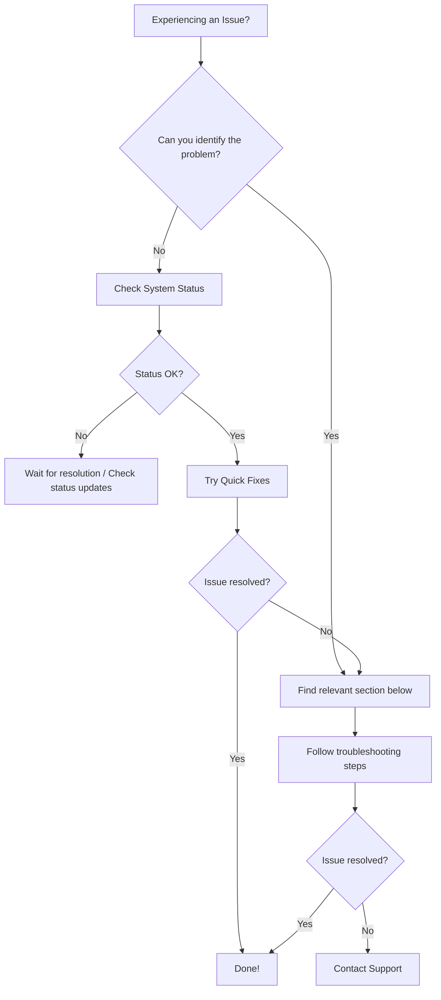

# Troubleshooting Guide

This guide covers the most common issues users encounter with Materi and provides step-by-step solutions. If you cannot find a solution here, please [contact our support team](/support/contact-support).

<Tip>
Before diving into specific issues, try these quick fixes that resolve most problems:
1. Refresh the page (Cmd/Ctrl + R)
2. Clear browser cache and cookies
3. Try a different browser or incognito mode
4. Check the [system status page](https://status.materi.io)
</Tip>

## Troubleshooting Workflow



---

## Login & Authentication Issues

<AccordionGroup>
  <Accordion title="I cannot log in to my account">
    **Symptoms**: Login page shows error, password not accepted, or page keeps refreshing.

    <Steps>
      <Step title="Verify your email address">
        Ensure you are entering the correct email address associated with your account. Check for typos or extra spaces.
      </Step>
      <Step title="Reset your password">
        Click "Forgot Password" on the login page and follow the instructions sent to your email. Check spam/junk folders if you do not receive the email within 5 minutes.
      </Step>
      <Step title="Check for SSO requirements">
        If your organization uses Single Sign-On (SSO), you may need to log in through your company's identity provider. Look for a "Sign in with SSO" button.
      </Step>
      <Step title="Clear browser data">
        Clear cookies and cached data for materi.io:
        - **Chrome**: Settings > Privacy > Clear browsing data
        - **Firefox**: Settings > Privacy > Clear Data
        - **Safari**: Preferences > Privacy > Manage Website Data
      </Step>
      <Step title="Try incognito/private mode">
        Open an incognito window and try logging in. If this works, a browser extension may be interfering.
      </Step>
    </Steps>

    <Warning>
    After 5 failed login attempts, your account will be temporarily locked for 15 minutes. Wait and try again, or use password reset.
    </Warning>
  </Accordion>

  <Accordion title="Two-factor authentication is not working">
    **Symptoms**: 2FA codes are rejected, authenticator app shows different codes, or cannot access backup codes.

    <Steps>
      <Step title="Check time synchronization">
        Authenticator apps depend on accurate time. Ensure your phone's time is set to automatic:
        - **iOS**: Settings > General > Date & Time > Set Automatically
        - **Android**: Settings > System > Date & Time > Automatic
      </Step>
      <Step title="Try your backup codes">
        If you saved your backup codes during 2FA setup, use one to log in. Each code can only be used once.
      </Step>
      <Step title="Wait for new code">
        TOTP codes refresh every 30 seconds. Wait for a fresh code and enter it immediately.
      </Step>
      <Step title="Contact support for recovery">
        If you cannot access your 2FA device or backup codes, contact support with:
        - Your account email
        - Government-issued ID for verification
        - Last known login date/location
      </Step>
    </Steps>
  </Accordion>

  <Accordion title="Session keeps expiring unexpectedly">
    **Symptoms**: Frequently logged out, asked to re-authenticate often.

    **Possible causes and solutions**:

    | Cause | Solution |
    |-------|----------|
    | Browser blocking cookies | Allow cookies for materi.io in browser settings |
    | VPN/Network switching | Use a stable network connection |
    | Multiple devices | Log out from other devices in Settings > Security > Sessions |
    | Browser extensions | Disable privacy extensions temporarily |
    | Admin security policy | Check with your admin for session timeout settings |

    <Tip>
    Enable "Remember me" on the login page for 30-day sessions instead of the default 24 hours.
    </Tip>
  </Accordion>

  <Accordion title="SSO login fails with error">
    **Symptoms**: Error messages from identity provider, redirect loops, or access denied.

    <Tabs>
      <Tab title="For Users">
        1. Ensure you are using your corporate email, not a personal one
        2. Try logging in through your company's SSO portal first
        3. Clear browser cookies and cache
        4. Contact your IT administrator to verify your access
      </Tab>
      <Tab title="For Administrators">
        1. Verify SAML configuration in Materi admin panel
        2. Check that assertion consumer service URL is correct
        3. Ensure user attributes are mapped correctly
        4. Review identity provider logs for detailed error messages
        5. Verify the SSL certificate has not expired
      </Tab>
    </Tabs>
  </Accordion>
</AccordionGroup>

---

## Document Issues

<AccordionGroup>
  <Accordion title="Changes are not saving">
    **Symptoms**: Save indicator spinning, changes disappear after refresh, "Unable to save" error.

    <Steps>
      <Step title="Check your internet connection">
        Materi requires an active internet connection to save changes. Verify your connection by visiting another website.
      </Step>
      <Step title="Look for the save indicator">
        - **Cloud icon**: All changes saved
        - **Spinning icon**: Save in progress
        - **Red icon**: Save failed - hover for details
      </Step>
      <Step title="Check for conflicts">
        If another user made changes simultaneously, you may see a conflict notification. Review and merge changes manually.
      </Step>
      <Step title="Copy your work">
        Before troubleshooting further, select all content (Cmd/Ctrl + A) and copy it (Cmd/Ctrl + C) to avoid losing work.
      </Step>
      <Step title="Force refresh">
        Press Cmd/Ctrl + Shift + R to perform a hard refresh. This clears cached data that may be causing issues.
      </Step>
    </Steps>

    <Note>
    Materi auto-saves every 3 seconds. If the document has not saved in over 30 seconds, there is likely a connection issue.
    </Note>
  </Accordion>

  <Accordion title="Document loads slowly or times out">
    **Symptoms**: Long loading times, blank page, timeout errors.

    **Check document size and complexity**:

    | Issue | Solution |
    |-------|----------|
    | Large images | Compress images or use external hosting |
    | Too many embeds | Remove unused embedded content |
    | Extensive version history | Export and create a fresh copy |
    | Complex tables | Split into multiple simpler tables |
    | Many comments | Archive or resolve old comments |

    <Tip>
    Documents over 50MB may experience performance issues. Consider splitting large documents into sections.
    </Tip>
  </Accordion>

  <Accordion title="Cannot access a shared document">
    **Symptoms**: "Access denied", "Document not found", or permission errors.

    <Steps>
      <Step title="Verify the link">
        Ensure the link is complete and has not been truncated. Ask the owner to resend if needed.
      </Step>
      <Step title="Check your account">
        The share may be restricted to specific email addresses. Ensure you are logged in with the correct account.
      </Step>
      <Step title="Request access">
        Click the "Request Access" button if available. The document owner will receive a notification.
      </Step>
      <Step title="Check expiration">
        Shared links can have expiration dates. Ask the owner to create a new share link.
      </Step>
    </Steps>

    <Warning>
    If you previously had access but now do not, your permissions may have been revoked. Contact the document owner or your workspace admin.
    </Warning>
  </Accordion>

  <Accordion title="Formatting looks wrong or is lost">
    **Symptoms**: Styles not displaying correctly, formatting changes after save, imported documents look different.

    **Common formatting issues and fixes**:

    | Issue | Cause | Solution |
    |-------|-------|----------|
    | Fonts changed | Custom fonts not available | Use web-safe fonts or upload custom fonts (Enterprise) |
    | Colors different | Browser color profiles | Check document in different browser |
    | Tables misaligned | Column width issues | Reset table formatting (right-click > Reset Table) |
    | Lists broken | Nested list complexity | Simplify list structure |
    | Code not highlighted | Language not detected | Manually set language in code block menu |

    <Tip>
    When importing from Word or Google Docs, use "Paste without formatting" (Cmd/Ctrl + Shift + V) for cleaner results.
    </Tip>
  </Accordion>

  <Accordion title="Document appears blank or corrupted">
    **Symptoms**: Empty document, garbled text, or missing sections.

    <Steps>
      <Step title="Check version history">
        Click History (Cmd/Ctrl + Shift + H) to view previous versions. Restore a working version if available.
      </Step>
      <Step title="Try a different browser">
        Some rendering issues are browser-specific. Try Chrome, Firefox, or Safari.
      </Step>
      <Step title="Disable browser extensions">
        Ad blockers and privacy extensions can interfere with document rendering.
      </Step>
      <Step title="Contact support">
        If the document remains corrupted, contact support with the document URL. Our team can often recover content from backups.
      </Step>
    </Steps>
  </Accordion>
</AccordionGroup>

---

## Collaboration Issues

<AccordionGroup>
  <Accordion title="Cannot see other collaborators' cursors or changes">
    **Symptoms**: Real-time collaboration not working, changes from others not appearing, no presence indicators.

    <Steps>
      <Step title="Check WebSocket connection">
        Look for a red dot next to your avatar - this indicates a connection issue. Try refreshing the page.
      </Step>
      <Step title="Verify collaborator permissions">
        Viewers can see changes but editors may have restricted visibility. Check document permissions.
      </Step>
      <Step title="Check firewall/proxy settings">
        WebSocket connections (wss://) may be blocked by corporate firewalls. Contact your IT team to allow:
        - `wss://relay.materi.io`
        - Port 443
      </Step>
      <Step title="Disable VPN temporarily">
        Some VPNs interfere with WebSocket connections. Try disconnecting briefly to test.
      </Step>
    </Steps>

    ```mermaid
    sequenceDiagram
        participant User A
        participant Materi Server
        participant User B

        User A->>Materi Server: Connect WebSocket
        Materi Server-->>User A: Connection established
        User B->>Materi Server: Connect WebSocket
        Materi Server-->>User B: Connection established

        User A->>Materi Server: Make edit
        Materi Server->>User B: Broadcast change
        Note over User B: If no change appears,<br/>WebSocket may be blocked
    ```
  </Accordion>

  <Accordion title="Comments or mentions not working">
    **Symptoms**: Cannot add comments, mentions not showing suggestions, notifications not received.

    <Tabs>
      <Tab title="Comment Issues">
        **Cannot add comments**:
        - Ensure you have Comment or Edit permissions
        - Select text before clicking the comment button
        - Check that the document is not in read-only mode

        **Comments not visible**:
        - Click the Comments icon to show/hide the sidebar
        - Check filter settings (may be hiding resolved comments)
        - Refresh the page
      </Tab>
      <Tab title="Mention Issues">
        **Mentions not suggesting names**:
        - Type `@` and wait 1-2 seconds for suggestions
        - Ensure the user is a member of the workspace
        - Check that you are in a comment or document body (not title)

        **Notifications not received**:
        - Check notification settings in profile
        - Verify email is not in spam folder
        - Ensure browser notifications are enabled
      </Tab>
    </Tabs>
  </Accordion>

  <Accordion title="Editing conflicts between collaborators">
    **Symptoms**: Changes overwritten, duplicate content, merge conflicts.

    **Understanding conflict resolution**:

    Materi uses Operational Transform (OT) to merge simultaneous edits. However, edge cases can occur:

    | Scenario | What happens | Prevention |
    |----------|--------------|------------|
    | Same paragraph edited | Both changes merged | Communicate via comments |
    | Same word edited | Last save wins | Use section locking |
    | Content deleted and edited | Deletion preserved | Check before deleting |
    | Offline edits | Merged on reconnect | Stay connected when collaborating |

    <Tip>
    Use the presence indicators to see where collaborators are working. Avoid editing the same section simultaneously.
    </Tip>
  </Accordion>

  <Accordion title="Cannot invite or add team members">
    **Symptoms**: Invite button disabled, invitation emails not received, access denied errors.

    <Steps>
      <Step title="Check your permissions">
        Only Admins and document owners can invite members. Verify your role in Settings > Team.
      </Step>
      <Step title="Verify seat availability">
        Your plan may have reached its user limit. Upgrade or remove inactive members.
      </Step>
      <Step title="Check email validity">
        Ensure the email address is valid and not already associated with another workspace.
      </Step>
      <Step title="Review spam filters">
        Ask invitees to check spam/junk folders for invitations from `no-reply@materi.io`.
      </Step>
    </Steps>
  </Accordion>
</AccordionGroup>

---

## Performance Issues

<AccordionGroup>
  <Accordion title="Application running slowly">
    **Symptoms**: Lag when typing, slow page loads, unresponsive interface.

    **Performance optimization checklist**:

    <Steps>
      <Step title="Check system requirements">
        **Minimum requirements**:
        - 4 GB RAM (8 GB recommended)
        - Modern browser (Chrome 90+, Firefox 88+, Safari 14+)
        - Stable internet (5+ Mbps)
      </Step>
      <Step title="Close unnecessary tabs">
        Each browser tab consumes memory. Close tabs you are not actively using.
      </Step>
      <Step title="Disable heavy browser extensions">
        Ad blockers, Grammarly, and similar extensions can slow down editing.
      </Step>
      <Step title="Clear browser cache">
        Accumulated cache can cause performance issues. Clear it periodically.
      </Step>
      <Step title="Use the desktop app">
        The Materi desktop app (if available for your plan) offers better performance than browsers.
      </Step>
    </Steps>

    <Note>
    If performance issues persist across multiple devices, the problem may be with the document itself. Try creating a new document and copying content in sections.
    </Note>
  </Accordion>

  <Accordion title="Images not loading">
    **Symptoms**: Broken image icons, images stuck loading, placeholder shown instead of image.

    | Possible cause | Solution |
    |---------------|----------|
    | Slow internet | Wait or switch to a faster connection |
    | Image deleted from source | Re-upload the image |
    | External link broken | Host image on Materi instead of linking |
    | Image too large | Compress image before uploading |
    | CORS issues | Use images from allowed domains |

    <Tip>
    For consistent image loading, upload images directly to Materi rather than linking to external URLs.
    </Tip>
  </Accordion>

  <Accordion title="Export taking too long or failing">
    **Symptoms**: Export spinner stuck, timeout errors, incomplete export file.

    <Tabs>
      <Tab title="PDF Export">
        - Large documents take longer to process
        - Remove high-resolution images or compress them
        - Export sections separately for very large documents
        - Check that all fonts are web-accessible
      </Tab>
      <Tab title="Word Export">
        - Complex formatting may slow export
        - Tables with merged cells may cause issues
        - Remove embedded videos (not supported in Word)
        - Try exporting without comments if they are numerous
      </Tab>
      <Tab title="Other Formats">
        - Markdown export is fastest
        - HTML export may miss custom styling
        - Plain text removes all formatting
        - Try multiple formats if one fails
      </Tab>
    </Tabs>

    <Warning>
    Export jobs timeout after 5 minutes. If your document consistently fails to export, contact support for assistance.
    </Warning>
  </Accordion>
</AccordionGroup>

---

## Integration Issues

<AccordionGroup>
  <Accordion title="Google Drive integration not working">
    **Symptoms**: Cannot connect Google Drive, files not syncing, authorization errors.

    <Steps>
      <Step title="Reauthorize the connection">
        1. Go to Settings > Integrations > Google Drive
        2. Click "Disconnect"
        3. Click "Connect" and complete authorization again
      </Step>
      <Step title="Check Google permissions">
        Ensure Materi has the necessary permissions in your Google Account:
        1. Visit [Google Security Settings](https://myaccount.google.com/permissions)
        2. Find Materi and verify it has Drive access
      </Step>
      <Step title="Verify organization policies">
        Your Google Workspace admin may have restricted third-party app access. Contact your IT team.
      </Step>
    </Steps>
  </Accordion>

  <Accordion title="Slack notifications not arriving">
    **Symptoms**: Slack integration connected but notifications not posting.

    | Check | Action |
    |-------|--------|
    | Channel permissions | Ensure Materi app is added to the channel |
    | Notification settings | Verify which events trigger Slack notifications |
    | App status | Check if Materi app is active in Slack workspace |
    | Rate limits | Slack may throttle if too many notifications |

    <Tip>
    Test the integration by triggering a simple action (like adding a comment) and checking if it posts to Slack within 30 seconds.
    </Tip>
  </Accordion>

  <Accordion title="API requests returning errors">
    **Symptoms**: 401 Unauthorized, 403 Forbidden, 429 Too Many Requests, 500 Server Error.

    <Tabs>
      <Tab title="401 Unauthorized">
        - API key may be expired or revoked
        - Ensure Bearer token format is correct
        - Generate a new API key in Settings > API
      </Tab>
      <Tab title="403 Forbidden">
        - Your plan may not include API access
        - The resource may require elevated permissions
        - Check API scopes on your key
      </Tab>
      <Tab title="429 Rate Limited">
        - Reduce request frequency
        - Implement exponential backoff
        - Contact support for rate limit increases
      </Tab>
      <Tab title="500 Server Error">
        - Check system status page
        - Retry with exponential backoff
        - If persistent, report to support with request ID
      </Tab>
    </Tabs>

    **Rate limits by plan**:

    | Plan | Requests/minute | Requests/day |
    |------|-----------------|--------------|
    | Professional | 60 | 10,000 |
    | Enterprise | 300 | 100,000 |
  </Accordion>
</AccordionGroup>

---

## Mobile App Issues

<AccordionGroup>
  <Accordion title="App crashes or freezes">
    **Symptoms**: App closes unexpectedly, becomes unresponsive, or shows white screen.

    <Steps>
      <Step title="Update the app">
        Ensure you have the latest version from the App Store or Google Play.
      </Step>
      <Step title="Restart the app">
        Force close the app and reopen it:
        - **iOS**: Swipe up from bottom, swipe away Materi
        - **Android**: Recent apps button, swipe away Materi
      </Step>
      <Step title="Clear app cache">
        - **iOS**: Delete and reinstall the app
        - **Android**: Settings > Apps > Materi > Storage > Clear Cache
      </Step>
      <Step title="Check device storage">
        Ensure at least 500MB of free storage is available.
      </Step>
      <Step title="Restart your device">
        A full device restart can resolve many app issues.
      </Step>
    </Steps>
  </Accordion>

  <Accordion title="Offline mode not working">
    **Symptoms**: Cannot access documents offline, changes not syncing when back online.

    **Requirements for offline mode**:
    - Professional or Enterprise plan
    - Documents must be marked for offline access before going offline
    - Sufficient device storage

    <Note>
    Offline mode is not available on Starter plans. Upgrade to access documents without internet.
    </Note>
  </Accordion>
</AccordionGroup>

---

## Still Need Help?

If you have tried the solutions above and still experience issues:

<CardGroup cols={2}>
  <Card title="Contact Support" icon="headset" href="/support/contact-support">
    Submit a ticket with your issue details. Include steps you have tried and any error messages.
  </Card>
  <Card title="Community Forum" icon="users" href="https://community.materi.io">
    Search for similar issues or ask the community. Other users may have encountered the same problem.
  </Card>
</CardGroup>

**When contacting support, please include**:
- Your account email
- Browser and version (or mobile app version)
- Steps to reproduce the issue
- Screenshots or screen recordings
- Any error messages (exact text)
- Document URL (if applicable)
