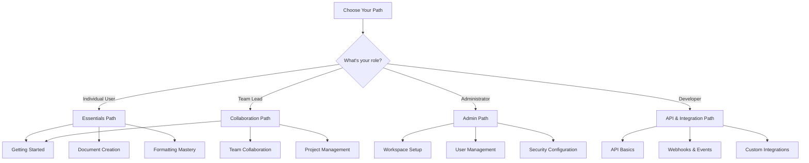

# Video Tutorials

Welcome to the Materi Video Learning Center. Our comprehensive video library covers everything from getting started basics to advanced features and workflows. Whether you prefer visual learning or want a quick refresher, these tutorials will help you master Materi.

<Tip>
**New to Materi?** Start with our [Getting Started Playlist](#getting-started) to learn the fundamentals in under 30 minutes.
</Tip>

## Learning Paths

Choose a learning path based on your role and goals.

---

## Getting Started

Essential tutorials for new Materi users. Complete this series to master the fundamentals.

<CardGroup cols={2}>
  <Card title="Welcome to Materi" icon="play">
    **Duration**: 5 minutes

    An overview of Materi's interface, core concepts, and what you can accomplish with the platform.

    **Topics covered**:
    - Dashboard navigation
    - Understanding workspaces
    - Document vs. folder structure
    - Quick tour of features

    [Watch Now](https://learn.materi.io/videos/welcome-to-materi)
  </Card>

  <Card title="Creating Your First Document" icon="play">
    **Duration**: 8 minutes

    Step-by-step guide to creating, editing, and saving your first document in Materi.

    **Topics covered**:
    - Creating a new document
    - Basic text entry and formatting
    - Saving and organizing
    - Document settings

    [Watch Now](https://learn.materi.io/videos/first-document)
  </Card>

  <Card title="Navigating the Interface" icon="play">
    **Duration**: 6 minutes

    Learn to navigate Materi efficiently using the sidebar, search, and keyboard shortcuts.

    **Topics covered**:
    - Sidebar navigation
    - Quick search functionality
    - Recent documents
    - Favorites and starred items

    [Watch Now](https://learn.materi.io/videos/navigation)
  </Card>

  <Card title="Understanding Workspaces" icon="play">
    **Duration**: 7 minutes

    Learn how workspaces organize your team's content and how to navigate between them.

    **Topics covered**:
    - Workspace structure
    - Switching workspaces
    - Personal vs. team workspaces
    - Workspace settings

    [Watch Now](https://learn.materi.io/videos/workspaces)
  </Card>
</CardGroup>

### Getting Started Playlist

<Note>
Complete the Getting Started playlist in order for the best learning experience. Total time: approximately 26 minutes.
</Note>

| # | Video | Duration | Description |
|---|-------|----------|-------------|
| 1 | Welcome to Materi | 5 min | Platform overview and core concepts |
| 2 | Creating Your First Document | 8 min | Document creation fundamentals |
| 3 | Navigating the Interface | 6 min | Efficient navigation techniques |
| 4 | Understanding Workspaces | 7 min | Workspace organization and management |

---

## Document Creation & Editing

Master the art of creating professional documents in Materi.

<Tabs>
  <Tab title="Basics">
    <CardGroup cols={2}>
      <Card title="Text Formatting Essentials" icon="play">
        **Duration**: 10 minutes

        Learn all the text formatting options available in Materi.

        **Topics covered**:
        - Bold, italic, underline
        - Headings and paragraphs
        - Lists (bullet, numbered, task)
        - Text alignment and spacing

        [Watch Now](https://learn.materi.io/videos/text-formatting)
      </Card>

      <Card title="Working with Images" icon="play">
        **Duration**: 8 minutes

        Add, resize, and manage images in your documents.

        **Topics covered**:
        - Uploading images
        - Drag and drop
        - Resizing and positioning
        - Image captions and alt text

        [Watch Now](https://learn.materi.io/videos/images)
      </Card>

      <Card title="Creating Tables" icon="play">
        **Duration**: 12 minutes

        Build and customize tables for organizing data.

        **Topics covered**:
        - Inserting tables
        - Adding rows and columns
        - Merging cells
        - Table styling options

        [Watch Now](https://learn.materi.io/videos/tables)
      </Card>

      <Card title="Links and References" icon="play">
        **Duration**: 6 minutes

        Create links to external sites and internal documents.

        **Topics covered**:
        - Adding hyperlinks
        - Internal document links
        - Anchor links
        - Link previews

        [Watch Now](https://learn.materi.io/videos/links)
      </Card>
    </CardGroup>
  </Tab>

  <Tab title="Advanced">
    <CardGroup cols={2}>
      <Card title="Code Blocks and Syntax Highlighting" icon="play">
        **Duration**: 9 minutes

        Perfect for technical documentation with code examples.

        **Topics covered**:
        - Inline code formatting
        - Code blocks
        - Language selection
        - Syntax highlighting options

        [Watch Now](https://learn.materi.io/videos/code-blocks)
      </Card>

      <Card title="Mathematical Equations" icon="play">
        **Duration**: 11 minutes

        Add LaTeX equations and mathematical notation.

        **Topics covered**:
        - Inline equations
        - Block equations
        - LaTeX syntax basics
        - Common equation templates

        [Watch Now](https://learn.materi.io/videos/equations)
      </Card>

      <Card title="Diagrams with Mermaid" icon="play">
        **Duration**: 15 minutes

        Create flowcharts, sequence diagrams, and more.

        **Topics covered**:
        - Flowchart basics
        - Sequence diagrams
        - Gantt charts
        - Class diagrams

        [Watch Now](https://learn.materi.io/videos/diagrams)
      </Card>

      <Card title="Embeds and Integrations" icon="play">
        **Duration**: 10 minutes

        Embed external content like videos, maps, and more.

        **Topics covered**:
        - YouTube and Vimeo embeds
        - Google Maps
        - Figma designs
        - Custom embed URLs

        [Watch Now](https://learn.materi.io/videos/embeds)
      </Card>
    </CardGroup>
  </Tab>

  <Tab title="Templates">
    <CardGroup cols={2}>
      <Card title="Using Built-in Templates" icon="play">
        **Duration**: 7 minutes

        Get started quickly with pre-designed templates.

        **Topics covered**:
        - Template gallery
        - Selecting templates
        - Customizing templates
        - Template categories

        [Watch Now](https://learn.materi.io/videos/builtin-templates)
      </Card>

      <Card title="Creating Custom Templates" icon="play">
        **Duration**: 12 minutes

        Build your own templates for repeated use.

        **Topics covered**:
        - Designing templates
        - Saving as template
        - Template variables
        - Sharing templates

        [Watch Now](https://learn.materi.io/videos/custom-templates)
      </Card>

      <Card title="Team Template Library" icon="play">
        **Duration**: 8 minutes

        Manage templates across your organization.

        **Topics covered**:
        - Workspace templates
        - Template permissions
        - Template updates
        - Best practices

        [Watch Now](https://learn.materi.io/videos/team-templates)
      </Card>
    </CardGroup>
  </Tab>
</Tabs>

---

## Collaboration Features

Learn how to work effectively with your team in real-time.

<CardGroup cols={2}>
  <Card title="Real-Time Collaboration" icon="play">
    **Duration**: 10 minutes

    Work together with teammates in the same document simultaneously.

    **Topics covered**:
    - Inviting collaborators
    - Real-time cursors and presence
    - Conflict resolution
    - Following collaborators

    [Watch Now](https://learn.materi.io/videos/realtime-collab)
  </Card>

  <Card title="Comments and Discussions" icon="play">
    **Duration**: 8 minutes

    Add comments, mentions, and have discussions within documents.

    **Topics covered**:
    - Adding comments
    - @mentions and notifications
    - Threaded discussions
    - Resolving comments

    [Watch Now](https://learn.materi.io/videos/comments)
  </Card>

  <Card title="Sharing and Permissions" icon="play">
    **Duration**: 11 minutes

    Control who can access and edit your documents.

    **Topics covered**:
    - Share settings
    - Permission levels
    - External sharing
    - Link expiration and passwords

    [Watch Now](https://learn.materi.io/videos/sharing)
  </Card>

  <Card title="Version History" icon="play">
    **Duration**: 9 minutes

    Track changes and restore previous versions of documents.

    **Topics covered**:
    - Viewing history
    - Comparing versions
    - Restoring versions
    - Named versions

    [Watch Now](https://learn.materi.io/videos/version-history)
  </Card>
</CardGroup>

### Collaboration Best Practices

<AccordionGroup>
  <Accordion title="Video: Establishing Team Workflows">
    **Duration**: 14 minutes

    Learn how successful teams structure their collaboration in Materi.

    **Key takeaways**:
    - Define clear document ownership
    - Establish naming conventions
    - Set up folder structures
    - Create review processes

    [Watch Now](https://learn.materi.io/videos/team-workflows)
  </Accordion>

  <Accordion title="Video: Running Effective Document Reviews">
    **Duration**: 12 minutes

    Master the art of document reviews and feedback cycles.

    **Key takeaways**:
    - Request feedback effectively
    - Use suggestions mode
    - Track review status
    - Incorporate feedback efficiently

    [Watch Now](https://learn.materi.io/videos/document-reviews)
  </Accordion>

  <Accordion title="Video: Async Collaboration Strategies">
    **Duration**: 10 minutes

    Collaborate effectively across time zones and schedules.

    **Key takeaways**:
    - Leave clear context in comments
    - Use task assignments
    - Set up notifications
    - Document decisions

    [Watch Now](https://learn.materi.io/videos/async-collab)
  </Accordion>
</AccordionGroup>

---

## Administration & Setup

For workspace administrators and team leads.

<Tabs>
  <Tab title="Setup">
    | Video | Duration | Description |
    |-------|----------|-------------|
    | [Initial Workspace Setup](https://learn.materi.io/videos/workspace-setup) | 15 min | Configure your workspace from scratch |
    | [Inviting Team Members](https://learn.materi.io/videos/invite-team) | 8 min | Add users and manage invitations |
    | [Configuring Roles and Permissions](https://learn.materi.io/videos/roles-permissions) | 12 min | Set up access control |
    | [Branding and Customization](https://learn.materi.io/videos/branding) | 10 min | Customize appearance and branding |
  </Tab>

  <Tab title="Security">
    | Video | Duration | Description |
    |-------|----------|-------------|
    | [Setting Up SSO/SAML](https://learn.materi.io/videos/sso-setup) | 18 min | Configure single sign-on |
    | [Two-Factor Authentication](https://learn.materi.io/videos/2fa-admin) | 10 min | Enforce 2FA for your team |
    | [Audit Logs and Compliance](https://learn.materi.io/videos/audit-logs) | 12 min | Monitor activity and ensure compliance |
    | [Data Export and Backup](https://learn.materi.io/videos/data-export) | 8 min | Export and backup your data |
  </Tab>

  <Tab title="Management">
    | Video | Duration | Description |
    |-------|----------|-------------|
    | [User Management](https://learn.materi.io/videos/user-management) | 11 min | Manage users, roles, and access |
    | [Storage and Quotas](https://learn.materi.io/videos/storage-quotas) | 7 min | Monitor and manage storage usage |
    | [Billing and Subscriptions](https://learn.materi.io/videos/billing) | 9 min | Manage your plan and payments |
    | [Analytics Dashboard](https://learn.materi.io/videos/analytics) | 10 min | Understand workspace analytics |
  </Tab>
</Tabs>

---

## Integrations

Connect Materi with your favorite tools.

<CardGroup cols={3}>
  <Card title="Slack Integration" icon="play">
    **Duration**: 8 minutes

    Connect Materi with Slack for notifications and sharing.

    [Watch Now](https://learn.materi.io/videos/slack-integration)
  </Card>

  <Card title="Google Drive Sync" icon="play">
    **Duration**: 10 minutes

    Sync documents between Materi and Google Drive.

    [Watch Now](https://learn.materi.io/videos/google-drive)
  </Card>

  <Card title="GitHub Integration" icon="play">
    **Duration**: 12 minutes

    Link documents to repositories and sync README files.

    [Watch Now](https://learn.materi.io/videos/github-integration)
  </Card>

  <Card title="Jira & Linear" icon="play">
    **Duration**: 11 minutes

    Connect project management tools with your documentation.

    [Watch Now](https://learn.materi.io/videos/jira-linear)
  </Card>

  <Card title="Zapier Automation" icon="play">
    **Duration**: 14 minutes

    Create automated workflows with Zapier.

    [Watch Now](https://learn.materi.io/videos/zapier)
  </Card>

  <Card title="Custom Webhooks" icon="play">
    **Duration**: 15 minutes

    Set up webhooks for custom integrations.

    [Watch Now](https://learn.materi.io/videos/webhooks)
  </Card>
</CardGroup>

---

## API & Developer Resources

For developers building with the Materi API.

<Steps>
  <Step title="API Authentication">
    **Video**: [Getting Started with the Materi API](https://learn.materi.io/videos/api-intro)

    **Duration**: 12 minutes

    Learn how to authenticate and make your first API calls.

    - Generating API keys
    - Authentication methods
    - Rate limits and best practices
    - Making your first request
  </Step>

  <Step title="Document Operations">
    **Video**: [CRUD Operations with the API](https://learn.materi.io/videos/api-crud)

    **Duration**: 18 minutes

    Create, read, update, and delete documents programmatically.

    - Creating documents
    - Reading document content
    - Updating documents
    - Managing document metadata
  </Step>

  <Step title="Webhooks Deep Dive">
    **Video**: [Building with Webhooks](https://learn.materi.io/videos/webhooks-deep-dive)

    **Duration**: 20 minutes

    Build event-driven integrations with webhooks.

    - Webhook configuration
    - Event types and payloads
    - Signature verification
    - Error handling
  </Step>

  <Step title="Building a Custom Integration">
    **Video**: [Complete Integration Walkthrough](https://learn.materi.io/videos/custom-integration)

    **Duration**: 25 minutes

    End-to-end tutorial building a custom integration.

    - Architecture planning
    - OAuth implementation
    - Data synchronization
    - Testing and deployment
  </Step>
</Steps>

---

## Live Webinars

Join our live sessions for interactive learning and Q&A.

<Warning>
Webinars are available for Professional and Enterprise customers. Recordings are available in the video library after the live session.
</Warning>

### Upcoming Webinars

| Date | Topic | Duration | Registration |
|------|-------|----------|--------------|
| Jan 15, 2026 | Advanced Collaboration Techniques | 60 min | [Register](https://learn.materi.io/webinars/collab-advanced) |
| Jan 22, 2026 | API Masterclass | 90 min | [Register](https://learn.materi.io/webinars/api-masterclass) |
| Jan 29, 2026 | Admin Best Practices | 60 min | [Register](https://learn.materi.io/webinars/admin-best-practices) |
| Feb 5, 2026 | Template Design Workshop | 75 min | [Register](https://learn.materi.io/webinars/template-workshop) |

### Past Webinar Recordings

<AccordionGroup>
  <Accordion title="Q4 2025 Webinars">
    - [What's New in Materi 3.0](https://learn.materi.io/webinars/archive/whats-new-3) (Dec 2025)
    - [Year-End Productivity Tips](https://learn.materi.io/webinars/archive/productivity-tips) (Dec 2025)
    - [Enterprise Security Deep Dive](https://learn.materi.io/webinars/archive/security-deep-dive) (Nov 2025)
    - [Migrating to Materi](https://learn.materi.io/webinars/archive/migration) (Oct 2025)
  </Accordion>

  <Accordion title="Q3 2025 Webinars">
    - [Real-Time Collaboration at Scale](https://learn.materi.io/webinars/archive/collab-scale) (Sep 2025)
    - [Building Documentation Workflows](https://learn.materi.io/webinars/archive/doc-workflows) (Aug 2025)
    - [API v2 Introduction](https://learn.materi.io/webinars/archive/api-v2) (Jul 2025)
  </Accordion>
</AccordionGroup>

---

## Learning Resources

Additional resources to support your learning.

<CardGroup cols={2}>
  <Card title="Interactive Tutorials" icon="laptop-code" href="https://learn.materi.io/interactive">
    Hands-on exercises within Materi to practice features in a sandbox environment.
  </Card>
  <Card title="Certification Program" icon="certificate" href="https://learn.materi.io/certification">
    Earn official Materi certifications to demonstrate your expertise.
  </Card>
  <Card title="Community Courses" icon="users" href="https://community.materi.io/courses">
    User-created courses and tutorials from the Materi community.
  </Card>
  <Card title="Office Hours" icon="calendar" href="https://learn.materi.io/office-hours">
    Join weekly office hours for live Q&A with Materi experts.
  </Card>
</CardGroup>

---

## Video Settings & Accessibility

<AccordionGroup>
  <Accordion title="Playback speed options">
    All videos support playback speeds from 0.5x to 2x. Adjust speed using the settings icon in the video player.
  </Accordion>
  <Accordion title="Closed captions">
    All videos include closed captions in English. Additional languages (Spanish, French, German, Japanese) are available for most content.
  </Accordion>
  <Accordion title="Video transcripts">
    Full text transcripts are available below each video for accessibility and reference.
  </Accordion>
  <Accordion title="Offline viewing">
    Professional and Enterprise users can download videos for offline viewing through the Materi mobile app.
  </Accordion>
</AccordionGroup>

---

## Request a Tutorial

Cannot find a tutorial for what you need? Let us know!

<Tip>
Submit tutorial requests through our [feedback form](https://learn.materi.io/request) or contact support. Popular requests are prioritized for production.
</Tip>

<CardGroup cols={2}>
  <Card title="Request a Tutorial" icon="plus" href="https://learn.materi.io/request">
    Suggest a new video topic for our content team to create.
  </Card>
  <Card title="Browse All Videos" icon="video" href="https://learn.materi.io/library">
    Search our complete video library with filters by topic, duration, and skill level.
  </Card>
</CardGroup>
