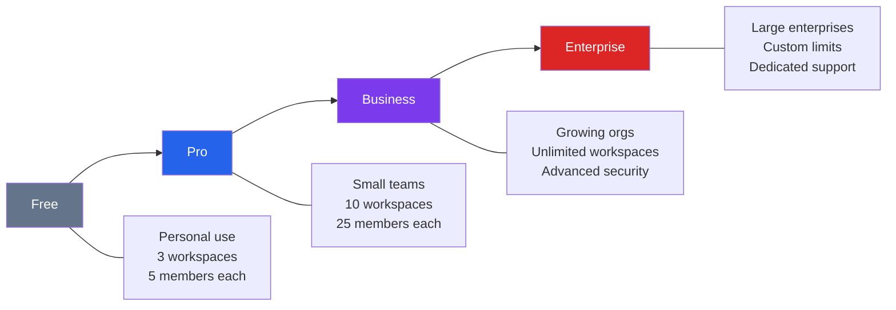
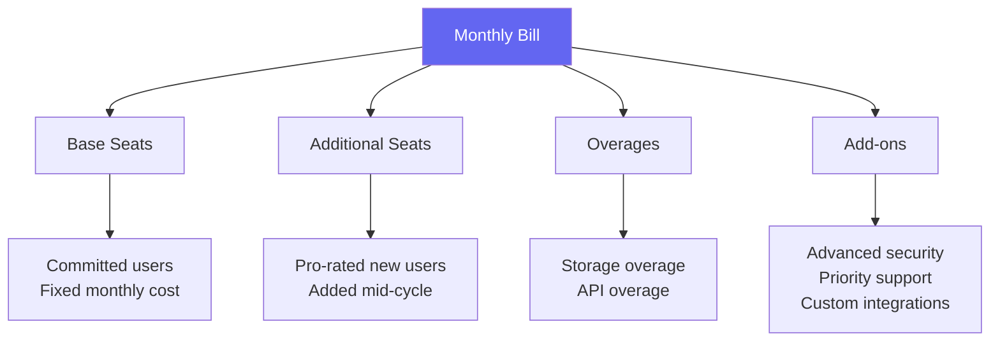
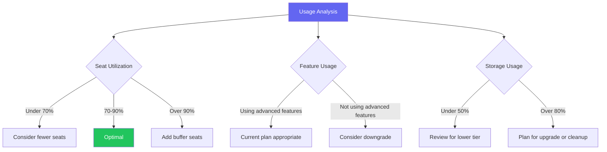

# Billing & Plans

This guide covers everything you need to know about Materi's pricing, billing management, and optimizing your subscription for your organization's needs.

## Plan Overview

### Plan Comparison

| Feature | Free | Pro | Business | Enterprise |
|---------|------|-----|----------|------------|
| **Pricing** | $0 | $12/user/mo | $24/user/mo | Custom |
| **Workspaces** | 3 | 10 | Unlimited | Unlimited |
| **Members per workspace** | 5 | 25 | 100 | Unlimited |
| **Storage** | 1 GB | 10 GB | 100 GB | Custom |
| **Version history** | 7 days | 30 days | 1 year | Unlimited |
| **Guest access** | No | Yes | Yes | Yes |
| **SSO/SAML** | No | No | Basic | Full |
| **Custom roles** | No | No | Yes | Yes |
| **API access** | Limited | Yes | Yes | Yes |
| **Audit logs** | 7 days | 30 days | 90 days | Unlimited |
| **Support** | Community | Email | Priority | Dedicated |
| **SLA** | None | 99.5% | 99.9% | 99.99% |

<Note>
Prices shown are for annual billing. Monthly billing is available at a 20% premium.
</Note>

## Detailed Plan Features

<Tabs>
  <Tab title="Free Plan">
    **Best for:** Personal projects and evaluation

    **Includes:**
    - 3 workspaces maximum
    - Up to 5 members per workspace
    - 1 GB total storage
    - Basic document features
    - 7-day version history
    - Community forum support

    **Limitations:**
    - No guest access
    - No API access
    - No integrations
    - Limited export options
    - Materi branding on shared content

    <Info>
    The Free plan is perfect for trying Materi. Upgrade anytime without losing your data.
    </Info>
  </Tab>

  <Tab title="Pro Plan">
    **Best for:** Small teams and startups

    **Includes everything in Free, plus:**
    - 10 workspaces
    - Up to 25 members per workspace
    - 10 GB storage per workspace
    - Guest access
    - Full API access
    - 5 webhook endpoints
    - Basic integrations (Slack, GitHub)
    - 30-day version history
    - Email support (24hr response)
    - 99.5% uptime SLA

    **Pricing:**
    - $12/user/month (annual)
    - $15/user/month (monthly)
    - Minimum 3 users
  </Tab>

  <Tab title="Business Plan">
    **Best for:** Growing organizations

    **Includes everything in Pro, plus:**
    - Unlimited workspaces
    - Up to 100 members per workspace
    - 100 GB storage per workspace
    - Advanced security (2FA requirement, IP allowlisting)
    - Basic SSO (Google, Microsoft)
    - Custom roles
    - 20 webhook endpoints
    - All integrations
    - 1-year version history
    - 90-day audit log retention
    - Priority support (4hr response)
    - 99.9% uptime SLA

    **Pricing:**
    - $24/user/month (annual)
    - $30/user/month (monthly)
    - Volume discounts available (50+ users)
  </Tab>

  <Tab title="Enterprise Plan">
    **Best for:** Large organizations with complex needs

    **Includes everything in Business, plus:**
    - Unlimited everything
    - Custom storage limits
    - Full SSO/SAML with any IdP
    - Advanced compliance (SOC 2, HIPAA, GDPR)
    - Data residency options
    - Custom data retention
    - Unlimited webhooks
    - Custom integrations
    - Dedicated customer success manager
    - 24/7 phone support
    - 99.99% uptime SLA with credits
    - Custom contract terms

    **Pricing:**
    - Custom pricing based on needs
    - Annual contracts
    - Contact sales for quote
  </Tab>
</Tabs>

## Billing Management

### Accessing Billing

<Steps>
  <Step title="Navigate to Billing">
    Click your organization name in the top-left, then select **Settings** > **Billing**.
  </Step>

  <Step title="View Current Plan">
    See your current plan, billing cycle, and next payment date.
  </Step>

  <Step title="Manage Subscription">
    From the billing dashboard you can:
    - Upgrade or downgrade your plan
    - Update payment method
    - View invoices and payment history
    - Manage billing contacts
  </Step>
</Steps>

<Note>
Only Organization Owners and users with Billing Admin role can access billing settings.
</Note>

### Understanding Your Bill

Your monthly bill consists of:

**Line items explained:**

| Item | Description |
|------|-------------|
| Base subscription | Your plan's base cost times committed seats |
| Additional seats | Pro-rated cost for users added mid-cycle |
| Storage overage | Charges for exceeding included storage |
| API overage | Charges for exceeding API rate limits |
| Add-ons | Optional features and services |
| Credits | Applied discounts or account credits |
| Taxes | Applicable sales tax or VAT |

### Payment Methods

<AccordionGroup>
  <Accordion title="Credit/Debit Card">
    We accept:
    - Visa
    - Mastercard
    - American Express
    - Discover

    Cards are charged automatically on your billing date. Update card details before expiration to avoid service interruption.
  </Accordion>

  <Accordion title="ACH Bank Transfer">
    Available for Business and Enterprise plans:

    - Lower transaction fees
    - Set up in Billing > Payment Methods
    - 3-5 business days to process
    - Automatic monthly debit
  </Accordion>

  <Accordion title="Wire Transfer">
    For Enterprise annual contracts:

    - Invoice sent with wire instructions
    - Net 30 payment terms
    - Contact finance@materi.io for setup
  </Accordion>

  <Accordion title="Purchase Orders">
    Enterprise customers can use POs:

    - Submit PO during contract signing
    - PO number appears on invoices
    - Custom invoicing available
  </Accordion>
</AccordionGroup>

### Invoices and Receipts

Access billing history in **Settings** > **Billing** > **Invoices**:

- Download PDF invoices
- View payment status
- Access receipts for completed payments
- Filter by date range
- Export for accounting

**Invoice delivery:**
- Emailed to billing contacts automatically
- Available in dashboard immediately
- Customizable invoice details (PO number, tax ID, etc.)

## Usage Tracking

### Viewing Usage

Monitor your organization's usage in **Settings** > **Usage**:

<CardGroup cols={2}>
  <Card title="Seat Usage" icon="users">
    - Active users this billing period
    - Users by workspace
    - Guest user count
    - Pending invitations
  </Card>

  <Card title="Storage Usage" icon="hard-drive">
    - Total storage used
    - Storage by workspace
    - Largest files
    - Storage trends
  </Card>

  <Card title="API Usage" icon="code">
    - API calls this period
    - Calls by endpoint
    - Rate limit status
    - Usage trends
  </Card>

  <Card title="Feature Usage" icon="chart-bar">
    - Active workspaces
    - Documents created
    - Collaboration sessions
    - Integration calls
  </Card>
</CardGroup>

### Usage Alerts

Set up alerts to avoid unexpected charges:

<Steps>
  <Step title="Configure Alerts">
    Go to **Billing** > **Usage Alerts**
  </Step>

  <Step title="Set Thresholds">
    Configure alert thresholds:

    | Alert Type | Recommended Threshold |
    |------------|----------------------|
    | Seat usage | 80% of limit |
    | Storage usage | 75% of quota |
    | API usage | 80% of rate limit |
  </Step>

  <Step title="Choose Recipients">
    Select who receives alerts:
    - Billing contacts
    - Organization admins
    - Custom email addresses
  </Step>
</Steps>

### Seat Counting

How seats are counted:

| User Type | Seat Count |
|-----------|------------|
| Full member | 1 seat |
| Organization admin | 1 seat |
| Service account | 0.5 seats |
| Guest (external) | Free (up to limit) |
| Pending invitation | 0 seats |
| Deactivated user | 0 seats |

<Tip>
Deactivate unused accounts instead of deleting them to preserve document ownership and history while freeing up seats.
</Tip>

## Upgrading and Downgrading

### Upgrading Your Plan

<Tabs>
  <Tab title="Upgrade Process">
    1. Go to **Settings** > **Billing** > **Change Plan**
    2. Select your new plan
    3. Review feature comparison
    4. Confirm upgrade
    5. New features available immediately

    **Billing impact:**
    - Prorated charge for remainder of billing period
    - New rate applies to next full billing cycle
    - No downtime during upgrade
  </Tab>

  <Tab title="Adding Seats">
    1. Go to **Settings** > **Billing** > **Manage Seats**
    2. Enter new seat count
    3. Review prorated charges
    4. Confirm addition

    **Billing impact:**
    - Prorated charge for new seats
    - Added to next invoice
    - Seats available immediately
  </Tab>
</Tabs>

### Downgrading Your Plan

<Warning>
Downgrading may result in loss of access to certain features. Review the impact carefully before proceeding.
</Warning>

**Before downgrading, verify:**

1. **Workspace count** - Will exceed new limit?
2. **Member count** - Workspaces exceed new member limit?
3. **Storage** - Within new storage quota?
4. **Features** - Dependencies on features not in new plan?

**Downgrade process:**

1. Go to **Settings** > **Billing** > **Change Plan**
2. Select lower tier plan
3. Review impact analysis
4. Address any blockers (reduce workspaces, members, etc.)
5. Confirm downgrade
6. Changes take effect at next billing cycle

### Cancellation

To cancel your subscription:

<Steps>
  <Step title="Request Cancellation">
    Go to **Settings** > **Billing** > **Cancel Subscription**
  </Step>

  <Step title="Provide Feedback">
    Let us know why you're leaving (optional but appreciated)
  </Step>

  <Step title="Review Impact">
    - Access continues until end of billing period
    - Data retained for 30 days after expiration
    - Can reactivate within 30 days
    - After 30 days, data is permanently deleted
  </Step>

  <Step title="Confirm Cancellation">
    Review and confirm. You'll receive confirmation email.
  </Step>
</Steps>

<Info>
Need to pause instead of cancel? Contact support about account hibernation options.
</Info>

## Cost Optimization

### Right-sizing Your Plan

Analyze your usage to optimize costs:

### Cost-Saving Strategies

<AccordionGroup>
  <Accordion title="Annual vs. Monthly Billing">
    Annual billing saves 20%:

    | Plan | Monthly | Annual | Savings |
    |------|---------|--------|---------|
    | Pro | $15/user | $12/user | $36/user/year |
    | Business | $30/user | $24/user | $72/user/year |

    For a 50-user Business team: **$3,600/year savings**
  </Accordion>

  <Accordion title="Seat Optimization">
    Reduce seat costs:

    - **Audit inactive users** - Deactivate users who haven't logged in for 90+ days
    - **Use guest access** - External collaborators don't count as seats
    - **Service accounts** - Count as 0.5 seats for automation
    - **Consolidate workspaces** - Fewer workspaces may need fewer total members
  </Accordion>

  <Accordion title="Storage Management">
    Reduce storage usage:

    - **Archive old workspaces** - Archived content uses less active storage
    - **Clean up versions** - Reduce version history retention if not needed
    - **Compress files** - Use compressed formats where appropriate
    - **External storage** - Link to external files instead of uploading
  </Accordion>

  <Accordion title="Volume Discounts">
    Available for larger teams:

    | Seats | Discount |
    |-------|----------|
    | 50-99 | 10% |
    | 100-249 | 15% |
    | 250-499 | 20% |
    | 500+ | Custom |

    Contact sales@materi.io for volume pricing.
  </Accordion>
</AccordionGroup>

## Enterprise Billing

### Custom Contracts

Enterprise customers receive:

- Custom pricing based on needs
- Flexible payment terms
- Custom SLAs
- Volume commitments with discounts
- Multi-year contract options

### True-Up Billing

For Enterprise with true-up billing:

- Pay for committed seats upfront
- Quarterly true-up for additional usage
- No overage charges between true-ups
- Flexibility to grow without immediate charges

### Department Chargebacks

Allocate costs across departments:

1. **Enable chargebacks** in **Billing** > **Cost Allocation**
2. **Assign workspaces** to cost centers
3. **Generate reports** by department
4. **Export** for internal billing

## Troubleshooting

<AccordionGroup>
  <Accordion title="Payment failed">
    Common causes and solutions:

    1. **Expired card** - Update payment method
    2. **Insufficient funds** - Ensure funds available
    3. **Bank block** - Contact bank to allow Materi charges
    4. **Currency issues** - We charge in USD; check conversion limits

    Failed payments retry automatically after 3 days. Update payment method to avoid service interruption.
  </Accordion>

  <Accordion title="Unexpected charges">
    Review charges in **Billing** > **Invoices**:

    1. **Check seat additions** - New members added mid-cycle
    2. **Check overages** - Storage or API limits exceeded
    3. **Check add-ons** - New features enabled
    4. **Contact support** if charges seem incorrect
  </Accordion>

  <Accordion title="Cannot access billing">
    Billing access requires:

    - Organization Owner role, OR
    - Billing Admin permission

    Contact your Organization Owner to grant access.
  </Accordion>

  <Accordion title="Need invoice changes">
    To update invoice details:

    1. Go to **Billing** > **Invoice Settings**
    2. Update company name, address, tax ID
    3. Future invoices will reflect changes
    4. For past invoice corrections, contact support
  </Accordion>
</AccordionGroup>

## Tax Information

### Sales Tax and VAT

- **United States**: Sales tax charged based on state
- **European Union**: VAT charged at local rate
- **Other regions**: Applicable local taxes

**Tax exemption:**
1. Go to **Billing** > **Tax Information**
2. Upload tax exemption certificate
3. Exemption applied to future invoices

### Tax IDs

Add your tax ID for invoices:
- VAT number (EU)
- GST number (Australia, India)
- Tax ID (other regions)

## Related Documentation

<CardGroup cols={2}>
  <Card title="Creating Workspaces" icon="folder-plus" href="/workspaces/creating-workspaces">
    Set up workspaces within your plan limits
  </Card>
  <Card title="Managing Members" icon="users" href="/workspaces/managing-members">
    Manage seats and member access
  </Card>
  <Card title="Workspace Settings" icon="gear" href="/workspaces/workspace-settings">
    Configure workspace features
  </Card>
  <Card title="Enterprise Features" icon="building" href="/enterprise/overview">
    Learn about Enterprise capabilities
  </Card>
</CardGroup>

## Contact

**Billing questions:** billing@materi.io

**Sales inquiries:** sales@materi.io

**Enterprise contracts:** enterprise@materi.io

For urgent billing issues, Organization Owners can access priority support via the in-app chat.
