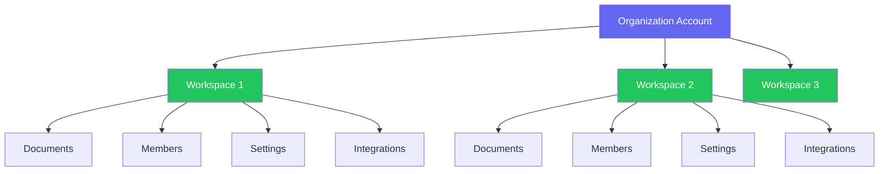

# Creating Workspaces

Workspaces are the foundational organizational unit in Materi. They provide isolated environments for teams to collaborate on documents, manage content workflows, and maintain security boundaries.

## Overview

A workspace contains all your team's documents, member access controls, integrations, and settings. Each workspace operates independently, allowing organizations to separate projects, departments, or client work.



## Before You Begin

<Note>
You must have **Owner** or **Admin** permissions in your organization to create new workspaces. If you don't see the create option, contact your organization administrator.
</Note>

### Requirements

| Requirement | Details |
|-------------|---------|
| Account Type | Business or Enterprise plan |
| Permission Level | Owner or Admin role |
| Workspace Limit | Varies by plan (see [Billing](/workspaces/billing)) |
| Naming | 3-50 characters, alphanumeric and hyphens |

## Creating Your First Workspace

<Steps>
  <Step title="Access Workspace Management">
    Navigate to **Settings** > **Workspaces** from the main navigation menu. You can also click the workspace dropdown in the top-left corner and select **Create New Workspace**.
  </Step>

  <Step title="Enter Workspace Details">
    Fill in the workspace creation form:

    - **Name**: A descriptive name for the workspace (e.g., "Marketing Team", "Project Alpha")
    - **Slug**: Auto-generated URL-friendly identifier (can be customized)
    - **Description**: Optional but recommended for team clarity
    - **Icon**: Choose from our library or upload a custom icon
  </Step>

  <Step title="Select Workspace Template">
    Choose a starting template:

    <Tabs>
      <Tab title="Blank Workspace">
        Start fresh with no pre-configured settings. Best for custom setups or experienced users.
      </Tab>
      <Tab title="Team Collaboration">
        Pre-configured with common team settings:
        - Default member roles
        - Standard folder structure
        - Collaboration features enabled
      </Tab>
      <Tab title="Client Projects">
        Optimized for client-facing work:
        - Guest access enabled
        - Branded sharing pages
        - Activity logging
      </Tab>
      <Tab title="Knowledge Base">
        Set up for documentation:
        - Public/private toggle
        - Search indexing enabled
        - Version history extended
      </Tab>
    </Tabs>
  </Step>

  <Step title="Configure Initial Settings">
    Set your workspace preferences:

    - **Visibility**: Private (invite-only) or Organization-wide
    - **Default Role**: What role new members receive
    - **Storage Region**: Where your data is stored (EU, US, APAC)
  </Step>

  <Step title="Invite Initial Members">
    Add your first team members by email address. You can skip this step and invite members later.
  </Step>

  <Step title="Review and Create">
    Review your configuration and click **Create Workspace**. Your new workspace will be ready immediately.
  </Step>
</Steps>

## Workspace Configuration Options

### Basic Settings

<AccordionGroup>
  <Accordion title="Workspace Name and Branding">
    Customize how your workspace appears to members:

    - **Display Name**: The name shown in the UI
    - **Custom Icon**: Upload a 256x256 PNG or SVG
    - **Color Theme**: Choose a primary color for workspace accents
    - **Custom Domain**: Available on Enterprise plans
  </Accordion>

  <Accordion title="Privacy and Visibility">
    Control who can discover and access your workspace:

    | Setting | Description |
    |---------|-------------|
    | Private | Only invited members can see or access |
    | Organization | All organization members can view |
    | Discoverable | Members can request to join |
    | Public | Anyone with the link can view (read-only) |
  </Accordion>

  <Accordion title="Storage and Limits">
    Configure resource allocation:

    - **Storage Quota**: Set maximum storage per workspace
    - **Member Limit**: Cap the number of workspace members
    - **Document Limit**: Optional document count restriction
    - **File Size Limit**: Maximum individual file upload size
  </Accordion>
</AccordionGroup>

### Advanced Configuration

<Tabs>
  <Tab title="Security">
    Enhanced security options for sensitive workspaces:

    - **Two-Factor Requirement**: Require 2FA for all members
    - **IP Allowlisting**: Restrict access to specific IP ranges
    - **Session Duration**: Custom session timeout settings
    - **Audit Logging**: Enhanced activity tracking

    <Warning>
    Enabling IP allowlisting will immediately restrict access. Ensure your IP ranges are correct before enabling.
    </Warning>
  </Tab>

  <Tab title="Integrations">
    Connect external services:

    - **SSO/SAML**: Enterprise single sign-on
    - **Webhooks**: Real-time event notifications
    - **API Access**: Programmatic workspace access
    - **Third-Party Apps**: Slack, Microsoft Teams, etc.
  </Tab>

  <Tab title="Compliance">
    Regulatory compliance settings:

    - **Data Retention**: Automatic document archival rules
    - **Export Controls**: Restrict document downloads
    - **Watermarking**: Add watermarks to exported documents
    - **Legal Hold**: Prevent deletion of specific content
  </Tab>
</Tabs>

## Workspace Templates

Create reusable templates for consistent workspace setup:

<CardGroup cols={2}>
  <Card title="Save as Template" icon="floppy-disk">
    Convert any configured workspace into a template for future use. Templates include settings, folder structure, and default roles.
  </Card>
  <Card title="Organization Templates" icon="building">
    Admins can create organization-wide templates that enforce company standards and policies.
  </Card>
  <Card title="Import Template" icon="file-import">
    Import templates from other workspaces or download community templates from the Materi marketplace.
  </Card>
  <Card title="Template Variables" icon="brackets-curly">
    Use variables in templates for dynamic content like workspace name, creation date, or custom fields.
  </Card>
</CardGroup>

### Creating a Workspace Template

```json
{
  "name": "Client Project Template",
  "description": "Standard setup for client engagements",
  "settings": {
    "visibility": "private",
    "defaultRole": "editor",
    "features": {
      "guestAccess": true,
      "activityLog": true,
      "watermarking": true
    }
  },
  "folders": [
    "Deliverables",
    "Working Documents",
    "Client Feedback",
    "Archive"
  ],
  "roles": ["admin", "editor", "reviewer", "client"]
}
```

## Bulk Workspace Creation

<Info>
Bulk creation is available on Enterprise plans. Contact your account manager for access.
</Info>

For organizations needing multiple workspaces, use the bulk creation API or CSV import:

<Steps>
  <Step title="Prepare Your CSV">
    Create a CSV file with workspace details:

    ```csv
    name,slug,description,template,owner_email
    Marketing Q1,marketing-q1,Q1 Marketing Campaigns,team-collab,marketing@company.com
    Engineering,engineering,Engineering Documentation,knowledge-base,eng@company.com
    ```
  </Step>

  <Step title="Upload and Validate">
    Upload your CSV in **Settings** > **Bulk Operations** > **Create Workspaces**. The system validates your data before processing.
  </Step>

  <Step title="Review and Confirm">
    Review the preview of workspaces to be created, then confirm to begin batch creation.
  </Step>
</Steps>

## Troubleshooting

<AccordionGroup>
  <Accordion title="Cannot create workspace - limit reached">
    Your organization has reached its workspace limit. Options:

    1. **Upgrade your plan** to increase limits
    2. **Archive unused workspaces** to free up slots
    3. **Contact support** for temporary limit increase

    Check your current usage in **Settings** > **Usage & Billing**.
  </Accordion>

  <Accordion title="Workspace slug already exists">
    Workspace slugs must be unique across your organization. Try:

    - Adding a numeric suffix (e.g., `marketing-2024`)
    - Using a more specific name (e.g., `marketing-emea`)
    - Checking if an archived workspace uses the slug
  </Accordion>

  <Accordion title="Template not applying correctly">
    If template settings aren't applying:

    1. Verify you have permission to use the template
    2. Check that all template dependencies are available
    3. Try creating without a template, then applying settings manually
    4. Contact support if the issue persists
  </Accordion>

  <Accordion title="Storage region unavailable">
    Some storage regions require Enterprise plans or specific compliance agreements. Contact your account manager if your required region is unavailable.
  </Accordion>
</AccordionGroup>

## Best Practices

<Tip>
**Naming Convention**: Establish a consistent naming convention across your organization. Example: `[Department]-[Project]-[Year]` results in names like `Marketing-BrandRefresh-2024`.
</Tip>

1. **Plan your structure** before creating workspaces. Map out team needs and access requirements.

2. **Use templates** for consistency across similar workspace types.

3. **Set appropriate defaults** for member roles to reduce manual configuration.

4. **Document your workspaces** with clear descriptions so members understand their purpose.

5. **Regular audits** - Review workspace usage quarterly and archive inactive ones.

## Related Documentation

<CardGroup cols={2}>
  <Card title="Managing Members" icon="users" href="/workspaces/managing-members">
    Learn how to add, remove, and manage workspace members
  </Card>
  <Card title="Roles & Permissions" icon="shield-check" href="/workspaces/roles-permissions">
    Understand the role hierarchy and permission system
  </Card>
  <Card title="Workspace Settings" icon="gear" href="/workspaces/workspace-settings">
    Deep dive into all workspace configuration options
  </Card>
  <Card title="Billing & Plans" icon="credit-card" href="/workspaces/billing">
    Understand how workspaces affect your billing
  </Card>
</CardGroup>

## API Reference

For programmatic workspace creation, see the [Workspace API documentation](/api-reference/workspaces/create).

```bash
curl -X POST https://api.materi.io/v1/workspaces \
  -H "Authorization: Bearer YOUR_API_KEY" \
  -H "Content-Type: application/json" \
  -d '{
    "name": "New Workspace",
    "slug": "new-workspace",
    "template": "team-collaboration",
    "settings": {
      "visibility": "private",
      "defaultRole": "editor"
    }
  }'
```
