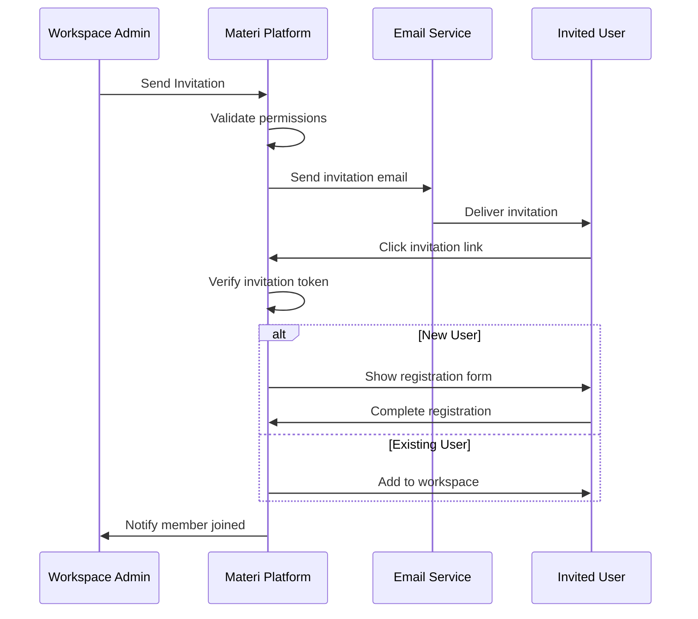
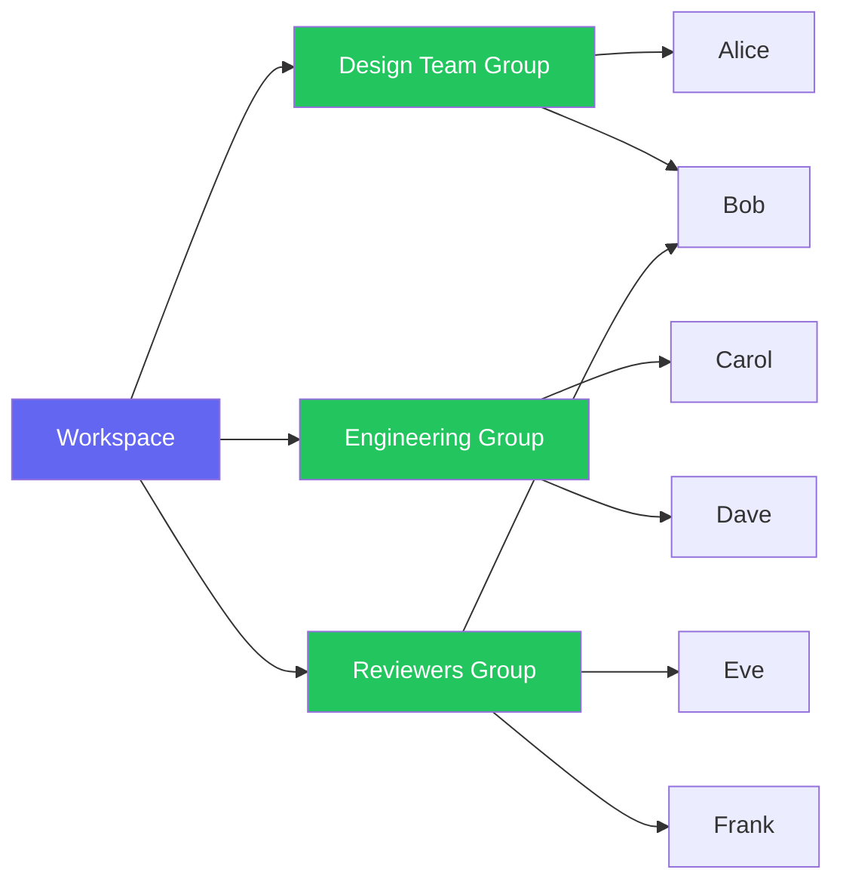

# Managing Workspace Members

Effective member management is crucial for maintaining security and enabling collaboration. This guide covers everything you need to know about managing workspace members in Materi.

## Member Management Overview



## Understanding Member Types

Materi supports different types of workspace members:

| Member Type | Description | Billing Impact |
|-------------|-------------|----------------|
| **Full Member** | Organization employee with full access | Counts toward seat limit |
| **Guest** | External collaborator with limited access | Free or reduced rate |
| **Service Account** | API/automation access | Counts as 0.5 seat |
| **Pending** | Invited but not yet joined | No billing until accepted |

<Note>
Guest members can only access workspaces they're explicitly invited to and cannot create new workspaces or access organization settings.
</Note>

## Inviting Members

### Single Invitation

<Steps>
  <Step title="Open Member Settings">
    Navigate to your workspace, click **Settings** in the sidebar, then select **Members**.
  </Step>

  <Step title="Click Invite Member">
    Click the **Invite Member** button in the top-right corner of the members list.
  </Step>

  <Step title="Enter Member Details">
    Fill in the invitation form:

    - **Email Address**: The invitee's email
    - **Role**: Select the appropriate role (see [Roles & Permissions](/workspaces/roles-permissions))
    - **Personal Message**: Optional custom message
    - **Expiration**: How long the invitation remains valid (default: 7 days)
  </Step>

  <Step title="Send Invitation">
    Review and click **Send Invitation**. The invitee receives an email with a unique invitation link.
  </Step>
</Steps>

### Bulk Invitations

For adding multiple members at once:

<Tabs>
  <Tab title="CSV Import">
    Upload a CSV file with member details:

    ```csv
    email,role,message
    alice@company.com,editor,Welcome to the Marketing workspace!
    bob@company.com,viewer,Read-only access for review
    carol@company.com,admin,You'll be helping manage this workspace
    ```

    **Steps:**
    1. Go to **Members** > **Bulk Actions** > **Import Members**
    2. Download the CSV template
    3. Fill in member details
    4. Upload and review the preview
    5. Confirm to send all invitations
  </Tab>

  <Tab title="Copy from Workspace">
    Duplicate the member list from another workspace:

    1. Go to **Members** > **Bulk Actions** > **Copy from Workspace**
    2. Select the source workspace
    3. Choose which members to copy
    4. Optionally adjust roles
    5. Send invitations

    <Warning>
    This only copies the member list and roles. It does not copy permissions or custom access rules.
    </Warning>
  </Tab>

  <Tab title="Organization Sync">
    Automatically sync with organization groups (Enterprise only):

    1. Go to **Members** > **Sync Settings**
    2. Select organization groups to sync
    3. Map group membership to workspace roles
    4. Enable automatic sync

    Members are added/removed as they join/leave organization groups.
  </Tab>
</Tabs>

### Invitation Link

Generate a shareable link for self-service joining:

<Steps>
  <Step title="Create Invitation Link">
    Go to **Members** > **Invitation Links** > **Create Link**
  </Step>

  <Step title="Configure Link Settings">
    - **Default Role**: Role assigned to users who join via this link
    - **Usage Limit**: Maximum number of times the link can be used
    - **Expiration**: When the link becomes invalid
    - **Domain Restriction**: Limit to specific email domains
  </Step>

  <Step title="Share the Link">
    Copy and share the generated link. Users clicking it are added immediately or after approval, based on your settings.
  </Step>
</Steps>

<Tip>
Use invitation links with domain restrictions for onboarding new team members. Example: Restrict to `@yourcompany.com` and share in your internal wiki.
</Tip>

## Managing Existing Members

### Viewing Members

The member list shows:

| Column | Description |
|--------|-------------|
| **Member** | Name, email, and avatar |
| **Role** | Current workspace role |
| **Status** | Active, Pending, Suspended |
| **Joined** | Date member joined workspace |
| **Last Active** | Most recent workspace activity |
| **2FA** | Two-factor authentication status |

Use filters to find specific members:
- **Role filter**: Show only members with specific roles
- **Status filter**: Active, Pending, or Suspended
- **Search**: Find by name or email
- **Sort**: By name, role, join date, or activity

### Changing Member Roles

<Steps>
  <Step title="Locate the Member">
    Find the member in the list using search or filters.
  </Step>

  <Step title="Open Role Menu">
    Click the **Role** dropdown next to the member's name.
  </Step>

  <Step title="Select New Role">
    Choose the new role from the dropdown. The change takes effect immediately.
  </Step>

  <Step title="Confirm Change">
    For role downgrades (e.g., Admin to Editor), you'll be asked to confirm. The member receives a notification about the change.
  </Step>
</Steps>

<Warning>
Changing a member's role may immediately revoke access to certain features. Coordinate with the member before making changes during active work.
</Warning>

### Suspending Members

Temporarily disable access without removing the member:

1. Click the **...** menu next to the member
2. Select **Suspend Member**
3. Optionally add a reason (visible to admins)
4. Confirm suspension

Suspended members:
- Cannot access the workspace
- Retain their role assignment
- Keep their document ownership
- Can be reactivated at any time

### Removing Members

<Steps>
  <Step title="Select Remove Option">
    Click **...** > **Remove from Workspace**
  </Step>

  <Step title="Choose Content Handling">
    Decide what happens to their content:

    <AccordionGroup>
      <Accordion title="Transfer Ownership">
        Assign their documents to another member. The removed member loses all access.
      </Accordion>

      <Accordion title="Keep Content">
        Documents remain but become unowned. An admin must claim ownership.
      </Accordion>

      <Accordion title="Delete Content">
        Permanently delete all documents owned by this member. **This cannot be undone.**
      </Accordion>
    </AccordionGroup>
  </Step>

  <Step title="Confirm Removal">
    Review the impact summary and confirm. The member loses access immediately.
  </Step>
</Steps>

## Guest Access

Guests are external collaborators with limited workspace access.

### Inviting Guests

<Tabs>
  <Tab title="Standard Guest">
    Basic external access:

    1. Invite with any non-organization email
    2. Select "Guest" as the member type
    3. Assign a role (typically Viewer or Commenter)
    4. Guest can only see explicitly shared content
  </Tab>

  <Tab title="Client Guest">
    Enhanced client collaboration:

    1. Enable **Client Mode** in workspace settings
    2. Invite with "Client Guest" type
    3. Clients see branded interface
    4. Activity is logged for compliance
  </Tab>

  <Tab title="Temporary Access">
    Time-limited guest access:

    1. Set **Access Duration** when inviting
    2. Access automatically expires
    3. Guest receives expiration reminders
    4. Can be extended by admins
  </Tab>
</Tabs>

### Guest Limitations

| Feature | Full Member | Guest |
|---------|-------------|-------|
| Create documents | Yes | Limited or No |
| Share externally | Yes | No |
| Access settings | Yes | No |
| View all content | Yes | Shared only |
| API access | Yes | No |
| SSO login | Yes | Password only |

## Member Groups

Organize members into groups for easier management:



### Creating Groups

<Steps>
  <Step title="Navigate to Groups">
    Go to **Members** > **Groups** tab
  </Step>

  <Step title="Create New Group">
    Click **Create Group** and enter:
    - **Group Name**: Descriptive identifier
    - **Description**: Purpose of the group
    - **Color**: Visual identifier in the UI
  </Step>

  <Step title="Add Members">
    Select members to add from the member list. Members can belong to multiple groups.
  </Step>

  <Step title="Set Group Permissions">
    Optionally assign folder or document access at the group level.
  </Step>
</Steps>

### Using Groups

Groups simplify common operations:

- **Bulk permission changes**: Update access for all group members at once
- **Mentions**: @mention a group to notify all members
- **Sharing**: Share documents with entire groups
- **Reporting**: Filter activity logs by group

## Activity and Audit

### Member Activity

View individual member activity:

1. Click on a member's name
2. Select the **Activity** tab
3. See recent actions: documents viewed, edited, shared

### Audit Log

Access the full audit log in **Settings** > **Audit Log**:

| Event | Details Logged |
|-------|----------------|
| Member Invited | Inviter, invitee email, role |
| Member Joined | Member, invitation source |
| Role Changed | Member, old role, new role, changed by |
| Member Removed | Member, removed by, content action |
| Member Suspended | Member, suspended by, reason |

<Info>
Audit logs are retained based on your plan. Enterprise plans include extended retention and export capabilities.
</Info>

## Troubleshooting

<AccordionGroup>
  <Accordion title="Invitation email not received">
    Common causes and solutions:

    1. **Check spam/junk folders** - Add `noreply@materi.io` to safe senders
    2. **Verify email address** - Check for typos in the invitation
    3. **Corporate email filters** - IT may need to allowlist Materi
    4. **Resend invitation** - Go to Pending members and click Resend
    5. **Use invitation link** - Generate a direct link as alternative
  </Accordion>

  <Accordion title="Member cannot access workspace">
    Troubleshoot access issues:

    1. **Check member status** - Ensure not suspended or removed
    2. **Verify role permissions** - Role may not have required access
    3. **SSO issues** - Check SSO configuration if using enterprise SSO
    4. **Browser issues** - Clear cache or try incognito mode
    5. **IP restrictions** - Verify member's IP is allowed
  </Accordion>

  <Accordion title="Cannot change member role">
    Role changes may be restricted because:

    1. **Insufficient permissions** - You need Admin or Owner role
    2. **Protected member** - Owners cannot be demoted by Admins
    3. **SSO role mapping** - Role is controlled by SSO provider
    4. **Group inheritance** - Role is assigned via organization group
  </Accordion>

  <Accordion title="Bulk import failing">
    CSV import troubleshooting:

    1. **Format check** - Ensure CSV uses UTF-8 encoding
    2. **Required fields** - Email and role columns are mandatory
    3. **Valid roles** - Use exact role names (admin, editor, viewer)
    4. **Email validation** - Remove invalid email addresses
    5. **Duplicates** - Remove members already in workspace
  </Accordion>
</AccordionGroup>

## Best Practices

<Tip>
**Principle of Least Privilege**: Always assign the minimum role needed for a member to do their job. You can always upgrade later.
</Tip>

1. **Regular access reviews** - Quarterly review member list and remove inactive accounts

2. **Use groups** - Organize members logically for easier bulk management

3. **Document ownership** - Ensure critical documents have multiple owners or are owned by service accounts

4. **Guest expiration** - Set expiration dates for guest access to prevent access creep

5. **Offboarding process** - Create a checklist for removing departing employees

## Related Documentation

<CardGroup cols={2}>
  <Card title="Roles & Permissions" icon="shield-check" href="/workspaces/roles-permissions">
    Understand what each role can do
  </Card>
  <Card title="Creating Workspaces" icon="folder-plus" href="/workspaces/creating-workspaces">
    Set up new workspaces for your team
  </Card>
  <Card title="Workspace Settings" icon="gear" href="/workspaces/workspace-settings">
    Configure workspace-level options
  </Card>
  <Card title="Billing" icon="credit-card" href="/workspaces/billing">
    Understand how members affect billing
  </Card>
</CardGroup>

## API Reference

Manage members programmatically:

```bash
# List workspace members
curl https://api.materi.io/v1/workspaces/{workspace_id}/members \
  -H "Authorization: Bearer YOUR_API_KEY"

# Invite a member
curl -X POST https://api.materi.io/v1/workspaces/{workspace_id}/members \
  -H "Authorization: Bearer YOUR_API_KEY" \
  -H "Content-Type: application/json" \
  -d '{
    "email": "newmember@company.com",
    "role": "editor",
    "message": "Welcome to the team!"
  }'

# Update member role
curl -X PATCH https://api.materi.io/v1/workspaces/{workspace_id}/members/{member_id} \
  -H "Authorization: Bearer YOUR_API_KEY" \
  -H "Content-Type: application/json" \
  -d '{"role": "admin"}'
```

See the full [Members API Reference](/api-reference/members) for all endpoints.
