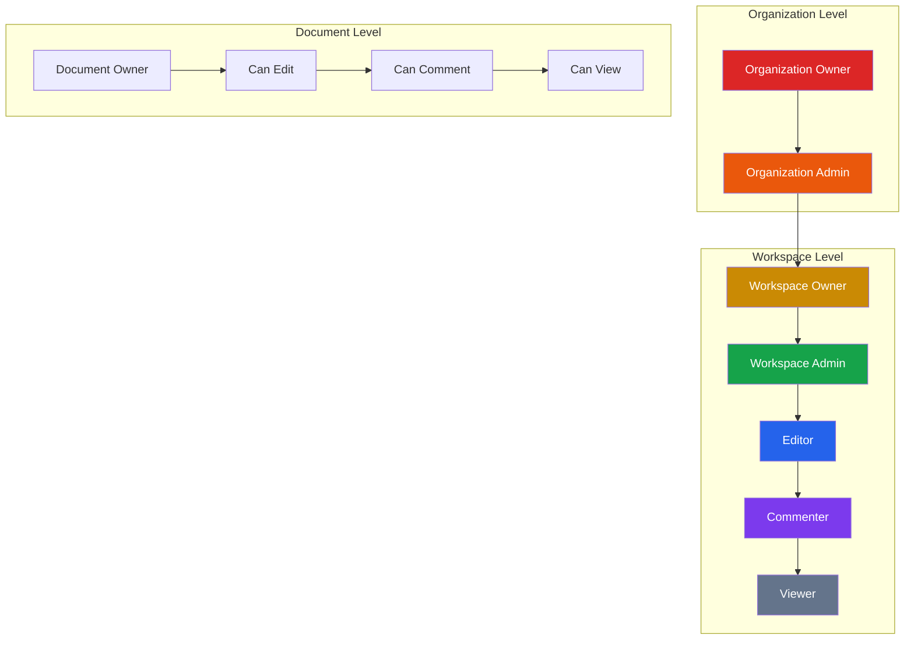
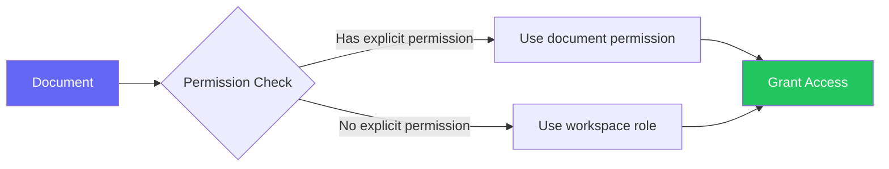
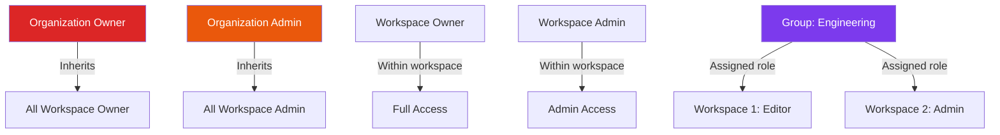

# Roles & Permissions

Materi uses a robust role-based access control (RBAC) system to manage what users can do within workspaces. This guide explains the permission model, built-in roles, and how to create custom roles.

## Permission Model Overview



Permissions in Materi flow through three levels:

1. **Organization Level**: Controls who can manage billing, create workspaces, and administer the organization
2. **Workspace Level**: Controls access within a specific workspace
3. **Document Level**: Fine-grained control over individual documents

<Note>
Higher-level permissions always include lower-level permissions. An Organization Admin automatically has Admin access to all workspaces.
</Note>

## Built-in Roles

### Organization Roles

<Tabs>
  <Tab title="Organization Owner">
    The highest level of access. Typically the account creator or billing contact.

    **Capabilities:**
    - Full control over organization settings
    - Manage billing and subscriptions
    - Create and delete workspaces
    - Assign Organization Admin role
    - Access all workspaces as Owner
    - Cannot be removed (must transfer ownership)

    **Limit:** One Organization Owner per account
  </Tab>

  <Tab title="Organization Admin">
    Delegated administrative access for managing the organization.

    **Capabilities:**
    - Create and archive workspaces
    - Manage organization members
    - Configure SSO and security settings
    - View billing (cannot modify)
    - Access all workspaces as Admin
    - View audit logs

    **Use case:** IT administrators, department heads
  </Tab>
</Tabs>

### Workspace Roles

| Role | Create | Edit | Comment | View | Manage Members | Settings |
|------|--------|------|---------|------|----------------|----------|
| **Owner** | Yes | Yes | Yes | Yes | Yes | Full |
| **Admin** | Yes | Yes | Yes | Yes | Yes | Limited |
| **Editor** | Yes | Yes | Yes | Yes | No | No |
| **Commenter** | No | No | Yes | Yes | No | No |
| **Viewer** | No | No | No | Yes | No | No |

<AccordionGroup>
  <Accordion title="Workspace Owner">
    Full control over the workspace. Created automatically when a workspace is created.

    **Unique capabilities:**
    - Delete the workspace
    - Transfer workspace ownership
    - Promote members to Admin
    - Configure all workspace settings
    - Cannot be removed from workspace

    **Note:** A workspace can have multiple Owners.
  </Accordion>

  <Accordion title="Workspace Admin">
    Day-to-day workspace management without full ownership rights.

    **Capabilities:**
    - Invite and remove members (except Owners)
    - Change member roles (up to Admin)
    - Configure most workspace settings
    - Manage integrations
    - Create and manage templates

    **Cannot:**
    - Delete the workspace
    - Remove or demote Owners
    - Access billing settings
  </Accordion>

  <Accordion title="Editor">
    Standard content creation and editing access.

    **Capabilities:**
    - Create new documents
    - Edit any document (unless restricted)
    - Delete own documents
    - Share documents with workspace members
    - Use all document features

    **Cannot:**
    - Delete others' documents
    - Manage workspace members
    - Change workspace settings
  </Accordion>

  <Accordion title="Commenter">
    Collaboration without editing capability.

    **Capabilities:**
    - View all workspace content
    - Add comments and suggestions
    - Participate in discussions
    - Receive notifications

    **Cannot:**
    - Create or edit documents
    - Delete any content
    - Share externally
  </Accordion>

  <Accordion title="Viewer">
    Read-only access to workspace content.

    **Capabilities:**
    - View documents and folders
    - Download documents (if allowed)
    - Search workspace content

    **Cannot:**
    - Create, edit, or delete anything
    - Comment or participate in discussions
    - Share content
  </Accordion>
</AccordionGroup>

### Document-Level Permissions

Beyond workspace roles, you can set permissions on individual documents:



| Permission | Description |
|------------|-------------|
| **Full Access** | Edit, comment, share, delete |
| **Can Edit** | Edit document content |
| **Can Comment** | Add comments only |
| **Can View** | Read-only access |
| **No Access** | Explicitly blocked |

<Warning>
Document-level "No Access" overrides workspace roles. An Editor can be blocked from specific sensitive documents.
</Warning>

## Permission Matrix

### Detailed Workspace Permissions

| Permission | Owner | Admin | Editor | Commenter | Viewer |
|------------|-------|-------|--------|-----------|--------|
| **Documents** |||||
| View documents | Yes | Yes | Yes | Yes | Yes |
| Create documents | Yes | Yes | Yes | No | No |
| Edit documents | Yes | Yes | Yes | No | No |
| Delete own documents | Yes | Yes | Yes | No | No |
| Delete any documents | Yes | Yes | No | No | No |
| **Comments** |||||
| View comments | Yes | Yes | Yes | Yes | Yes |
| Add comments | Yes | Yes | Yes | Yes | No |
| Resolve comments | Yes | Yes | Yes | No | No |
| Delete any comments | Yes | Yes | No | No | No |
| **Sharing** |||||
| Share with members | Yes | Yes | Yes | No | No |
| Share externally | Yes | Yes | Config | No | No |
| Generate public links | Yes | Yes | No | No | No |
| **Members** |||||
| View member list | Yes | Yes | Yes | Yes | Yes |
| Invite members | Yes | Yes | No | No | No |
| Remove members | Yes | Yes | No | No | No |
| Change roles | Yes | Yes | No | No | No |
| **Settings** |||||
| View settings | Yes | Yes | Limited | No | No |
| Modify settings | Yes | Yes | No | No | No |
| Manage integrations | Yes | Yes | No | No | No |
| Delete workspace | Yes | No | No | No | No |

## Custom Roles

<Info>
Custom roles are available on Business and Enterprise plans.
</Info>

Create roles tailored to your organization's needs:

### Creating a Custom Role

<Steps>
  <Step title="Access Role Management">
    Navigate to **Workspace Settings** > **Roles & Permissions** > **Custom Roles**
  </Step>

  <Step title="Create New Role">
    Click **Create Custom Role** and enter:
    - **Role Name**: Descriptive identifier (e.g., "External Reviewer")
    - **Description**: Purpose and intended use
    - **Base Role**: Start from an existing role's permissions
  </Step>

  <Step title="Configure Permissions">
    Toggle individual permissions on/off:

    <Tabs>
      <Tab title="Document Permissions">
        - View documents
        - Create documents
        - Edit documents
        - Delete own documents
        - Delete any documents
        - Restore deleted documents
      </Tab>

      <Tab title="Collaboration Permissions">
        - View comments
        - Add comments
        - Resolve comments
        - Delete comments
        - Use real-time collaboration
        - View version history
      </Tab>

      <Tab title="Sharing Permissions">
        - Share with workspace members
        - Share with organization
        - Share externally
        - Create public links
        - Set password protection
      </Tab>

      <Tab title="Administrative Permissions">
        - View workspace settings
        - Manage integrations
        - View audit logs
        - Export data
      </Tab>
    </Tabs>
  </Step>

  <Step title="Save and Assign">
    Save the role and assign it to members as needed.
  </Step>
</Steps>

### Custom Role Examples

<CardGroup cols={2}>
  <Card title="External Reviewer" icon="magnifying-glass">
    **Use case:** External stakeholders reviewing content

    **Permissions:**
    - View documents: Yes
    - Add comments: Yes
    - Edit documents: No
    - Share externally: No
  </Card>

  <Card title="Content Publisher" icon="newspaper">
    **Use case:** Marketing team publishing content

    **Permissions:**
    - Edit documents: Yes
    - Create public links: Yes
    - Delete documents: No
    - Manage members: No
  </Card>

  <Card title="Template Manager" icon="clone">
    **Use case:** Maintaining document templates

    **Permissions:**
    - Create documents: Yes
    - Edit documents: Yes
    - Manage templates: Yes
    - Delete any documents: No
  </Card>

  <Card title="Compliance Officer" icon="clipboard-check">
    **Use case:** Audit and compliance review

    **Permissions:**
    - View all documents: Yes
    - View audit logs: Yes
    - Export data: Yes
    - Edit documents: No
  </Card>
</CardGroup>

## Role Inheritance

Understanding how roles are inherited across the organization:



### Inheritance Rules

1. **Organization roles cascade down** to all workspaces
2. **Workspace roles don't cascade up** to organization level
3. **Group membership** applies the group's role in each workspace
4. **Higher role wins** when a user has multiple role assignments
5. **Explicit denials** (No Access) override inherited permissions

## Permission Conflicts

When a user has multiple role assignments, Materi resolves conflicts:

<AccordionGroup>
  <Accordion title="Multiple workspace roles">
    If assigned multiple roles (e.g., via groups), the **highest permission wins**.

    Example: User is in "Editors" group (Editor role) and "Reviewers" group (Commenter role) → User has Editor permissions.
  </Accordion>

  <Accordion title="Document vs. workspace permissions">
    Document-level permissions **override** workspace role for that specific document.

    Example: An Editor with "Can View" on a specific document can only view that document.
  </Accordion>

  <Accordion title="Organization vs. workspace roles">
    Organization-level roles **always take precedence** within their scope.

    Example: Organization Admin cannot be demoted to Viewer in any workspace.
  </Accordion>
</AccordionGroup>

## Checking Permissions

### For Users

View your permissions:

1. Click your avatar in the workspace
2. Select **My Permissions**
3. See your effective role and capabilities

### For Admins

Check any member's permissions:

1. Go to **Members** > Select member
2. View **Effective Permissions** tab
3. See role sources and inheritance chain

## API Permission Scopes

When creating API keys, select specific permission scopes:

| Scope | Description |
|-------|-------------|
| `documents:read` | View documents |
| `documents:write` | Create and edit documents |
| `documents:delete` | Delete documents |
| `members:read` | View member list |
| `members:write` | Manage members |
| `settings:read` | View workspace settings |
| `settings:write` | Modify settings |
| `admin` | Full administrative access |

<Tip>
Always use the minimum scopes needed for your integration. You can create multiple API keys with different scopes for different purposes.
</Tip>

## Troubleshooting

<AccordionGroup>
  <Accordion title="User cannot access a document they should see">
    Check in order:

    1. **Document-level permission** - Is there an explicit "No Access"?
    2. **Workspace membership** - Is user still a workspace member?
    3. **Folder permissions** - Is the folder restricted?
    4. **User status** - Is the user suspended?
    5. **Cache** - Ask user to refresh or clear browser cache
  </Accordion>

  <Accordion title="Cannot change a member's role">
    Common restrictions:

    1. **Your role** - You need Admin or Owner to change roles
    2. **Target's role** - Admins cannot demote Owners
    3. **SSO mapping** - Role may be controlled by SSO
    4. **Group membership** - Role assigned via organization group
  </Accordion>

  <Accordion title="Custom role not appearing">
    Verify:

    1. **Plan eligibility** - Custom roles require Business or Enterprise
    2. **Role status** - Check if role is enabled/disabled
    3. **Workspace scope** - Role may be created in different workspace
    4. **Permissions** - You need Admin to view/assign custom roles
  </Accordion>

  <Accordion title="Inherited permissions not working">
    Debug inheritance:

    1. **Check organization role** - View in organization settings
    2. **Check group memberships** - Review all group assignments
    3. **Check explicit assignments** - Direct workspace role may override
    4. **View effective permissions** - Use the admin tool to see final result
  </Accordion>
</AccordionGroup>

## Best Practices

<Tip>
**Regular audits**: Review role assignments quarterly. Remove unnecessary elevated permissions and ensure departing employees are properly offboarded.
</Tip>

1. **Principle of Least Privilege** - Assign the minimum role needed
2. **Use groups** - Manage permissions via groups, not individuals
3. **Document custom roles** - Maintain documentation of custom roles and their purposes
4. **Avoid Owner proliferation** - Limit Owner role to those who truly need it
5. **Test before deploying** - Test custom role configurations before assigning widely

## Related Documentation

<CardGroup cols={2}>
  <Card title="Managing Members" icon="users" href="/workspaces/managing-members">
    Add and manage workspace members
  </Card>
  <Card title="Creating Workspaces" icon="folder-plus" href="/workspaces/creating-workspaces">
    Set up new workspaces
  </Card>
  <Card title="Workspace Settings" icon="gear" href="/workspaces/workspace-settings">
    Configure workspace options
  </Card>
  <Card title="Security & Compliance" icon="lock" href="/security/overview">
    Security best practices
  </Card>
</CardGroup>

## API Reference

Query permissions programmatically:

```bash
# Get current user's permissions
curl https://api.materi.io/v1/workspaces/{workspace_id}/permissions/me \
  -H "Authorization: Bearer YOUR_API_KEY"

# Check specific permission
curl https://api.materi.io/v1/workspaces/{workspace_id}/permissions/check \
  -H "Authorization: Bearer YOUR_API_KEY" \
  -H "Content-Type: application/json" \
  -d '{"permission": "documents:delete", "resource_id": "doc_123"}'

# List custom roles
curl https://api.materi.io/v1/workspaces/{workspace_id}/roles \
  -H "Authorization: Bearer YOUR_API_KEY"
```
