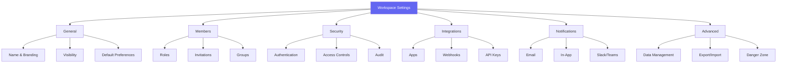

# Workspace Settings

This guide covers all configuration options available in workspace settings. Access settings by navigating to your workspace and clicking **Settings** in the sidebar.

## Settings Overview



<Note>
Settings availability varies by role. Owners see all settings, Admins see most, and other roles have limited or no access.
</Note>

## General Settings

### Workspace Identity

<Tabs>
  <Tab title="Name & Description">
    **Workspace Name**
    - Display name shown throughout the application
    - 3-100 characters
    - Can contain spaces and special characters

    **Description**
    - Optional workspace description
    - Shown on workspace overview page
    - Supports basic Markdown formatting
    - Maximum 500 characters

    **Slug**
    - URL-friendly identifier
    - Used in workspace URLs and API calls
    - Lowercase letters, numbers, and hyphens only
    - Cannot be changed after creation (contact support)
  </Tab>

  <Tab title="Branding">
    **Workspace Icon**
    - Upload custom icon (PNG, SVG, or GIF)
    - Recommended size: 256x256 pixels
    - Maximum file size: 1MB
    - Or choose from built-in emoji icons

    **Color Theme**
    - Primary color for workspace accents
    - Applied to sidebar, buttons, and highlights
    - Enter hex code or use color picker

    **Custom Domain** (Enterprise)
    - Use your own domain for workspace access
    - Requires DNS configuration
    - SSL certificate automatically provisioned
  </Tab>
</Tabs>

### Visibility Settings

| Setting | Description | Available To |
|---------|-------------|--------------|
| **Private** | Only invited members can access | All plans |
| **Organization** | All organization members can view | Business+ |
| **Discoverable** | Listed in organization directory | Business+ |
| **Public** | Anyone with link can view (read-only) | Enterprise |

<AccordionGroup>
  <Accordion title="Private Workspace">
    The default and most secure option:

    - Members must be explicitly invited
    - Not visible in organization workspace list
    - Ideal for confidential projects or client work
    - Full control over who accesses content
  </Accordion>

  <Accordion title="Organization Workspace">
    Visible to all organization members:

    - Listed in organization workspace directory
    - Organization members can view content
    - Only invited members can edit (based on role)
    - Good for company-wide resources
  </Accordion>

  <Accordion title="Discoverable Workspace">
    Self-service joining enabled:

    - Listed in organization directory
    - Members can request to join
    - Admins approve/deny requests
    - Useful for optional team workspaces
  </Accordion>

  <Accordion title="Public Workspace">
    Internet-accessible read-only access:

    - Anyone with the link can view
    - No authentication required for viewing
    - Members still required for editing
    - Perfect for public documentation or portfolios

    <Warning>
    Public workspaces are indexed by search engines. Do not enable for sensitive content.
    </Warning>
  </Accordion>
</AccordionGroup>

### Default Preferences

Configure defaults for new documents and members:

**New Document Defaults:**
- Default template
- Default sharing settings
- Default editor mode (rich text, Markdown, etc.)
- Auto-save interval

**New Member Defaults:**
- Default role for invitations
- Default notification preferences
- Default dashboard layout

## Security Settings

### Authentication

<Tabs>
  <Tab title="Two-Factor Authentication">
    **Workspace 2FA Requirement**

    Force all members to enable 2FA:

    1. Go to **Security** > **Authentication**
    2. Enable **Require Two-Factor Authentication**
    3. Set grace period for existing members (default: 7 days)
    4. Members without 2FA will be locked out after grace period

    | Option | Description |
    |--------|-------------|
    | Not Required | 2FA is optional for members |
    | Required for Admins | Only Admins must have 2FA |
    | Required for All | All members must have 2FA |
  </Tab>

  <Tab title="SSO Configuration">
    **Single Sign-On** (Enterprise)

    Connect to your identity provider:

    - SAML 2.0 (Okta, Azure AD, OneLogin)
    - OAuth 2.0 / OIDC
    - Google Workspace
    - Microsoft 365

    **Configuration steps:**
    1. Select your identity provider
    2. Enter configuration details (Entity ID, SSO URL, Certificate)
    3. Map user attributes to Materi fields
    4. Configure role mapping (optional)
    5. Test SSO connection
    6. Enable for workspace
  </Tab>

  <Tab title="Session Settings">
    **Session Management**

    | Setting | Description | Default |
    |---------|-------------|---------|
    | Session Duration | How long before re-authentication | 24 hours |
    | Idle Timeout | Inactivity before logout | 30 minutes |
    | Concurrent Sessions | Max active sessions per user | Unlimited |
    | Remember Me | Allow persistent sessions | Enabled |
  </Tab>
</Tabs>

### Access Controls

<Steps>
  <Step title="IP Allowlisting">
    Restrict access to specific IP addresses or ranges:

    ```
    192.168.1.0/24
    10.0.0.1
    203.0.113.0/28
    ```

    <Warning>
    Test your IP ranges before enabling. Incorrect configuration can lock out all users, including yourself.
    </Warning>
  </Step>

  <Step title="Device Trust">
    Require approved devices for access:

    - Enable device registration
    - Approve devices manually or automatically
    - Set maximum devices per user
    - Require re-approval periodically
  </Step>

  <Step title="Geographic Restrictions">
    Block access from specific countries:

    - Select allowed countries
    - Or select blocked countries
    - VPN detection (Enterprise)
    - Logging of blocked attempts
  </Step>
</Steps>

### Audit Logging

Configure what activities are logged:

| Category | Events Logged |
|----------|---------------|
| Authentication | Login, logout, failed attempts, 2FA events |
| Members | Invites, role changes, removals |
| Documents | Create, edit, delete, share, export |
| Settings | All settings changes |
| API | API key usage, rate limiting |
| Security | IP blocks, suspicious activity |

**Audit Log Settings:**
- Retention period (30 days - unlimited based on plan)
- Export format (JSON, CSV)
- Real-time alerts for security events
- Integration with SIEM systems (Enterprise)

## Integration Settings

### Connected Apps

<CardGroup cols={2}>
  <Card title="Slack" icon="slack">
    - Post document updates to channels
    - Receive notifications in Slack
    - Share documents in conversations
    - Slash commands for quick actions
  </Card>

  <Card title="Microsoft Teams" icon="microsoft">
    - Teams tab integration
    - Document notifications
    - Meeting integration
    - SharePoint sync
  </Card>

  <Card title="Google Workspace" icon="google">
    - Google Drive sync
    - Gmail integration
    - Calendar integration
    - Single sign-on
  </Card>

  <Card title="GitHub" icon="github">
    - Link documents to issues/PRs
    - Markdown sync
    - Repository documentation
    - CI/CD integration
  </Card>
</CardGroup>

### Webhooks

Send real-time events to your systems:

<Steps>
  <Step title="Create Webhook">
    Go to **Integrations** > **Webhooks** > **Add Webhook**

    Enter:
    - **URL**: Your endpoint URL
    - **Secret**: Signing secret for verification
    - **Events**: Which events to send
  </Step>

  <Step title="Select Events">
    Choose events to trigger webhooks:

    ```
    document.created
    document.updated
    document.deleted
    document.shared
    member.invited
    member.joined
    member.removed
    comment.created
    ```
  </Step>

  <Step title="Test and Enable">
    Send a test payload to verify your endpoint, then enable the webhook.
  </Step>
</Steps>

**Webhook Payload Example:**
```json
{
  "event": "document.created",
  "timestamp": "2024-01-15T10:30:00Z",
  "workspace_id": "ws_abc123",
  "data": {
    "document_id": "doc_xyz789",
    "title": "New Document",
    "created_by": "user_123",
    "created_at": "2024-01-15T10:30:00Z"
  },
  "signature": "sha256=..."
}
```

### API Keys

Manage programmatic access:

| Key Type | Use Case | Scope |
|----------|----------|-------|
| Personal | Individual automation | User's permissions |
| Workspace | Workspace integrations | Configurable |
| Service Account | CI/CD, bots | Configurable |

**Creating API Keys:**
1. Go to **Integrations** > **API Keys**
2. Click **Create API Key**
3. Name the key and select scopes
4. Set expiration (optional)
5. Copy the key immediately (shown only once)

<Tip>
Rotate API keys regularly. Set expiration dates and revoke unused keys.
</Tip>

## Notification Settings

### Email Notifications

Configure workspace-wide email settings:

| Notification | Description | Default |
|--------------|-------------|---------|
| Daily Digest | Summary of workspace activity | Enabled |
| Mentions | When someone @mentions you | Enabled |
| Comments | On documents you own or follow | Enabled |
| Invitations | New member invitations | Enabled |
| Security Alerts | Suspicious activity | Enabled |

### In-App Notifications

- Real-time notifications in the app
- Desktop notifications (browser)
- Mobile push notifications
- Notification center history

### Third-Party Notifications

<Tabs>
  <Tab title="Slack Notifications">
    Connect Slack workspace and configure:

    - Default channel for workspace notifications
    - Per-document channel overrides
    - Notification types to send
    - Mention translation (@user to Slack @user)
  </Tab>

  <Tab title="Teams Notifications">
    Connect Microsoft Teams:

    - Select Teams channel
    - Configure notification cards
    - Activity feed integration
  </Tab>

  <Tab title="Custom Webhook">
    Send notifications to any endpoint:

    - Configure webhook URL
    - Select notification types
    - Custom payload templates
  </Tab>
</Tabs>

## Advanced Settings

### Data Management

<AccordionGroup>
  <Accordion title="Storage Settings">
    - **Storage Quota**: View and set workspace storage limit
    - **Storage Location**: Data residency region (cannot be changed)
    - **File Size Limit**: Maximum upload size per file
    - **Allowed File Types**: Restrict uploadable file types
  </Accordion>

  <Accordion title="Retention Policies">
    Automatic data lifecycle management:

    - **Document Retention**: Auto-archive after inactivity
    - **Trash Retention**: Days before permanent deletion (default: 30)
    - **Version History**: How many versions to keep
    - **Audit Log Retention**: Based on plan
  </Accordion>

  <Accordion title="Backup Settings">
    - **Automatic Backups**: Frequency and retention
    - **Manual Backup**: Export workspace data on-demand
    - **Backup Encryption**: Additional encryption for backups
  </Accordion>
</AccordionGroup>

### Export & Import

**Export Options:**
- Full workspace export (JSON, ZIP)
- Document export (PDF, Markdown, HTML, DOCX)
- Member list export (CSV)
- Audit log export (JSON, CSV)

**Import Options:**
- Import from other Materi workspaces
- Import from Notion, Confluence, Google Docs
- Bulk document upload
- API-based import

### Danger Zone

<Warning>
Actions in the Danger Zone are destructive and often irreversible. Proceed with extreme caution.
</Warning>

<Tabs>
  <Tab title="Archive Workspace">
    Temporarily disable workspace:

    - All content becomes read-only
    - Members cannot create or edit
    - Workspace hidden from navigation
    - Can be unarchived by Owners
    - No billing impact (still counts toward limit)
  </Tab>

  <Tab title="Transfer Ownership">
    Transfer to another organization member:

    1. Select new Owner from organization members
    2. New Owner must accept transfer
    3. You become Admin after transfer
    4. Billing responsibility transfers
  </Tab>

  <Tab title="Delete Workspace">
    Permanently delete workspace and all content:

    - **7-day grace period** before permanent deletion
    - All documents, members, settings deleted
    - Cannot be recovered after grace period
    - Frees up workspace slot
    - Requires Owner role and confirmation
  </Tab>
</Tabs>

## Settings by Plan

| Setting | Free | Pro | Business | Enterprise |
|---------|------|-----|----------|------------|
| Basic branding | Yes | Yes | Yes | Yes |
| Custom domain | No | No | No | Yes |
| SSO/SAML | No | No | Basic | Full |
| IP allowlisting | No | No | Yes | Yes |
| Custom roles | No | No | Yes | Yes |
| Audit log retention | 7 days | 30 days | 90 days | Unlimited |
| Webhooks | 1 | 5 | 20 | Unlimited |
| API rate limits | 100/hr | 1000/hr | 10000/hr | Custom |

## Troubleshooting

<AccordionGroup>
  <Accordion title="Settings changes not taking effect">
    1. **Refresh the page** - Some settings require a page refresh
    2. **Clear cache** - Browser may be caching old settings
    3. **Check permissions** - Ensure you have Admin or Owner role
    4. **Wait for propagation** - Some settings take up to 5 minutes
    5. **Check plan limits** - Feature may require upgrade
  </Accordion>

  <Accordion title="Cannot access settings">
    - **Role check**: Only Admins and Owners can access settings
    - **SSO restrictions**: Your IdP may restrict settings access
    - **IP blocking**: You may be accessing from blocked IP
    - **Contact workspace Owner** if you need elevated access
  </Accordion>

  <Accordion title="Integration not connecting">
    1. **Check OAuth permissions** - Revoke and reconnect
    2. **Firewall/proxy** - Ensure Materi can reach your services
    3. **API limits** - Third-party service may be rate limiting
    4. **Credentials expired** - Re-authenticate the integration
  </Accordion>

  <Accordion title="Webhook not firing">
    Debug webhooks:

    1. Check webhook is enabled
    2. Verify URL is accessible from internet
    3. Check event selection matches expected events
    4. Review webhook logs for errors
    5. Test with webhook.site to debug payloads
  </Accordion>
</AccordionGroup>

## Best Practices

<Tip>
**Settings documentation**: Keep a record of your workspace settings and the reasoning behind them. This helps with audits and onboarding new admins.
</Tip>

1. **Security first** - Enable 2FA and set appropriate session timeouts
2. **Least privilege** - Use the most restrictive settings that still allow work
3. **Regular reviews** - Audit settings quarterly
4. **Test changes** - Test in a non-production workspace when possible
5. **Document changes** - Note why settings were changed in audit log comments

## Related Documentation

<CardGroup cols={2}>
  <Card title="Creating Workspaces" icon="folder-plus" href="/workspaces/creating-workspaces">
    Initial workspace setup
  </Card>
  <Card title="Managing Members" icon="users" href="/workspaces/managing-members">
    Member management guide
  </Card>
  <Card title="Roles & Permissions" icon="shield-check" href="/workspaces/roles-permissions">
    RBAC configuration
  </Card>
  <Card title="Billing" icon="credit-card" href="/workspaces/billing">
    Plans and billing management
  </Card>
</CardGroup>
