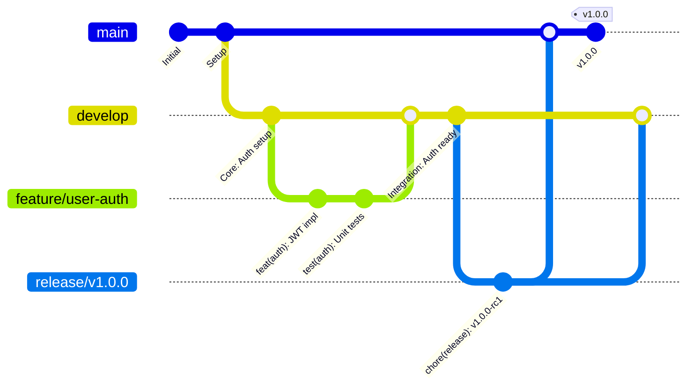

# Git Workflow Reference

<Info>
**SDD Classification:** L4-Development | **Authority:** CTO + Engineering Leadership | **Review Cycle:** Quarterly
</Info>

This document defines the Git workflow, branching strategy, and commit conventions for the Materi development team. Following these practices ensures consistent, traceable, and high-quality code changes.

**Strategy**: Git Flow with feature branches
**Commits**: Conventional Commits specification
**Quality**: Pre-commit hooks + CI gates
**Target**: <7 days branch lifetime, <5% merge conflicts

---

## Git Flow Strategy

### Branch Hierarchy



### Branch Types & Naming

| Branch Type | Pattern | Purpose | Lifetime | Merge Target |
|-------------|---------|---------|----------|--------------|
| **main** | `main` | Production-ready code | Permanent | N/A |
| **develop** | `develop` | Integration branch | Permanent | main (via release) |
| **feature** | `feature/issue-description` | New features | Temporary | develop |
| **release** | `release/v1.2.3` | Release preparation | Temporary | main + develop |
| **hotfix** | `hotfix/critical-issue` | Production fixes | Temporary | main + develop |
| **bugfix** | `bugfix/issue-description` | Non-critical fixes | Temporary | develop |

---

## Branching Practices

### Creating Feature Branches

```bash
# Start from latest develop
git checkout develop
git pull origin develop

# Create feature branch
git checkout -b feature/user-authentication
```

### Keeping Branches Updated

```bash
# Sync with develop regularly
git checkout develop
git pull origin develop
git checkout feature/user-authentication
git merge develop
```

### Branch Naming Examples

**Good:**
- `feature/add-document-versioning`
- `bugfix/fix-login-redirect`
- `hotfix/security-patch-auth`
- `release/v2.1.0`

**Bad:**
- `feature/my-feature`
- `fix`
- `john-branch`

---

## Commit Message Standards

### Conventional Commit Format

```
<type>[optional scope]: <description>

[optional body]

[optional footer(s)]
```

### Commit Types

| Type | Purpose | Example |
|------|---------|---------|
| **feat** | New feature | `feat(auth): add OAuth2 integration` |
| **fix** | Bug fix | `fix(api): resolve null pointer in user service` |
| **docs** | Documentation | `docs(readme): update setup instructions` |
| **style** | Code formatting | `style(auth): fix linting issues` |
| **refactor** | Code restructuring | `refactor(db): optimize query performance` |
| **test** | Add/modify tests | `test(auth): add integration test coverage` |
| **chore** | Maintenance | `chore(deps): update dependencies` |
| **ci** | CI/CD changes | `ci(github): add automated deployment` |
| **perf** | Performance | `perf(api): cache frequent queries` |
| **build** | Build system | `build(docker): optimize image size` |

### Scope Guidelines

| Scope | Purpose | Examples |
|-------|---------|----------|
| **auth** | Authentication/Authorization | `feat(auth): implement 2FA` |
| **api** | API endpoints | `fix(api): validate request payload` |
| **ui** | User interface | `feat(ui): add dark mode` |
| **db** | Database changes | `fix(db): resolve migration issue` |
| **docs** | Documentation | `docs(api): update endpoint specs` |

---

## Daily Workflow Commands

### Feature Development

```bash
# Start new feature
git checkout develop
git pull origin develop
git checkout -b feature/amazing-feature

# Work on feature
git add .
git commit -m "feat(scope): implement amazing functionality"

# Push feature branch
git push -u origin feature/amazing-feature

# Sync with latest develop
git checkout develop
git pull origin develop
git checkout feature/amazing-feature
git merge develop

# After approval, clean up
git checkout develop
git pull origin develop
git branch -d feature/amazing-feature
```

### Emergency Hotfix

```bash
# Start hotfix from main
git checkout main
git pull origin main
git checkout -b hotfix/critical-security-fix

# Apply fix
git add .
git commit -m "fix(security): patch authentication vulnerability"

# Push and create PR to main
git push -u origin hotfix/critical-security-fix

# After merge to main, apply to develop
git checkout develop
git pull origin develop
git merge main
git push origin develop
```

### Release Process

```bash
# Start release from develop
git checkout develop
git pull origin develop
git checkout -b release/v1.2.0

# Prepare release
npm version 1.2.0
git add package.json package-lock.json
git commit -m "chore(release): bump to v1.2.0"

# Merge to main
git checkout main
git merge --no-ff release/v1.2.0
git tag -a v1.2.0 -m "Release version 1.2.0"
git push origin main --tags

# Back-merge to develop
git checkout develop
git merge main
git push origin develop
```

---

## Cross-Service Changes

When a PR touches multiple services:

1. **Start from the contract** (OpenAPI/proto/events) and drive implementation
2. **Include impact summary** in PR description:
   - Affected services
   - Contract changes (OpenAPI, events)
   - Migrations/ops changes (if any)

### Impact Summary Template

```markdown
## Impact Summary

### Services Affected
- [ ] API
- [ ] Shield
- [ ] Relay

### Contract Changes
- [ ] OpenAPI spec updated
- [ ] Event schemas updated

### Deployment Notes
- Deploy Shield first (auth dependency)
- Run migrations before API deployment
```

---

## Keeping Specs and Docs in Sync

From `platform/atlas`:

```bash
# Check for drift
python3 scripts/sync_reference.py --check

# If check fails, regenerate and commit
python3 scripts/sync_reference.py
git add docs/
git commit -m "docs: sync reference documentation"
```

---

## Git Configuration

### Recommended Settings

```bash
git config --global user.name "Your Name"
git config --global user.email "your.email@materi.com"
git config --global core.editor "code --wait"
git config --global init.defaultBranch main
git config --global pull.rebase false
git config --global push.default simple
```

### Useful Aliases

```bash
[alias]
    st = status -s
    lg = log --oneline --graph --decorate --all
    co = checkout
    br = branch
    cm = commit -m
    undo = reset HEAD~1 --mixed
    sync = !git checkout develop && git pull origin develop
```

---

## Common Scenarios

### Accidentally Committed to Wrong Branch

```bash
git branch feature/my-feature  # Create branch at current HEAD
git reset --hard HEAD~3        # Reset main to 3 commits back
git checkout feature/my-feature
```

### Undo Last Commit

```bash
# Keep changes but uncommit
git reset HEAD~1

# Remove changes completely
git reset --hard HEAD~1
```

### Merge Conflict Resolution

```bash
git status                    # See conflicted files
git diff                     # Review conflicts
# Edit files to resolve, then:
git add .
git commit
```

---

## Quality Gates

### Pre-commit Hooks

```json
{
  "husky": {
    "hooks": {
      "pre-commit": "lint-staged",
      "commit-msg": "commitlint -E HUSKY_GIT_PARAMS"
    }
  }
}
```

### Performance Metrics

| Metric | Target |
|--------|--------|
| **Branch Lifetime** | <7 days |
| **Merge Conflicts** | <5% of merges |
| **Code Review Time** | <24 hours |

---

## Related Documentation

- [Contributing Overview](/developer/contributing/overview) - Development process
- [Testing Overview](/developer/testing/overview) - CI integration
- [Verification Matrix](/internal/architecture/specs/verification-matrix) - Quality gates

---

**Document Status:** Complete
**Version:** 2.0
**Last Updated:** January 2026
**Authority:** CTO + Engineering Leadership
**Classification:** L4-Development - Developer Reference

**Distribution:** Engineering Teams
