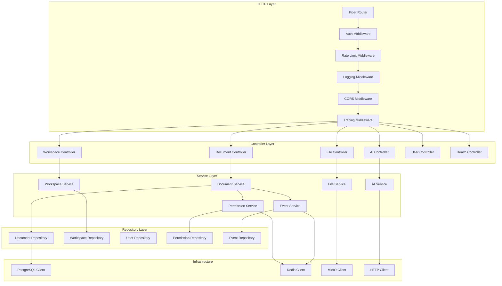
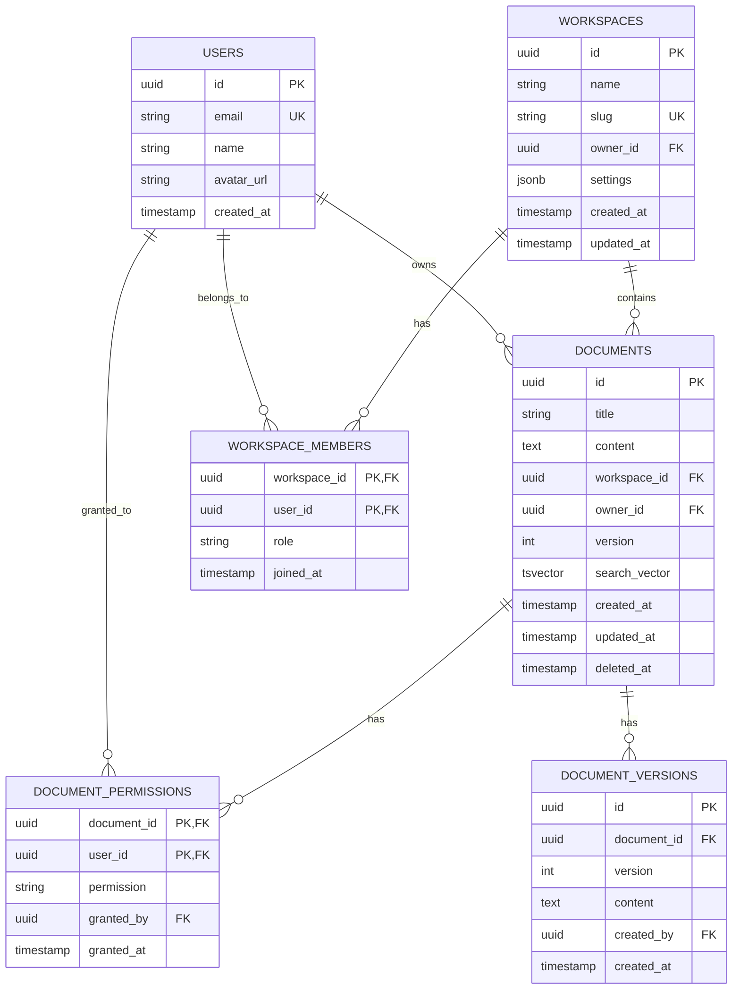
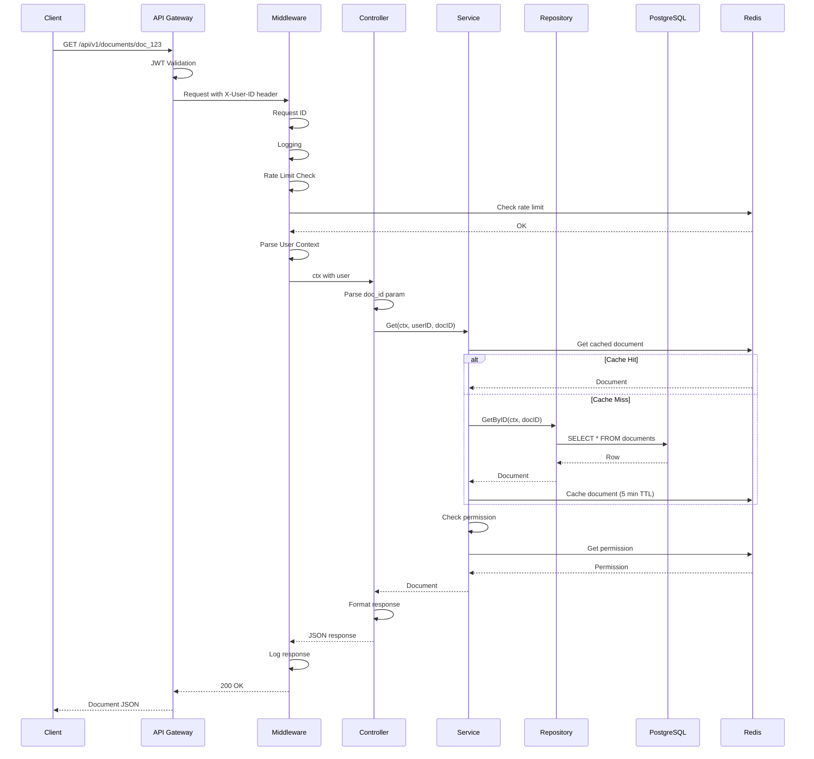
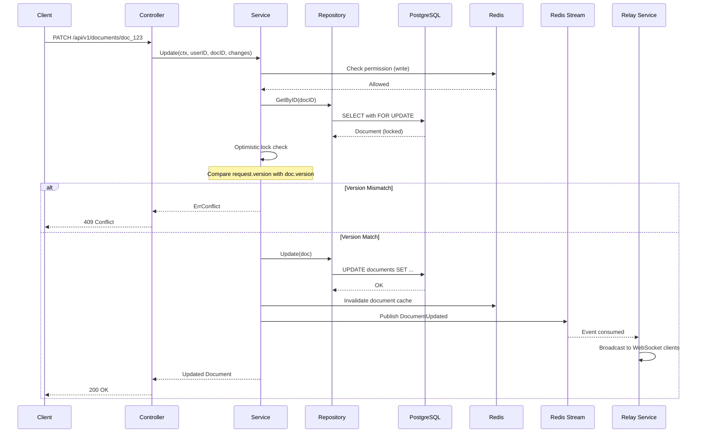
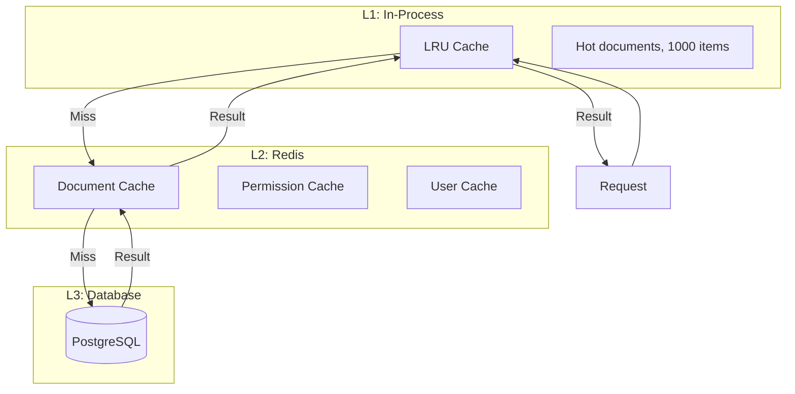

# API Architecture

<Info>
**SDD Classification:** L3-Technical
**Authority:** Engineering Team
**Review Cycle:** Quarterly
</Info>

This document details the internal architecture of Materi's API Service, including component design, data models, request flow, and integration patterns.

---

## Component Architecture



---

## Layer Responsibilities

### HTTP Layer (Middleware)

| Middleware | Order | Purpose |
|------------|-------|---------|
| Recovery | 1 | Panic recovery with stack trace |
| Request ID | 2 | Generate/propagate correlation ID |
| Logger | 3 | Request/response logging |
| CORS | 4 | Cross-origin request handling |
| Rate Limit | 5 | Request throttling |
| Auth | 6 | JWT validation and user context |
| Tracing | 7 | OpenTelemetry span creation |

### Controller Layer

Controllers handle HTTP concerns only:
- Request parsing and validation
- Response formatting
- HTTP status code selection
- No business logic

```go
// internal/controller/document.go
type DocumentController struct {
    documentService service.DocumentService
    logger          *zap.Logger
}

func (c *DocumentController) Create(ctx *fiber.Ctx) error {
    var req CreateDocumentRequest
    if err := ctx.BodyParser(&req); err != nil {
        return ctx.Status(400).JSON(ErrorResponse{
            Code:    "INVALID_REQUEST",
            Message: "Failed to parse request body",
        })
    }

    if err := req.Validate(); err != nil {
        return ctx.Status(422).JSON(ErrorResponse{
            Code:    "VALIDATION_ERROR",
            Message: err.Error(),
        })
    }

    userID := ctx.Locals("user_id").(string)
    doc, err := c.documentService.Create(ctx.Context(), userID, req)
    if err != nil {
        return c.handleError(ctx, err)
    }

    return ctx.Status(201).JSON(SuccessResponse{
        Data: doc,
    })
}
```

### Service Layer

Services contain business logic:
- Domain operations
- Transaction management
- Cross-service coordination
- Event publishing

```go
// internal/service/document.go
type DocumentService interface {
    Create(ctx context.Context, userID string, req CreateDocumentRequest) (*Document, error)
    Get(ctx context.Context, userID, docID string) (*Document, error)
    Update(ctx context.Context, userID, docID string, req UpdateDocumentRequest) (*Document, error)
    Delete(ctx context.Context, userID, docID string) error
    List(ctx context.Context, userID string, opts ListOptions) (*DocumentList, error)
    Search(ctx context.Context, userID, query string, opts SearchOptions) (*SearchResults, error)
}

type documentService struct {
    repo         repository.DocumentRepository
    permService  PermissionService
    eventService EventService
    cache        *redis.Client
    logger       *zap.Logger
}

func (s *documentService) Create(ctx context.Context, userID string, req CreateDocumentRequest) (*Document, error) {
    // Check workspace permission
    if err := s.permService.CheckWorkspacePermission(ctx, userID, req.WorkspaceID, PermissionWrite); err != nil {
        return nil, err
    }

    // Create document
    doc := &Document{
        ID:          uuid.New().String(),
        Title:       req.Title,
        Content:     req.Content,
        WorkspaceID: req.WorkspaceID,
        OwnerID:     userID,
        Version:     1,
        CreatedAt:   time.Now(),
        UpdatedAt:   time.Now(),
    }

    // Save to database
    if err := s.repo.Create(ctx, doc); err != nil {
        return nil, fmt.Errorf("failed to create document: %w", err)
    }

    // Publish event
    event := events.NewDocumentCreatedEvent(doc.ID, doc.WorkspaceID, userID)
    if err := s.eventService.Publish(ctx, "materi:events:documents", event); err != nil {
        s.logger.Error("failed to publish event", zap.Error(err))
        // Non-critical, don't fail the request
    }

    return doc, nil
}
```

### Repository Layer

Repositories handle data access:
- Database queries
- Query building
- Result mapping
- No business logic

```go
// internal/repository/document.go
type DocumentRepository interface {
    Create(ctx context.Context, doc *Document) error
    GetByID(ctx context.Context, id string) (*Document, error)
    Update(ctx context.Context, doc *Document) error
    Delete(ctx context.Context, id string) error
    List(ctx context.Context, workspaceID string, opts ListOptions) ([]*Document, int64, error)
    Search(ctx context.Context, workspaceID, query string) ([]*Document, error)
}

type documentRepository struct {
    db *sqlx.DB
}

func (r *documentRepository) GetByID(ctx context.Context, id string) (*Document, error) {
    var doc Document
    query := `
        SELECT id, title, content, workspace_id, owner_id, version,
               created_at, updated_at, deleted_at
        FROM documents
        WHERE id = $1 AND deleted_at IS NULL
    `
    if err := r.db.GetContext(ctx, &doc, query, id); err != nil {
        if errors.Is(err, sql.ErrNoRows) {
            return nil, ErrDocumentNotFound
        }
        return nil, fmt.Errorf("failed to get document: %w", err)
    }
    return &doc, nil
}

func (r *documentRepository) Search(ctx context.Context, workspaceID, query string) ([]*Document, error) {
    var docs []*Document
    searchQuery := `
        SELECT id, title, content, workspace_id, owner_id, version,
               created_at, updated_at,
               ts_rank(search_vector, plainto_tsquery('english', $1)) as rank
        FROM documents
        WHERE workspace_id = $2
          AND deleted_at IS NULL
          AND search_vector @@ plainto_tsquery('english', $1)
        ORDER BY rank DESC
        LIMIT 50
    `
    if err := r.db.SelectContext(ctx, &docs, searchQuery, query, workspaceID); err != nil {
        return nil, fmt.Errorf("failed to search documents: %w", err)
    }
    return docs, nil
}
```

---

## Data Models

### Database Schema



### Domain Models

```go
// internal/model/document.go
type Document struct {
    ID          string     `json:"id" db:"id"`
    Title       string     `json:"title" db:"title"`
    Content     string     `json:"content" db:"content"`
    WorkspaceID string     `json:"workspace_id" db:"workspace_id"`
    OwnerID     string     `json:"owner_id" db:"owner_id"`
    Version     int        `json:"version" db:"version"`
    CreatedAt   time.Time  `json:"created_at" db:"created_at"`
    UpdatedAt   time.Time  `json:"updated_at" db:"updated_at"`
    DeletedAt   *time.Time `json:"-" db:"deleted_at"`
}

type Workspace struct {
    ID        string          `json:"id" db:"id"`
    Name      string          `json:"name" db:"name"`
    Slug      string          `json:"slug" db:"slug"`
    OwnerID   string          `json:"owner_id" db:"owner_id"`
    Settings  WorkspaceSettings `json:"settings" db:"settings"`
    CreatedAt time.Time       `json:"created_at" db:"created_at"`
    UpdatedAt time.Time       `json:"updated_at" db:"updated_at"`
}

type WorkspaceSettings struct {
    DefaultPermission string `json:"default_permission"`
    AllowPublicLinks  bool   `json:"allow_public_links"`
    AIEnabled         bool   `json:"ai_enabled"`
}

type WorkspaceMember struct {
    WorkspaceID string    `json:"workspace_id" db:"workspace_id"`
    UserID      string    `json:"user_id" db:"user_id"`
    Role        string    `json:"role" db:"role"`
    JoinedAt    time.Time `json:"joined_at" db:"joined_at"`
}
```

---

## Request Flow

### Authenticated Request



### Document Update with Event



---

## Caching Strategy

### Cache Layers



### Cache Keys

| Pattern | TTL | Purpose |
|---------|-----|---------|
| `doc:{id}` | 5 min | Document content |
| `doc:{id}:meta` | 15 min | Document metadata only |
| `perm:{user_id}:{doc_id}` | 2 min | Permission decision |
| `perm:{user_id}:ws:{ws_id}` | 5 min | Workspace permissions |
| `user:{id}` | 10 min | User profile |
| `ws:{id}:members` | 5 min | Workspace members list |
| `rate:{user_id}:{endpoint}` | 1 min | Rate limit counter |

### Cache Invalidation

```go
// internal/service/cache.go
type CacheInvalidator struct {
    redis *redis.Client
}

func (c *CacheInvalidator) InvalidateDocument(ctx context.Context, docID string) error {
    keys := []string{
        fmt.Sprintf("doc:%s", docID),
        fmt.Sprintf("doc:%s:meta", docID),
    }
    return c.redis.Del(ctx, keys...).Err()
}

func (c *CacheInvalidator) InvalidatePermissions(ctx context.Context, userID, docID string) error {
    pattern := fmt.Sprintf("perm:%s:*", userID)
    keys, err := c.redis.Keys(ctx, pattern).Result()
    if err != nil {
        return err
    }
    if len(keys) > 0 {
        return c.redis.Del(ctx, keys...).Err()
    }
    return nil
}
```

---

## Error Handling

### Error Types

```go
// internal/errors/errors.go
var (
    ErrNotFound          = NewError("NOT_FOUND", "Resource not found", 404)
    ErrUnauthorized      = NewError("UNAUTHORIZED", "Authentication required", 401)
    ErrForbidden         = NewError("FORBIDDEN", "Permission denied", 403)
    ErrConflict          = NewError("CONFLICT", "Resource conflict", 409)
    ErrValidation        = NewError("VALIDATION_ERROR", "Validation failed", 422)
    ErrRateLimited       = NewError("RATE_LIMITED", "Too many requests", 429)
    ErrInternalError     = NewError("INTERNAL_ERROR", "Internal server error", 500)
    ErrServiceUnavailable = NewError("SERVICE_UNAVAILABLE", "Service temporarily unavailable", 503)
)

type AppError struct {
    Code       string `json:"code"`
    Message    string `json:"message"`
    StatusCode int    `json:"-"`
    Details    any    `json:"details,omitempty"`
    Cause      error  `json:"-"`
}

func (e *AppError) Error() string {
    return e.Message
}

func (e *AppError) WithDetails(details any) *AppError {
    e.Details = details
    return e
}

func (e *AppError) WithCause(cause error) *AppError {
    e.Cause = cause
    return e
}
```

### Error Middleware

```go
// internal/middleware/error.go
func ErrorHandler() fiber.Handler {
    return func(ctx *fiber.Ctx) error {
        err := ctx.Next()
        if err == nil {
            return nil
        }

        var appErr *errors.AppError
        if errors.As(err, &appErr) {
            return ctx.Status(appErr.StatusCode).JSON(fiber.Map{
                "success": false,
                "error": fiber.Map{
                    "code":    appErr.Code,
                    "message": appErr.Message,
                    "details": appErr.Details,
                },
            })
        }

        // Unknown error - log and return generic
        logger := ctx.Locals("logger").(*zap.Logger)
        logger.Error("unhandled error",
            zap.Error(err),
            zap.String("path", ctx.Path()),
        )

        return ctx.Status(500).JSON(fiber.Map{
            "success": false,
            "error": fiber.Map{
                "code":    "INTERNAL_ERROR",
                "message": "An unexpected error occurred",
            },
        })
    }
}
```

---

## Circuit Breaker Pattern

### Implementation

```go
// internal/infra/circuit.go
type CircuitBreaker struct {
    name          string
    maxFailures   int
    timeout       time.Duration
    halfOpenMax   int

    state         State
    failures      int
    successes     int
    lastFailure   time.Time
    mu            sync.RWMutex
}

type State int

const (
    StateClosed State = iota
    StateOpen
    StateHalfOpen
)

func (cb *CircuitBreaker) Execute(fn func() error) error {
    if !cb.canExecute() {
        return ErrCircuitOpen
    }

    err := fn()

    cb.mu.Lock()
    defer cb.mu.Unlock()

    if err != nil {
        cb.recordFailure()
        return err
    }

    cb.recordSuccess()
    return nil
}

func (cb *CircuitBreaker) canExecute() bool {
    cb.mu.RLock()
    defer cb.mu.RUnlock()

    switch cb.state {
    case StateClosed:
        return true
    case StateOpen:
        if time.Since(cb.lastFailure) > cb.timeout {
            cb.mu.RUnlock()
            cb.mu.Lock()
            cb.state = StateHalfOpen
            cb.successes = 0
            cb.mu.Unlock()
            cb.mu.RLock()
            return true
        }
        return false
    case StateHalfOpen:
        return true
    }
    return false
}
```

### Circuit Breaker Config

| Service | Failure Threshold | Timeout | Half-Open Max |
|---------|-------------------|---------|---------------|
| Shield | 5 | 60s | 2 |
| AI Provider | 3 | 30s | 1 |
| Relay | 5 | 30s | 2 |
| MinIO | 3 | 60s | 2 |

---

## Dependency Injection

### Wire Configuration

```go
// internal/wire/wire.go
// +build wireinject

func InitializeApp(cfg *config.Config) (*App, func(), error) {
    wire.Build(
        // Infrastructure
        provideLogger,
        provideDatabase,
        provideRedis,
        provideMinIO,
        provideHTTPClient,

        // Repositories
        repository.NewDocumentRepository,
        repository.NewWorkspaceRepository,
        repository.NewUserRepository,
        repository.NewPermissionRepository,

        // Services
        service.NewDocumentService,
        service.NewWorkspaceService,
        service.NewAIService,
        service.NewFileService,
        service.NewPermissionService,
        service.NewEventService,

        // Controllers
        controller.NewDocumentController,
        controller.NewWorkspaceController,
        controller.NewAIController,
        controller.NewFileController,
        controller.NewHealthController,

        // App
        NewApp,
    )
    return nil, nil, nil
}
```

---

## Related Documentation

- [Overview](overview) - Service overview
- [Endpoints](endpoints) - API endpoint reference
- [Authentication](authentication) - JWT and authorization
- [Testing](testing) - Test strategies
- [Deployment](deployment) - Container configuration

---

**Document Status:** Complete
**Version:** 2.0
