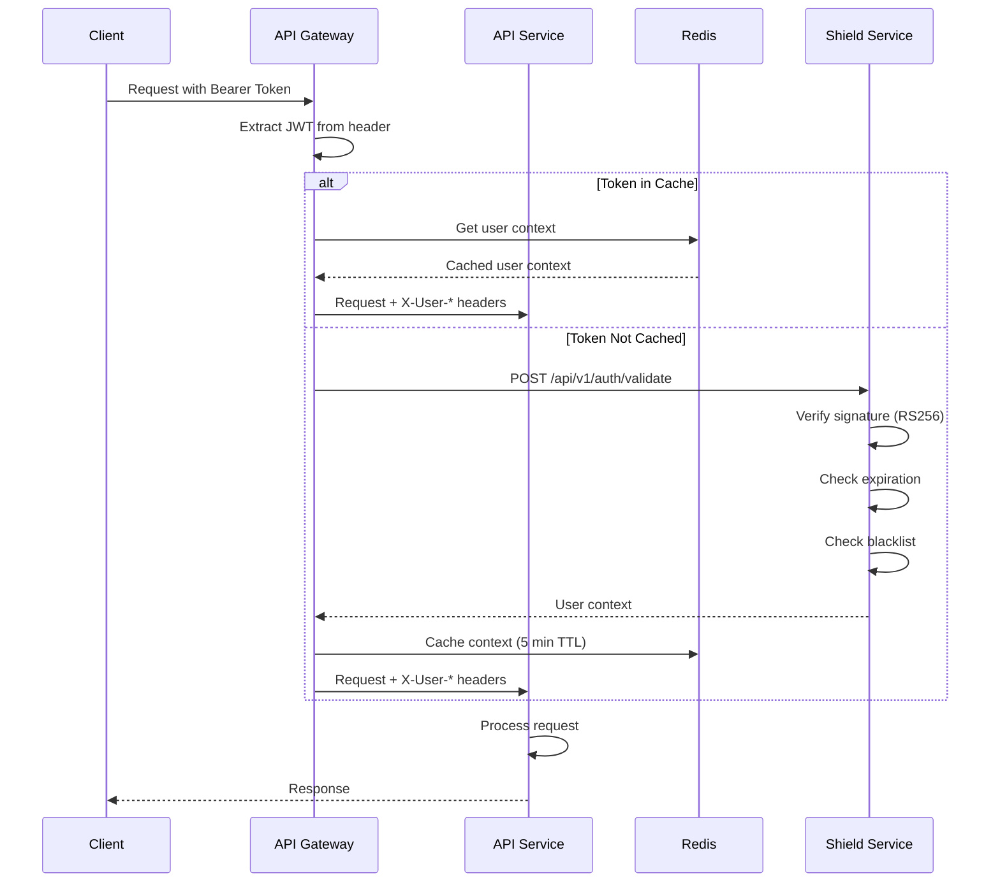
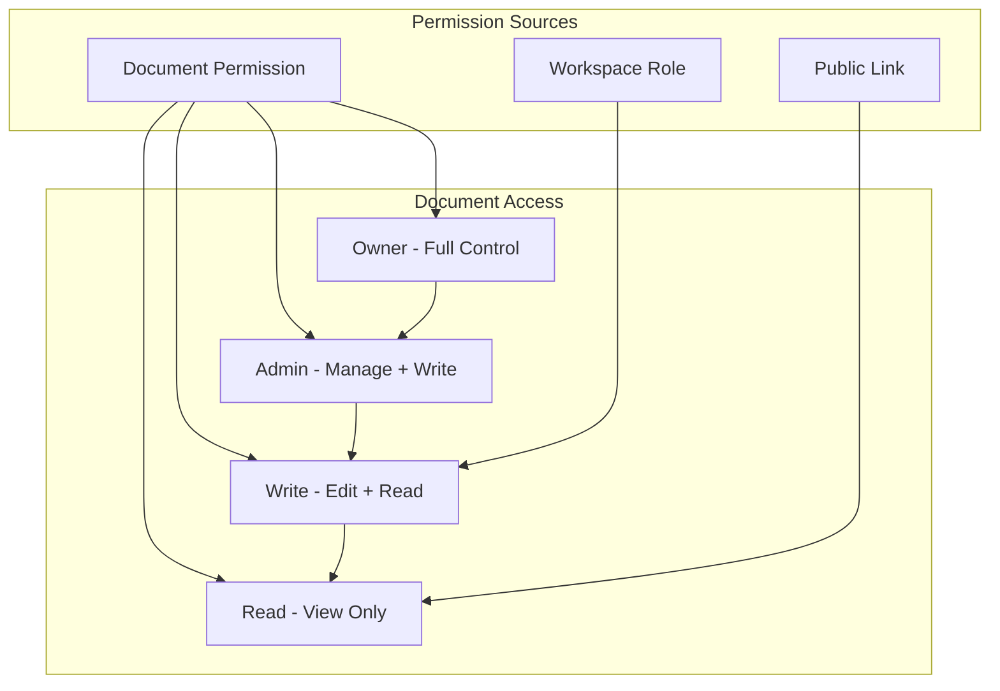
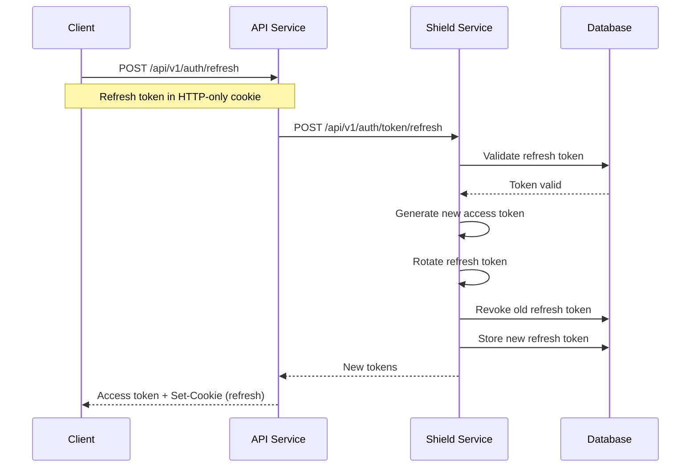

# API Authentication

<Info>
**SDD Classification:** L3-Technical
**Authority:** Engineering Team
**Review Cycle:** Quarterly
</Info>

This document details the authentication and authorization implementation in Materi's API Service, including JWT validation, permission checking, and integration with Shield authentication service.

---

## Authentication Flow



---

## JWT Token Structure

### Access Token Claims

```json
{
  "iss": "https://auth.materi.dev",
  "sub": "user_abc123",
  "aud": ["api.materi.dev"],
  "exp": 1704067200,
  "iat": 1704063600,
  "jti": "token_xyz789",
  "type": "access",
  "user": {
    "id": "user_abc123",
    "email": "user@example.com",
    "name": "John Doe",
    "email_verified": true
  },
  "workspaces": [
    {
      "id": "ws_123",
      "role": "owner"
    },
    {
      "id": "ws_456",
      "role": "member"
    }
  ]
}
```

### Token Lifetimes

| Token Type | Lifetime | Storage |
|------------|----------|---------|
| Access Token | 15 minutes | Memory only |
| Refresh Token | 30 days | Secure HTTP-only cookie |
| API Key | No expiry | Database with hash |

---

## Authentication Middleware

### Implementation

```go
// internal/middleware/auth.go
type AuthMiddleware struct {
    jwtPublicKey *rsa.PublicKey
    redis        *redis.Client
    shieldClient *shield.Client
    logger       *zap.Logger
}

func (m *AuthMiddleware) Authenticate() fiber.Handler {
    return func(ctx *fiber.Ctx) error {
        // Extract token from header
        authHeader := ctx.Get("Authorization")
        if authHeader == "" {
            return errors.ErrUnauthorized.WithDetails("Missing Authorization header")
        }

        if !strings.HasPrefix(authHeader, "Bearer ") {
            return errors.ErrUnauthorized.WithDetails("Invalid Authorization format")
        }

        token := strings.TrimPrefix(authHeader, "Bearer ")

        // Try cache first
        userCtx, err := m.getCachedContext(ctx.Context(), token)
        if err == nil {
            ctx.Locals("user", userCtx)
            ctx.Locals("user_id", userCtx.UserID)
            return ctx.Next()
        }

        // Validate with Shield
        userCtx, err = m.validateWithShield(ctx.Context(), token)
        if err != nil {
            return errors.ErrUnauthorized.WithCause(err)
        }

        // Cache the context
        if err := m.cacheContext(ctx.Context(), token, userCtx); err != nil {
            m.logger.Warn("failed to cache user context", zap.Error(err))
        }

        ctx.Locals("user", userCtx)
        ctx.Locals("user_id", userCtx.UserID)
        return ctx.Next()
    }
}

type UserContext struct {
    UserID        string            `json:"user_id"`
    Email         string            `json:"email"`
    Name          string            `json:"name"`
    EmailVerified bool              `json:"email_verified"`
    Workspaces    []WorkspaceRole   `json:"workspaces"`
}

type WorkspaceRole struct {
    WorkspaceID string `json:"workspace_id"`
    Role        string `json:"role"`
}
```

### Cache Operations

```go
func (m *AuthMiddleware) getCachedContext(ctx context.Context, token string) (*UserContext, error) {
    // Hash token to create cache key (don't store raw token)
    hash := sha256.Sum256([]byte(token))
    key := fmt.Sprintf("auth:ctx:%x", hash[:8])

    data, err := m.redis.Get(ctx, key).Bytes()
    if err != nil {
        return nil, err
    }

    var userCtx UserContext
    if err := json.Unmarshal(data, &userCtx); err != nil {
        return nil, err
    }
    return &userCtx, nil
}

func (m *AuthMiddleware) cacheContext(ctx context.Context, token string, userCtx *UserContext) error {
    hash := sha256.Sum256([]byte(token))
    key := fmt.Sprintf("auth:ctx:%x", hash[:8])

    data, err := json.Marshal(userCtx)
    if err != nil {
        return err
    }

    return m.redis.Set(ctx, key, data, 5*time.Minute).Err()
}
```

---

## Authorization

### Permission Levels

| Level | Value | Capabilities |
|-------|-------|--------------|
| `owner` | 100 | Full control, delete, transfer |
| `admin` | 75 | Manage members, settings, share |
| `write` | 50 | Create, edit, comment |
| `read` | 25 | View only |

### Permission Hierarchy



### Permission Service

```go
// internal/service/permission.go
type PermissionService interface {
    CheckDocumentPermission(ctx context.Context, userID, docID string, required Permission) error
    CheckWorkspacePermission(ctx context.Context, userID, wsID string, required Permission) error
    GetEffectivePermission(ctx context.Context, userID, docID string) (Permission, error)
    GrantDocumentPermission(ctx context.Context, granterID, userID, docID string, perm Permission) error
    RevokeDocumentPermission(ctx context.Context, revokerID, userID, docID string) error
}

type permissionService struct {
    docRepo  repository.DocumentRepository
    permRepo repository.PermissionRepository
    cache    *redis.Client
    logger   *zap.Logger
}

func (s *permissionService) CheckDocumentPermission(
    ctx context.Context,
    userID, docID string,
    required Permission,
) error {
    // Check cache first
    cacheKey := fmt.Sprintf("perm:%s:%s", userID, docID)
    if cached, err := s.cache.Get(ctx, cacheKey).Result(); err == nil {
        perm := Permission(cached)
        if perm.GreaterOrEqual(required) {
            return nil
        }
        return errors.ErrForbidden
    }

    // Get document to check ownership
    doc, err := s.docRepo.GetByID(ctx, docID)
    if err != nil {
        return err
    }

    // Owner has full access
    if doc.OwnerID == userID {
        s.cache.Set(ctx, cacheKey, string(PermissionOwner), 2*time.Minute)
        return nil
    }

    // Check explicit document permission
    perm, err := s.permRepo.GetDocumentPermission(ctx, userID, docID)
    if err == nil && perm.GreaterOrEqual(required) {
        s.cache.Set(ctx, cacheKey, string(perm), 2*time.Minute)
        return nil
    }

    // Check workspace role
    wsPerm, err := s.getWorkspacePermission(ctx, userID, doc.WorkspaceID)
    if err == nil && wsPerm.GreaterOrEqual(required) {
        s.cache.Set(ctx, cacheKey, string(wsPerm), 2*time.Minute)
        return nil
    }

    return errors.ErrForbidden
}

func (s *permissionService) GetEffectivePermission(
    ctx context.Context,
    userID, docID string,
) (Permission, error) {
    doc, err := s.docRepo.GetByID(ctx, docID)
    if err != nil {
        return PermissionNone, err
    }

    // Owner has full access
    if doc.OwnerID == userID {
        return PermissionOwner, nil
    }

    // Check explicit permission
    perm, err := s.permRepo.GetDocumentPermission(ctx, userID, docID)
    if err == nil {
        return perm, nil
    }

    // Check workspace role
    return s.getWorkspacePermission(ctx, userID, doc.WorkspaceID)
}
```

---

## Token Refresh

### Refresh Flow



### Implementation

```go
// internal/controller/auth.go
func (c *AuthController) RefreshToken(ctx *fiber.Ctx) error {
    // Get refresh token from cookie
    refreshToken := ctx.Cookies("refresh_token")
    if refreshToken == "" {
        return errors.ErrUnauthorized.WithDetails("Missing refresh token")
    }

    // Call Shield to refresh
    result, err := c.shieldClient.RefreshToken(ctx.Context(), refreshToken)
    if err != nil {
        return errors.ErrUnauthorized.WithCause(err)
    }

    // Set new refresh token cookie
    ctx.Cookie(&fiber.Cookie{
        Name:     "refresh_token",
        Value:    result.RefreshToken,
        Expires:  time.Now().Add(30 * 24 * time.Hour),
        HTTPOnly: true,
        Secure:   true,
        SameSite: "Strict",
    })

    return ctx.JSON(fiber.Map{
        "access_token": result.AccessToken,
        "expires_in":   900, // 15 minutes
    })
}
```

---

## API Key Authentication

### API Key Format

```
mat_live_abc123xyz789...
mat_test_abc123xyz789...
```

| Prefix | Environment | Permissions |
|--------|-------------|-------------|
| `mat_live_` | Production | Full API access |
| `mat_test_` | Sandbox | Test data only |

### API Key Middleware

```go
// internal/middleware/apikey.go
func (m *AuthMiddleware) APIKeyAuth() fiber.Handler {
    return func(ctx *fiber.Ctx) error {
        apiKey := ctx.Get("X-API-Key")
        if apiKey == "" {
            return ctx.Next() // Fall through to JWT auth
        }

        // Validate prefix
        if !strings.HasPrefix(apiKey, "mat_live_") &&
           !strings.HasPrefix(apiKey, "mat_test_") {
            return errors.ErrUnauthorized.WithDetails("Invalid API key format")
        }

        // Hash and lookup
        hash := sha256.Sum256([]byte(apiKey))
        keyHash := hex.EncodeToString(hash[:])

        keyInfo, err := m.apiKeyRepo.GetByHash(ctx.Context(), keyHash)
        if err != nil {
            return errors.ErrUnauthorized.WithDetails("Invalid API key")
        }

        // Check if revoked
        if keyInfo.RevokedAt != nil {
            return errors.ErrUnauthorized.WithDetails("API key has been revoked")
        }

        // Update last used
        go func() {
            _ = m.apiKeyRepo.UpdateLastUsed(context.Background(), keyInfo.ID)
        }()

        // Set user context
        ctx.Locals("user_id", keyInfo.UserID)
        ctx.Locals("workspace_id", keyInfo.WorkspaceID)
        ctx.Locals("auth_method", "api_key")
        ctx.Locals("api_key_id", keyInfo.ID)

        return ctx.Next()
    }
}
```

---

## Rate Limiting by Auth

### Rate Limit Tiers

| Auth Method | Default Limit | Burst | Window |
|-------------|---------------|-------|--------|
| Anonymous | 20 req/min | 5 | 1 min |
| Authenticated User | 100 req/min | 20 | 1 min |
| API Key (Standard) | 1000 req/min | 100 | 1 min |
| API Key (Enterprise) | 10000 req/min | 500 | 1 min |

### Endpoint-Specific Limits

| Endpoint | Limit | Reason |
|----------|-------|--------|
| `POST /api/v1/auth/*` | 5 req/min | Brute force prevention |
| `POST /api/v1/ai/*` | Tier-based | Cost control |
| `GET /api/v1/documents` | 200 req/min | Pagination expected |
| `POST /api/v1/documents` | 60 req/min | Write operation |

### Rate Limiter Implementation

```go
// internal/middleware/ratelimit.go
type RateLimiter struct {
    redis  *redis.Client
    config RateLimitConfig
}

func (r *RateLimiter) Limit() fiber.Handler {
    return func(ctx *fiber.Ctx) error {
        // Determine identity
        identity := r.getIdentity(ctx)
        endpoint := ctx.Path()

        // Get limit for this identity/endpoint
        limit := r.getLimit(ctx, identity, endpoint)

        // Check rate
        key := fmt.Sprintf("rate:%s:%s", identity, endpoint)
        count, err := r.redis.Incr(ctx.Context(), key).Result()
        if err != nil {
            // Redis error - allow request but log
            r.logger.Error("rate limit check failed", zap.Error(err))
            return ctx.Next()
        }

        // Set expiry on first request
        if count == 1 {
            r.redis.Expire(ctx.Context(), key, limit.Window)
        }

        // Check limit
        if count > int64(limit.Max) {
            ttl, _ := r.redis.TTL(ctx.Context(), key).Result()
            ctx.Set("Retry-After", strconv.Itoa(int(ttl.Seconds())))
            ctx.Set("X-RateLimit-Limit", strconv.Itoa(limit.Max))
            ctx.Set("X-RateLimit-Remaining", "0")
            ctx.Set("X-RateLimit-Reset", strconv.FormatInt(time.Now().Add(ttl).Unix(), 10))

            return errors.ErrRateLimited.WithDetails(fiber.Map{
                "retry_after": int(ttl.Seconds()),
                "limit":       limit.Max,
            })
        }

        // Set rate limit headers
        ctx.Set("X-RateLimit-Limit", strconv.Itoa(limit.Max))
        ctx.Set("X-RateLimit-Remaining", strconv.Itoa(limit.Max-int(count)))

        return ctx.Next()
    }
}

func (r *RateLimiter) getIdentity(ctx *fiber.Ctx) string {
    // Prefer user ID
    if userID, ok := ctx.Locals("user_id").(string); ok {
        return "user:" + userID
    }

    // Prefer API key
    if keyID, ok := ctx.Locals("api_key_id").(string); ok {
        return "key:" + keyID
    }

    // Fall back to IP
    return "ip:" + ctx.IP()
}
```

---

## Security Headers

### Response Headers

```go
// internal/middleware/security.go
func SecurityHeaders() fiber.Handler {
    return func(ctx *fiber.Ctx) error {
        // Prevent clickjacking
        ctx.Set("X-Frame-Options", "DENY")

        // Prevent MIME sniffing
        ctx.Set("X-Content-Type-Options", "nosniff")

        // XSS protection (legacy browsers)
        ctx.Set("X-XSS-Protection", "1; mode=block")

        // HSTS
        ctx.Set("Strict-Transport-Security", "max-age=31536000; includeSubDomains")

        // Content Security Policy
        ctx.Set("Content-Security-Policy", "default-src 'none'; frame-ancestors 'none'")

        // Referrer Policy
        ctx.Set("Referrer-Policy", "strict-origin-when-cross-origin")

        return ctx.Next()
    }
}
```

### CORS Configuration

```go
// internal/middleware/cors.go
func CORSConfig() cors.Config {
    return cors.Config{
        AllowOrigins: "https://app.materi.dev, https://materi.dev",
        AllowMethods: "GET, POST, PATCH, DELETE, OPTIONS",
        AllowHeaders: "Authorization, Content-Type, X-Request-ID, X-API-Key",
        AllowCredentials: true,
        ExposeHeaders: "X-Request-ID, X-RateLimit-Limit, X-RateLimit-Remaining",
        MaxAge: 3600,
    }
}
```

---

## Token Blacklisting

### Blacklist Operations

```go
// internal/service/auth.go
type AuthService interface {
    BlacklistToken(ctx context.Context, tokenJTI string, expiry time.Time) error
    IsTokenBlacklisted(ctx context.Context, tokenJTI string) bool
    Logout(ctx context.Context, userID string) error
}

func (s *authService) BlacklistToken(ctx context.Context, tokenJTI string, expiry time.Time) error {
    key := fmt.Sprintf("blacklist:%s", tokenJTI)
    ttl := time.Until(expiry)
    if ttl <= 0 {
        return nil // Already expired
    }
    return s.redis.Set(ctx, key, "1", ttl).Err()
}

func (s *authService) IsTokenBlacklisted(ctx context.Context, tokenJTI string) bool {
    key := fmt.Sprintf("blacklist:%s", tokenJTI)
    exists, _ := s.redis.Exists(ctx, key).Result()
    return exists > 0
}

func (s *authService) Logout(ctx context.Context, userID string) error {
    // Blacklist all active tokens for user
    pattern := fmt.Sprintf("auth:ctx:*")
    keys, err := s.redis.Keys(ctx, pattern).Result()
    if err != nil {
        return err
    }

    // Delete all cached contexts
    if len(keys) > 0 {
        return s.redis.Del(ctx, keys...).Err()
    }
    return nil
}
```

---

## Related Documentation

- [Overview](overview) - Service overview
- [Architecture](architecture) - Component design
- [Rate Limiting](rate-limiting) - Request throttling
- [Endpoints](endpoints) - API endpoint reference

---

**Document Status:** Complete
**Version:** 2.0
