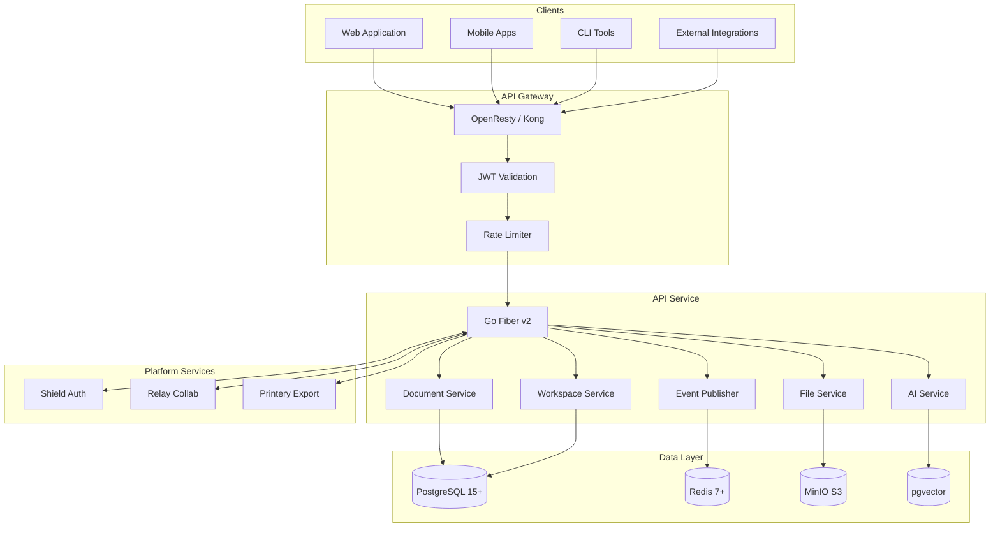
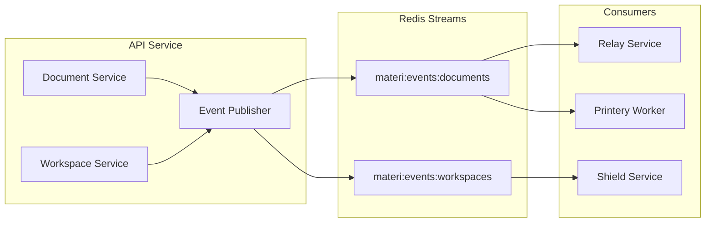

# API Service Overview

<Info>
**SDD Classification:** L2-System
**Authority:** Engineering Team
**Review Cycle:** Quarterly
</Info>

The API Service is Materi's primary HTTP backend, built with Go 1.25+ and Fiber v2 framework. It serves as the central REST gateway for document management, AI integration, workspace operations, and event-driven cross-service communication.

---

## Service Context



---

## Core Responsibilities

### Document Management
- Full CRUD operations for documents with versioning
- Full-text search with PostgreSQL tsvector
- Soft deletion with 30-day retention
- Version history and snapshot creation
- Document sharing and permission inheritance

### Workspace Operations
- Multi-tenant workspace isolation
- Team member management and invitations
- Workspace-level settings and preferences
- Usage tracking and quota enforcement

### AI Integration
- Content generation with streaming SSE responses
- Context-aware prompts via vector similarity search
- Token usage tracking and tier-based rate limiting
- Multi-provider support (OpenAI, Anthropic)

### Event Publishing
- Redis Streams event publishing for cross-service sync
- Protocol Buffer serialization for type safety
- Document lifecycle events (created, updated, deleted, shared)
- At-least-once delivery with idempotency keys

### File Operations
- MinIO S3-compatible file storage
- Image optimization and thumbnail generation
- Pre-signed URL generation for direct uploads
- File metadata extraction and indexing

---

## Technology Stack

| Component | Technology | Purpose |
|-----------|------------|---------|
| Framework | Go Fiber v2 | High-performance HTTP routing |
| Language | Go 1.25+ | Compiled, concurrent runtime |
| Database | PostgreSQL 15+ | Primary data store |
| SQL Toolkit | sqlx + pgx/v5 | Type-safe queries |
| Cache | Redis 7+ | Session, permissions, events |
| Object Storage | MinIO | S3-compatible file storage |
| Vector Search | pgvector | AI context enhancement |
| Metrics | Prometheus | Observability |
| Logging | Zap | Structured JSON logging |
| Tracing | OpenTelemetry | Distributed tracing |

---

## API Design Principles

### RESTful Conventions
```
POST   /api/v1/documents          Create document
GET    /api/v1/documents          List documents (paginated)
GET    /api/v1/documents/{id}     Get document by ID
PATCH  /api/v1/documents/{id}     Partial update
DELETE /api/v1/documents/{id}     Soft delete
GET    /api/v1/documents/search   Full-text search
```

### Response Format
```json
{
  "success": true,
  "data": {
    "id": "doc_abc123",
    "title": "My Document",
    "content": "...",
    "version": 5,
    "created_at": "2025-01-07T10:00:00Z",
    "updated_at": "2025-01-07T14:30:00Z"
  },
  "meta": {
    "request_id": "req_xyz789"
  }
}
```

### Error Response
```json
{
  "success": false,
  "error": {
    "code": "DOCUMENT_NOT_FOUND",
    "message": "Document with ID 'doc_abc123' not found",
    "details": {
      "document_id": "doc_abc123"
    }
  },
  "meta": {
    "request_id": "req_xyz789"
  }
}
```

---

## Event-Driven Architecture

The API Service publishes events to Redis Streams for cross-service synchronization:



### Published Events

| Event | Stream | Payload |
|-------|--------|---------|
| `DocumentCreated` | `materi:events:documents` | document_id, workspace_id, owner_id |
| `DocumentUpdated` | `materi:events:documents` | document_id, changes, version |
| `DocumentDeleted` | `materi:events:documents` | document_id, deleted_by |
| `DocumentShared` | `materi:events:documents` | document_id, shared_with, permission |
| `WorkspaceCreated` | `materi:events:workspaces` | workspace_id, owner_id |
| `MemberInvited` | `materi:events:workspaces` | workspace_id, user_email, role |

---

## Performance Targets

| Metric | Target | Measurement |
|--------|--------|-------------|
| Response Time (p50) | <100ms | API Gateway |
| Response Time (p95) | <200ms | API Gateway |
| Response Time (p99) | <500ms | API Gateway |
| Database Query (p99) | <100ms | Service metrics |
| Cache Hit Rate | >90% | Redis metrics |
| Availability | 99.9% | Uptime monitoring |

---

## Service Dependencies

### Required Services
- **PostgreSQL**: Primary data store (critical)
- **Redis**: Caching, sessions, events (critical)
- **Shield**: JWT validation, permission checks (critical)

### Optional Services
- **MinIO**: File storage (graceful degradation)
- **AI Providers**: Content generation (circuit breaker)
- **Relay**: Real-time collaboration sync (eventual consistency)

### Health Check Behavior
```
/health  - Basic liveness (always returns 200 if process running)
/ready   - Dependency checks (503 if critical services unavailable)
/metrics - Prometheus metrics (no auth required)
```

---

## Configuration

### Environment Variables

```bash
# Core
ENVIRONMENT=production           # development, staging, production
API_PORT=8080                    # HTTP listen port
LOG_LEVEL=info                   # debug, info, warn, error

# Database
DATABASE_URL=postgresql://...    # Primary connection string
DATABASE_POOL_SIZE=20            # Connection pool size
DATABASE_TIMEOUT=30s             # Query timeout

# Redis
REDIS_URL=redis://...            # Redis connection string
REDIS_POOL_SIZE=50               # Connection pool size

# Authentication
JWT_PUBLIC_KEY=...               # RS256 public key
SHIELD_URL=http://shield:8000    # Shield service URL

# AI Services
OPENAI_API_KEY=sk-...            # OpenAI API key
ANTHROPIC_API_KEY=sk-ant-...     # Anthropic API key
AI_TIMEOUT=60s                   # AI request timeout

# Feature Flags
ENABLE_AI_FEATURES=true          # AI generation features
ENABLE_COLLABORATION=true        # Real-time collaboration
```

---

## Related Documentation

- [Architecture](architecture) - Component design and data models
- [Endpoints](endpoints) - Complete API endpoint reference
- [Authentication](authentication) - JWT and authorization flows
- [Rate Limiting](rate-limiting) - Request throttling configuration
- [Testing](testing) - Test strategies and coverage
- [Deployment](deployment) - Container and Kubernetes configuration
- [Setup](setup) - Local development environment

---

**Document Status:** Complete
**Version:** 2.0
