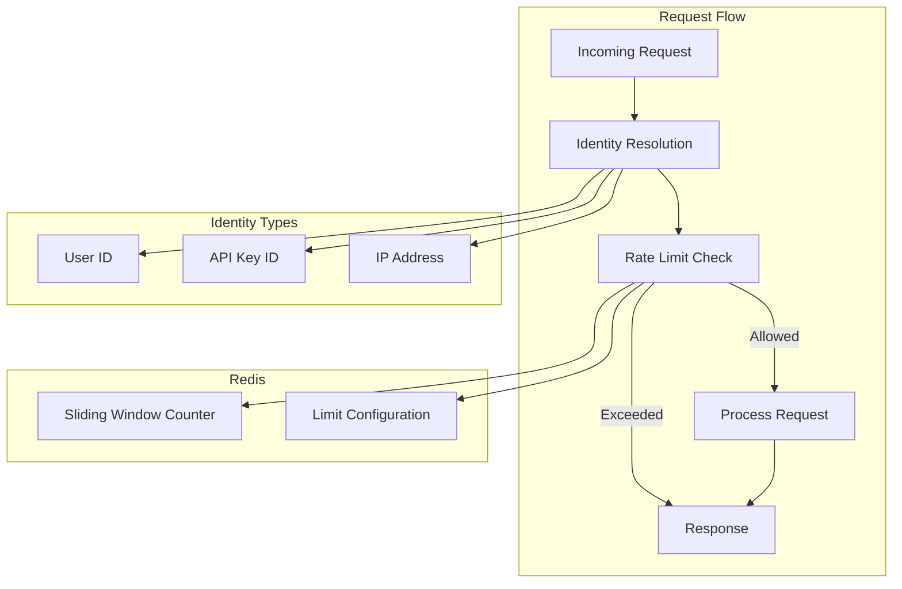
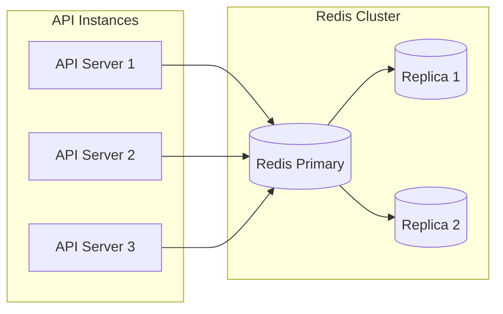

# API Rate Limiting

<Info>
**SDD Classification:** L3-Technical
**Authority:** Engineering Team
**Review Cycle:** Quarterly
</Info>

This document describes the rate limiting implementation in Materi's API Service, including algorithms, configuration, and client-side handling.

---

## Rate Limiting Overview



---

## Rate Limit Tiers

### By Authentication Method

| Auth Method | Requests/Minute | Burst | Daily Limit |
|-------------|-----------------|-------|-------------|
| Anonymous (IP) | 20 | 5 | 500 |
| Free User | 100 | 20 | 10,000 |
| Pro User | 500 | 50 | 100,000 |
| API Key (Standard) | 1,000 | 100 | Unlimited |
| API Key (Enterprise) | 10,000 | 500 | Unlimited |

### By Endpoint Category

| Category | Limit | Reason |
|----------|-------|--------|
| Auth endpoints | 5/min | Brute force prevention |
| AI endpoints | Tier-based | Cost control |
| Read operations | 200/min | Allow high throughput |
| Write operations | 60/min | Database protection |
| Search operations | 30/min | Resource intensive |
| File uploads | 20/min | Storage bandwidth |

---

## Sliding Window Algorithm

### Implementation

```go
// internal/middleware/ratelimit.go
type SlidingWindowLimiter struct {
    redis  *redis.Client
    logger *zap.Logger
}

type RateLimitResult struct {
    Allowed   bool
    Limit     int
    Remaining int
    ResetAt   time.Time
    RetryAfter time.Duration
}

func (l *SlidingWindowLimiter) Check(
    ctx context.Context,
    key string,
    limit int,
    window time.Duration,
) (*RateLimitResult, error) {
    now := time.Now()
    windowStart := now.Add(-window)

    pipe := l.redis.Pipeline()

    // Remove old entries outside the window
    pipe.ZRemRangeByScore(ctx, key, "0", strconv.FormatInt(windowStart.UnixMicro(), 10))

    // Count current entries in window
    countCmd := pipe.ZCard(ctx, key)

    // Add current request with timestamp as score
    member := fmt.Sprintf("%d:%s", now.UnixMicro(), uuid.New().String())
    pipe.ZAdd(ctx, key, redis.Z{
        Score:  float64(now.UnixMicro()),
        Member: member,
    })

    // Set expiry on the key
    pipe.Expire(ctx, key, window)

    _, err := pipe.Exec(ctx)
    if err != nil {
        return nil, err
    }

    count := int(countCmd.Val())
    remaining := limit - count - 1
    if remaining < 0 {
        remaining = 0
    }

    result := &RateLimitResult{
        Allowed:   count < limit,
        Limit:     limit,
        Remaining: remaining,
        ResetAt:   now.Add(window),
    }

    if !result.Allowed {
        // Calculate retry after based on oldest entry
        oldestCmd := l.redis.ZRange(ctx, key, 0, 0)
        oldest, _ := oldestCmd.Result()
        if len(oldest) > 0 {
            parts := strings.Split(oldest[0], ":")
            if ts, err := strconv.ParseInt(parts[0], 10, 64); err == nil {
                oldestTime := time.UnixMicro(ts)
                result.RetryAfter = window - now.Sub(oldestTime)
            }
        }
    }

    return result, nil
}
```

### Token Bucket Alternative

For burst-tolerant endpoints:

```go
// internal/middleware/tokenbucket.go
type TokenBucketLimiter struct {
    redis *redis.Client
}

type BucketConfig struct {
    Capacity   int           // Max tokens
    RefillRate int           // Tokens per second
    Window     time.Duration // Refill window
}

func (l *TokenBucketLimiter) Allow(
    ctx context.Context,
    key string,
    config BucketConfig,
) (bool, error) {
    script := `
        local key = KEYS[1]
        local capacity = tonumber(ARGV[1])
        local refill_rate = tonumber(ARGV[2])
        local now = tonumber(ARGV[3])
        local requested = tonumber(ARGV[4])

        local bucket = redis.call("HMGET", key, "tokens", "last_update")
        local tokens = tonumber(bucket[1]) or capacity
        local last_update = tonumber(bucket[2]) or now

        -- Calculate tokens to add based on elapsed time
        local elapsed = now - last_update
        local refill = math.floor(elapsed * refill_rate / 1000)
        tokens = math.min(capacity, tokens + refill)

        -- Check if request can be fulfilled
        if tokens >= requested then
            tokens = tokens - requested
            redis.call("HMSET", key, "tokens", tokens, "last_update", now)
            redis.call("EXPIRE", key, 3600)
            return {1, tokens, capacity}
        else
            return {0, tokens, capacity}
        end
    `

    result, err := l.redis.Eval(ctx, script, []string{key},
        config.Capacity,
        config.RefillRate,
        time.Now().UnixMilli(),
        1,
    ).Result()

    if err != nil {
        return false, err
    }

    values := result.([]interface{})
    return values[0].(int64) == 1, nil
}
```

---

## Endpoint Configuration

### Route-Level Limits

```go
// internal/config/ratelimit.go
type RateLimitConfig struct {
    DefaultLimit   int
    DefaultWindow  time.Duration
    EndpointLimits map[string]EndpointLimit
}

type EndpointLimit struct {
    Path   string
    Method string
    Limit  int
    Window time.Duration
    Burst  int
}

var DefaultRateLimits = RateLimitConfig{
    DefaultLimit:  100,
    DefaultWindow: time.Minute,
    EndpointLimits: map[string]EndpointLimit{
        // Auth - strict limits
        "POST:/api/v1/auth/login": {
            Limit:  5,
            Window: time.Minute,
            Burst:  2,
        },
        "POST:/api/v1/auth/refresh": {
            Limit:  10,
            Window: time.Minute,
            Burst:  5,
        },

        // AI - tier-based (multiplier applied)
        "POST:/api/v1/ai/generate": {
            Limit:  10,  // Base limit, multiplied by tier
            Window: time.Minute,
            Burst:  3,
        },

        // Documents - read heavy
        "GET:/api/v1/documents": {
            Limit:  200,
            Window: time.Minute,
            Burst:  50,
        },
        "POST:/api/v1/documents": {
            Limit:  60,
            Window: time.Minute,
            Burst:  10,
        },

        // Search - expensive
        "GET:/api/v1/documents/search": {
            Limit:  30,
            Window: time.Minute,
            Burst:  5,
        },

        // Files - bandwidth
        "POST:/api/v1/files/upload": {
            Limit:  20,
            Window: time.Minute,
            Burst:  5,
        },
    },
}
```

---

## Response Headers

### Standard Headers

Every response includes rate limit information:

```
X-RateLimit-Limit: 100
X-RateLimit-Remaining: 95
X-RateLimit-Reset: 1704067260
```

| Header | Description |
|--------|-------------|
| `X-RateLimit-Limit` | Maximum requests allowed in window |
| `X-RateLimit-Remaining` | Requests remaining in current window |
| `X-RateLimit-Reset` | Unix timestamp when window resets |

### Rate Exceeded Response

```
HTTP/1.1 429 Too Many Requests
Retry-After: 45
X-RateLimit-Limit: 100
X-RateLimit-Remaining: 0
X-RateLimit-Reset: 1704067260
Content-Type: application/json

{
  "success": false,
  "error": {
    "code": "RATE_LIMITED",
    "message": "Rate limit exceeded",
    "details": {
      "limit": 100,
      "window_seconds": 60,
      "retry_after_seconds": 45
    }
  }
}
```

---

## Middleware Implementation

### Rate Limit Middleware

```go
// internal/middleware/ratelimit.go
func RateLimitMiddleware(limiter *SlidingWindowLimiter, config RateLimitConfig) fiber.Handler {
    return func(ctx *fiber.Ctx) error {
        // Build rate limit key
        identity := getIdentity(ctx)
        endpoint := fmt.Sprintf("%s:%s", ctx.Method(), ctx.Path())
        key := fmt.Sprintf("ratelimit:%s:%s", identity, endpoint)

        // Get limit for this endpoint
        limit := getLimit(config, endpoint, ctx)

        // Check rate
        result, err := limiter.Check(ctx.Context(), key, limit.Limit, limit.Window)
        if err != nil {
            // Redis error - log and allow (fail open)
            zap.L().Error("rate limit check failed", zap.Error(err))
            return ctx.Next()
        }

        // Set headers
        ctx.Set("X-RateLimit-Limit", strconv.Itoa(result.Limit))
        ctx.Set("X-RateLimit-Remaining", strconv.Itoa(result.Remaining))
        ctx.Set("X-RateLimit-Reset", strconv.FormatInt(result.ResetAt.Unix(), 10))

        if !result.Allowed {
            ctx.Set("Retry-After", strconv.Itoa(int(result.RetryAfter.Seconds())))

            return ctx.Status(429).JSON(fiber.Map{
                "success": false,
                "error": fiber.Map{
                    "code":    "RATE_LIMITED",
                    "message": "Rate limit exceeded",
                    "details": fiber.Map{
                        "limit":               result.Limit,
                        "window_seconds":      int(limit.Window.Seconds()),
                        "retry_after_seconds": int(result.RetryAfter.Seconds()),
                    },
                },
            })
        }

        return ctx.Next()
    }
}

func getIdentity(ctx *fiber.Ctx) string {
    // Prefer user ID for authenticated requests
    if userID, ok := ctx.Locals("user_id").(string); ok {
        return "user:" + userID
    }

    // Use API key ID if present
    if keyID, ok := ctx.Locals("api_key_id").(string); ok {
        return "key:" + keyID
    }

    // Fall back to IP address
    return "ip:" + ctx.IP()
}

func getLimit(config RateLimitConfig, endpoint string, ctx *fiber.Ctx) EndpointLimit {
    // Check for endpoint-specific limit
    if limit, ok := config.EndpointLimits[endpoint]; ok {
        // Apply tier multiplier for tiered endpoints
        if strings.HasPrefix(endpoint, "POST:/api/v1/ai/") {
            limit.Limit = applyTierMultiplier(limit.Limit, ctx)
        }
        return limit
    }

    // Return default
    return EndpointLimit{
        Limit:  config.DefaultLimit,
        Window: config.DefaultWindow,
    }
}

func applyTierMultiplier(baseLimit int, ctx *fiber.Ctx) int {
    tier := ctx.Locals("user_tier").(string)
    switch tier {
    case "enterprise":
        return baseLimit * 100
    case "pro":
        return baseLimit * 10
    case "free":
        return baseLimit
    default:
        return baseLimit
    }
}
```

---

## Distributed Rate Limiting

### Multi-Instance Coordination



### Key Distribution

Rate limit keys are distributed across Redis cluster using consistent hashing:

```go
// Key format ensures proper distribution
func buildRateLimitKey(identity, endpoint string) string {
    // Hash tag ensures related keys go to same shard
    return fmt.Sprintf("ratelimit:{%s}:%s", identity, endpoint)
}
```

---

## Quota Management

### AI Request Quotas

```go
// internal/service/quota.go
type QuotaService interface {
    CheckAIQuota(ctx context.Context, userID string) (*QuotaStatus, error)
    ConsumeAIQuota(ctx context.Context, userID string, tokens int) error
    GetQuotaUsage(ctx context.Context, userID string) (*QuotaUsage, error)
}

type QuotaStatus struct {
    Allowed       bool
    Remaining     int
    Limit         int
    ResetAt       time.Time
    UsedThisPeriod int
}

type QuotaUsage struct {
    RequestsUsed  int
    TokensUsed    int
    RequestsLimit int
    TokensLimit   int
    Period        string
    ResetAt       time.Time
}

func (s *quotaService) CheckAIQuota(ctx context.Context, userID string) (*QuotaStatus, error) {
    user, err := s.userRepo.GetByID(ctx, userID)
    if err != nil {
        return nil, err
    }

    // Get tier limits
    limits := s.getTierLimits(user.Tier)

    // Get current usage
    usage, err := s.getMonthlyUsage(ctx, userID)
    if err != nil {
        return nil, err
    }

    return &QuotaStatus{
        Allowed:        usage.Requests < limits.MonthlyRequests,
        Remaining:      limits.MonthlyRequests - usage.Requests,
        Limit:          limits.MonthlyRequests,
        ResetAt:        s.getMonthEnd(),
        UsedThisPeriod: usage.Requests,
    }, nil
}

type TierLimits struct {
    MonthlyRequests int
    MonthlyTokens   int
    RequestsPerMin  int
}

func (s *quotaService) getTierLimits(tier string) TierLimits {
    switch tier {
    case "enterprise":
        return TierLimits{
            MonthlyRequests: -1, // Unlimited
            MonthlyTokens:   -1,
            RequestsPerMin:  1000,
        }
    case "pro":
        return TierLimits{
            MonthlyRequests: 10000,
            MonthlyTokens:   5000000,
            RequestsPerMin:  100,
        }
    default: // free
        return TierLimits{
            MonthlyRequests: 100,
            MonthlyTokens:   50000,
            RequestsPerMin:  10,
        }
    }
}
```

---

## Client-Side Handling

### Retry Strategy

```typescript
// Recommended client implementation
class RateLimitAwareClient {
  private async request(url: string, options: RequestInit): Promise<Response> {
    const maxRetries = 3;
    let attempt = 0;

    while (attempt < maxRetries) {
      const response = await fetch(url, options);

      if (response.status !== 429) {
        return response;
      }

      // Rate limited - check headers
      const retryAfter = response.headers.get('Retry-After');
      const remaining = response.headers.get('X-RateLimit-Remaining');

      if (remaining === '0' && retryAfter) {
        const waitMs = parseInt(retryAfter, 10) * 1000;
        console.log(`Rate limited, waiting ${waitMs}ms before retry`);

        // Add jitter to prevent thundering herd
        const jitter = Math.random() * 1000;
        await this.sleep(waitMs + jitter);
      }

      attempt++;
    }

    throw new Error('Max retries exceeded due to rate limiting');
  }

  private sleep(ms: number): Promise<void> {
    return new Promise(resolve => setTimeout(resolve, ms));
  }
}
```

### Best Practices

1. **Cache responses** - Reduce unnecessary API calls
2. **Implement exponential backoff** - Don't hammer the API
3. **Monitor headers** - Track remaining quota proactively
4. **Batch requests** - Combine multiple operations when possible
5. **Use webhooks** - Prefer push over polling where available

---

## Monitoring and Alerts

### Prometheus Metrics

```go
var (
    rateLimitTotal = prometheus.NewCounterVec(
        prometheus.CounterOpts{
            Name: "materi_ratelimit_requests_total",
            Help: "Total rate limit checks",
        },
        []string{"endpoint", "result"},
    )

    rateLimitLatency = prometheus.NewHistogramVec(
        prometheus.HistogramOpts{
            Name:    "materi_ratelimit_check_duration_seconds",
            Help:    "Rate limit check latency",
            Buckets: []float64{0.0001, 0.0005, 0.001, 0.005, 0.01},
        },
        []string{"endpoint"},
    )
)
```

### Alert Thresholds

| Metric | Warning | Critical |
|--------|---------|----------|
| Rate limit hits (%) | >10% | >25% |
| Redis latency (p99) | >5ms | >20ms |
| Daily quota usage | >80% | >95% |

---

## Related Documentation

- [Overview](overview) - Service overview
- [Authentication](authentication) - Auth flows
- [Endpoints](endpoints) - API reference
- [Architecture](architecture) - System design

---

**Document Status:** Complete
**Version:** 2.0
