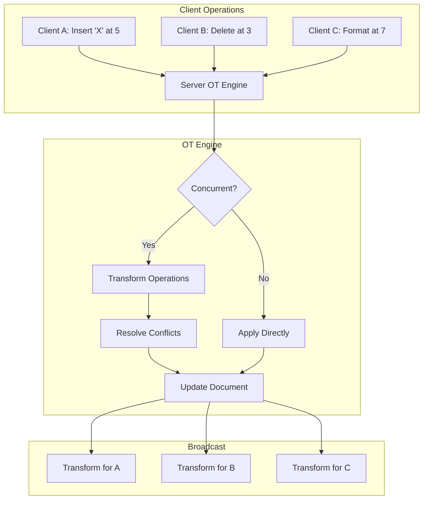
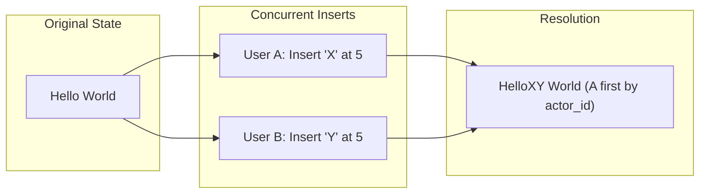
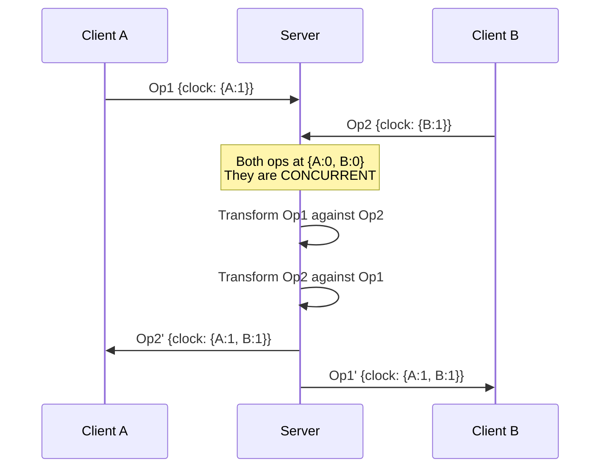

# Operational Transform

<Info>
**SDD Classification:** L3-Technical
**Authority:** Engineering Team
**Review Cycle:** Quarterly
</Info>

This document details Relay's Operational Transform (OT) implementation for conflict-free concurrent document editing, including transformation algorithms, vector clock management, and conflict resolution strategies.

---

## OT Architecture Overview



---

## Operation Types

### Core Operations

| Operation | Description | Parameters |
|-----------|-------------|------------|
| `Insert` | Add content at position | `position`, `content`, `attributes` |
| `Delete` | Remove content at position | `position`, `length` |
| `Retain` | Skip over content | `length` |
| `Format` | Apply formatting | `position`, `length`, `attributes` |

### Operation Structure

```rust
#[derive(Debug, Clone, Serialize, Deserialize)]
pub enum Operation {
    Insert {
        position: u32,
        content: String,
        attributes: Option<HashMap<String, String>>,
    },
    Delete {
        position: u32,
        length: u32,
    },
    Retain {
        length: u32,
    },
    Format {
        position: u32,
        length: u32,
        attributes: HashMap<String, String>,
    },
}

#[derive(Debug, Clone)]
pub struct OperationWithMetadata {
    pub id: String,
    pub actor_id: String,
    pub document_id: String,
    pub operation: Operation,
    pub vector_clock: VectorClock,
    pub timestamp: u64,
    pub parent_id: Option<String>,
}
```

### Composite Operations

Multiple operations can be composed into a single transaction:

```rust
pub struct CompositeOperation {
    pub id: String,
    pub operations: Vec<Operation>,
    pub metadata: OperationMetadata,
}

impl CompositeOperation {
    pub fn compose(self) -> Operation {
        // Compose multiple ops into single optimized op
        self.operations.into_iter()
            .reduce(|acc, op| acc.compose(op))
            .unwrap_or(Operation::Retain { length: 0 })
    }
}
```

---

## Transformation Rules

### Insert vs Insert

When two users insert at the same position:



**Algorithm:**

```rust
fn transform_insert_insert(
    op_a: &InsertOp,
    op_b: &InsertOp,
    priority_a: bool
) -> (InsertOp, InsertOp) {
    let (new_a, new_b) = match op_a.position.cmp(&op_b.position) {
        Ordering::Less => {
            // A is before B, B shifts right
            (op_a.clone(), InsertOp {
                position: op_b.position + op_a.content.len() as u32,
                ..op_b.clone()
            })
        }
        Ordering::Greater => {
            // B is before A, A shifts right
            (InsertOp {
                position: op_a.position + op_b.content.len() as u32,
                ..op_a.clone()
            }, op_b.clone())
        }
        Ordering::Equal => {
            // Same position - use priority (actor_id comparison)
            if priority_a {
                (op_a.clone(), InsertOp {
                    position: op_b.position + op_a.content.len() as u32,
                    ..op_b.clone()
                })
            } else {
                (InsertOp {
                    position: op_a.position + op_b.content.len() as u32,
                    ..op_a.clone()
                }, op_b.clone())
            }
        }
    };
    (new_a, new_b)
}
```

### Insert vs Delete

```rust
fn transform_insert_delete(
    insert: &InsertOp,
    delete: &DeleteOp
) -> (InsertOp, DeleteOp) {
    if insert.position <= delete.position {
        // Insert is before delete range
        (insert.clone(), DeleteOp {
            position: delete.position + insert.content.len() as u32,
            length: delete.length,
        })
    } else if insert.position >= delete.position + delete.length {
        // Insert is after delete range
        (InsertOp {
            position: insert.position - delete.length,
            ..insert.clone()
        }, delete.clone())
    } else {
        // Insert is within delete range - insert before delete
        (InsertOp {
            position: delete.position,
            ..insert.clone()
        }, DeleteOp {
            position: delete.position + insert.content.len() as u32,
            length: delete.length,
        })
    }
}
```

### Delete vs Delete

```rust
fn transform_delete_delete(
    del_a: &DeleteOp,
    del_b: &DeleteOp
) -> (Option<DeleteOp>, Option<DeleteOp>) {
    let a_start = del_a.position;
    let a_end = del_a.position + del_a.length;
    let b_start = del_b.position;
    let b_end = del_b.position + del_b.length;

    if a_end <= b_start {
        // A is entirely before B
        (Some(del_a.clone()), Some(DeleteOp {
            position: b_start - del_a.length,
            length: del_b.length,
        }))
    } else if b_end <= a_start {
        // B is entirely before A
        (Some(DeleteOp {
            position: a_start - del_b.length,
            length: del_a.length,
        }), Some(del_b.clone()))
    } else if a_start <= b_start && a_end >= b_end {
        // A contains B - B becomes no-op
        (Some(DeleteOp {
            position: del_a.position,
            length: del_a.length - del_b.length,
        }), None)
    } else if b_start <= a_start && b_end >= a_end {
        // B contains A - A becomes no-op
        (None, Some(DeleteOp {
            position: del_b.position,
            length: del_b.length - del_a.length,
        }))
    } else {
        // Overlapping deletes - split operations
        let overlap = calculate_overlap(del_a, del_b);
        (
            Some(DeleteOp {
                position: del_a.position.min(del_b.position),
                length: del_a.length - overlap,
            }),
            Some(DeleteOp {
                position: del_b.position.min(del_a.position),
                length: del_b.length - overlap,
            })
        )
    }
}
```

---

## Vector Clock Management

### Vector Clock Structure

```rust
#[derive(Debug, Clone, Default)]
pub struct VectorClock {
    clocks: HashMap<String, u64>,
}

impl VectorClock {
    pub fn new() -> Self {
        Self::default()
    }

    pub fn increment(&mut self, actor_id: &str) -> &Self {
        *self.clocks.entry(actor_id.to_string()).or_insert(0) += 1;
        self
    }

    pub fn get(&self, actor_id: &str) -> u64 {
        *self.clocks.get(actor_id).unwrap_or(&0)
    }

    pub fn merge(&mut self, other: &VectorClock) {
        for (actor, clock) in &other.clocks {
            let current = self.clocks.entry(actor.clone()).or_insert(0);
            *current = (*current).max(*clock);
        }
    }

    pub fn compare(&self, other: &VectorClock) -> ClockOrder {
        let mut greater = false;
        let mut less = false;

        for actor in self.all_actors(other) {
            let a = self.get(&actor);
            let b = other.get(&actor);

            if a > b { greater = true; }
            if a < b { less = true; }
        }

        match (greater, less) {
            (true, false) => ClockOrder::After,
            (false, true) => ClockOrder::Before,
            (false, false) => ClockOrder::Equal,
            (true, true) => ClockOrder::Concurrent,
        }
    }

    fn all_actors(&self, other: &VectorClock) -> HashSet<String> {
        self.clocks.keys()
            .chain(other.clocks.keys())
            .cloned()
            .collect()
    }
}

#[derive(Debug, PartialEq)]
pub enum ClockOrder {
    Before,
    After,
    Equal,
    Concurrent,
}
```

### Causal Ordering



---

## OT Engine Implementation

### Core Engine

```rust
pub struct OTEngine {
    document_id: String,
    document_state: DocumentState,
    operation_log: VecDeque<OperationWithMetadata>,
    pending_operations: HashMap<String, OperationWithMetadata>,
    vector_clock: VectorClock,
    max_log_size: usize,
}

impl OTEngine {
    pub fn new(document_id: String) -> Self {
        Self {
            document_id,
            document_state: DocumentState::new(),
            operation_log: VecDeque::with_capacity(10000),
            pending_operations: HashMap::new(),
            vector_clock: VectorClock::new(),
            max_log_size: 10000,
        }
    }

    pub fn apply_operation(
        &mut self,
        op: OperationWithMetadata
    ) -> Result<Vec<OperationWithMetadata>, OTError> {
        // 1. Check if operation is causally ready
        if !self.is_causally_ready(&op) {
            self.pending_operations.insert(op.id.clone(), op);
            return Ok(vec![]);
        }

        // 2. Find concurrent operations
        let concurrent_ops = self.find_concurrent_operations(&op);

        // 3. Transform against concurrent ops
        let transformed = self.transform_against_history(op.clone(), &concurrent_ops)?;

        // 4. Apply to document state
        self.document_state.apply(&transformed.operation)?;

        // 5. Update vector clock
        self.vector_clock.merge(&transformed.vector_clock);

        // 6. Add to operation log
        self.add_to_log(transformed.clone());

        // 7. Process any pending operations that are now ready
        let ready_pending = self.process_pending_operations()?;

        let mut results = vec![transformed];
        results.extend(ready_pending);

        Ok(results)
    }

    fn is_causally_ready(&self, op: &OperationWithMetadata) -> bool {
        match op.vector_clock.compare(&self.vector_clock) {
            ClockOrder::Before | ClockOrder::Equal => true,
            ClockOrder::After => false,
            ClockOrder::Concurrent => {
                // Check if all dependencies are satisfied
                for (actor, clock) in op.vector_clock.clocks.iter() {
                    if actor != &op.actor_id {
                        if *clock > self.vector_clock.get(actor) {
                            return false;
                        }
                    }
                }
                true
            }
        }
    }

    fn transform_against_history(
        &self,
        mut op: OperationWithMetadata,
        concurrent: &[OperationWithMetadata]
    ) -> Result<OperationWithMetadata, OTError> {
        for concurrent_op in concurrent {
            let (transformed, _) = transform_pair(
                &op.operation,
                &concurrent_op.operation,
                op.actor_id > concurrent_op.actor_id  // Deterministic priority
            );
            op.operation = transformed;
        }
        Ok(op)
    }

    fn find_concurrent_operations(
        &self,
        op: &OperationWithMetadata
    ) -> Vec<OperationWithMetadata> {
        self.operation_log.iter()
            .filter(|log_op| {
                log_op.vector_clock.compare(&op.vector_clock) == ClockOrder::Concurrent
            })
            .cloned()
            .collect()
    }

    fn add_to_log(&mut self, op: OperationWithMetadata) {
        self.operation_log.push_back(op);

        // Garbage collect old operations
        while self.operation_log.len() > self.max_log_size {
            self.operation_log.pop_front();
        }
    }
}
```

### Transform Function

```rust
pub fn transform_pair(
    op_a: &Operation,
    op_b: &Operation,
    priority_a: bool
) -> (Operation, Operation) {
    match (op_a, op_b) {
        (Operation::Insert { .. }, Operation::Insert { .. }) => {
            transform_insert_insert(op_a, op_b, priority_a)
        }
        (Operation::Insert { .. }, Operation::Delete { .. }) => {
            transform_insert_delete(op_a, op_b)
        }
        (Operation::Delete { .. }, Operation::Insert { .. }) => {
            let (b, a) = transform_insert_delete(op_b, op_a);
            (a, b)
        }
        (Operation::Delete { .. }, Operation::Delete { .. }) => {
            transform_delete_delete(op_a, op_b)
        }
        (Operation::Format { .. }, _) |
        (_, Operation::Format { .. }) => {
            transform_format(op_a, op_b, priority_a)
        }
        _ => (op_a.clone(), op_b.clone())
    }
}
```

---

## Undo/Redo Support

### Operation Inversion

```rust
impl Operation {
    pub fn invert(&self, document: &str) -> Operation {
        match self {
            Operation::Insert { position, content, .. } => {
                Operation::Delete {
                    position: *position,
                    length: content.len() as u32,
                }
            }
            Operation::Delete { position, length } => {
                // Get deleted content from document at time of operation
                let deleted_content = document
                    [*position as usize..(*position + *length) as usize]
                    .to_string();
                Operation::Insert {
                    position: *position,
                    content: deleted_content,
                    attributes: None,
                }
            }
            Operation::Format { position, length, attributes } => {
                // Invert formatting by removing attributes
                Operation::Format {
                    position: *position,
                    length: *length,
                    attributes: invert_attributes(attributes),
                }
            }
            Operation::Retain { .. } => self.clone(),
        }
    }
}
```

### Undo Stack Management

```rust
pub struct UndoManager {
    undo_stack: Vec<CompositeOperation>,
    redo_stack: Vec<CompositeOperation>,
    max_stack_size: usize,
}

impl UndoManager {
    pub fn push_operation(&mut self, op: OperationWithMetadata) {
        // Group related operations (within 500ms)
        if let Some(last) = self.undo_stack.last_mut() {
            if last.can_merge(&op) {
                last.merge(op);
                return;
            }
        }

        self.undo_stack.push(CompositeOperation::from(op));
        self.redo_stack.clear();

        // Limit stack size
        while self.undo_stack.len() > self.max_stack_size {
            self.undo_stack.remove(0);
        }
    }

    pub fn undo(&mut self, document: &str) -> Option<CompositeOperation> {
        let op = self.undo_stack.pop()?;
        let inverse = op.invert(document);
        self.redo_stack.push(op);
        Some(inverse)
    }

    pub fn redo(&mut self) -> Option<CompositeOperation> {
        let op = self.redo_stack.pop()?;
        self.undo_stack.push(op.clone());
        Some(op)
    }
}
```

---

## Performance Optimization

### Batching Operations

```rust
pub struct OperationBatcher {
    pending: Vec<Operation>,
    batch_timeout: Duration,
    max_batch_size: usize,
    last_flush: Instant,
}

impl OperationBatcher {
    pub fn add(&mut self, op: Operation) -> Option<Vec<Operation>> {
        self.pending.push(op);

        if self.should_flush() {
            Some(self.flush())
        } else {
            None
        }
    }

    fn should_flush(&self) -> bool {
        self.pending.len() >= self.max_batch_size ||
        self.last_flush.elapsed() > self.batch_timeout
    }

    fn flush(&mut self) -> Vec<Operation> {
        self.last_flush = Instant::now();
        std::mem::take(&mut self.pending)
    }
}
```

### Operation Compression

```rust
pub fn compress_operations(ops: Vec<Operation>) -> Vec<Operation> {
    let mut compressed = Vec::new();

    for op in ops {
        if let Some(last) = compressed.last_mut() {
            if let Some(merged) = try_merge(last, &op) {
                *last = merged;
                continue;
            }
        }
        compressed.push(op);
    }

    compressed
}

fn try_merge(a: &Operation, b: &Operation) -> Option<Operation> {
    match (a, b) {
        // Merge adjacent inserts
        (
            Operation::Insert { position: p1, content: c1, attributes: a1 },
            Operation::Insert { position: p2, content: c2, attributes: a2 }
        ) if *p2 == p1 + c1.len() as u32 && a1 == a2 => {
            Some(Operation::Insert {
                position: *p1,
                content: format!("{}{}", c1, c2),
                attributes: a1.clone(),
            })
        }
        // Merge adjacent deletes
        (
            Operation::Delete { position: p1, length: l1 },
            Operation::Delete { position: p2, length: l2 }
        ) if *p2 == *p1 => {
            Some(Operation::Delete {
                position: *p1,
                length: l1 + l2,
            })
        }
        _ => None
    }
}
```

---

## Conflict Resolution Strategies

### Deterministic Ordering

For truly concurrent operations at the same position:

```rust
fn resolve_tie(op_a: &OperationWithMetadata, op_b: &OperationWithMetadata) -> Ordering {
    // 1. Compare actor IDs (lexicographic)
    match op_a.actor_id.cmp(&op_b.actor_id) {
        Ordering::Equal => {
            // 2. Compare operation IDs
            op_a.id.cmp(&op_b.id)
        }
        ordering => ordering
    }
}
```

### Formatting Conflicts

When multiple users apply different formatting to the same region:

```rust
fn resolve_format_conflict(
    format_a: &FormatOp,
    format_b: &FormatOp
) -> FormatOp {
    // Last-writer-wins for conflicting attributes
    let mut merged_attrs = format_a.attributes.clone();

    for (key, value) in &format_b.attributes {
        // Later timestamp wins
        merged_attrs.insert(key.clone(), value.clone());
    }

    FormatOp {
        position: format_a.position,
        length: format_a.length,
        attributes: merged_attrs,
    }
}
```

---

## Error Handling

### OT Errors

```rust
#[derive(Debug, thiserror::Error)]
pub enum OTError {
    #[error("Invalid operation: position {0} out of bounds (document length: {1})")]
    OutOfBounds(u32, u32),

    #[error("Operation conflict cannot be resolved: {0}")]
    UnresolvableConflict(String),

    #[error("Vector clock inconsistency: expected {expected:?}, got {actual:?}")]
    ClockInconsistency {
        expected: VectorClock,
        actual: VectorClock,
    },

    #[error("Operation queue overflow: {0} pending operations")]
    QueueOverflow(usize),

    #[error("Invalid operation format: {0}")]
    InvalidFormat(String),
}
```

---

## Testing OT Correctness

### Convergence Test

```rust
#[test]
fn test_convergence() {
    // Apply ops in different orders, verify same final state
    let ops = vec![
        Operation::Insert { position: 0, content: "Hello".to_string(), attributes: None },
        Operation::Insert { position: 5, content: " World".to_string(), attributes: None },
        Operation::Delete { position: 0, length: 5 },
    ];

    let permutations = ops.iter().permutations(ops.len());

    let mut final_states = HashSet::new();
    for perm in permutations {
        let mut engine = OTEngine::new("test".to_string());
        for op in perm {
            engine.apply_operation(op.clone().into()).unwrap();
        }
        final_states.insert(engine.document_state.content());
    }

    // All permutations should converge to same state
    assert_eq!(final_states.len(), 1);
}
```

---

## Related Documentation

- [Architecture](architecture) - System design
- [WebSocket Protocol](websocket-protocol) - Message formats
- [Presence Tracking](presence-tracking) - User presence
- [Testing](testing) - Test strategies

---

**Document Status:** Complete
**Version:** 2.0
