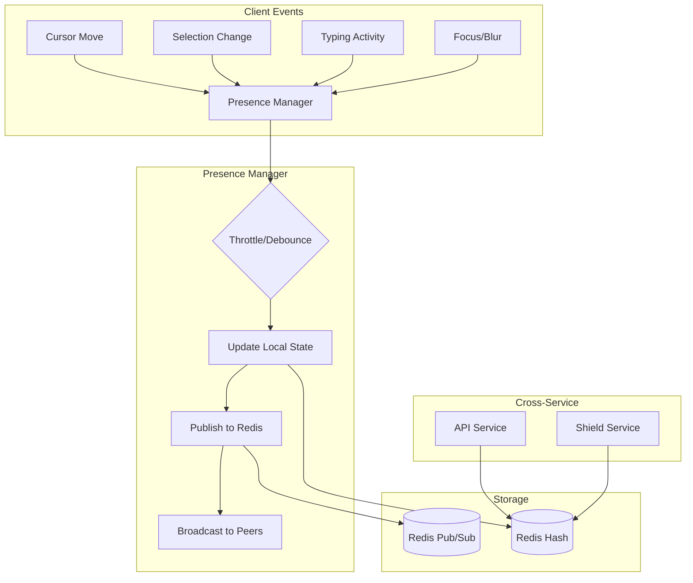

# Presence Tracking

<Info>
**SDD Classification:** L3-Technical
**Authority:** Engineering Team
**Review Cycle:** Quarterly
</Info>

This document covers Relay's real-time presence tracking system including user activity monitoring, cursor synchronization, typing indicators, and cross-service presence integration.

---

## Presence Architecture



---

## Presence Data Model

### Presence State Structure

```rust
#[derive(Debug, Clone, Serialize, Deserialize)]
pub struct UserPresence {
    pub user_id: String,
    pub document_id: String,
    pub workspace_id: String,

    // User identity
    pub name: String,
    pub avatar_url: Option<String>,
    pub color: String,  // Unique color per user

    // Activity state
    pub state: PresenceState,
    pub cursor: Option<CursorPosition>,
    pub selection: Option<Selection>,

    // Timestamps
    pub connected_at: u64,
    pub last_active_at: u64,
    pub last_cursor_update: u64,
}

#[derive(Debug, Clone, Serialize, Deserialize)]
pub struct PresenceState {
    pub online: bool,
    pub typing: bool,
    pub focused: bool,
    pub activity: ActivityType,
    pub viewport: Option<Viewport>,
}

#[derive(Debug, Clone, Serialize, Deserialize)]
pub enum ActivityType {
    Editing,
    Viewing,
    Selecting,
    Idle,
    Away,
}

#[derive(Debug, Clone, Serialize, Deserialize)]
pub struct CursorPosition {
    pub line: u32,
    pub column: u32,
    pub offset: u32,
}

#[derive(Debug, Clone, Serialize, Deserialize)]
pub struct Selection {
    pub anchor: CursorPosition,
    pub head: CursorPosition,
    pub is_backward: bool,
}

#[derive(Debug, Clone, Serialize, Deserialize)]
pub struct Viewport {
    pub top_line: u32,
    pub bottom_line: u32,
    pub scroll_percentage: f32,
}
```

---

## Presence Manager

### Core Implementation

```rust
pub struct PresenceManager {
    document_id: String,
    users: DashMap<String, UserPresence>,
    redis: RedisClient,
    broadcast_tx: broadcast::Sender<PresenceEvent>,
    config: PresenceConfig,
}

#[derive(Clone)]
pub struct PresenceConfig {
    pub cursor_throttle_ms: u64,      // 50ms default
    pub typing_debounce_ms: u64,      // 500ms default
    pub presence_ttl_seconds: u64,    // 30s default
    pub activity_timeout_ms: u64,     // 30000ms default
    pub max_users_per_document: usize, // 1000 default
}

impl PresenceManager {
    pub fn new(
        document_id: String,
        redis: RedisClient,
        config: PresenceConfig,
    ) -> Self {
        let (broadcast_tx, _) = broadcast::channel(1000);

        Self {
            document_id,
            users: DashMap::new(),
            redis,
            broadcast_tx,
            config,
        }
    }

    pub async fn user_join(
        &self,
        user_id: &str,
        user_info: UserInfo,
    ) -> Result<UserPresence, PresenceError> {
        // Check capacity
        if self.users.len() >= self.config.max_users_per_document {
            return Err(PresenceError::DocumentAtCapacity);
        }

        let color = self.assign_unique_color(user_id);
        let now = current_timestamp_ms();

        let presence = UserPresence {
            user_id: user_id.to_string(),
            document_id: self.document_id.clone(),
            workspace_id: user_info.workspace_id.clone(),
            name: user_info.name.clone(),
            avatar_url: user_info.avatar_url.clone(),
            color,
            state: PresenceState {
                online: true,
                typing: false,
                focused: true,
                activity: ActivityType::Viewing,
                viewport: None,
            },
            cursor: None,
            selection: None,
            connected_at: now,
            last_active_at: now,
            last_cursor_update: now,
        };

        // Store locally
        self.users.insert(user_id.to_string(), presence.clone());

        // Store in Redis
        self.store_presence_redis(&presence).await?;

        // Broadcast join event
        self.broadcast_event(PresenceEvent::UserJoined(presence.clone())).await;

        // Publish to cross-service stream
        self.publish_presence_event(&presence, "joined").await?;

        Ok(presence)
    }

    pub async fn user_leave(&self, user_id: &str) -> Result<(), PresenceError> {
        if let Some((_, presence)) = self.users.remove(user_id) {
            // Remove from Redis
            self.remove_presence_redis(user_id).await?;

            // Broadcast leave event
            self.broadcast_event(PresenceEvent::UserLeft(user_id.to_string())).await;

            // Publish to cross-service stream
            self.publish_presence_event(&presence, "left").await?;
        }

        Ok(())
    }

    pub async fn update_cursor(
        &self,
        user_id: &str,
        cursor: CursorPosition,
        selection: Option<Selection>,
    ) -> Result<(), PresenceError> {
        let now = current_timestamp_ms();

        if let Some(mut presence) = self.users.get_mut(user_id) {
            // Throttle cursor updates
            if now - presence.last_cursor_update < self.config.cursor_throttle_ms {
                return Ok(());
            }

            presence.cursor = Some(cursor.clone());
            presence.selection = selection.clone();
            presence.last_cursor_update = now;
            presence.last_active_at = now;
            presence.state.activity = if selection.is_some() {
                ActivityType::Selecting
            } else {
                ActivityType::Viewing
            };

            // Broadcast cursor update
            self.broadcast_event(PresenceEvent::CursorMoved {
                user_id: user_id.to_string(),
                cursor,
                selection,
            }).await;
        }

        Ok(())
    }

    pub async fn update_typing(
        &self,
        user_id: &str,
        is_typing: bool,
    ) -> Result<(), PresenceError> {
        if let Some(mut presence) = self.users.get_mut(user_id) {
            presence.state.typing = is_typing;
            presence.state.activity = if is_typing {
                ActivityType::Editing
            } else {
                ActivityType::Viewing
            };
            presence.last_active_at = current_timestamp_ms();

            // Broadcast typing state
            self.broadcast_event(PresenceEvent::TypingChanged {
                user_id: user_id.to_string(),
                is_typing,
            }).await;
        }

        Ok(())
    }

    pub fn get_active_users(&self) -> Vec<UserPresence> {
        self.users.iter()
            .map(|entry| entry.value().clone())
            .collect()
    }

    pub fn subscribe(&self) -> broadcast::Receiver<PresenceEvent> {
        self.broadcast_tx.subscribe()
    }

    async fn broadcast_event(&self, event: PresenceEvent) {
        let _ = self.broadcast_tx.send(event);
    }

    fn assign_unique_color(&self, user_id: &str) -> String {
        // Deterministic color based on user_id hash
        let hash = seahash::hash(user_id.as_bytes());
        let hue = (hash % 360) as f32;
        format!("hsl({}, 70%, 50%)", hue)
    }
}
```

---

## Presence Events

### Event Types

```rust
#[derive(Debug, Clone, Serialize, Deserialize)]
pub enum PresenceEvent {
    UserJoined(UserPresence),
    UserLeft(String),  // user_id
    CursorMoved {
        user_id: String,
        cursor: CursorPosition,
        selection: Option<Selection>,
    },
    TypingChanged {
        user_id: String,
        is_typing: bool,
    },
    ViewportChanged {
        user_id: String,
        viewport: Viewport,
    },
    ActivityChanged {
        user_id: String,
        activity: ActivityType,
    },
    UserIdle {
        user_id: String,
    },
}
```

### Event Broadcasting

```rust
impl PresenceManager {
    pub async fn start_broadcast_loop(
        self: Arc<Self>,
        mut ws_tx: SplitSink<WebSocketStream, Message>,
    ) {
        let mut rx = self.subscribe();

        while let Ok(event) = rx.recv().await {
            let message = PresenceBroadcast {
                event_type: "presence",
                payload: event,
                timestamp: current_timestamp_ms(),
            };

            let data = serde_json::to_vec(&message).unwrap();
            if ws_tx.send(Message::Binary(data)).await.is_err() {
                break;
            }
        }
    }
}
```

---

## Cursor Rendering

### Cursor Display Data

```typescript
interface CursorDisplay {
  userId: string;
  name: string;
  color: string;
  position: {
    line: number;
    column: number;
  };
  selection?: {
    startLine: number;
    startColumn: number;
    endLine: number;
    endColumn: number;
  };
  isTyping: boolean;
  lastActive: number;
}

class CursorRenderer {
  private cursors: Map<string, CursorElement> = new Map();
  private editor: Editor;

  constructor(editor: Editor) {
    this.editor = editor;
  }

  updateCursor(data: CursorDisplay): void {
    let cursor = this.cursors.get(data.userId);

    if (!cursor) {
      cursor = this.createCursorElement(data);
      this.cursors.set(data.userId, cursor);
    }

    // Update position
    const coords = this.editor.getCoordinates(data.position);
    cursor.element.style.left = `${coords.x}px`;
    cursor.element.style.top = `${coords.y}px`;

    // Update selection highlight
    if (data.selection) {
      cursor.updateSelection(data.selection, data.color);
    } else {
      cursor.clearSelection();
    }

    // Show/hide name label
    cursor.setTyping(data.isTyping);
  }

  removeCursor(userId: string): void {
    const cursor = this.cursors.get(userId);
    if (cursor) {
      cursor.element.remove();
      this.cursors.delete(userId);
    }
  }

  private createCursorElement(data: CursorDisplay): CursorElement {
    const element = document.createElement('div');
    element.className = 'remote-cursor';
    element.style.backgroundColor = data.color;

    const label = document.createElement('span');
    label.className = 'cursor-label';
    label.textContent = data.name;
    label.style.backgroundColor = data.color;
    element.appendChild(label);

    this.editor.container.appendChild(element);

    return new CursorElement(element, label);
  }
}
```

---

## Typing Indicators

### Debounced Typing Detection

```rust
pub struct TypingDetector {
    typing_users: DashMap<String, Instant>,
    debounce_duration: Duration,
    presence_manager: Arc<PresenceManager>,
}

impl TypingDetector {
    pub fn new(
        presence_manager: Arc<PresenceManager>,
        debounce_ms: u64,
    ) -> Self {
        Self {
            typing_users: DashMap::new(),
            debounce_duration: Duration::from_millis(debounce_ms),
            presence_manager,
        }
    }

    pub async fn user_typed(&self, user_id: &str) {
        let now = Instant::now();
        let was_typing = self.typing_users.contains_key(user_id);

        self.typing_users.insert(user_id.to_string(), now);

        if !was_typing {
            // Start typing
            self.presence_manager.update_typing(user_id, true).await.ok();
        }

        // Schedule stop typing check
        let user_id = user_id.to_string();
        let detector = self.clone();
        tokio::spawn(async move {
            tokio::time::sleep(detector.debounce_duration).await;
            detector.check_typing_stopped(&user_id).await;
        });
    }

    async fn check_typing_stopped(&self, user_id: &str) {
        if let Some(last_typed) = self.typing_users.get(user_id) {
            if last_typed.elapsed() >= self.debounce_duration {
                self.typing_users.remove(user_id);
                self.presence_manager.update_typing(user_id, false).await.ok();
            }
        }
    }
}
```

### Client-Side Typing Indicator

```typescript
class TypingIndicator {
  private typingUsers: Map<string, TypingState> = new Map();
  private container: HTMLElement;

  constructor(container: HTMLElement) {
    this.container = container;
  }

  updateTyping(userId: string, userName: string, isTyping: boolean): void {
    if (isTyping) {
      this.typingUsers.set(userId, {
        name: userName,
        startedAt: Date.now()
      });
    } else {
      this.typingUsers.delete(userId);
    }

    this.render();
  }

  private render(): void {
    const names = Array.from(this.typingUsers.values())
      .map(u => u.name);

    if (names.length === 0) {
      this.container.textContent = '';
      this.container.classList.add('hidden');
    } else if (names.length === 1) {
      this.container.textContent = `${names[0]} is typing...`;
      this.container.classList.remove('hidden');
    } else if (names.length === 2) {
      this.container.textContent = `${names[0]} and ${names[1]} are typing...`;
      this.container.classList.remove('hidden');
    } else {
      this.container.textContent = `${names.length} people are typing...`;
      this.container.classList.remove('hidden');
    }
  }
}
```

---

## Redis Storage

### Presence Keys

```
# Per-document presence hash
presence:{document_id}:users -> Hash of user_id -> UserPresence JSON

# Active documents per workspace
presence:workspace:{workspace_id}:documents -> Set of document_ids

# Global user presence (across documents)
presence:user:{user_id} -> Hash of document_id -> last_active timestamp

# Presence pub/sub channel
presence:channel:{document_id}
```

### Redis Operations

```rust
impl PresenceManager {
    async fn store_presence_redis(&self, presence: &UserPresence) -> Result<(), PresenceError> {
        let key = format!("presence:{}:users", self.document_id);
        let data = serde_json::to_string(presence)?;

        self.redis.hset(&key, &presence.user_id, &data).await?;
        self.redis.expire(&key, self.config.presence_ttl_seconds as i64).await?;

        // Add to workspace active documents
        let workspace_key = format!("presence:workspace:{}:documents", presence.workspace_id);
        self.redis.sadd(&workspace_key, &self.document_id).await?;

        // Update global user presence
        let user_key = format!("presence:user:{}", presence.user_id);
        self.redis.hset(
            &user_key,
            &self.document_id,
            &presence.last_active_at.to_string()
        ).await?;

        Ok(())
    }

    async fn remove_presence_redis(&self, user_id: &str) -> Result<(), PresenceError> {
        let key = format!("presence:{}:users", self.document_id);
        self.redis.hdel(&key, user_id).await?;

        // Check if document has no more users
        let remaining: i64 = self.redis.hlen(&key).await?;
        if remaining == 0 {
            // Remove from workspace active documents
            if let Some(presence) = self.users.get(user_id) {
                let workspace_key = format!(
                    "presence:workspace:{}:documents",
                    presence.workspace_id
                );
                self.redis.srem(&workspace_key, &self.document_id).await?;
            }
        }

        // Update global user presence
        let user_key = format!("presence:user:{}", user_id);
        self.redis.hdel(&user_key, &self.document_id).await?;

        Ok(())
    }

    async fn publish_presence_event(
        &self,
        presence: &UserPresence,
        event_type: &str,
    ) -> Result<(), PresenceError> {
        let event = PresenceStreamEvent {
            event_type: event_type.to_string(),
            user_id: presence.user_id.clone(),
            document_id: self.document_id.clone(),
            workspace_id: presence.workspace_id.clone(),
            timestamp: current_timestamp_ms(),
        };

        self.redis.xadd(
            "materi:events:presence",
            "*",
            &[
                ("type", &event.event_type),
                ("user_id", &event.user_id),
                ("document_id", &event.document_id),
                ("workspace_id", &event.workspace_id),
                ("timestamp", &event.timestamp.to_string()),
            ],
        ).await?;

        Ok(())
    }
}
```

---

## Activity Detection

### Idle Detection

```rust
pub struct ActivityMonitor {
    presence_manager: Arc<PresenceManager>,
    activity_timeout: Duration,
    idle_timeout: Duration,
}

impl ActivityMonitor {
    pub async fn start_monitoring(self: Arc<Self>) {
        let mut interval = tokio::time::interval(Duration::from_secs(5));

        loop {
            interval.tick().await;
            self.check_user_activity().await;
        }
    }

    async fn check_user_activity(&self) {
        let now = current_timestamp_ms();

        for entry in self.presence_manager.users.iter() {
            let presence = entry.value();
            let inactive_duration = Duration::from_millis(now - presence.last_active_at);

            if inactive_duration > self.idle_timeout {
                // Mark as away if still connected
                if presence.state.online {
                    self.presence_manager.broadcast_event(
                        PresenceEvent::ActivityChanged {
                            user_id: presence.user_id.clone(),
                            activity: ActivityType::Away,
                        }
                    ).await;
                }
            } else if inactive_duration > self.activity_timeout {
                // Mark as idle
                if matches!(presence.state.activity, ActivityType::Editing | ActivityType::Viewing) {
                    self.presence_manager.broadcast_event(
                        PresenceEvent::UserIdle {
                            user_id: presence.user_id.clone(),
                        }
                    ).await;
                }
            }
        }
    }
}
```

---

## Cross-Service Integration

### API Service Queries

```rust
// HTTP endpoint for presence queries
#[axum::get("/internal/presence/:document_id")]
async fn get_document_presence(
    Path(document_id): Path<String>,
    State(presence_service): State<Arc<PresenceService>>,
) -> Json<DocumentPresenceResponse> {
    let active_users = presence_service
        .get_document_presence(&document_id)
        .await
        .unwrap_or_default();

    Json(DocumentPresenceResponse {
        document_id,
        active_users,
        total_count: active_users.len(),
        timestamp: current_timestamp_ms(),
    })
}

#[derive(Serialize)]
pub struct DocumentPresenceResponse {
    document_id: String,
    active_users: Vec<UserPresenceSummary>,
    total_count: usize,
    timestamp: u64,
}

#[derive(Serialize)]
pub struct UserPresenceSummary {
    user_id: String,
    name: String,
    avatar_url: Option<String>,
    activity: String,
    last_active_at: u64,
}
```

### Presence in Document Listings

```rust
// Add presence info to document list responses
pub async fn enrich_document_with_presence(
    document: Document,
    redis: &RedisClient,
) -> EnrichedDocument {
    let presence_key = format!("presence:{}:users", document.id);
    let active_count: i64 = redis.hlen(&presence_key).await.unwrap_or(0);

    EnrichedDocument {
        id: document.id,
        title: document.title,
        active_users: active_count as u32,
        // ... other fields
    }
}
```

---

## Presence Metrics

```rust
// Prometheus metrics for presence
lazy_static! {
    static ref ACTIVE_USERS: GaugeVec = register_gauge_vec!(
        "materi_presence_active_users",
        "Number of active users per document",
        &["document_id", "workspace_id"]
    ).unwrap();

    static ref PRESENCE_UPDATES: CounterVec = register_counter_vec!(
        "materi_presence_updates_total",
        "Total presence update events",
        &["event_type"]
    ).unwrap();

    static ref CURSOR_UPDATE_LATENCY: Histogram = register_histogram!(
        "materi_cursor_update_latency_seconds",
        "Cursor update broadcast latency",
        vec![0.005, 0.010, 0.025, 0.050, 0.100]
    ).unwrap();
}
```

---

## Error Handling

```rust
#[derive(Debug, thiserror::Error)]
pub enum PresenceError {
    #[error("Document at capacity: maximum {0} users")]
    DocumentAtCapacity(usize),

    #[error("User not found: {0}")]
    UserNotFound(String),

    #[error("Redis error: {0}")]
    RedisError(#[from] redis::RedisError),

    #[error("Serialization error: {0}")]
    SerializationError(#[from] serde_json::Error),

    #[error("Broadcast channel closed")]
    ChannelClosed,
}
```

---

## Related Documentation

- [Overview](overview) - Service overview
- [Architecture](architecture) - System design
- [WebSocket Protocol](websocket-protocol) - Message formats
- [API Presence](/api/websocket/presence) - Client integration

---

**Document Status:** Complete
**Version:** 2.0
