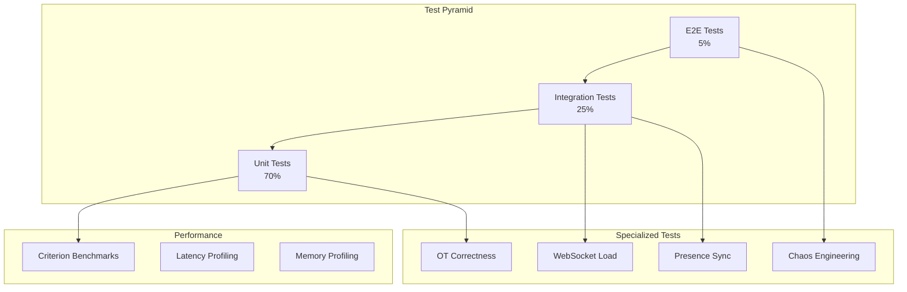

# Relay Testing

<Info>
**SDD Classification:** L3-Technical
**Authority:** Engineering Team
**Review Cycle:** Quarterly
</Info>

This document covers Relay's testing strategy including unit tests, integration tests, WebSocket testing, performance benchmarks, and chaos engineering approaches.

---

## Testing Architecture



---

## Test Configuration

### Cargo Test Configuration

```toml
# Cargo.toml
[dev-dependencies]
tokio-test = "0.4"
criterion = { version = "0.5", features = ["html_reports"] }
proptest = "1.4"
wiremock = "0.5"
testcontainers = "0.15"
fake = "2.9"

[[bench]]
name = "ot_benchmarks"
harness = false

[[bench]]
name = "websocket_benchmarks"
harness = false
```

### Test Utilities

```rust
// tests/common/mod.rs
use relay::*;
use testcontainers::{clients::Cli, images::redis::Redis};

pub struct TestContext {
    pub redis: RedisClient,
    pub ot_engine: OTEngine,
    pub presence_manager: PresenceManager,
    _container: Container<'static, Redis>,
}

impl TestContext {
    pub async fn new() -> Self {
        let docker = Cli::default();
        let container = docker.run(Redis::default());
        let redis_url = format!(
            "redis://localhost:{}",
            container.get_host_port_ipv4(6379)
        );

        let redis = RedisClient::new(&redis_url).await.unwrap();
        let ot_engine = OTEngine::new("test_doc".to_string());
        let presence_manager = PresenceManager::new(
            "test_doc".to_string(),
            redis.clone(),
            PresenceConfig::default(),
        );

        Self {
            redis,
            ot_engine,
            presence_manager,
            _container: container,
        }
    }

    pub fn create_test_operation(&self, position: u32, content: &str) -> OperationWithMetadata {
        OperationWithMetadata {
            id: uuid::Uuid::new_v4().to_string(),
            actor_id: "test_user".to_string(),
            document_id: "test_doc".to_string(),
            operation: Operation::Insert {
                position,
                content: content.to_string(),
                attributes: None,
            },
            vector_clock: VectorClock::new(),
            timestamp: current_timestamp_ms(),
            parent_id: None,
        }
    }
}
```

---

## Unit Tests

### OT Engine Tests

```rust
#[cfg(test)]
mod ot_tests {
    use super::*;

    #[test]
    fn test_insert_insert_same_position() {
        // Given two inserts at the same position
        let op_a = Operation::Insert {
            position: 5,
            content: "AAA".to_string(),
            attributes: None,
        };
        let op_b = Operation::Insert {
            position: 5,
            content: "BBB".to_string(),
            attributes: None,
        };

        // When we transform them (A has priority)
        let (transformed_a, transformed_b) = transform_pair(&op_a, &op_b, true);

        // Then A stays at 5, B shifts to 8
        assert_eq!(get_position(&transformed_a), 5);
        assert_eq!(get_position(&transformed_b), 8);
    }

    #[test]
    fn test_insert_delete_before() {
        // Given insert before delete range
        let insert = Operation::Insert {
            position: 3,
            content: "XXX".to_string(),
            attributes: None,
        };
        let delete = Operation::Delete {
            position: 10,
            length: 5,
        };

        let (transformed_insert, transformed_delete) =
            transform_pair(&insert, &delete, true);

        // Insert unchanged, delete shifts right by 3
        assert_eq!(get_position(&transformed_insert), 3);
        assert_eq!(get_position(&transformed_delete), 13);
    }

    #[test]
    fn test_delete_delete_overlap() {
        // Given overlapping deletes
        let del_a = Operation::Delete { position: 5, length: 10 };  // 5-15
        let del_b = Operation::Delete { position: 10, length: 10 }; // 10-20

        let (opt_a, opt_b) = transform_delete_delete(&del_a, &del_b);

        // A reduces to 5-10 (length 5)
        // B reduces to 15-20 (length 5, position adjusted)
        assert_eq!(opt_a.map(|d| d.length), Some(5));
        assert_eq!(opt_b.map(|d| d.length), Some(5));
    }

    #[test]
    fn test_vector_clock_concurrent_detection() {
        let mut clock_a = VectorClock::new();
        clock_a.increment("user_a");
        clock_a.increment("user_a");

        let mut clock_b = VectorClock::new();
        clock_b.increment("user_b");

        // A has {user_a: 2}, B has {user_b: 1}
        // Neither knows about the other's operations
        assert_eq!(clock_a.compare(&clock_b), ClockOrder::Concurrent);
    }

    #[test]
    fn test_vector_clock_causal_ordering() {
        let mut clock_a = VectorClock::new();
        clock_a.increment("user_a");

        let mut clock_b = clock_a.clone();
        clock_b.increment("user_b");

        // B happened after A (it includes A's state)
        assert_eq!(clock_a.compare(&clock_b), ClockOrder::Before);
        assert_eq!(clock_b.compare(&clock_a), ClockOrder::After);
    }

    #[tokio::test]
    async fn test_operation_application() {
        let mut engine = OTEngine::new("test_doc".to_string());

        let op1 = create_operation("user_a", 0, "Hello");
        let op2 = create_operation("user_a", 5, " World");

        engine.apply_operation(op1).unwrap();
        engine.apply_operation(op2).unwrap();

        assert_eq!(engine.document_state.content(), "Hello World");
    }
}
```

### Vector Clock Tests

```rust
#[cfg(test)]
mod vector_clock_tests {
    use super::*;

    #[test]
    fn test_increment() {
        let mut clock = VectorClock::new();
        clock.increment("actor_1");
        clock.increment("actor_1");
        clock.increment("actor_2");

        assert_eq!(clock.get("actor_1"), 2);
        assert_eq!(clock.get("actor_2"), 1);
        assert_eq!(clock.get("actor_3"), 0);
    }

    #[test]
    fn test_merge() {
        let mut clock_a = VectorClock::new();
        clock_a.increment("a");
        clock_a.increment("a");

        let mut clock_b = VectorClock::new();
        clock_b.increment("b");
        clock_b.increment("b");
        clock_b.increment("b");

        clock_a.merge(&clock_b);

        assert_eq!(clock_a.get("a"), 2);
        assert_eq!(clock_a.get("b"), 3);
    }

    #[test]
    fn test_compare_equal() {
        let mut clock_a = VectorClock::new();
        clock_a.increment("a");

        let clock_b = clock_a.clone();

        assert_eq!(clock_a.compare(&clock_b), ClockOrder::Equal);
    }
}
```

### Presence Manager Tests

```rust
#[cfg(test)]
mod presence_tests {
    use super::*;

    #[tokio::test]
    async fn test_user_join() {
        let ctx = TestContext::new().await;

        let user_info = UserInfo {
            name: "Test User".to_string(),
            workspace_id: "ws_123".to_string(),
            avatar_url: None,
        };

        let presence = ctx.presence_manager
            .user_join("user_1", user_info)
            .await
            .unwrap();

        assert!(presence.state.online);
        assert_eq!(presence.user_id, "user_1");

        let active_users = ctx.presence_manager.get_active_users();
        assert_eq!(active_users.len(), 1);
    }

    #[tokio::test]
    async fn test_user_leave() {
        let ctx = TestContext::new().await;

        ctx.presence_manager
            .user_join("user_1", test_user_info())
            .await
            .unwrap();

        ctx.presence_manager.user_leave("user_1").await.unwrap();

        let active_users = ctx.presence_manager.get_active_users();
        assert_eq!(active_users.len(), 0);
    }

    #[tokio::test]
    async fn test_cursor_throttling() {
        let ctx = TestContext::new().await;

        ctx.presence_manager
            .user_join("user_1", test_user_info())
            .await
            .unwrap();

        // First cursor update should succeed
        ctx.presence_manager
            .update_cursor("user_1", cursor(10, 5), None)
            .await
            .unwrap();

        // Immediate second update should be throttled (no error, just ignored)
        ctx.presence_manager
            .update_cursor("user_1", cursor(10, 6), None)
            .await
            .unwrap();

        // Wait for throttle window
        tokio::time::sleep(Duration::from_millis(60)).await;

        // This update should succeed
        ctx.presence_manager
            .update_cursor("user_1", cursor(10, 7), None)
            .await
            .unwrap();
    }

    #[tokio::test]
    async fn test_document_capacity() {
        let mut config = PresenceConfig::default();
        config.max_users_per_document = 2;

        let presence_manager = PresenceManager::new(
            "test_doc".to_string(),
            test_redis_client().await,
            config,
        );

        presence_manager.user_join("user_1", test_user_info()).await.unwrap();
        presence_manager.user_join("user_2", test_user_info()).await.unwrap();

        // Third user should fail
        let result = presence_manager.user_join("user_3", test_user_info()).await;
        assert!(matches!(result, Err(PresenceError::DocumentAtCapacity(_))));
    }
}
```

---

## Integration Tests

### WebSocket Integration Tests

```rust
#[cfg(test)]
mod websocket_integration {
    use super::*;
    use axum::Server;
    use tokio_tungstenite::connect_async;

    async fn start_test_server() -> String {
        let app = create_test_app().await;
        let listener = TcpListener::bind("127.0.0.1:0").await.unwrap();
        let addr = listener.local_addr().unwrap();

        tokio::spawn(async move {
            axum::serve(listener, app).await.unwrap();
        });

        format!("ws://127.0.0.1:{}", addr.port())
    }

    #[tokio::test]
    async fn test_websocket_connection() {
        let base_url = start_test_server().await;
        let url = format!("{}/collab/document/test_doc?token={}", base_url, test_token());

        let (ws_stream, response) = connect_async(&url).await.unwrap();

        assert_eq!(response.status(), 101);

        let (mut write, mut read) = ws_stream.split();

        // Should receive initial sync
        let msg = read.next().await.unwrap().unwrap();
        let sync: SyncResponse = serde_json::from_slice(&msg.into_data()).unwrap();
        assert_eq!(sync.document_id, "test_doc");
    }

    #[tokio::test]
    async fn test_operation_broadcast() {
        let base_url = start_test_server().await;

        // Connect two clients
        let client_a = connect_client(&base_url, "user_a").await;
        let client_b = connect_client(&base_url, "user_b").await;

        // Client A sends operation
        let operation = json!({
            "type": "operation",
            "id": "op_1",
            "operation": {
                "insert": {
                    "position": 0,
                    "content": "Hello"
                }
            }
        });

        client_a.send(Message::Text(operation.to_string())).await.unwrap();

        // Client B should receive broadcast
        let msg = tokio::time::timeout(
            Duration::from_secs(5),
            client_b.next()
        ).await.unwrap().unwrap().unwrap();

        let broadcast: OperationBroadcast = serde_json::from_slice(&msg.into_data()).unwrap();
        assert_eq!(broadcast.operation.actor_id, "user_a");
    }

    #[tokio::test]
    async fn test_presence_updates() {
        let base_url = start_test_server().await;

        let client_a = connect_client(&base_url, "user_a").await;
        let client_b = connect_client(&base_url, "user_b").await;

        // Wait for presence broadcasts
        let mut received_join = false;
        let timeout = Duration::from_secs(5);
        let start = Instant::now();

        while start.elapsed() < timeout && !received_join {
            if let Ok(Some(Ok(msg))) = tokio::time::timeout(
                Duration::from_millis(100),
                client_a.next()
            ).await {
                if let Ok(event) = serde_json::from_slice::<PresenceEvent>(&msg.into_data()) {
                    if matches!(event, PresenceEvent::UserJoined(_)) {
                        received_join = true;
                    }
                }
            }
        }

        assert!(received_join, "Should receive user join presence event");
    }

    #[tokio::test]
    async fn test_reconnection_recovery() {
        let base_url = start_test_server().await;

        // Connect and send operation
        let mut client = connect_client(&base_url, "user_a").await;
        send_operation(&mut client, 0, "Hello").await;

        // Get vector clock from ack
        let ack = receive_ack(&mut client).await;
        let last_clock = ack.server_clock;

        // Disconnect
        drop(client);

        // Reconnect with last known clock
        let reconnect_url = format!(
            "{}/collab/document/test_doc?token={}&last_clock={}",
            base_url,
            test_token(),
            serde_json::to_string(&last_clock).unwrap()
        );

        let (new_client, _) = connect_async(&reconnect_url).await.unwrap();
        let (_, mut read) = new_client.split();

        // Should receive sync with current state
        let sync = receive_sync(&mut read).await;
        assert!(sync.content.contains("Hello"));
    }
}
```

### Redis Integration Tests

```rust
#[cfg(test)]
mod redis_integration {
    use super::*;

    #[tokio::test]
    async fn test_presence_stored_in_redis() {
        let ctx = TestContext::new().await;

        ctx.presence_manager
            .user_join("user_1", test_user_info())
            .await
            .unwrap();

        // Verify presence is in Redis
        let key = "presence:test_doc:users";
        let stored: Option<String> = ctx.redis.hget(key, "user_1").await.unwrap();

        assert!(stored.is_some());
        let presence: UserPresence = serde_json::from_str(&stored.unwrap()).unwrap();
        assert_eq!(presence.user_id, "user_1");
    }

    #[tokio::test]
    async fn test_cross_instance_presence() {
        let ctx = TestContext::new().await;

        // Simulate two instances sharing Redis
        let manager_1 = PresenceManager::new(
            "test_doc".to_string(),
            ctx.redis.clone(),
            PresenceConfig::default(),
        );

        let manager_2 = PresenceManager::new(
            "test_doc".to_string(),
            ctx.redis.clone(),
            PresenceConfig::default(),
        );

        manager_1.user_join("user_1", test_user_info()).await.unwrap();

        // Manager 2 should see user_1 via Redis
        let key = "presence:test_doc:users";
        let users: HashMap<String, String> = ctx.redis.hgetall(key).await.unwrap();

        assert!(users.contains_key("user_1"));
    }
}
```

---

## Property-Based Tests

### OT Convergence Property Tests

```rust
#[cfg(test)]
mod proptest_ot {
    use super::*;
    use proptest::prelude::*;

    proptest! {
        #[test]
        fn test_ot_convergence(
            ops in prop::collection::vec(arb_operation(), 1..20)
        ) {
            // Apply operations in different orders
            let permutations = ops.iter().permutations(ops.len());
            let mut final_states: HashSet<String> = HashSet::new();

            for perm in permutations.take(100) { // Limit permutations for speed
                let mut engine = OTEngine::new("test".to_string());
                for op in perm {
                    let _ = engine.apply_operation(op.clone().into());
                }
                final_states.insert(engine.document_state.content());
            }

            // All permutations should converge to same state
            prop_assert_eq!(final_states.len(), 1);
        }

        #[test]
        fn test_transform_preserves_intent(
            op_a in arb_operation(),
            op_b in arb_operation()
        ) {
            // Transform should preserve the intent of both operations
            let (transformed_a, transformed_b) = transform_pair(&op_a, &op_b, true);

            // Applying A then transformed_B should equal B then transformed_A
            let mut doc_1 = DocumentState::new();
            doc_1.apply(&op_a).unwrap();
            doc_1.apply(&transformed_b).unwrap();

            let mut doc_2 = DocumentState::new();
            doc_2.apply(&op_b).unwrap();
            doc_2.apply(&transformed_a).unwrap();

            prop_assert_eq!(doc_1.content(), doc_2.content());
        }
    }

    fn arb_operation() -> impl Strategy<Value = Operation> {
        prop_oneof![
            (0..100u32, "[a-z]{1,10}").prop_map(|(pos, content)| {
                Operation::Insert {
                    position: pos,
                    content,
                    attributes: None,
                }
            }),
            (0..100u32, 1..20u32).prop_map(|(pos, len)| {
                Operation::Delete { position: pos, length: len }
            }),
        ]
    }
}
```

---

## Performance Benchmarks

### Criterion Benchmarks

```rust
// benches/ot_benchmarks.rs
use criterion::{criterion_group, criterion_main, Criterion, BenchmarkId};
use relay::*;

fn benchmark_single_operation(c: &mut Criterion) {
    let mut engine = OTEngine::new("bench_doc".to_string());

    c.bench_function("single_insert_operation", |b| {
        b.iter(|| {
            let op = create_insert_operation(0, "Hello");
            engine.apply_operation(op).unwrap();
        });
    });
}

fn benchmark_concurrent_operations(c: &mut Criterion) {
    let mut group = c.benchmark_group("concurrent_operations");

    for num_ops in [10, 50, 100, 500].iter() {
        group.bench_with_input(
            BenchmarkId::from_parameter(num_ops),
            num_ops,
            |b, &num_ops| {
                let ops: Vec<_> = (0..num_ops)
                    .map(|i| create_insert_operation(i as u32, &format!("op_{}", i)))
                    .collect();

                b.iter(|| {
                    let mut engine = OTEngine::new("bench_doc".to_string());
                    for op in &ops {
                        engine.apply_operation(op.clone()).unwrap();
                    }
                });
            },
        );
    }
    group.finish();
}

fn benchmark_transform_pair(c: &mut Criterion) {
    let op_a = Operation::Insert {
        position: 10,
        content: "AAA".to_string(),
        attributes: None,
    };
    let op_b = Operation::Insert {
        position: 10,
        content: "BBB".to_string(),
        attributes: None,
    };

    c.bench_function("transform_insert_insert", |b| {
        b.iter(|| transform_pair(&op_a, &op_b, true));
    });
}

fn benchmark_vector_clock(c: &mut Criterion) {
    let mut group = c.benchmark_group("vector_clock");

    for num_actors in [5, 20, 100].iter() {
        group.bench_with_input(
            BenchmarkId::new("merge", num_actors),
            num_actors,
            |b, &num_actors| {
                let mut clock_a = VectorClock::new();
                let mut clock_b = VectorClock::new();

                for i in 0..num_actors {
                    clock_a.increment(&format!("actor_{}", i));
                    clock_b.increment(&format!("actor_{}", i));
                }

                b.iter(|| clock_a.merge(&clock_b));
            },
        );
    }
    group.finish();
}

criterion_group!(
    benches,
    benchmark_single_operation,
    benchmark_concurrent_operations,
    benchmark_transform_pair,
    benchmark_vector_clock,
);
criterion_main!(benches);
```

### WebSocket Load Benchmarks

```rust
// benches/websocket_benchmarks.rs
use criterion::{criterion_group, criterion_main, Criterion};
use tokio::runtime::Runtime;

fn benchmark_websocket_throughput(c: &mut Criterion) {
    let rt = Runtime::new().unwrap();

    c.bench_function("websocket_message_throughput", |b| {
        b.to_async(&rt).iter(|| async {
            let mut client = create_test_client().await;

            for i in 0..1000 {
                let op = create_operation(i as u32, "x");
                client.send(op).await.unwrap();
            }

            // Wait for all acks
            for _ in 0..1000 {
                client.receive_ack().await.unwrap();
            }
        });
    });
}

fn benchmark_presence_broadcast(c: &mut Criterion) {
    let rt = Runtime::new().unwrap();

    c.bench_function("presence_broadcast_100_users", |b| {
        b.to_async(&rt).iter(|| async {
            let clients = create_connected_clients(100).await;

            // Update cursor for one user
            clients[0].send_cursor_update(10, 5).await.unwrap();

            // Wait for broadcast to all
            for client in &clients[1..] {
                client.receive_presence_update().await.unwrap();
            }
        });
    });
}

criterion_group!(
    websocket_benches,
    benchmark_websocket_throughput,
    benchmark_presence_broadcast,
);
criterion_main!(websocket_benches);
```

---

## Load Testing

### Locust Load Test

```python
# load_tests/websocket_load.py
from locust import User, task, between
import websocket
import json
import random

class WebSocketUser(User):
    wait_time = between(0.1, 0.5)

    def on_start(self):
        self.document_id = f"doc_{random.randint(1, 100)}"
        self.ws = websocket.create_connection(
            f"wss://relay.materi.dev/collab/document/{self.document_id}",
            header={"Authorization": f"Bearer {self.token}"}
        )
        self.operation_count = 0

    @task(10)
    def send_operation(self):
        operation = {
            "type": "operation",
            "id": f"op_{self.operation_count}",
            "operation": {
                "insert": {
                    "position": random.randint(0, 1000),
                    "content": "x" * random.randint(1, 10)
                }
            }
        }
        self.ws.send(json.dumps(operation))
        self.operation_count += 1

    @task(5)
    def update_cursor(self):
        cursor = {
            "type": "cursor",
            "cursor": {
                "line": random.randint(0, 100),
                "column": random.randint(0, 80)
            }
        }
        self.ws.send(json.dumps(cursor))

    @task(1)
    def update_presence(self):
        presence = {
            "type": "presence",
            "state": {
                "typing": random.choice([True, False])
            }
        }
        self.ws.send(json.dumps(presence))

    def on_stop(self):
        self.ws.close()
```

---

## Chaos Engineering

### Chaos Tests

```rust
#[cfg(test)]
mod chaos_tests {
    use super::*;

    #[tokio::test]
    async fn test_redis_failure_recovery() {
        let ctx = TestContext::new().await;

        // Add some presence data
        ctx.presence_manager.user_join("user_1", test_user_info()).await.unwrap();

        // Simulate Redis failure
        ctx.redis.simulate_failure().await;

        // Operations should degrade gracefully
        let result = ctx.presence_manager.update_cursor(
            "user_1",
            cursor(10, 5),
            None
        ).await;

        // Should not crash, may return error or use cached data
        // Test that service remains operational

        // Restore Redis
        ctx.redis.restore().await;

        // Should recover
        let users = ctx.presence_manager.get_active_users();
        assert_eq!(users.len(), 1);
    }

    #[tokio::test]
    async fn test_network_partition() {
        let ctx = TestContext::new().await;

        // Simulate two clients that can't communicate
        let client_a = create_isolated_client("user_a").await;
        let client_b = create_isolated_client("user_b").await;

        // Both make conflicting edits
        client_a.send_operation(insert_at(5, "AAA")).await;
        client_b.send_operation(insert_at(5, "BBB")).await;

        // Heal partition
        heal_network_partition().await;

        // Both should eventually converge
        tokio::time::sleep(Duration::from_secs(5)).await;

        let state_a = client_a.get_document_state().await;
        let state_b = client_b.get_document_state().await;

        assert_eq!(state_a, state_b);
    }

    #[tokio::test]
    async fn test_high_latency_tolerance() {
        let ctx = TestContext::new().await;

        // Add artificial latency
        ctx.redis.set_latency(Duration::from_millis(500)).await;

        let start = Instant::now();

        // Operations should still complete
        ctx.presence_manager.user_join("user_1", test_user_info()).await.unwrap();

        // Should complete within reasonable time despite latency
        assert!(start.elapsed() < Duration::from_secs(10));
    }
}
```

---

## Test Coverage Requirements

| Component | Target Coverage |
|-----------|-----------------|
| OT Engine | 95% |
| WebSocket Handler | 90% |
| Presence Manager | 90% |
| Vector Clock | 95% |
| Protocol Parsing | 85% |
| **Overall** | **90%** |

### Generating Coverage Report

```bash
# Install coverage tools
cargo install cargo-tarpaulin

# Run tests with coverage
cargo tarpaulin --out Html --output-dir coverage/

# View report
open coverage/tarpaulin-report.html
```

---

## CI/CD Integration

```yaml
# .github/workflows/relay-tests.yml
name: Relay Tests

on: [push, pull_request]

jobs:
  test:
    runs-on: ubuntu-latest

    services:
      redis:
        image: redis:7-alpine
        ports:
          - 6379:6379

    steps:
      - uses: actions/checkout@v4

      - name: Install Rust
        uses: dtolnay/rust-action@stable

      - name: Cache cargo
        uses: actions/cache@v4
        with:
          path: |
            ~/.cargo/registry
            ~/.cargo/git
            target
          key: ${{ runner.os }}-cargo-${{ hashFiles('**/Cargo.lock') }}

      - name: Run unit tests
        run: cargo test --lib

      - name: Run integration tests
        run: cargo test --test '*'
        env:
          REDIS_URL: redis://localhost:6379

      - name: Run benchmarks
        run: cargo bench --no-run

      - name: Coverage report
        run: |
          cargo install cargo-tarpaulin
          cargo tarpaulin --out Xml
        continue-on-error: true

      - name: Upload coverage
        uses: codecov/codecov-action@v4
```

---

## Related Documentation

- [Overview](overview) - Service overview
- [Architecture](architecture) - System design
- [Operational Transform](operational-transform) - OT algorithms
- [Deployment](deployment) - Deployment guide

---

**Document Status:** Complete
**Version:** 2.0
