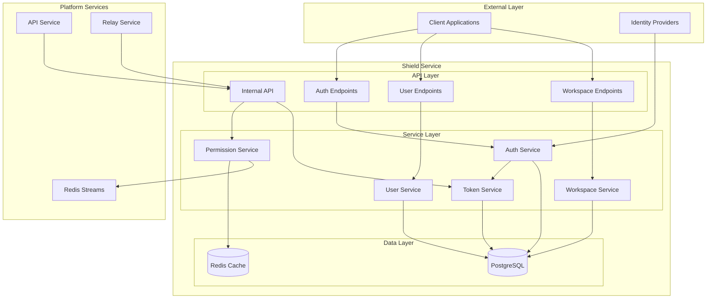
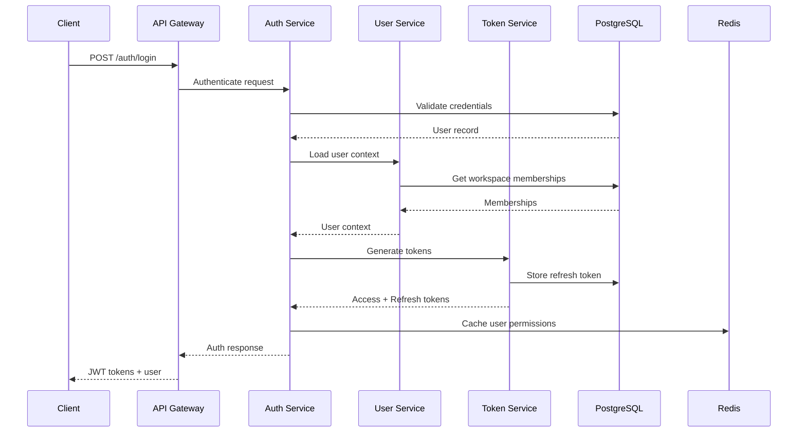
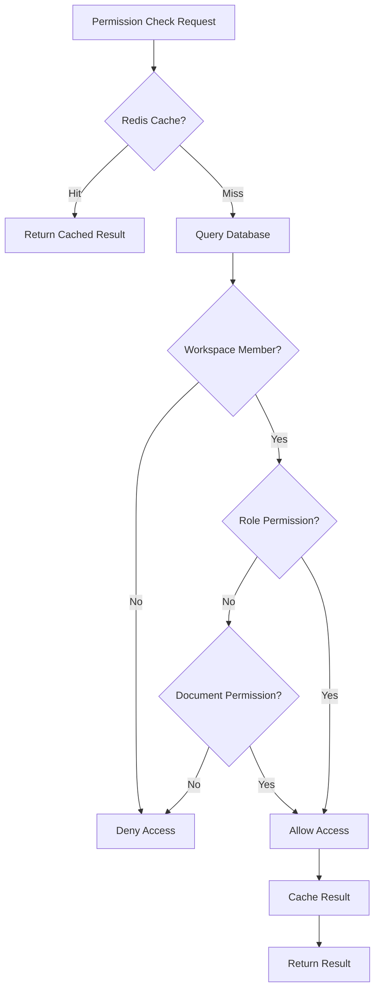
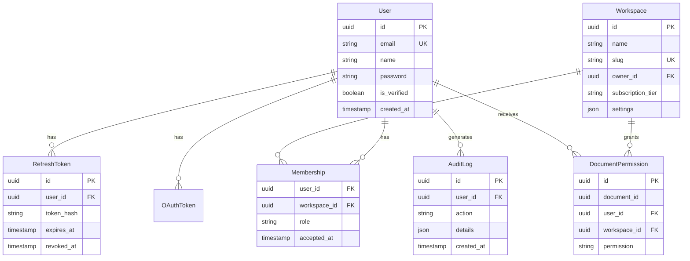
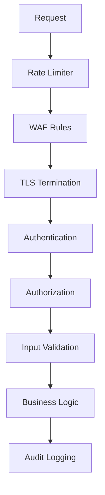

# Shield Architecture

<Info>
**SDD Classification:** L2-System
**Authority:** Engineering Team
**Review Cycle:** Quarterly
</Info>

This document details the internal architecture of the Shield authentication service, including component design, data models, caching strategies, and integration patterns.

---

## High-Level Architecture



---

## Component Architecture

### Authentication Pipeline



### Permission Validation Flow



---

## Data Models

### User Model

```python
class User(AbstractBaseUser):
    id = UUIDField(primary_key=True)
    email = EmailField(unique=True)
    name = CharField(max_length=255)
    password = CharField(max_length=128)  # bcrypt hash
    avatar_url = URLField(null=True)
    timezone = CharField(default='UTC')
    language = CharField(default='en')
    is_verified = BooleanField(default=False)
    is_active = BooleanField(default=True)
    created_at = DateTimeField(auto_now_add=True)
    updated_at = DateTimeField(auto_now=True)
    deleted_at = DateTimeField(null=True)  # Soft delete
```

### Workspace Model

```python
class Workspace(Model):
    id = UUIDField(primary_key=True)
    name = CharField(max_length=255)
    slug = SlugField(unique=True)
    owner = ForeignKey(User, on_delete=PROTECT)
    logo_url = URLField(null=True)
    subscription_tier = CharField(choices=TIER_CHOICES)
    settings = JSONField(default=dict)
    created_at = DateTimeField(auto_now_add=True)
    updated_at = DateTimeField(auto_now=True)
```

### Membership Model

```python
class Membership(Model):
    user = ForeignKey(User, on_delete=CASCADE)
    workspace = ForeignKey(Workspace, on_delete=CASCADE)
    role = CharField(choices=ROLE_CHOICES)  # owner, admin, member, viewer
    invited_by = ForeignKey(User, null=True)
    invited_at = DateTimeField(null=True)
    accepted_at = DateTimeField(null=True)
    created_at = DateTimeField(auto_now_add=True)

    class Meta:
        unique_together = ['user', 'workspace']
```

### Token Models

```python
class RefreshToken(Model):
    id = UUIDField(primary_key=True)
    user = ForeignKey(User, on_delete=CASCADE)
    token_hash = CharField(max_length=64)  # SHA-256 hash
    device_info = JSONField(default=dict)
    ip_address = GenericIPAddressField()
    expires_at = DateTimeField()
    revoked_at = DateTimeField(null=True)
    created_at = DateTimeField(auto_now_add=True)

class OAuthToken(Model):
    user = ForeignKey(User, on_delete=CASCADE)
    provider = CharField(max_length=50)
    provider_user_id = CharField(max_length=255)
    access_token = EncryptedField()  # AES-256
    refresh_token = EncryptedField(null=True)
    expires_at = DateTimeField()
    created_at = DateTimeField(auto_now_add=True)
```

---

## Database Schema



---

## Caching Strategy

### Permission Cache

```python
# Redis key structure
permission:{user_id}:{workspace_id}:{resource_type}:{resource_id} = {
    "allowed": true,
    "role": "member",
    "permissions": ["read", "write"],
    "expires_at": 1704067200
}

# TTL: 5 minutes
# Invalidation: On permission change events
```

### User Context Cache

```python
# Redis key structure
user_context:{user_id} = {
    "id": "user_123",
    "email": "user@example.com",
    "name": "John Doe",
    "workspaces": ["ws_1", "ws_2"],
    "roles": {"ws_1": "admin", "ws_2": "member"}
}

# TTL: 1 hour
# Invalidation: On user/membership changes
```

### Session Cache

```python
# Redis key structure
session:{session_id} = {
    "user_id": "user_123",
    "ip_address": "192.168.1.1",
    "user_agent": "...",
    "created_at": "2025-01-07T10:00:00Z"
}

# TTL: 2 weeks
# Invalidation: On logout
```

---

## Internal API Design

### Service-to-Service Authentication

```python
# Internal API requires X-Internal-Request header
# Validated via shared secret

INTERNAL_API_ENDPOINTS = {
    'GET /internal/api/auth/validate-token/': 'Token validation',
    'GET /internal/api/users/{user_id}/': 'User context',
    'POST /internal/api/users/{user_id}/invalidate-cache/': 'Cache invalidation',
    'POST /internal/api/auth/revoke-token/': 'Token revocation',
    'GET /internal/api/permissions/bulk-validate/': 'Bulk permission check',
    'POST /internal/api/collaboration/session/': 'WebSocket session token',
}
```

### Response Format

```json
{
  "status": "success",
  "data": {
    "user_id": "user_123",
    "permissions": ["read", "write"],
    "workspace_context": {
      "workspace_id": "ws_456",
      "role": "member"
    },
    "cache_metadata": {
      "ttl": 300,
      "invalidation_key": "perm:user_123:ws_456"
    }
  }
}
```

---

## Event System Integration

### Event Publishing

```python
class UserEventPublisher:
    STREAM = 'materi:events:users'

    def publish_user_created(self, user):
        event = UserCreatedEvent(
            user_id=str(user.id),
            email=user.email,
            name=user.name,
            workspaces=[],
            timestamp=datetime.utcnow().isoformat()
        )
        self.redis.xadd(self.STREAM, event.to_dict())

    def publish_user_updated(self, user, changed_fields):
        event = UserUpdatedEvent(
            user_id=str(user.id),
            changed_fields=changed_fields,
            timestamp=datetime.utcnow().isoformat()
        )
        self.redis.xadd(self.STREAM, event.to_dict())
```

### Event Consumption

```python
class DocumentEventConsumer:
    STREAM = 'materi:events:documents'
    GROUP = 'shield-service'

    def process_events(self):
        while True:
            events = self.redis.xreadgroup(
                groupname=self.GROUP,
                consumername=self.consumer_id,
                streams={self.STREAM: '>'},
                count=10,
                block=5000
            )
            for event in events:
                self.handle_event(event)
                self.redis.xack(self.STREAM, self.GROUP, event.id)
```

---

## Security Architecture

### Defense in Depth



### Key Security Controls

| Layer | Control |
|-------|---------|
| Transport | TLS 1.3 required |
| Rate Limiting | Per-IP and per-user limits |
| Authentication | bcrypt passwords, JWT (RS256) |
| Authorization | RBAC with row-level security |
| Data Protection | AES-256 encryption for sensitive data |
| Audit | Append-only audit logs |
| Sessions | Secure cookies (HttpOnly, Secure, SameSite) |

---

## Scaling Considerations

### Horizontal Scaling

- Stateless service design (all state in PostgreSQL/Redis)
- Gunicorn workers (2 × CPU cores + 1)
- Database connection pooling (pgbouncer)
- Redis connection pooling

### Performance Optimizations

- Permission result caching (95%+ hit rate)
- JWT public key caching (5-minute TTL)
- Database query optimization with proper indexes
- Async event publishing (non-blocking)

---

## Related Documentation

- [Overview](/developer/domain/shield/overview) - Service overview
- [Authentication](/developer/domain/shield/authentication) - Auth flows
- [Deployment](/developer/domain/shield/deployment) - Infrastructure

---

**Document Status:** Complete
**Version:** 2.0
