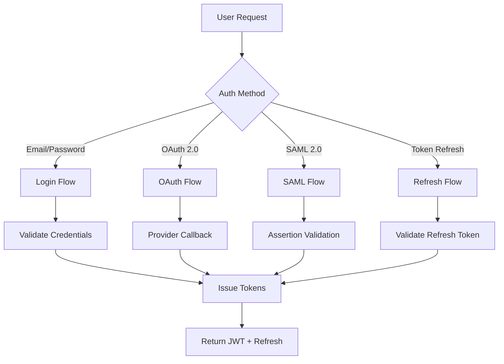
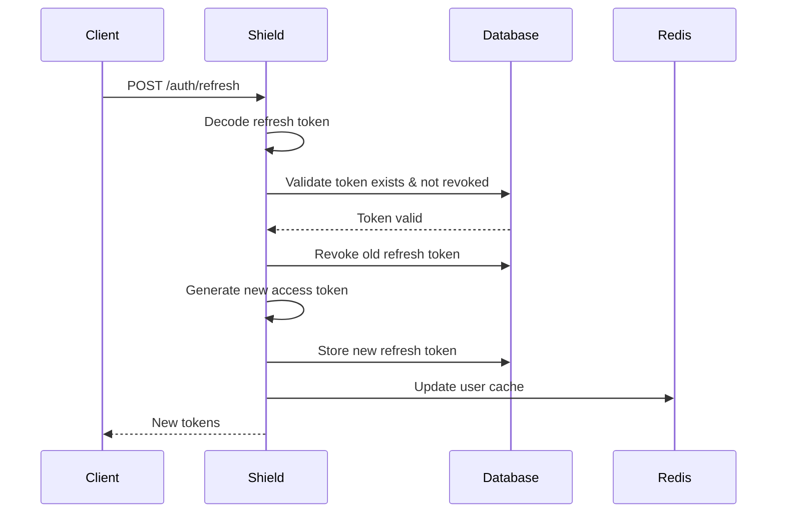

# Shield Authentication

<Info>
**SDD Classification:** L3-Technical
**Authority:** Engineering Team
**Review Cycle:** Quarterly
</Info>

This document covers Shield's authentication mechanisms including email/password login, JWT token management, OAuth 2.0 flows, and session handling.

---

## Authentication Overview



---

## Email/Password Authentication

### Login Endpoint

```http
POST /auth/login
Content-Type: application/json

{
  "email": "user@example.com",
  "password": "secure_password"
}
```

### Success Response

```json
{
  "access_token": "eyJhbGciOiJSUzI1NiIs...",
  "refresh_token": "eyJhbGciOiJSUzI1NiIs...",
  "token_type": "Bearer",
  "expires_in": 900,
  "user": {
    "id": "2441f8c8-0e14-4a71-8f32-8cbbf80382ae",
    "email": "user@example.com",
    "name": "John Doe",
    "is_verified": true
  }
}
```

### Login Flow Implementation

```python
class AuthService:
    def authenticate(self, email: str, password: str) -> AuthResult:
        # 1. Rate limit check
        if self.rate_limiter.is_exceeded(email):
            raise RateLimitExceeded('Too many login attempts')

        # 2. Fetch user
        user = User.objects.filter(email=email, is_active=True).first()
        if not user:
            self.rate_limiter.record_failure(email)
            raise InvalidCredentials()

        # 3. Verify password
        if not check_password(password, user.password):
            self.rate_limiter.record_failure(email)
            self.audit_log.record_failed_login(email)
            raise InvalidCredentials()

        # 4. Check email verification
        if not user.is_verified:
            raise EmailNotVerified()

        # 5. Generate tokens
        access_token = self.token_service.create_access_token(user)
        refresh_token = self.token_service.create_refresh_token(user)

        # 6. Cache user context
        self.cache_user_permissions(user)

        # 7. Audit log
        self.audit_log.record_successful_login(user)

        return AuthResult(
            access_token=access_token,
            refresh_token=refresh_token,
            user=user
        )
```

---

## JWT Token Structure

### Access Token Claims

```json
{
  "user_id": "2441f8c8-0e14-4a71-8f32-8cbbf80382ae",
  "email": "user@example.com",
  "name": "John Doe",
  "workspace_ids": ["ws_123", "ws_456"],
  "roles": {
    "ws_123": "admin",
    "ws_456": "member"
  },
  "permissions": {
    "documents": ["read", "write"],
    "workspaces": ["read"]
  },
  "iat": 1704067200,
  "exp": 1704068100,
  "jti": "token_unique_id",
  "token_type": "access"
}
```

### Token Properties

| Property | Access Token | Refresh Token |
|----------|--------------|---------------|
| Algorithm | RS256 | RS256 |
| Key Size | 2048-bit RSA | 2048-bit RSA |
| Expiry | 15 minutes | 30 days |
| Contains | Full user context | User ID only |
| Storage | Client memory | Secure storage |

### Token Generation

```python
class TokenService:
    def create_access_token(self, user: User) -> str:
        workspaces = user.get_workspace_memberships()

        payload = {
            'user_id': str(user.id),
            'email': user.email,
            'name': user.name,
            'workspace_ids': [str(ws.id) for ws in workspaces],
            'roles': {str(m.workspace_id): m.role for m in workspaces},
            'permissions': self.calculate_permissions(user),
            'iat': datetime.utcnow(),
            'exp': datetime.utcnow() + timedelta(minutes=15),
            'jti': str(uuid4()),
            'token_type': 'access'
        }

        return jwt.encode(
            payload,
            self.private_key,
            algorithm='RS256'
        )

    def create_refresh_token(self, user: User) -> str:
        token_id = uuid4()

        # Store refresh token in database
        RefreshToken.objects.create(
            id=token_id,
            user=user,
            token_hash=self.hash_token(str(token_id)),
            expires_at=datetime.utcnow() + timedelta(days=30)
        )

        payload = {
            'user_id': str(user.id),
            'jti': str(token_id),
            'iat': datetime.utcnow(),
            'exp': datetime.utcnow() + timedelta(days=30),
            'token_type': 'refresh'
        }

        return jwt.encode(
            payload,
            self.private_key,
            algorithm='RS256'
        )
```

---

## Token Refresh

### Refresh Endpoint

```http
POST /auth/refresh
Content-Type: application/json

{
  "refresh_token": "eyJhbGciOiJSUzI1NiIs..."
}
```

### Refresh Flow



### Refresh Implementation

```python
def refresh_tokens(self, refresh_token: str) -> AuthResult:
    # 1. Decode token
    try:
        payload = jwt.decode(
            refresh_token,
            self.public_key,
            algorithms=['RS256']
        )
    except jwt.ExpiredSignatureError:
        raise TokenExpired()
    except jwt.InvalidTokenError:
        raise InvalidToken()

    # 2. Verify token type
    if payload.get('token_type') != 'refresh':
        raise InvalidToken()

    # 3. Check database
    token_record = RefreshToken.objects.filter(
        id=payload['jti'],
        user_id=payload['user_id'],
        revoked_at__isnull=True,
        expires_at__gt=datetime.utcnow()
    ).first()

    if not token_record:
        # Possible token theft - revoke all user tokens
        self.revoke_all_user_tokens(payload['user_id'])
        raise TokenRevoked()

    # 4. Revoke old token
    token_record.revoked_at = datetime.utcnow()
    token_record.save()

    # 5. Issue new tokens
    user = token_record.user
    new_access_token = self.create_access_token(user)
    new_refresh_token = self.create_refresh_token(user)

    return AuthResult(
        access_token=new_access_token,
        refresh_token=new_refresh_token,
        user=user
    )
```

---

## Token Revocation

### Revoke Endpoint

```http
POST /auth/revoke
Authorization: Bearer <access_token>
Content-Type: application/json

{
  "refresh_token": "eyJhbGciOiJSUzI1NiIs..."
}
```

### Revoke All Sessions

```http
POST /auth/revoke-all
Authorization: Bearer <access_token>
```

### Implementation

```python
def revoke_token(self, refresh_token: str) -> None:
    payload = jwt.decode(
        refresh_token,
        self.public_key,
        algorithms=['RS256'],
        options={'verify_exp': False}  # Allow revoking expired tokens
    )

    RefreshToken.objects.filter(id=payload['jti']).update(
        revoked_at=datetime.utcnow()
    )

    self.audit_log.record_token_revocation(payload['user_id'])

def revoke_all_user_tokens(self, user_id: str) -> None:
    RefreshToken.objects.filter(
        user_id=user_id,
        revoked_at__isnull=True
    ).update(revoked_at=datetime.utcnow())

    # Invalidate cached permissions
    self.cache.delete_pattern(f'permission:{user_id}:*')
    self.cache.delete(f'user_context:{user_id}')

    self.audit_log.record_all_tokens_revoked(user_id)
```

---

## Public Key Distribution

### JWKS Endpoint

```http
GET /.well-known/jwks.json
```

### Response

```json
{
  "keys": [
    {
      "kty": "RSA",
      "use": "sig",
      "kid": "key_2024_01",
      "alg": "RS256",
      "n": "base64url_encoded_modulus...",
      "e": "AQAB"
    },
    {
      "kty": "RSA",
      "use": "sig",
      "kid": "key_2024_02",
      "alg": "RS256",
      "n": "base64url_encoded_modulus...",
      "e": "AQAB"
    }
  ]
}
```

### Key Rotation

| Property | Value |
|----------|-------|
| Rotation Interval | 90 days |
| Key Overlap | 7 days |
| Active Keys | 2 (current + previous) |
| Cache TTL | 5 minutes |

---

## Rate Limiting

### Limits by Endpoint

| Endpoint | Limit | Window |
|----------|-------|--------|
| `/auth/login` | 5 attempts | 15 minutes per IP |
| `/auth/register` | 3 accounts | 1 hour per IP |
| `/auth/password-reset` | 3 requests | 1 hour per IP |
| `/auth/refresh` | 10 requests | 1 minute |

### Implementation

```python
class RateLimiter:
    def is_exceeded(self, identifier: str, limit: int = 5, window: int = 900) -> bool:
        key = f'rate_limit:{identifier}'
        current = self.redis.incr(key)

        if current == 1:
            self.redis.expire(key, window)

        return current > limit

    def get_retry_after(self, identifier: str) -> int:
        key = f'rate_limit:{identifier}'
        ttl = self.redis.ttl(key)
        return max(0, ttl)
```

---

## Session Security

### Cookie Configuration

```python
SESSION_COOKIE_SECURE = True      # HTTPS only
SESSION_COOKIE_HTTPONLY = True    # No JavaScript access
SESSION_COOKIE_SAMESITE = 'Lax'   # CSRF protection
SESSION_COOKIE_AGE = 1209600      # 2 weeks
SESSION_EXPIRE_AT_BROWSER_CLOSE = False
```

### Session Storage

```python
# Redis session backend
SESSION_ENGINE = 'django.contrib.sessions.backends.cache'
SESSION_CACHE_ALIAS = 'sessions'

CACHES = {
    'sessions': {
        'BACKEND': 'django_redis.cache.RedisCache',
        'LOCATION': 'redis://localhost:6379/1',
        'OPTIONS': {
            'CLIENT_CLASS': 'django_redis.client.DefaultClient',
        }
    }
}
```

---

## Error Codes

| Code | HTTP Status | Description |
|------|-------------|-------------|
| `INVALID_CREDENTIALS` | 401 | Email or password incorrect |
| `EMAIL_NOT_VERIFIED` | 403 | Email verification required |
| `ACCOUNT_LOCKED` | 403 | Too many failed attempts |
| `ACCOUNT_SUSPENDED` | 403 | Account disabled by admin |
| `TOKEN_EXPIRED` | 401 | Access/refresh token expired |
| `TOKEN_REVOKED` | 401 | Token has been revoked |
| `RATE_LIMIT_EXCEEDED` | 429 | Too many requests |

---

## Related Documentation

- [Overview](/developer/domain/shield/overview) - Service overview
- [OAuth/SAML](/developer/domain/shield/oauth-saml) - SSO flows
- [Authorization](/developer/domain/shield/authorization) - Permission checks
- [API Authentication](/api/introduction/authentication) - Client integration

---

**Document Status:** Complete
**Version:** 2.0
