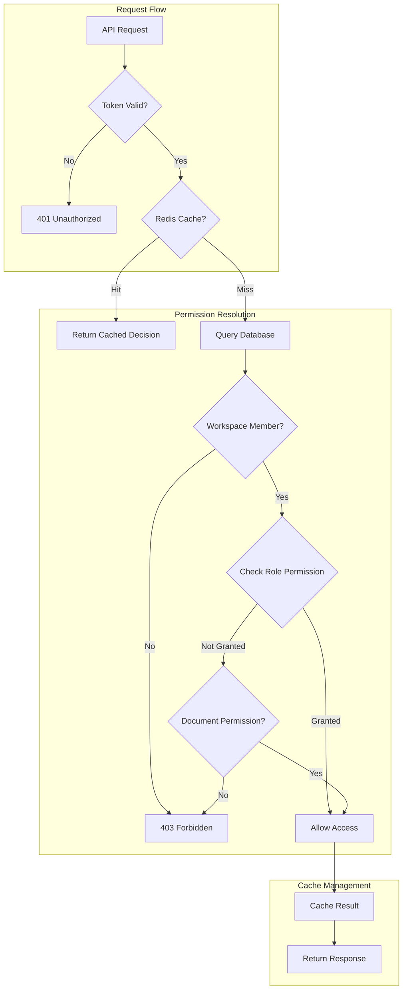
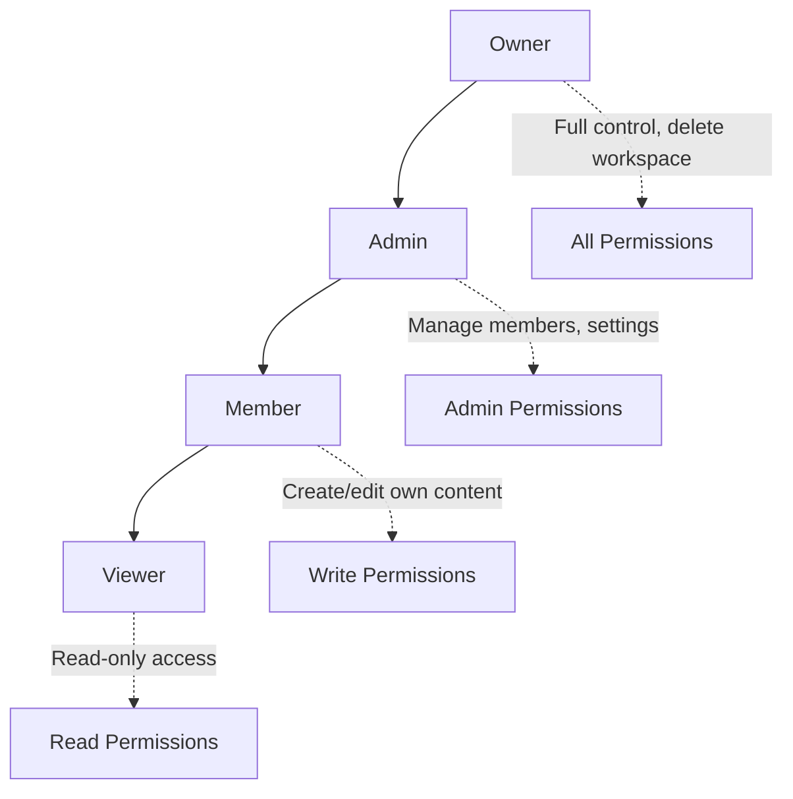
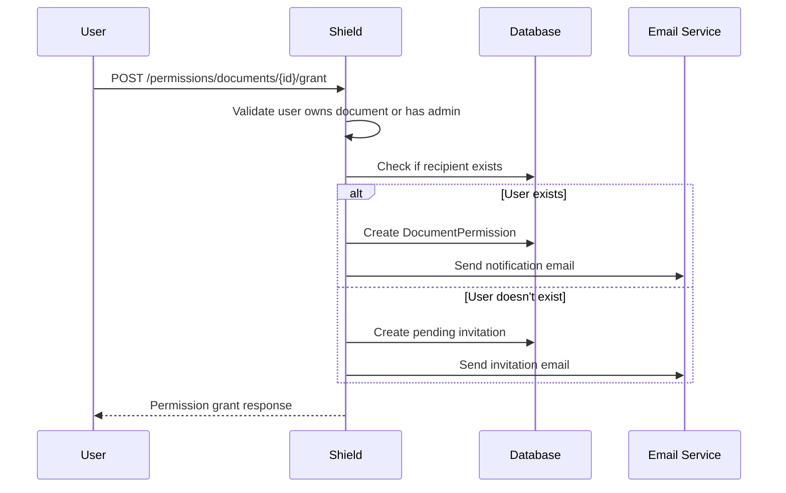
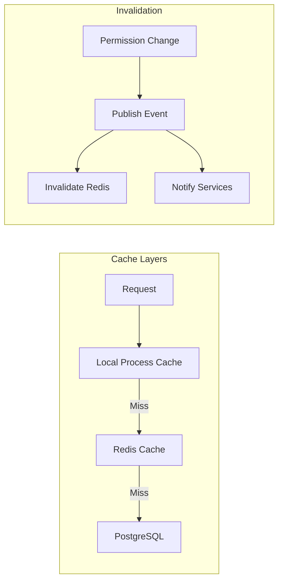

# Shield Authorization

<Info>
**SDD Classification:** L3-Technical
**Authority:** Engineering Team
**Review Cycle:** Quarterly
</Info>

This document details Shield's authorization system including role-based access control (RBAC), permission validation, document sharing, and caching strategies for high-performance access decisions.

---

## Authorization Architecture



---

## Role-Based Access Control

### Role Hierarchy



### Role Permissions Matrix

| Permission | Owner | Admin | Member | Viewer |
|------------|-------|-------|--------|--------|
| Delete workspace | ✅ | ❌ | ❌ | ❌ |
| Transfer ownership | ✅ | ❌ | ❌ | ❌ |
| Manage billing | ✅ | ❌ | ❌ | ❌ |
| Manage SSO | ✅ | ✅ | ❌ | ❌ |
| Invite members | ✅ | ✅ | ❌ | ❌ |
| Remove members | ✅ | ✅ | ❌ | ❌ |
| Update workspace settings | ✅ | ✅ | ❌ | ❌ |
| Create documents | ✅ | ✅ | ✅ | ❌ |
| Edit own documents | ✅ | ✅ | ✅ | ❌ |
| Edit any document | ✅ | ✅ | ❌ | ❌ |
| Delete own documents | ✅ | ✅ | ✅ | ❌ |
| Delete any document | ✅ | ✅ | ❌ | ❌ |
| View documents | ✅ | ✅ | ✅ | ✅ |
| Share documents | ✅ | ✅ | ✅ | ❌ |

### Role Implementation

```python
class Role(Enum):
    OWNER = 'owner'
    ADMIN = 'admin'
    MEMBER = 'member'
    VIEWER = 'viewer'

ROLE_HIERARCHY = {
    Role.OWNER: 4,
    Role.ADMIN: 3,
    Role.MEMBER: 2,
    Role.VIEWER: 1
}

class PermissionService:
    def has_role_permission(
        self,
        user_role: Role,
        required_role: Role
    ) -> bool:
        """Check if user role meets or exceeds required role."""
        return ROLE_HIERARCHY[user_role] >= ROLE_HIERARCHY[required_role]

    def get_user_role(self, user_id: str, workspace_id: str) -> Role:
        """Get user's role in workspace."""
        membership = Membership.objects.filter(
            user_id=user_id,
            workspace_id=workspace_id,
            accepted_at__isnull=False
        ).first()

        if not membership:
            return None

        return Role(membership.role)
```

---

## Permission Check Flow

### Check Endpoint

```http
POST /api/permissions/check
Authorization: Bearer <access_token>
Content-Type: application/json

{
  "resource_type": "document",
  "resource_id": "doc_abc123",
  "action": "write",
  "workspace_id": "ws_xyz789"
}
```

### Response

```json
{
  "allowed": true,
  "reason": "workspace_admin",
  "role": "admin",
  "permissions": ["read", "write", "delete", "admin"],
  "cache_metadata": {
    "ttl": 300,
    "invalidation_key": "perm:user_123:ws_xyz789:doc_abc123"
  }
}
```

### Permission Check Implementation

```python
class PermissionChecker:
    def check_permission(
        self,
        user_id: str,
        resource_type: str,
        resource_id: str,
        action: str,
        workspace_id: str
    ) -> PermissionResult:
        # 1. Check Redis cache
        cache_key = f'perm:{user_id}:{workspace_id}:{resource_type}:{resource_id}'
        cached = self.redis.get(cache_key)
        if cached:
            return PermissionResult.from_cache(cached)

        # 2. Get user's workspace role
        membership = Membership.objects.filter(
            user_id=user_id,
            workspace_id=workspace_id,
            accepted_at__isnull=False
        ).first()

        if not membership:
            return PermissionResult(allowed=False, reason='not_workspace_member')

        # 3. Check role-based permission
        role = Role(membership.role)
        if self.role_allows_action(role, resource_type, action):
            result = PermissionResult(
                allowed=True,
                reason=f'role_{role.value}',
                role=role.value,
                permissions=self.get_role_permissions(role, resource_type)
            )
            self.cache_result(cache_key, result)
            return result

        # 4. Check document-level permission (if applicable)
        if resource_type == 'document':
            doc_perm = DocumentPermission.objects.filter(
                document_id=resource_id,
                user_id=user_id
            ).first()

            if doc_perm and self.permission_allows_action(doc_perm.level, action):
                result = PermissionResult(
                    allowed=True,
                    reason='document_permission',
                    permissions=[doc_perm.level]
                )
                self.cache_result(cache_key, result)
                return result

        # 5. Deny access
        return PermissionResult(allowed=False, reason='insufficient_permissions')

    def cache_result(self, key: str, result: PermissionResult, ttl: int = 300):
        """Cache permission result for 5 minutes."""
        self.redis.setex(key, ttl, result.to_json())
```

---

## Document Sharing

### Share Document Endpoint

```http
POST /api/permissions/documents/{document_id}/grant
Authorization: Bearer <access_token>
Content-Type: application/json

{
  "email": "collaborator@example.com",
  "permission": "write",
  "message": "Please review this document"
}
```

### Permission Levels

| Level | Capabilities |
|-------|-------------|
| `read` | View document content |
| `write` | Edit document content |
| `admin` | Manage document permissions |

### Sharing Flow



### Sharing Implementation

```python
class DocumentSharingService:
    def grant_permission(
        self,
        grantor_id: str,
        document_id: str,
        recipient_email: str,
        permission_level: str
    ) -> DocumentPermission:
        # 1. Verify grantor has admin permission
        grantor_perm = self.permission_checker.check_permission(
            user_id=grantor_id,
            resource_type='document',
            resource_id=document_id,
            action='admin',
            workspace_id=self.get_document_workspace(document_id)
        )

        if not grantor_perm.allowed:
            raise PermissionDenied('Cannot grant permissions on this document')

        # 2. Check grantor's permission level
        grantor_level = self.get_user_document_permission(grantor_id, document_id)
        if not self.can_grant_level(grantor_level, permission_level):
            raise PermissionDenied('Cannot grant higher permission than own')

        # 3. Find or create recipient
        recipient = User.objects.filter(email=recipient_email).first()

        if recipient:
            # Create or update permission
            permission, created = DocumentPermission.objects.update_or_create(
                document_id=document_id,
                user_id=recipient.id,
                defaults={
                    'level': permission_level,
                    'granted_by': grantor_id,
                    'granted_at': datetime.utcnow()
                }
            )
        else:
            # Create pending invitation
            permission = PendingDocumentShare.objects.create(
                document_id=document_id,
                email=recipient_email,
                level=permission_level,
                granted_by=grantor_id,
                expires_at=datetime.utcnow() + timedelta(days=7)
            )

        # 4. Send notification
        self.email_service.send_share_notification(
            recipient_email=recipient_email,
            document_id=document_id,
            grantor_name=self.get_user_name(grantor_id),
            permission_level=permission_level
        )

        # 5. Invalidate cache
        self.invalidate_permission_cache(document_id)

        # 6. Audit log
        self.audit_log.record_permission_grant(
            grantor_id=grantor_id,
            recipient_email=recipient_email,
            document_id=document_id,
            level=permission_level
        )

        return permission
```

---

## Internal Permission API

### Bulk Permission Validation

For high-performance scenarios (e.g., document listings), Shield provides bulk validation:

```http
GET /internal/api/permissions/bulk-validate
X-Internal-Request: <shared_secret>
Content-Type: application/json

{
  "user_id": "user_123",
  "workspace_id": "ws_456",
  "resources": [
    {"type": "document", "id": "doc_1", "action": "read"},
    {"type": "document", "id": "doc_2", "action": "write"},
    {"type": "document", "id": "doc_3", "action": "read"}
  ]
}
```

### Response

```json
{
  "results": [
    {"resource_id": "doc_1", "allowed": true},
    {"resource_id": "doc_2", "allowed": true},
    {"resource_id": "doc_3", "allowed": false}
  ],
  "cache_metadata": {
    "user_role": "member",
    "workspace_id": "ws_456",
    "cached_at": "2025-01-07T10:00:00Z"
  }
}
```

### Collaboration Service Integration

```python
# Internal endpoint for collaboration service
@internal_api_required
def validate_collaboration_permission(request):
    """
    Validate permission for real-time collaboration.
    Optimized for sub-millisecond response time.
    """
    user_id = request.data['user_id']
    document_id = request.data['document_id']
    action = request.data['action']  # 'view', 'edit', 'comment'

    # Fast path: check Redis cache
    cache_key = f'collab_perm:{user_id}:{document_id}'
    cached = redis.get(cache_key)

    if cached:
        permissions = json.loads(cached)
        return Response({
            'allowed': action in permissions,
            'permissions': permissions,
            'source': 'cache'
        })

    # Slow path: full permission check
    result = permission_checker.check_document_permission(
        user_id=user_id,
        document_id=document_id,
        include_collaboration_context=True
    )

    # Cache for collaboration service (1 minute TTL)
    redis.setex(cache_key, 60, json.dumps(result.permissions))

    return Response({
        'allowed': action in result.permissions,
        'permissions': result.permissions,
        'source': 'database'
    })
```

---

## Permission Caching Strategy

### Cache Architecture



### Cache Key Structure

```python
# Permission cache keys
permission:{user_id}:{workspace_id}:{resource_type}:{resource_id}

# User context cache
user_context:{user_id}

# Workspace membership cache
membership:{user_id}:{workspace_id}

# Document permissions cache
doc_perms:{document_id}
```

### Cache Invalidation

```python
class PermissionCacheInvalidator:
    def invalidate_user_permissions(self, user_id: str):
        """Invalidate all permissions for a user."""
        pattern = f'permission:{user_id}:*'
        self.redis.delete_pattern(pattern)
        self.redis.delete(f'user_context:{user_id}')

        # Publish invalidation event
        self.publish_event('materi:events:cache', {
            'type': 'permission_invalidation',
            'user_id': user_id,
            'scope': 'all'
        })

    def invalidate_workspace_permissions(self, workspace_id: str):
        """Invalidate all permissions in a workspace."""
        # Get all workspace members
        members = Membership.objects.filter(
            workspace_id=workspace_id
        ).values_list('user_id', flat=True)

        for user_id in members:
            pattern = f'permission:{user_id}:{workspace_id}:*'
            self.redis.delete_pattern(pattern)

        # Publish workspace-wide invalidation
        self.publish_event('materi:events:cache', {
            'type': 'permission_invalidation',
            'workspace_id': workspace_id,
            'scope': 'workspace'
        })

    def invalidate_document_permissions(self, document_id: str):
        """Invalidate permissions for a specific document."""
        pattern = f'permission:*:*:document:{document_id}'
        self.redis.delete_pattern(pattern)
        self.redis.delete(f'doc_perms:{document_id}')
```

---

## Workspace-Level Policies

### SSO-Required Policy

```python
class WorkspacePolicyEnforcer:
    def enforce_sso_policy(self, workspace_id: str, user: User) -> bool:
        """Check if workspace requires SSO authentication."""
        workspace = Workspace.objects.get(id=workspace_id)

        if workspace.settings.get('sso_required', False):
            # Check if user authenticated via SSO
            if not user.last_login_method in ['oauth', 'saml']:
                raise SSORequired('This workspace requires SSO authentication')

        return True

    def enforce_ip_whitelist(self, workspace_id: str, ip_address: str) -> bool:
        """Check if IP is whitelisted for workspace."""
        workspace = Workspace.objects.get(id=workspace_id)
        whitelist = workspace.settings.get('ip_whitelist', [])

        if whitelist and ip_address not in whitelist:
            raise IPNotWhitelisted('Your IP is not authorized for this workspace')

        return True
```

---

## Permission Events

Shield publishes permission-related events for cross-service synchronization:

| Event Type | Trigger | Payload |
|------------|---------|---------|
| `PermissionGranted` | Document shared | user_id, document_id, level |
| `PermissionRevoked` | Share removed | user_id, document_id |
| `RoleChanged` | Member role updated | user_id, workspace_id, old_role, new_role |
| `MemberRemoved` | User removed from workspace | user_id, workspace_id |

### Event Publishing

```python
def publish_permission_event(self, event_type: str, data: dict):
    event = PermissionEvent(
        type=event_type,
        timestamp=datetime.utcnow().isoformat(),
        **data
    )

    self.redis.xadd(
        'materi:events:permissions',
        event.to_dict()
    )
```

---

## Error Responses

| Code | HTTP Status | Description |
|------|-------------|-------------|
| `PERMISSION_DENIED` | 403 | User lacks required permission |
| `NOT_WORKSPACE_MEMBER` | 403 | User is not a workspace member |
| `INVALID_PERMISSION_LEVEL` | 400 | Unknown permission level specified |
| `CANNOT_GRANT_HIGHER` | 400 | Cannot grant higher permission than own |
| `SSO_REQUIRED` | 403 | Workspace requires SSO authentication |
| `IP_NOT_WHITELISTED` | 403 | IP address not in workspace whitelist |

---

## Related Documentation

- [Overview](overview) - Service overview
- [Authentication](authentication) - Auth flows
- [Architecture](architecture) - System design
- [API Authorization](/api/introduction/authentication) - Client integration

---

**Document Status:** Complete
**Version:** 2.0
