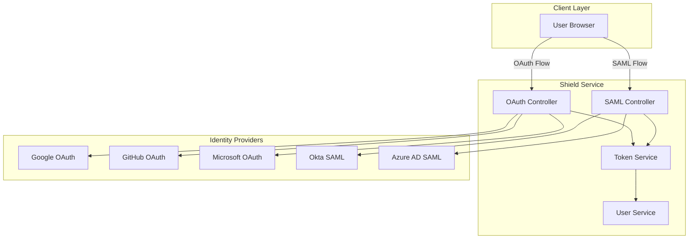
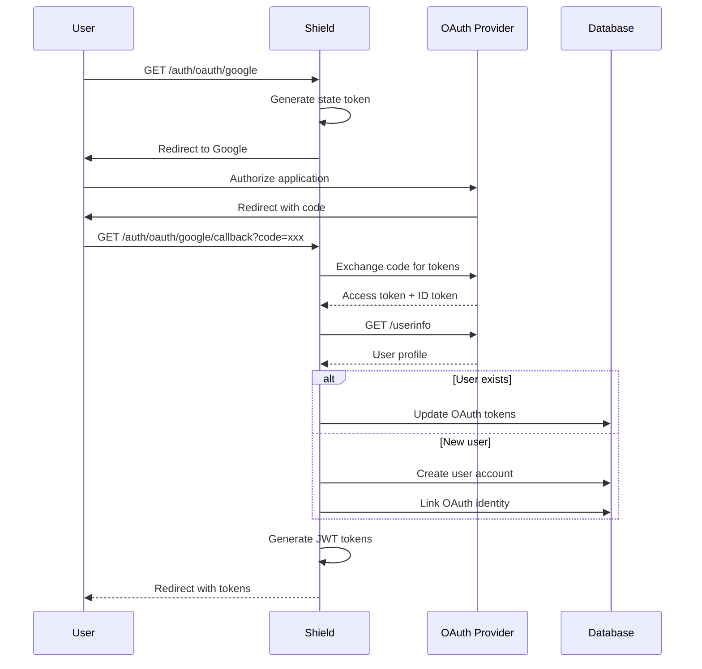
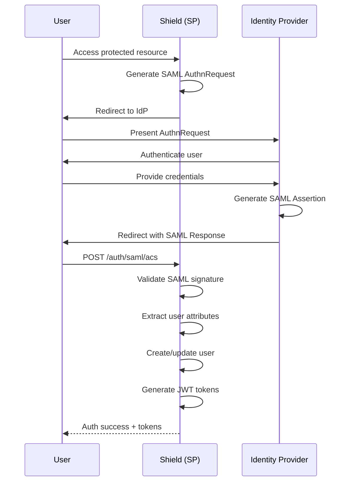
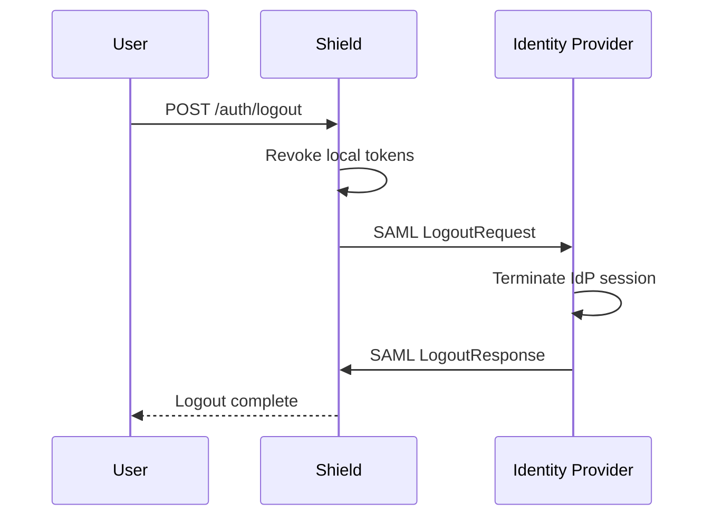

# OAuth 2.0 & SAML 2.0 Integration

<Info>
**SDD Classification:** L3-Technical
**Authority:** Engineering Team
**Review Cycle:** Quarterly
</Info>

This document covers Shield's Single Sign-On (SSO) integration including OAuth 2.0 providers (Google, GitHub, Microsoft) and SAML 2.0 enterprise identity providers.

---

## SSO Architecture



---

## OAuth 2.0 Integration

### Supported Providers

| Provider | Scopes | User Data |
|----------|--------|-----------|
| Google | `openid`, `email`, `profile` | email, name, picture |
| GitHub | `user:email`, `read:user` | email, name, avatar_url |
| Microsoft | `openid`, `email`, `profile` | email, displayName, photo |

### OAuth Flow



### OAuth Endpoints

#### Initiate OAuth Login

```http
GET /auth/oauth/{provider}
```

**Parameters:**
- `provider`: `google`, `github`, or `microsoft`
- `redirect_uri` (optional): Post-auth redirect URL
- `workspace_id` (optional): Auto-join workspace after auth

**Response:** Redirect to provider authorization URL

#### OAuth Callback

```http
GET /auth/oauth/{provider}/callback
```

**Query Parameters:**
- `code`: Authorization code from provider
- `state`: CSRF protection token

**Success Response:**

```json
{
  "access_token": "eyJhbGciOiJSUzI1NiIs...",
  "refresh_token": "eyJhbGciOiJSUzI1NiIs...",
  "token_type": "Bearer",
  "expires_in": 900,
  "user": {
    "id": "2441f8c8-0e14-4a71-8f32-8cbbf80382ae",
    "email": "user@example.com",
    "name": "John Doe",
    "avatar_url": "https://...",
    "is_verified": true,
    "oauth_provider": "google"
  }
}
```

### OAuth Implementation

```python
class OAuthService:
    PROVIDERS = {
        'google': {
            'authorize_url': 'https://accounts.google.com/o/oauth2/v2/auth',
            'token_url': 'https://oauth2.googleapis.com/token',
            'userinfo_url': 'https://openidconnect.googleapis.com/v1/userinfo',
            'scopes': ['openid', 'email', 'profile']
        },
        'github': {
            'authorize_url': 'https://github.com/login/oauth/authorize',
            'token_url': 'https://github.com/login/oauth/access_token',
            'userinfo_url': 'https://api.github.com/user',
            'scopes': ['user:email', 'read:user']
        },
        'microsoft': {
            'authorize_url': 'https://login.microsoftonline.com/common/oauth2/v2.0/authorize',
            'token_url': 'https://login.microsoftonline.com/common/oauth2/v2.0/token',
            'userinfo_url': 'https://graph.microsoft.com/v1.0/me',
            'scopes': ['openid', 'email', 'profile']
        }
    }

    def initiate_oauth(self, provider: str, redirect_uri: str) -> str:
        """Generate OAuth authorization URL."""
        config = self.PROVIDERS[provider]

        state = self.generate_state_token()
        self.store_state(state, {'redirect_uri': redirect_uri})

        params = {
            'client_id': self.get_client_id(provider),
            'redirect_uri': self.get_callback_url(provider),
            'response_type': 'code',
            'scope': ' '.join(config['scopes']),
            'state': state
        }

        return f"{config['authorize_url']}?{urlencode(params)}"

    def handle_callback(self, provider: str, code: str, state: str) -> AuthResult:
        """Handle OAuth callback and create/update user."""
        # 1. Validate state
        state_data = self.validate_state(state)
        if not state_data:
            raise InvalidOAuthState()

        # 2. Exchange code for tokens
        tokens = self.exchange_code(provider, code)

        # 3. Fetch user info
        user_info = self.fetch_user_info(provider, tokens['access_token'])

        # 4. Find or create user
        user = self.find_or_create_user(provider, user_info)

        # 5. Store OAuth tokens
        self.store_oauth_tokens(user, provider, tokens)

        # 6. Generate Materi tokens
        access_token = self.token_service.create_access_token(user)
        refresh_token = self.token_service.create_refresh_token(user)

        # 7. Audit log
        self.audit_log.record_oauth_login(user, provider)

        return AuthResult(
            access_token=access_token,
            refresh_token=refresh_token,
            user=user
        )

    def find_or_create_user(self, provider: str, user_info: dict) -> User:
        """Find existing user or create new account."""
        email = user_info['email']

        # Check for existing OAuth link
        oauth_token = OAuthToken.objects.filter(
            provider=provider,
            provider_user_id=user_info['id']
        ).first()

        if oauth_token:
            return oauth_token.user

        # Check for existing user by email
        user = User.objects.filter(email=email).first()

        if user:
            # Link OAuth to existing account
            OAuthToken.objects.create(
                user=user,
                provider=provider,
                provider_user_id=user_info['id']
            )
            return user

        # Create new user
        user = User.objects.create(
            email=email,
            name=user_info.get('name', email.split('@')[0]),
            avatar_url=user_info.get('picture'),
            is_verified=True  # OAuth emails are pre-verified
        )

        OAuthToken.objects.create(
            user=user,
            provider=provider,
            provider_user_id=user_info['id']
        )

        return user
```

### Provider-Specific Configuration

#### Google OAuth

```python
# settings.py
GOOGLE_OAUTH = {
    'client_id': os.environ['GOOGLE_CLIENT_ID'],
    'client_secret': os.environ['GOOGLE_CLIENT_SECRET'],
    'scopes': ['openid', 'email', 'profile'],
    'hosted_domain': None  # Set to restrict to specific domain
}
```

#### GitHub OAuth

```python
GITHUB_OAUTH = {
    'client_id': os.environ['GITHUB_CLIENT_ID'],
    'client_secret': os.environ['GITHUB_CLIENT_SECRET'],
    'scopes': ['user:email', 'read:user'],
    'allow_signup': True
}
```

#### Microsoft OAuth

```python
MICROSOFT_OAUTH = {
    'client_id': os.environ['MICROSOFT_CLIENT_ID'],
    'client_secret': os.environ['MICROSOFT_CLIENT_SECRET'],
    'tenant': 'common',  # or specific tenant ID
    'scopes': ['openid', 'email', 'profile', 'User.Read']
}
```

---

## SAML 2.0 Integration

### SAML Architecture



### SAML Endpoints

#### Initiate SAML Login

```http
POST /auth/saml/login
Content-Type: application/json

{
  "workspace_id": "ws_123",
  "relay_state": "/dashboard"
}
```

#### Assertion Consumer Service (ACS)

```http
POST /auth/saml/acs
Content-Type: application/x-www-form-urlencoded

SAMLResponse=<base64_encoded_response>
RelayState=<original_destination>
```

#### SAML Metadata

```http
GET /auth/saml/metadata/{workspace_id}
```

Returns SP metadata XML for IdP configuration.

### SAML Configuration

#### Service Provider Settings

```python
SAML_SP_SETTINGS = {
    'entityId': 'https://api.materi.dev/saml/metadata',
    'assertionConsumerService': {
        'url': 'https://api.materi.dev/auth/saml/acs',
        'binding': 'urn:oasis:names:tc:SAML:2.0:bindings:HTTP-POST'
    },
    'singleLogoutService': {
        'url': 'https://api.materi.dev/auth/saml/slo',
        'binding': 'urn:oasis:names:tc:SAML:2.0:bindings:HTTP-Redirect'
    },
    'x509cert': os.environ['SAML_SP_CERT'],
    'privateKey': os.environ['SAML_SP_PRIVATE_KEY']
}
```

#### Identity Provider Configuration

```python
class SAMLIdentityProvider(Model):
    workspace = ForeignKey(Workspace, on_delete=CASCADE)
    name = CharField(max_length=255)  # e.g., "Okta", "Azure AD"
    entity_id = CharField(max_length=500)
    sso_url = URLField()  # Single Sign-On URL
    slo_url = URLField(null=True)  # Single Logout URL
    x509_cert = TextField()  # IdP public certificate
    attribute_mapping = JSONField(default=dict)
    is_active = BooleanField(default=True)
    created_at = DateTimeField(auto_now_add=True)
```

### SAML Implementation

```python
class SAMLService:
    def create_authn_request(self, workspace_id: str, relay_state: str) -> str:
        """Generate SAML AuthnRequest and redirect URL."""
        idp = self.get_workspace_idp(workspace_id)
        if not idp:
            raise SAMLNotConfigured('SAML not configured for this workspace')

        auth = OneLogin_Saml2_Auth(
            self.get_request_data(),
            self.get_saml_settings(idp)
        )

        return auth.login(return_to=relay_state)

    def process_response(self, saml_response: str, workspace_id: str) -> AuthResult:
        """Process SAML Response and create user session."""
        idp = self.get_workspace_idp(workspace_id)

        auth = OneLogin_Saml2_Auth(
            self.get_request_data(saml_response),
            self.get_saml_settings(idp)
        )

        auth.process_response()

        if not auth.is_authenticated():
            errors = auth.get_errors()
            raise SAMLAuthenticationFailed(errors)

        # Extract attributes
        attributes = auth.get_attributes()
        name_id = auth.get_nameid()

        # Map to user profile
        user_data = self.map_attributes(attributes, idp.attribute_mapping)
        user_data['email'] = name_id

        # Find or create user
        user = self.find_or_create_saml_user(user_data, idp)

        # Generate tokens
        access_token = self.token_service.create_access_token(user)
        refresh_token = self.token_service.create_refresh_token(user)

        # Audit log
        self.audit_log.record_saml_login(user, idp.name)

        return AuthResult(
            access_token=access_token,
            refresh_token=refresh_token,
            user=user
        )

    def map_attributes(self, attributes: dict, mapping: dict) -> dict:
        """Map SAML attributes to user profile fields."""
        default_mapping = {
            'email': ['email', 'http://schemas.xmlsoap.org/ws/2005/05/identity/claims/emailaddress'],
            'name': ['displayName', 'http://schemas.xmlsoap.org/ws/2005/05/identity/claims/name'],
            'first_name': ['firstName', 'http://schemas.xmlsoap.org/ws/2005/05/identity/claims/givenname'],
            'last_name': ['lastName', 'http://schemas.xmlsoap.org/ws/2005/05/identity/claims/surname']
        }

        result = {}
        effective_mapping = {**default_mapping, **mapping}

        for field, attr_names in effective_mapping.items():
            if isinstance(attr_names, str):
                attr_names = [attr_names]

            for attr_name in attr_names:
                if attr_name in attributes:
                    value = attributes[attr_name]
                    result[field] = value[0] if isinstance(value, list) else value
                    break

        return result
```

### SAML Attribute Mapping Examples

#### Okta

```json
{
  "email": "email",
  "name": "displayName",
  "first_name": "firstName",
  "last_name": "lastName",
  "groups": "groups"
}
```

#### Azure AD

```json
{
  "email": "http://schemas.xmlsoap.org/ws/2005/05/identity/claims/emailaddress",
  "name": "http://schemas.xmlsoap.org/ws/2005/05/identity/claims/name",
  "first_name": "http://schemas.xmlsoap.org/ws/2005/05/identity/claims/givenname",
  "last_name": "http://schemas.xmlsoap.org/ws/2005/05/identity/claims/surname"
}
```

#### OneLogin

```json
{
  "email": "User.email",
  "name": "User.FirstName User.LastName",
  "department": "memberOf"
}
```

---

## Single Logout (SLO)

### Logout Flow



### SLO Implementation

```python
def initiate_slo(self, user: User) -> str:
    """Initiate SAML Single Logout."""
    # Revoke local tokens first
    self.token_service.revoke_all_user_tokens(user.id)

    # Get user's SAML session
    saml_session = SAMLSession.objects.filter(
        user=user,
        expires_at__gt=datetime.utcnow()
    ).first()

    if not saml_session:
        return None  # No SAML session, local logout only

    idp = saml_session.identity_provider
    auth = OneLogin_Saml2_Auth(
        self.get_request_data(),
        self.get_saml_settings(idp)
    )

    return auth.logout(
        name_id=saml_session.name_id,
        session_index=saml_session.session_index
    )
```

---

## Circuit Breaker Pattern

Shield implements circuit breakers for SSO provider resilience:

```python
class SSOCircuitBreaker:
    def __init__(self, provider: str):
        self.provider = provider
        self.failure_count = 0
        self.last_failure = None
        self.state = 'closed'  # closed, open, half_open

        # Provider-specific thresholds
        self.thresholds = {
            'google': {'failures': 5, 'timeout': 30, 'recovery': 60},
            'github': {'failures': 5, 'timeout': 30, 'recovery': 60},
            'microsoft': {'failures': 5, 'timeout': 30, 'recovery': 60},
            'saml': {'failures': 3, 'timeout': 60, 'recovery': 120}
        }

    def call(self, func, *args, **kwargs):
        """Execute function with circuit breaker protection."""
        if self.state == 'open':
            if self.should_attempt_reset():
                self.state = 'half_open'
            else:
                raise CircuitBreakerOpen(f'{self.provider} SSO is temporarily unavailable')

        try:
            result = func(*args, **kwargs)
            self.on_success()
            return result
        except Exception as e:
            self.on_failure()
            raise

    def on_failure(self):
        self.failure_count += 1
        self.last_failure = datetime.utcnow()

        threshold = self.thresholds[self.provider]['failures']
        if self.failure_count >= threshold:
            self.state = 'open'
            self.publish_circuit_state_change()

    def on_success(self):
        self.failure_count = 0
        if self.state == 'half_open':
            self.state = 'closed'
            self.publish_circuit_state_change()
```

---

## Admin Configuration

### OAuth Provider Setup

```http
POST /admin/sso/oauth/providers
Authorization: Bearer <admin_token>
Content-Type: application/json

{
  "provider": "google",
  "client_id": "xxx.apps.googleusercontent.com",
  "client_secret": "xxx",
  "enabled": true,
  "allowed_domains": ["company.com"]
}
```

### SAML IdP Setup

```http
POST /admin/sso/saml/providers
Authorization: Bearer <admin_token>
Content-Type: application/json

{
  "workspace_id": "ws_123",
  "name": "Okta Production",
  "entity_id": "http://www.okta.com/exk123",
  "sso_url": "https://company.okta.com/app/xxx/sso/saml",
  "x509_cert": "-----BEGIN CERTIFICATE-----...",
  "attribute_mapping": {
    "email": "email",
    "name": "displayName"
  }
}
```

---

## Security Considerations

### OAuth Security

| Control | Implementation |
|---------|----------------|
| State parameter | CSRF protection, stored in Redis |
| PKCE | Required for mobile/SPA clients |
| Token storage | OAuth tokens encrypted at rest |
| Scope validation | Minimum required scopes only |

### SAML Security

| Control | Implementation |
|---------|----------------|
| Signature validation | All assertions must be signed |
| Certificate pinning | IdP certificates stored per workspace |
| Assertion encryption | Optional, recommended for sensitive data |
| Replay prevention | Assertion ID tracking with 5-minute window |

---

## Metrics

Shield exposes SSO-specific metrics:

```prometheus
# OAuth metrics
materi_oauth_attempts_total{provider="google",status="success"} 1234
materi_oauth_attempts_total{provider="google",status="failure"} 12
materi_oauth_latency_seconds{provider="google",quantile="0.95"} 0.45

# SAML metrics
materi_saml_assertions_total{idp="okta",status="valid"} 567
materi_saml_assertions_total{idp="okta",status="invalid"} 3
materi_saml_latency_seconds{idp="okta",quantile="0.95"} 0.32

# Circuit breaker state
materi_sso_circuit_state{provider="google"} 0  # 0=closed, 1=open, 2=half_open
```

---

## Error Handling

| Error Code | HTTP Status | Description |
|------------|-------------|-------------|
| `OAUTH_STATE_INVALID` | 400 | Invalid or expired OAuth state |
| `OAUTH_CODE_INVALID` | 400 | Invalid authorization code |
| `OAUTH_PROVIDER_ERROR` | 502 | Provider returned error |
| `SAML_NOT_CONFIGURED` | 400 | SAML not configured for workspace |
| `SAML_ASSERTION_INVALID` | 400 | Invalid SAML assertion |
| `SAML_SIGNATURE_INVALID` | 400 | SAML signature verification failed |
| `SSO_CIRCUIT_OPEN` | 503 | SSO provider temporarily unavailable |

---

## Related Documentation

- [Overview](overview) - Service overview
- [Authentication](authentication) - Auth flows
- [Authorization](authorization) - Permission checks
- [Deployment](deployment) - Production configuration

---

**Document Status:** Complete
**Version:** 2.0
