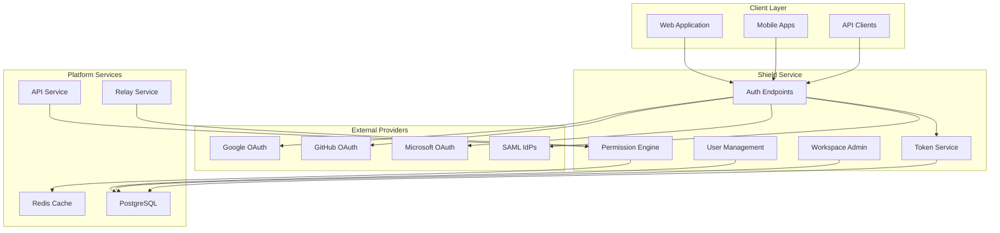

# Shield Service Overview

<Info>
**SDD Classification:** L2-System
**Authority:** Engineering Team
**Review Cycle:** Quarterly
</Info>

Shield is Materi's centralized authentication and administration service. Built on Django 4.2+, it provides user lifecycle management, OAuth 2.0/SAML 2.0 SSO integration, JWT token issuance, workspace administration, and role-based access control across the platform.

---

## Service Context

---

## Core Responsibilities

| Domain | Description |
|--------|-------------|
| **User Lifecycle** | Registration, verification, profile management, account deletion |
| **Authentication** | Email/password login, OAuth 2.0, SAML 2.0, JWT issuance |
| **Authorization** | RBAC, permission checks, document sharing, workspace roles |
| **Workspace Admin** | Workspace CRUD, member management, settings, subscriptions |
| **Admin Interface** | Django Admin for operations, user impersonation, activity monitoring |
| **Security** | Rate limiting, audit logging, session management, compliance |

---

## System Objectives

1. **Authentication Excellence**: Secure, standards-based auth (OAuth 2.0, SAML 2.0) with real-time collaboration optimization
2. **Ultra-Fast Validation**: Sub-1ms token validation via Redis caching and public key optimization
3. **Massive Scale**: Support 100,000+ concurrent users per workspace across HTTP and WebSocket
4. **High Availability**: 99.95% uptime for authentication operations
5. **Compliance**: SOC 2, GDPR, HIPAA requirements with event-driven audit trails

---

## Technology Stack

| Component | Technology | Purpose |
|-----------|------------|---------|
| **Framework** | Django 4.2+ | Web framework |
| **Authentication** | django-allauth, python-social-auth | OAuth providers |
| **SAML** | python3-saml | Enterprise SSO |
| **Database** | PostgreSQL 15+ | Primary data store |
| **Cache** | Redis 7+ | Session, permission caching |
| **Password** | bcrypt (12 rounds) | Password hashing |
| **Tokens** | PyJWT (RS256) | JWT signing/validation |
| **Testing** | pytest-django | Test framework |

---

## Service Endpoints

### Base URLs

| Environment | URL |
|-------------|-----|
| Production | `https://api.materi.dev` |
| Staging | `https://api-staging.materi.dev` |
| Local | `http://localhost:8000` |

### Health Endpoints

| Endpoint | Purpose |
|----------|---------|
| `GET /health/` | Basic health check |
| `GET /ready/` | Readiness (DB, cache connectivity) |
| `GET /metrics/` | Prometheus metrics |

---

## Integration Points

### Downstream Services

Shield provides authentication and authorization for:

- **API Service**: JWT validation, permission checks via internal API
- **Relay Service**: WebSocket auth tokens, permission caching
- **All Clients**: OAuth/SAML flows, token refresh

### Event Streams

Shield publishes and consumes events via Redis Streams:

| Stream | Direction | Events |
|--------|-----------|--------|
| `materi:events:users` | Publish | UserCreated, UserUpdated, UserDeleted |
| `materi:events:workspaces` | Publish | WorkspaceCreated, MembershipChanged |
| `materi:events:security` | Publish | UserLogin, UserLogout, PermissionDenied |
| `materi:events:documents` | Consume | DocumentCreated, DocumentDeleted |

---

## Performance Characteristics

| Metric | Target | Notes |
|--------|--------|-------|
| Auth response (p95) | <500ms | Includes password hashing |
| Token validation | <10ms | Public key validation |
| Permission check | <50ms | Redis-cached results |
| Cache hit rate | 95%+ | For permission validation |

---

## Related Documentation

- [Architecture](/developer/domain/shield/architecture) - System design
- [Authentication](/developer/domain/shield/authentication) - Auth flows
- [Authorization](/developer/domain/shield/authorization) - RBAC and permissions
- [OAuth/SAML](/developer/domain/shield/oauth-saml) - SSO integration
- [User Management](/developer/domain/shield/user-management) - User lifecycle
- [Testing](/developer/domain/shield/testing) - Test strategies
- [Deployment](/developer/domain/shield/deployment) - Deployment guide

---

**Document Status:** Complete
**Version:** 2.0
