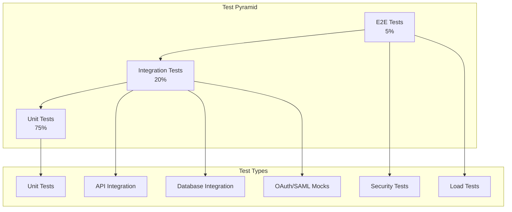

# Shield Testing

<Info>
**SDD Classification:** L3-Technical
**Authority:** Engineering Team
**Review Cycle:** Quarterly
</Info>

This document covers Shield's testing strategy including unit tests, integration tests, security testing, and load testing approaches for the authentication service.

---

## Testing Architecture



---

## Test Configuration

### pytest Configuration

```python
# pytest.ini
[pytest]
DJANGO_SETTINGS_MODULE = config.settings.test
python_files = test_*.py
python_classes = Test*
python_functions = test_*
addopts = -v --tb=short --strict-markers
markers =
    unit: Unit tests
    integration: Integration tests
    slow: Slow tests (excluded by default)
    security: Security-focused tests
```

### Test Settings

```python
# config/settings/test.py
from .base import *

DEBUG = False
TESTING = True

# Use in-memory SQLite for speed
DATABASES = {
    'default': {
        'ENGINE': 'django.db.backends.sqlite3',
        'NAME': ':memory:',
    }
}

# Faster password hashing in tests
PASSWORD_HASHERS = [
    'django.contrib.auth.hashers.MD5PasswordHasher',
]

# Mock Redis
CACHES = {
    'default': {
        'BACKEND': 'django.core.cache.backends.locmem.LocMemCache',
    }
}

# Disable rate limiting
RATE_LIMIT_ENABLED = False

# Mock email
EMAIL_BACKEND = 'django.core.mail.backends.locmem.EmailBackend'
```

---

## Unit Tests

### User Model Tests

```python
# apps/users/tests/test_models.py
import pytest
from apps.users.models import User

@pytest.mark.unit
class TestUserModel:
    def test_create_user(self, db):
        """Test user creation with valid data."""
        user = User.objects.create_user(
            email='test@example.com',
            password='SecureP@ss123',
            name='Test User'
        )

        assert user.email == 'test@example.com'
        assert user.name == 'Test User'
        assert user.is_verified is False
        assert user.is_active is True
        assert user.check_password('SecureP@ss123')

    def test_email_normalized(self, db):
        """Test email is normalized to lowercase."""
        user = User.objects.create_user(
            email='Test@EXAMPLE.COM',
            password='SecureP@ss123',
            name='Test User'
        )

        assert user.email == 'test@example.com'

    def test_email_unique(self, db):
        """Test email uniqueness constraint."""
        User.objects.create_user(
            email='test@example.com',
            password='SecureP@ss123',
            name='User 1'
        )

        with pytest.raises(IntegrityError):
            User.objects.create_user(
                email='test@example.com',
                password='SecureP@ss123',
                name='User 2'
            )

    def test_soft_delete(self, db):
        """Test soft deletion sets deleted_at."""
        user = User.objects.create_user(
            email='test@example.com',
            password='SecureP@ss123',
            name='Test User'
        )

        user.soft_delete()

        assert user.deleted_at is not None
        assert user.is_active is False
        assert User.objects.filter(id=user.id).exists()
```

### Authentication Service Tests

```python
# apps/auth/tests/test_services.py
import pytest
from unittest.mock import Mock, patch
from apps.auth.services import AuthService
from apps.auth.exceptions import InvalidCredentials, RateLimitExceeded

@pytest.mark.unit
class TestAuthService:
    @pytest.fixture
    def auth_service(self):
        return AuthService()

    @pytest.fixture
    def user(self, db):
        return User.objects.create_user(
            email='test@example.com',
            password='SecureP@ss123',
            name='Test User',
            is_verified=True
        )

    def test_authenticate_success(self, auth_service, user):
        """Test successful authentication."""
        result = auth_service.authenticate(
            email='test@example.com',
            password='SecureP@ss123'
        )

        assert result.user == user
        assert result.access_token is not None
        assert result.refresh_token is not None

    def test_authenticate_wrong_password(self, auth_service, user):
        """Test authentication with wrong password."""
        with pytest.raises(InvalidCredentials):
            auth_service.authenticate(
                email='test@example.com',
                password='WrongPassword'
            )

    def test_authenticate_nonexistent_user(self, auth_service):
        """Test authentication with non-existent email."""
        with pytest.raises(InvalidCredentials):
            auth_service.authenticate(
                email='nonexistent@example.com',
                password='AnyPassword'
            )

    def test_authenticate_unverified_user(self, auth_service, db):
        """Test authentication fails for unverified user."""
        user = User.objects.create_user(
            email='unverified@example.com',
            password='SecureP@ss123',
            name='Unverified',
            is_verified=False
        )

        with pytest.raises(EmailNotVerified):
            auth_service.authenticate(
                email='unverified@example.com',
                password='SecureP@ss123'
            )

    @patch('apps.auth.services.RateLimiter')
    def test_rate_limiting(self, mock_limiter, auth_service, user):
        """Test rate limiting on failed attempts."""
        mock_limiter.return_value.is_exceeded.return_value = True

        with pytest.raises(RateLimitExceeded):
            auth_service.authenticate(
                email='test@example.com',
                password='WrongPassword'
            )
```

### Token Service Tests

```python
# apps/auth/tests/test_tokens.py
import pytest
import jwt
from datetime import datetime, timedelta
from apps.auth.services import TokenService

@pytest.mark.unit
class TestTokenService:
    @pytest.fixture
    def token_service(self):
        return TokenService()

    @pytest.fixture
    def user(self, db):
        return User.objects.create_user(
            email='test@example.com',
            password='SecureP@ss123',
            name='Test User',
            is_verified=True
        )

    def test_create_access_token(self, token_service, user):
        """Test access token creation."""
        token = token_service.create_access_token(user)

        decoded = jwt.decode(
            token,
            token_service.public_key,
            algorithms=['RS256']
        )

        assert decoded['user_id'] == str(user.id)
        assert decoded['email'] == user.email
        assert decoded['token_type'] == 'access'
        assert 'exp' in decoded
        assert 'jti' in decoded

    def test_access_token_expiry(self, token_service, user):
        """Test access token has correct expiry."""
        token = token_service.create_access_token(user)
        decoded = jwt.decode(
            token,
            token_service.public_key,
            algorithms=['RS256']
        )

        exp = datetime.fromtimestamp(decoded['exp'])
        now = datetime.utcnow()

        # Should expire in ~15 minutes
        assert timedelta(minutes=14) < (exp - now) < timedelta(minutes=16)

    def test_create_refresh_token(self, token_service, user):
        """Test refresh token creation."""
        token = token_service.create_refresh_token(user)

        decoded = jwt.decode(
            token,
            token_service.public_key,
            algorithms=['RS256']
        )

        assert decoded['user_id'] == str(user.id)
        assert decoded['token_type'] == 'refresh'

        # Should be stored in database
        assert RefreshToken.objects.filter(id=decoded['jti']).exists()

    def test_validate_token(self, token_service, user):
        """Test token validation."""
        token = token_service.create_access_token(user)
        result = token_service.validate_token(token)

        assert result.valid is True
        assert result.user_id == str(user.id)

    def test_validate_expired_token(self, token_service, user):
        """Test expired token validation."""
        # Create token with past expiry
        with patch('apps.auth.services.datetime') as mock_dt:
            mock_dt.utcnow.return_value = datetime.utcnow() - timedelta(hours=1)
            token = token_service.create_access_token(user)

        result = token_service.validate_token(token)
        assert result.valid is False
        assert result.error == 'token_expired'
```

---

## Integration Tests

### API Endpoint Tests

```python
# apps/auth/tests/test_api.py
import pytest
from rest_framework.test import APIClient
from rest_framework import status

@pytest.mark.integration
class TestAuthAPI:
    @pytest.fixture
    def client(self):
        return APIClient()

    @pytest.fixture
    def user(self, db):
        return User.objects.create_user(
            email='test@example.com',
            password='SecureP@ss123',
            name='Test User',
            is_verified=True
        )

    def test_login_success(self, client, user):
        """Test successful login returns tokens."""
        response = client.post('/auth/login', {
            'email': 'test@example.com',
            'password': 'SecureP@ss123'
        })

        assert response.status_code == status.HTTP_200_OK
        assert 'access_token' in response.data
        assert 'refresh_token' in response.data
        assert response.data['user']['email'] == 'test@example.com'

    def test_login_wrong_credentials(self, client, user):
        """Test login with wrong credentials returns 401."""
        response = client.post('/auth/login', {
            'email': 'test@example.com',
            'password': 'WrongPassword'
        })

        assert response.status_code == status.HTTP_401_UNAUTHORIZED
        assert response.data['error'] == 'INVALID_CREDENTIALS'

    def test_register_success(self, client, db):
        """Test successful user registration."""
        response = client.post('/auth/register', {
            'email': 'new@example.com',
            'password': 'SecureP@ss123',
            'name': 'New User'
        })

        assert response.status_code == status.HTTP_201_CREATED
        assert User.objects.filter(email='new@example.com').exists()

    def test_register_duplicate_email(self, client, user):
        """Test registration with duplicate email returns 409."""
        response = client.post('/auth/register', {
            'email': 'test@example.com',
            'password': 'SecureP@ss123',
            'name': 'Duplicate User'
        })

        assert response.status_code == status.HTTP_409_CONFLICT

    def test_refresh_token(self, client, user):
        """Test token refresh."""
        # Login first
        login_response = client.post('/auth/login', {
            'email': 'test@example.com',
            'password': 'SecureP@ss123'
        })

        refresh_token = login_response.data['refresh_token']

        # Refresh
        response = client.post('/auth/refresh', {
            'refresh_token': refresh_token
        })

        assert response.status_code == status.HTTP_200_OK
        assert 'access_token' in response.data
        assert response.data['access_token'] != login_response.data['access_token']

    def test_logout(self, client, user):
        """Test logout revokes tokens."""
        # Login
        login_response = client.post('/auth/login', {
            'email': 'test@example.com',
            'password': 'SecureP@ss123'
        })

        access_token = login_response.data['access_token']
        refresh_token = login_response.data['refresh_token']

        # Logout
        client.credentials(HTTP_AUTHORIZATION=f'Bearer {access_token}')
        response = client.post('/auth/revoke', {
            'refresh_token': refresh_token
        })

        assert response.status_code == status.HTTP_204_NO_CONTENT

        # Try to refresh - should fail
        response = client.post('/auth/refresh', {
            'refresh_token': refresh_token
        })
        assert response.status_code == status.HTTP_401_UNAUTHORIZED
```

### Database Integration Tests

```python
# apps/auth/tests/test_db_integration.py
import pytest
from django.db import connection

@pytest.mark.integration
class TestDatabaseIntegration:
    def test_user_workspace_relationship(self, db):
        """Test user-workspace membership relationship."""
        user = User.objects.create_user(
            email='test@example.com',
            password='SecureP@ss123',
            name='Test User'
        )

        workspace = Workspace.objects.create(
            name='Test Workspace',
            owner=user
        )

        membership = Membership.objects.create(
            user=user,
            workspace=workspace,
            role='owner'
        )

        # Verify relationship
        assert user.memberships.count() == 1
        assert workspace.members.count() == 1
        assert membership.user == user
        assert membership.workspace == workspace

    def test_cascade_delete(self, db):
        """Test cascade deletion of related records."""
        user = User.objects.create_user(
            email='test@example.com',
            password='SecureP@ss123',
            name='Test User'
        )

        # Create related records
        RefreshToken.objects.create(
            user=user,
            token_hash='hash123',
            expires_at=datetime.utcnow() + timedelta(days=30)
        )

        # Delete user
        user.delete()

        # Verify cascade
        assert RefreshToken.objects.filter(user_id=user.id).count() == 0
```

---

## OAuth/SAML Mock Tests

```python
# apps/auth/tests/test_oauth.py
import pytest
from unittest.mock import patch, Mock
from apps.auth.services import OAuthService

@pytest.mark.integration
class TestOAuthIntegration:
    @pytest.fixture
    def oauth_service(self):
        return OAuthService()

    @patch('apps.auth.services.requests.post')
    @patch('apps.auth.services.requests.get')
    def test_google_oauth_flow(self, mock_get, mock_post, oauth_service, db):
        """Test Google OAuth flow with mocked responses."""
        # Mock token exchange
        mock_post.return_value = Mock(
            status_code=200,
            json=lambda: {
                'access_token': 'google_access_token',
                'id_token': 'google_id_token',
                'expires_in': 3600
            }
        )

        # Mock userinfo
        mock_get.return_value = Mock(
            status_code=200,
            json=lambda: {
                'sub': 'google_user_123',
                'email': 'user@gmail.com',
                'name': 'Google User',
                'picture': 'https://...'
            }
        )

        result = oauth_service.handle_callback(
            provider='google',
            code='auth_code_123',
            state='valid_state'
        )

        assert result.user.email == 'user@gmail.com'
        assert result.access_token is not None

    @patch('apps.auth.services.OneLogin_Saml2_Auth')
    def test_saml_response_processing(self, mock_saml_auth, oauth_service, db):
        """Test SAML response processing with mocked IdP."""
        mock_auth = Mock()
        mock_auth.is_authenticated.return_value = True
        mock_auth.get_attributes.return_value = {
            'email': ['user@company.com'],
            'displayName': ['SAML User']
        }
        mock_auth.get_nameid.return_value = 'user@company.com'
        mock_saml_auth.return_value = mock_auth

        result = oauth_service.process_saml_response(
            saml_response='base64_response',
            workspace_id='ws_123'
        )

        assert result.user.email == 'user@company.com'
```

---

## Security Tests

```python
# apps/auth/tests/test_security.py
import pytest
from rest_framework.test import APIClient

@pytest.mark.security
class TestSecurityControls:
    @pytest.fixture
    def client(self):
        return APIClient()

    def test_password_not_logged(self, client, db, caplog):
        """Test passwords are never logged."""
        response = client.post('/auth/register', {
            'email': 'test@example.com',
            'password': 'SecretP@ssword123',
            'name': 'Test User'
        })

        # Check logs don't contain password
        assert 'SecretP@ssword123' not in caplog.text

    def test_rate_limiting(self, client, db):
        """Test rate limiting on login endpoint."""
        # Create user
        User.objects.create_user(
            email='test@example.com',
            password='SecureP@ss123',
            name='Test User',
            is_verified=True
        )

        # Attempt multiple failed logins
        for i in range(6):
            response = client.post('/auth/login', {
                'email': 'test@example.com',
                'password': 'WrongPassword'
            })

        # 6th attempt should be rate limited
        assert response.status_code == 429
        assert 'Retry-After' in response.headers

    def test_csrf_protection(self, client):
        """Test CSRF protection on state-changing endpoints."""
        # Should fail without CSRF token
        response = client.post(
            '/auth/login',
            {'email': 'test@example.com', 'password': 'pass'},
            HTTP_COOKIE=''
        )

        # For API endpoints using JWT, CSRF might be handled differently
        # This test verifies the security configuration

    def test_jwt_signature_validation(self, client, db):
        """Test that tampered JWTs are rejected."""
        user = User.objects.create_user(
            email='test@example.com',
            password='SecureP@ss123',
            name='Test User',
            is_verified=True
        )

        # Get valid token
        login_response = client.post('/auth/login', {
            'email': 'test@example.com',
            'password': 'SecureP@ss123'
        })

        token = login_response.data['access_token']

        # Tamper with token
        parts = token.split('.')
        parts[1] = parts[1][:-4] + 'XXXX'  # Modify payload
        tampered_token = '.'.join(parts)

        # Try to use tampered token
        client.credentials(HTTP_AUTHORIZATION=f'Bearer {tampered_token}')
        response = client.get('/api/users/me')

        assert response.status_code == 401

    def test_sql_injection_prevention(self, client, db):
        """Test SQL injection attempts are prevented."""
        response = client.post('/auth/login', {
            'email': "'; DROP TABLE users; --",
            'password': 'password'
        })

        # Should fail gracefully, not cause SQL error
        assert response.status_code in [400, 401]
        assert User.objects.count() >= 0  # Table still exists

    def test_xss_prevention(self, client, db):
        """Test XSS payloads are escaped."""
        response = client.post('/auth/register', {
            'email': 'test@example.com',
            'password': 'SecureP@ss123',
            'name': '<script>alert("xss")</script>'
        })

        user = User.objects.get(email='test@example.com')
        assert '<script>' not in user.name or user.name == '&lt;script&gt;...'
```

---

## Load Tests

```python
# load_tests/test_auth_load.py
from locust import HttpUser, task, between

class AuthLoadTest(HttpUser):
    wait_time = between(1, 3)

    def on_start(self):
        """Setup: create test user."""
        self.client.post('/auth/register', json={
            'email': f'loadtest_{self.user_id}@example.com',
            'password': 'SecureP@ss123',
            'name': 'Load Test User'
        })

    @task(10)
    def login(self):
        """Test login endpoint."""
        self.client.post('/auth/login', json={
            'email': f'loadtest_{self.user_id}@example.com',
            'password': 'SecureP@ss123'
        })

    @task(5)
    def refresh_token(self):
        """Test token refresh."""
        # Login first
        response = self.client.post('/auth/login', json={
            'email': f'loadtest_{self.user_id}@example.com',
            'password': 'SecureP@ss123'
        })

        if response.status_code == 200:
            refresh_token = response.json()['refresh_token']
            self.client.post('/auth/refresh', json={
                'refresh_token': refresh_token
            })

    @task(3)
    def permission_check(self):
        """Test permission validation."""
        response = self.client.post('/auth/login', json={
            'email': f'loadtest_{self.user_id}@example.com',
            'password': 'SecureP@ss123'
        })

        if response.status_code == 200:
            token = response.json()['access_token']
            self.client.post(
                '/api/permissions/check',
                json={
                    'resource_type': 'document',
                    'resource_id': 'doc_123',
                    'action': 'read'
                },
                headers={'Authorization': f'Bearer {token}'}
            )
```

### Running Load Tests

```bash
# Run with 100 concurrent users
locust -f load_tests/test_auth_load.py \
  --host=http://localhost:8000 \
  --users=100 \
  --spawn-rate=10 \
  --run-time=5m

# Run headless with HTML report
locust -f load_tests/test_auth_load.py \
  --host=http://localhost:8000 \
  --users=100 \
  --spawn-rate=10 \
  --run-time=5m \
  --headless \
  --html=report.html
```

---

## Test Coverage Requirements

| Component | Target Coverage |
|-----------|-----------------|
| Models | 95% |
| Services | 90% |
| Views/Controllers | 85% |
| Serializers | 80% |
| Utils | 80% |
| **Overall** | **85%** |

### Generating Coverage Report

```bash
# Run tests with coverage
pytest --cov=apps --cov-report=html --cov-report=term-missing

# View HTML report
open htmlcov/index.html
```

---

## CI/CD Integration

```yaml
# .github/workflows/shield-tests.yml
name: Shield Tests

on: [push, pull_request]

jobs:
  test:
    runs-on: ubuntu-latest

    services:
      postgres:
        image: postgres:15
        env:
          POSTGRES_PASSWORD: postgres
        options: >-
          --health-cmd pg_isready
          --health-interval 10s
          --health-timeout 5s
          --health-retries 5

      redis:
        image: redis:7
        options: >-
          --health-cmd "redis-cli ping"
          --health-interval 10s
          --health-timeout 5s
          --health-retries 5

    steps:
      - uses: actions/checkout@v4

      - name: Set up Python
        uses: actions/setup-python@v5
        with:
          python-version: '3.11'

      - name: Install dependencies
        run: |
          pip install -r requirements.txt
          pip install -r requirements-dev.txt

      - name: Run unit tests
        run: pytest -m unit --cov=apps

      - name: Run integration tests
        run: pytest -m integration

      - name: Run security tests
        run: pytest -m security

      - name: Upload coverage
        uses: codecov/codecov-action@v4
```

---

## Related Documentation

- [Overview](overview) - Service overview
- [Architecture](architecture) - System design
- [Deployment](deployment) - Deployment guide
- [API Testing](/api/testing) - API test patterns

---

**Document Status:** Complete
**Version:** 2.0
