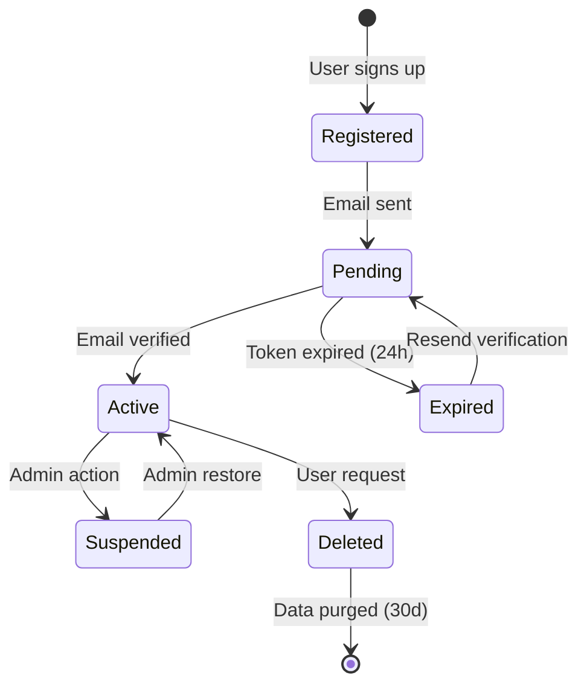
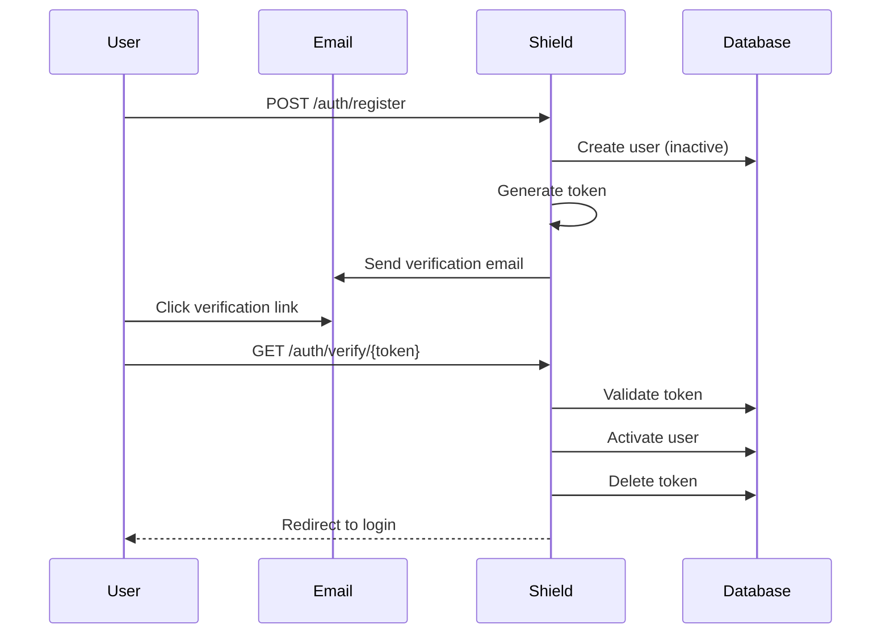
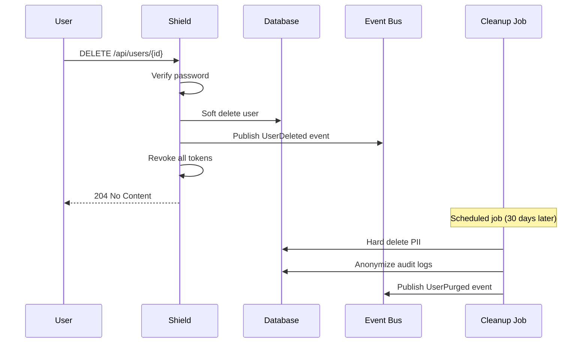

# User Management

<Info>
**SDD Classification:** L3-Technical
**Authority:** Engineering Team
**Review Cycle:** Quarterly
</Info>

This document covers Shield's user lifecycle management including registration, email verification, profile management, password handling, and GDPR-compliant account deletion.

---

## User Lifecycle



---

## User Registration

### Registration Endpoint

```http
POST /auth/register
Content-Type: application/json

{
  "email": "user@example.com",
  "password": "SecureP@ss123",
  "name": "John Doe"
}
```

### Success Response

```json
{
  "user": {
    "id": "2441f8c8-0e14-4a71-8f32-8cbbf80382ae",
    "email": "user@example.com",
    "name": "John Doe",
    "is_verified": false,
    "created_at": "2025-01-07T10:00:00Z"
  },
  "message": "Verification email sent"
}
```

### Registration Implementation

```python
class RegistrationService:
    def register(self, email: str, password: str, name: str) -> User:
        # 1. Check rate limit
        if self.rate_limiter.is_exceeded(self.get_client_ip(), limit=3, window=3600):
            raise RateLimitExceeded('Too many registration attempts')

        # 2. Validate email format
        if not self.validate_email(email):
            raise InvalidEmail('Invalid email format')

        # 3. Check email availability
        if User.objects.filter(email=email).exists():
            raise EmailAlreadyExists('Email already registered')

        # 4. Validate password complexity
        self.validate_password(password)

        # 5. Create user
        user = User.objects.create(
            email=email,
            password=make_password(password),
            name=name,
            is_verified=False,
            is_active=False  # Inactive until verified
        )

        # 6. Generate verification token
        token = self.create_verification_token(user)

        # 7. Send verification email
        self.email_service.send_verification_email(user, token)

        # 8. Publish event
        self.event_publisher.publish_user_created(user)

        # 9. Audit log
        self.audit_log.record_registration(user)

        return user

    def validate_password(self, password: str):
        """Validate password meets complexity requirements."""
        if len(password) < 8:
            raise WeakPassword('Password must be at least 8 characters')
        if not re.search(r'[A-Z]', password):
            raise WeakPassword('Password must contain uppercase letter')
        if not re.search(r'[a-z]', password):
            raise WeakPassword('Password must contain lowercase letter')
        if not re.search(r'\d', password):
            raise WeakPassword('Password must contain a number')
        if not re.search(r'[!@#$%^&*(),.?":{}|<>]', password):
            raise WeakPassword('Password must contain a special character')

        # Check against common passwords
        if password.lower() in self.common_passwords:
            raise WeakPassword('Password is too common')
```

---

## Email Verification

### Verification Endpoint

```http
GET /auth/verify/{token}
```

### Verification Flow



### Verification Implementation

```python
class VerificationService:
    TOKEN_EXPIRY = timedelta(hours=24)

    def create_verification_token(self, user: User) -> str:
        """Generate email verification token."""
        token = secrets.token_urlsafe(32)

        VerificationToken.objects.create(
            user=user,
            token_hash=hashlib.sha256(token.encode()).hexdigest(),
            token_type='email_verification',
            expires_at=datetime.utcnow() + self.TOKEN_EXPIRY
        )

        return token

    def verify_email(self, token: str) -> User:
        """Verify user email with token."""
        token_hash = hashlib.sha256(token.encode()).hexdigest()

        verification = VerificationToken.objects.filter(
            token_hash=token_hash,
            token_type='email_verification',
            expires_at__gt=datetime.utcnow(),
            used_at__isnull=True
        ).first()

        if not verification:
            raise InvalidToken('Verification link is invalid or expired')

        user = verification.user

        # Mark token as used
        verification.used_at = datetime.utcnow()
        verification.save()

        # Activate user
        user.is_verified = True
        user.is_active = True
        user.save()

        # Audit log
        self.audit_log.record_email_verified(user)

        # Publish event
        self.event_publisher.publish_user_verified(user)

        return user

    def resend_verification(self, email: str):
        """Resend verification email."""
        user = User.objects.filter(email=email, is_verified=False).first()

        if not user:
            return  # Don't reveal if email exists

        # Rate limit resend
        recent_tokens = VerificationToken.objects.filter(
            user=user,
            token_type='email_verification',
            created_at__gt=datetime.utcnow() - timedelta(minutes=5)
        ).count()

        if recent_tokens >= 3:
            raise RateLimitExceeded('Too many verification requests')

        # Invalidate old tokens
        VerificationToken.objects.filter(
            user=user,
            token_type='email_verification',
            used_at__isnull=True
        ).delete()

        # Create new token
        token = self.create_verification_token(user)
        self.email_service.send_verification_email(user, token)
```

---

## Profile Management

### Get Profile

```http
GET /api/users/{user_id}
Authorization: Bearer <access_token>
```

### Response

```json
{
  "id": "2441f8c8-0e14-4a71-8f32-8cbbf80382ae",
  "email": "user@example.com",
  "name": "John Doe",
  "avatar_url": "https://cdn.materi.dev/avatars/123.jpg",
  "timezone": "America/New_York",
  "language": "en",
  "is_verified": true,
  "created_at": "2025-01-07T10:00:00Z",
  "updated_at": "2025-01-07T12:00:00Z",
  "workspaces": [
    {
      "id": "ws_123",
      "name": "Acme Corp",
      "role": "admin"
    }
  ]
}
```

### Update Profile

```http
PATCH /api/users/{user_id}/profile
Authorization: Bearer <access_token>
Content-Type: application/json

{
  "name": "John Smith",
  "avatar_url": "https://cdn.materi.dev/avatars/new.jpg",
  "timezone": "Europe/London",
  "language": "en-GB"
}
```

### Profile Implementation

```python
class ProfileService:
    ALLOWED_FIELDS = {'name', 'avatar_url', 'timezone', 'language'}

    def update_profile(self, user_id: str, requester_id: str, updates: dict) -> User:
        """Update user profile."""
        # Authorization: users can only update own profile (or admin)
        if user_id != requester_id:
            if not self.is_admin(requester_id):
                raise PermissionDenied('Cannot update another user profile')

        user = User.objects.get(id=user_id)

        # Filter to allowed fields
        filtered_updates = {
            k: v for k, v in updates.items()
            if k in self.ALLOWED_FIELDS
        }

        # Validate avatar URL
        if 'avatar_url' in filtered_updates:
            self.validate_avatar_url(filtered_updates['avatar_url'])

        # Validate timezone
        if 'timezone' in filtered_updates:
            self.validate_timezone(filtered_updates['timezone'])

        # Apply updates
        for field, value in filtered_updates.items():
            setattr(user, field, value)

        user.updated_at = datetime.utcnow()
        user.save()

        # Publish event
        self.event_publisher.publish_user_updated(user, list(filtered_updates.keys()))

        # Invalidate cache
        self.cache.delete(f'user_context:{user_id}')

        return user

    def validate_avatar_url(self, url: str):
        """Validate avatar URL is HTTPS and from allowed domains."""
        parsed = urlparse(url)

        if parsed.scheme != 'https':
            raise InvalidInput('Avatar URL must use HTTPS')

        allowed_domains = ['cdn.materi.dev', 'gravatar.com', 'avatars.githubusercontent.com']
        if parsed.netloc not in allowed_domains:
            raise InvalidInput('Avatar must be from approved CDN')

    def validate_timezone(self, tz: str):
        """Validate timezone string."""
        try:
            pytz.timezone(tz)
        except pytz.exceptions.UnknownTimeZoneError:
            raise InvalidInput(f'Unknown timezone: {tz}')
```

---

## Password Management

### Password Reset Request

```http
POST /auth/password-reset
Content-Type: application/json

{
  "email": "user@example.com"
}
```

**Response:** Always returns 200 (prevents email enumeration)

### Password Reset Confirmation

```http
POST /auth/password-reset/confirm
Content-Type: application/json

{
  "token": "reset_token_here",
  "password": "NewSecureP@ss456"
}
```

### Password Change (Authenticated)

```http
POST /api/users/{user_id}/password
Authorization: Bearer <access_token>
Content-Type: application/json

{
  "current_password": "OldP@ssword123",
  "new_password": "NewSecureP@ss456"
}
```

### Password Implementation

```python
class PasswordService:
    RESET_TOKEN_EXPIRY = timedelta(hours=1)
    BCRYPT_ROUNDS = 12

    def request_password_reset(self, email: str):
        """Request password reset email."""
        user = User.objects.filter(email=email, is_active=True).first()

        if not user:
            return  # Don't reveal if email exists

        # Rate limit
        if self.rate_limiter.is_exceeded(email, limit=3, window=3600):
            return  # Silent fail on rate limit

        # Invalidate previous tokens
        PasswordResetToken.objects.filter(
            user=user,
            used_at__isnull=True
        ).delete()

        # Generate token
        token = secrets.token_urlsafe(32)
        PasswordResetToken.objects.create(
            user=user,
            token_hash=hashlib.sha256(token.encode()).hexdigest(),
            expires_at=datetime.utcnow() + self.RESET_TOKEN_EXPIRY
        )

        # Send email
        self.email_service.send_password_reset_email(user, token)

        # Audit log
        self.audit_log.record_password_reset_requested(user)

    def confirm_password_reset(self, token: str, new_password: str) -> User:
        """Confirm password reset with token."""
        token_hash = hashlib.sha256(token.encode()).hexdigest()

        reset_token = PasswordResetToken.objects.filter(
            token_hash=token_hash,
            expires_at__gt=datetime.utcnow(),
            used_at__isnull=True
        ).first()

        if not reset_token:
            raise InvalidToken('Password reset link is invalid or expired')

        user = reset_token.user

        # Validate new password
        self.validate_password(new_password)

        # Check password history (prevent reuse)
        if self.is_password_reused(user, new_password):
            raise WeakPassword('Cannot reuse recent passwords')

        # Update password
        user.password = make_password(new_password, hasher='bcrypt')
        user.save()

        # Mark token as used
        reset_token.used_at = datetime.utcnow()
        reset_token.save()

        # Revoke all sessions (security measure)
        self.token_service.revoke_all_user_tokens(user.id)

        # Store password hash for history
        PasswordHistory.objects.create(
            user=user,
            password_hash=user.password
        )

        # Audit log
        self.audit_log.record_password_reset_completed(user)

        return user

    def change_password(self, user_id: str, current_password: str, new_password: str) -> User:
        """Change password for authenticated user."""
        user = User.objects.get(id=user_id)

        # Verify current password
        if not check_password(current_password, user.password):
            self.audit_log.record_failed_password_change(user)
            raise InvalidCredentials('Current password is incorrect')

        # Validate new password
        self.validate_password(new_password)

        # Update password
        user.password = make_password(new_password, hasher='bcrypt')
        user.save()

        # Store in history
        PasswordHistory.objects.create(
            user=user,
            password_hash=user.password
        )

        # Keep only last 5 passwords
        PasswordHistory.objects.filter(user=user).order_by('-created_at')[5:].delete()

        # Audit log
        self.audit_log.record_password_changed(user)

        return user
```

---

## Account Deletion

### Delete Account Endpoint

```http
DELETE /api/users/{user_id}
Authorization: Bearer <access_token>
Content-Type: application/json

{
  "password": "current_password",
  "confirmation": "DELETE MY ACCOUNT"
}
```

### Deletion Flow



### Deletion Implementation

```python
class AccountDeletionService:
    SOFT_DELETE_RETENTION = timedelta(days=30)

    def delete_account(self, user_id: str, password: str, confirmation: str) -> None:
        """Delete user account (GDPR compliant)."""
        user = User.objects.get(id=user_id)

        # Verify password
        if not check_password(password, user.password):
            raise InvalidCredentials('Password verification failed')

        # Verify confirmation
        if confirmation != 'DELETE MY ACCOUNT':
            raise InvalidInput('Confirmation text does not match')

        # Soft delete
        user.deleted_at = datetime.utcnow()
        user.is_active = False
        user.save()

        # Revoke all tokens immediately
        self.token_service.revoke_all_user_tokens(user_id)

        # Transfer owned workspaces
        self.transfer_owned_workspaces(user)

        # Publish event
        self.event_publisher.publish_user_deleted(user)

        # Audit log
        self.audit_log.record_account_deletion(user)

    def transfer_owned_workspaces(self, user: User):
        """Transfer workspace ownership before deletion."""
        owned_workspaces = Workspace.objects.filter(owner=user)

        for workspace in owned_workspaces:
            # Find next admin to transfer to
            next_admin = Membership.objects.filter(
                workspace=workspace,
                role__in=['admin', 'owner'],
                user__is_active=True
            ).exclude(user=user).first()

            if next_admin:
                workspace.owner = next_admin.user
                next_admin.role = 'owner'
                next_admin.save()
                workspace.save()
            else:
                # No admin found, schedule workspace deletion
                workspace.scheduled_deletion = datetime.utcnow() + timedelta(days=30)
                workspace.save()

    def purge_deleted_accounts(self):
        """Scheduled job to permanently delete PII after retention period."""
        cutoff = datetime.utcnow() - self.SOFT_DELETE_RETENTION

        deleted_users = User.objects.filter(
            deleted_at__lt=cutoff,
            purged_at__isnull=True
        )

        for user in deleted_users:
            # Anonymize PII
            user.email = f'deleted_{user.id}@anonymized.local'
            user.name = 'Deleted User'
            user.password = ''
            user.avatar_url = None
            user.purged_at = datetime.utcnow()
            user.save()

            # Delete related data
            OAuthToken.objects.filter(user=user).delete()
            RefreshToken.objects.filter(user=user).delete()
            PasswordHistory.objects.filter(user=user).delete()

            # Publish purge event
            self.event_publisher.publish_user_purged(user.id)
```

---

## User Data Model

```python
class User(AbstractBaseUser):
    id = UUIDField(primary_key=True, default=uuid4)
    email = EmailField(unique=True, max_length=255)
    name = CharField(max_length=255)
    password = CharField(max_length=128)  # bcrypt hash
    avatar_url = URLField(null=True, blank=True)
    timezone = CharField(max_length=50, default='UTC')
    language = CharField(max_length=10, default='en')

    # Status flags
    is_verified = BooleanField(default=False)
    is_active = BooleanField(default=True)

    # Timestamps
    created_at = DateTimeField(auto_now_add=True)
    updated_at = DateTimeField(auto_now=True)
    last_login_at = DateTimeField(null=True)
    deleted_at = DateTimeField(null=True)
    purged_at = DateTimeField(null=True)

    # Metadata
    last_login_ip = GenericIPAddressField(null=True)
    last_login_method = CharField(max_length=20, null=True)  # email, oauth, saml

    USERNAME_FIELD = 'email'
    REQUIRED_FIELDS = ['name']

    class Meta:
        db_table = 'users'
        indexes = [
            Index(fields=['email']),
            Index(fields=['created_at']),
            Index(fields=['deleted_at']),
        ]
```

---

## User Events

Shield publishes user lifecycle events to Redis Streams:

| Event | Stream | Trigger |
|-------|--------|---------|
| `UserCreated` | `materi:events:users` | Registration |
| `UserVerified` | `materi:events:users` | Email verified |
| `UserUpdated` | `materi:events:users` | Profile changed |
| `UserDeleted` | `materi:events:users` | Soft delete |
| `UserPurged` | `materi:events:users` | Hard delete (30d) |

### Event Schema

```python
class UserCreatedEvent:
    type: str = 'UserCreated'
    user_id: str
    email: str
    name: str
    workspace_ids: List[str]
    timestamp: str

class UserUpdatedEvent:
    type: str = 'UserUpdated'
    user_id: str
    changed_fields: List[str]
    timestamp: str

class UserDeletedEvent:
    type: str = 'UserDeleted'
    user_id: str
    deletion_type: str  # 'soft' or 'hard'
    timestamp: str
```

---

## Error Codes

| Code | HTTP Status | Description |
|------|-------------|-------------|
| `EMAIL_ALREADY_EXISTS` | 409 | Email already registered |
| `WEAK_PASSWORD` | 400 | Password doesn't meet requirements |
| `INVALID_TOKEN` | 400 | Verification/reset token invalid |
| `TOKEN_EXPIRED` | 400 | Token has expired |
| `INVALID_CREDENTIALS` | 401 | Password verification failed |
| `ACCOUNT_NOT_VERIFIED` | 403 | Email not yet verified |
| `ACCOUNT_SUSPENDED` | 403 | Account suspended by admin |
| `RATE_LIMIT_EXCEEDED` | 429 | Too many requests |

---

## Related Documentation

- [Overview](overview) - Service overview
- [Authentication](authentication) - Auth flows
- [Authorization](authorization) - Permission checks
- [API Users](/api/endpoints/users) - API reference

---

**Document Status:** Complete
**Version:** 2.0
