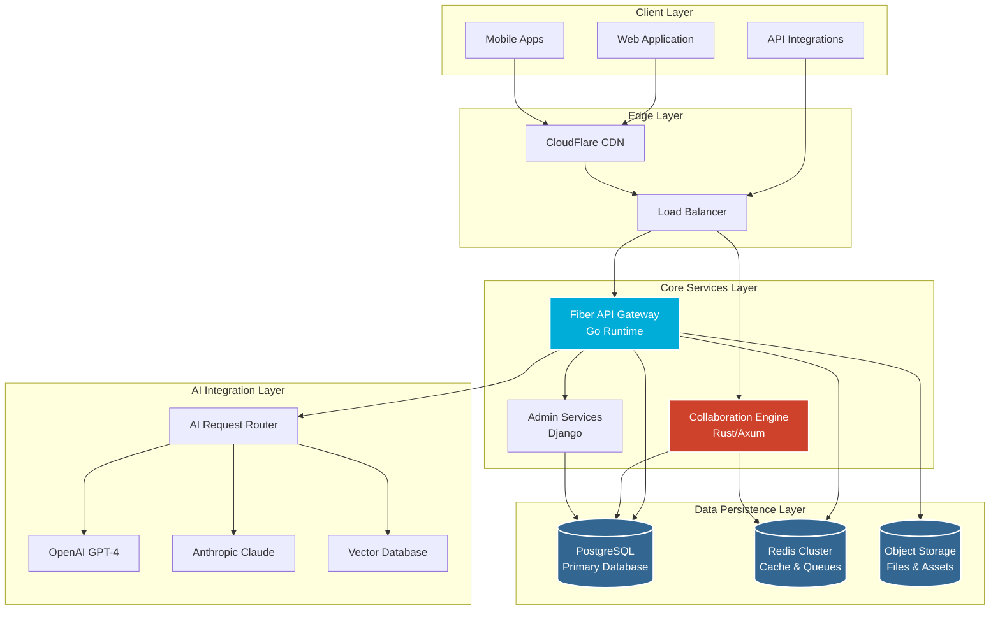
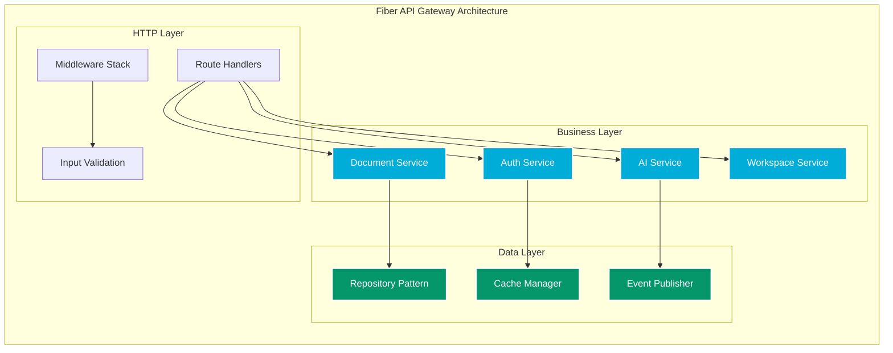
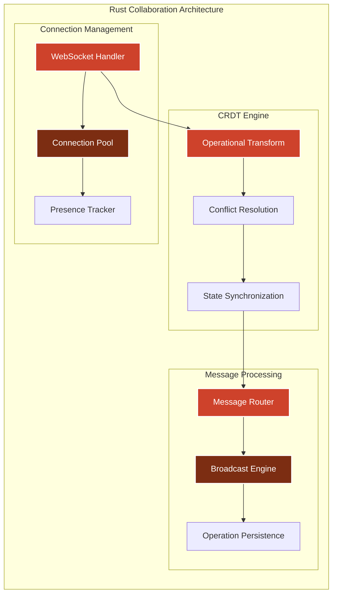
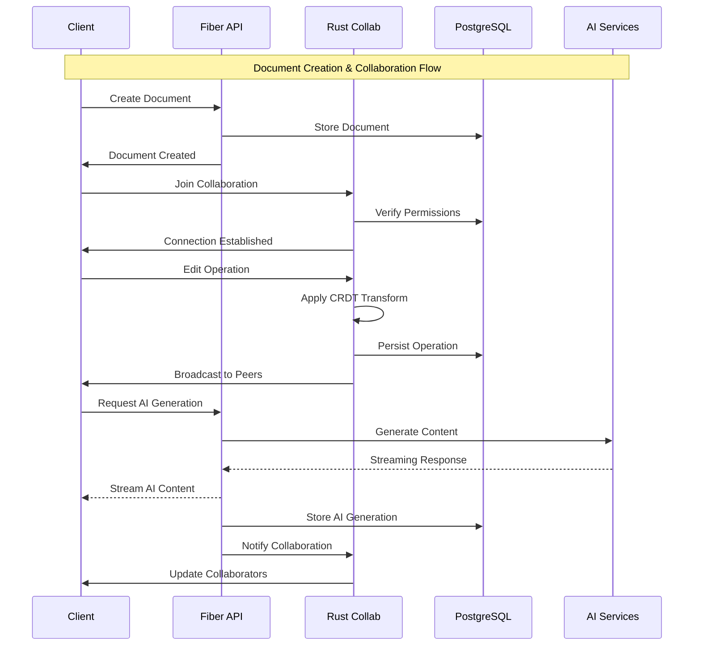
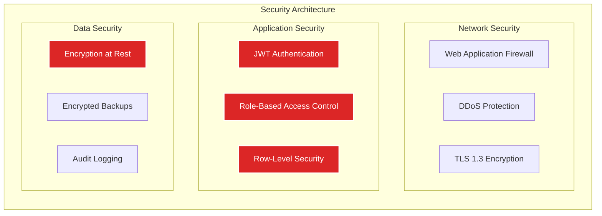

# Backend System Architecture

<Info>
**SDD Classification:** L3-Technical | **Authority:** CTO + VP Engineering | **Review Cycle:** Quarterly
</Info>

This document provides the comprehensive backend architecture for the Materi document collaboration platform. It covers the polyglot microservices design using Go Fiber for HTTP APIs and Rust Axum for real-time collaboration, along with data layer design and scalability strategies.

**Performance Target**: <50ms API response P95, <25ms collaboration latency
**Architecture Style**: Polyglot microservices with event-driven integration
**Primary Languages**: Go (API), Rust (Real-time), Python (Auth)

---

## Architecture Overview

### Technology Decision Rationale

Our technology choices prioritize enterprise-grade performance while optimizing operational costs:

| Requirement | Traditional Approach | Materi's Approach | Business Impact |
|-------------|---------------------|-------------------|-----------------|
| **API Performance** | Python/FastAPI (~200ms) | Go Fiber (~50ms) | 4x faster user experience |
| **Real-time Collaboration** | Separate WebSocket service | Integrated Rust engine | Seamless collaborative editing |
| **Concurrent Users** | 1,000 per instance | 5,000+ per instance | 5x better cost efficiency |
| **Memory Usage** | 500MB-2GB (Python) | 50-200MB (Go/Rust) | 80% lower infrastructure cost |

### High-Level Service Topology

### Service Responsibilities Matrix

| Service | Primary Responsibility | Performance Target | Scaling Strategy |
|---------|----------------------|-------------------|------------------|
| **Fiber API Gateway** | HTTP APIs, Business Logic, Authentication | <50ms P95 response time | Horizontal scaling, stateless |
| **Rust Collaboration Engine** | WebSocket connections, CRDT operations | <100ms message latency | Connection pooling, memory efficiency |
| **Django Admin Services** | User management, billing, analytics | <200ms response time | Vertical scaling, background jobs |

---

## Fiber API Gateway (Go)

### Architecture Design

The Fiber API Gateway serves as the primary interface for all document operations, designed for enterprise-grade performance and reliability.

### Key Performance Characteristics

- **Concurrency Model:** Goroutines (lightweight threads) - 1M+ concurrent connections possible
- **Memory Efficiency:** ~2MB per 1000 connections vs ~200MB for equivalent Python service
- **Response Time:** 95th percentile under 50ms for document operations
- **Throughput:** 10,000+ requests/second per instance

### Enterprise Features

- **JWT Authentication** with refresh token rotation
- **Rate Limiting** per user/workspace with Redis backend
- **Audit Logging** for compliance (SOX, HIPAA, GDPR)
- **Circuit Breakers** for external service resilience

---

## Collaboration Engine (Rust/Axum)

### Architecture Design

The Rust Collaboration Engine provides real-time document collaboration that outperforms Google Docs in latency and concurrent user capacity.

### Technical Advantages

- **Zero-Copy Operations:** Rust's memory safety without garbage collection pauses
- **Lock-Free Algorithms:** Concurrent data structures for maximum throughput
- **Predictable Latency:** No garbage collection = consistent sub-100ms performance
- **Memory Safety:** Prevents entire classes of security vulnerabilities

### Collaborative Features

- **Real-time Editing:** Character-by-character synchronization
- **Conflict-Free Resolution:** Mathematical guarantees against edit conflicts
- **Presence Awareness:** Live cursors and user indicators
- **Connection Recovery:** Automatic reconnection with state synchronization

---

## Data Layer Selection

### Primary Database (PostgreSQL)

| Feature | MongoDB | MySQL | DynamoDB | **PostgreSQL** |
|---------|---------|-------|----------|----------------|
| ACID Support | Limited | Yes | No | **Full** |
| JSON Handling | Native | Basic | Good | **Advanced** |
| Query Power | Medium | Good | Limited | **Excellent** |
| Enterprise Use | Medium | High | Medium | **Very High** |

**Why PostgreSQL:**
- Full ACID compliance for document integrity
- Superior JSON/JSONB support for flexible schemas
- Advanced query capabilities with indexing options
- Enterprise-grade security and reliability

### Cache & Message Layer (Redis)

| Feature | Memcached | RabbitMQ | Kafka | **Redis** |
|---------|-----------|----------|-------|-----------|
| Latency | Good | Medium | Medium | **Best** |
| Data Types | Basic | Queue | Streams | **Rich** |
| Memory Util | Medium | High | High | **Low** |
| Scalability | Limited | Good | Good | **Best** |

**Why Redis:**
- Sub-millisecond response times for caching
- Built-in pub/sub for real-time messaging
- Rich data structures for complex operations
- Simple deployment and maintenance model

---

## Performance & Scalability

### Scaling Characteristics by User Load

| Load Tier | Fiber Instances | Rust Instances | Database Config |
|-----------|----------------|----------------|-----------------|
| **1-1K Users** | 2 instances | 1 instance | Single DB |
| **1K-10K Users** | 5 instances | 3 instances | Read Replicas |
| **10K-100K Users** | 15+ instances | 8+ instances | Sharded Database |
| **100K+ Users** | Auto-scaling | Auto-scaling | Multi-region |

### Performance Benchmarks vs Competition

| Metric | Google Docs | Microsoft 365 | **Materi** | Advantage |
|--------|-------------|---------------|------------|-----------|
| **API Response Time** | 150-300ms | 200-400ms | **<50ms** | **3-8x faster** |
| **Concurrent Editors** | 100 users | 100 users | **1000+ users** | **10x capacity** |
| **WebSocket Latency** | 200-500ms | 300-600ms | **<100ms** | **2-5x faster** |
| **Memory per User** | ~10MB | ~15MB | **<2MB** | **5-7x efficient** |

### Cost Efficiency Analysis

| Cost Category | Traditional Python Stack | Materi Fiber/Axum | Savings |
|---------------|-------------------------|-------------------|---------|
| **Compute Cost per 1K Users** | $2,400/month | $960/month | 60% |
| **Memory Requirements** | 16GB per instance | 4GB per instance | 75% |
| **Instance Count (10K users)** | 20 instances | 8 instances | 60% |

---

## Data Flow & Integration

### Document Lifecycle Flow

### Event-Driven Architecture

All services communicate via Redis Streams for cross-service synchronization:

| Stream Name | Purpose | Publishers | Consumers | Retention |
|-------------|---------|------------|-----------|-----------|
| `materi:events:users` | User lifecycle events | Shield | API, Relay | 7 days |
| `materi:events:documents` | Document CRUD operations | API | Relay, Shield | 7 days |
| `materi:events:collaboration` | Real-time operations | Relay | API | 24 hours |
| `materi:events:ai` | AI generation events | Aria | API | 24 hours |

---

## Security Architecture

### Security Layers

### Compliance Framework

- **SOC 2 Type II** - Automated security controls and monitoring
- **GDPR Compliance** - Data portability and right to deletion
- **HIPAA Ready** - Encryption and audit logging for healthcare customers
- **Enterprise SSO** - SAML 2.0 and OAuth 2.0 integration

---

## Monitoring & Observability

### Three Pillars of Observability

| Pillar | Technology | Purpose |
|--------|------------|---------|
| **Metrics** | Prometheus + Grafana | Time-series performance data |
| **Logging** | Structured Logs + ELK | Searchable application logs |
| **Tracing** | Jaeger + OpenTelemetry | Distributed request tracing |

### Key Business Metrics

- **User Experience** - API latency, collaboration lag, error rates
- **System Health** - Resource utilization, connection counts, throughput
- **Business KPIs** - Document creation rate, AI usage, user engagement

---

## Cross-References

### Upstream Documents
- [L2-System Tactical Specifications](/internal/architecture/specs/l2-tactical-specs) - System architecture decisions
- [Platform Architecture](/internal/architecture/system-design/overview) - Platform overview

### Peer Documents
- [Frontend Architecture](/developer/products/canvas/architecture) - Canvas React application
- [Relay Architecture](/developer/domain/relay/architecture) - Real-time collaboration details
- [AI Integration](/developer/platform/aria/model-integration) - AI provider integration

### Downstream Documents
- [Testing Framework](/developer/testing/overview) - Testing strategy
- [Git Workflow](/developer/contributing/git-workflow) - Development workflow

---

**Document Status:** Complete
**Version:** 2.0
**Last Updated:** January 2026
**Authority:** CTO + VP Engineering
**Classification:** L3-Technical - Backend Development Guide

**Distribution:** Engineering Teams, Architecture Council
