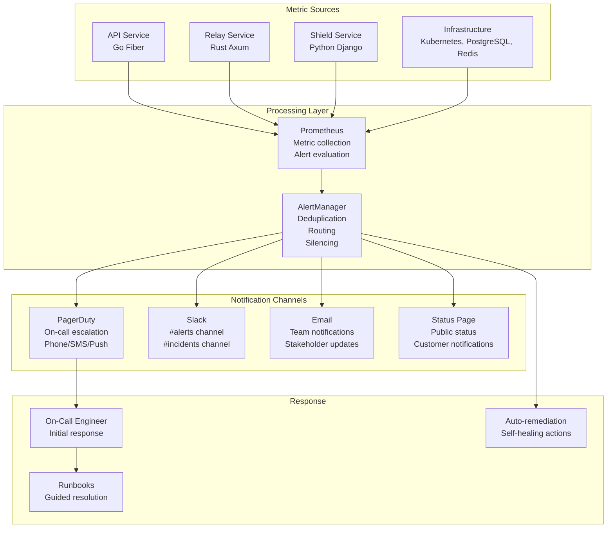

# Folio Alerting & Operations Heat Suite

<Info>
**SDD Classification:** L4-Operational | **Authority:** SRE Lead + Operations Lead | **Review Cycle:** Monthly
</Info>

This document defines the alerting configuration, thresholds, and operational heat metrics for the Materi platform. It covers AlertManager rules, PagerDuty integration, escalation policies, and the Operations Heat Suite for real-time system health monitoring.

**Alert Platform**: Prometheus AlertManager + PagerDuty
**Visualization**: Grafana dashboards
**Target MTTR**: <15 minutes for SEV-1, <30 minutes for SEV-2

---

## Alerting Architecture

### Alert Flow



---

## Alert Configuration

### AlertManager Configuration

```yaml
# alertmanager.yml
global:
  resolve_timeout: 5m
  slack_api_url: '${SLACK_WEBHOOK_URL}'
  pagerduty_url: 'https://events.pagerduty.com/v2/enqueue'

route:
  receiver: 'default-receiver'
  group_by: ['alertname', 'service', 'severity']
  group_wait: 30s
  group_interval: 5m
  repeat_interval: 4h

  routes:
    # Critical alerts - immediate escalation
    - match:
        severity: critical
      receiver: 'pagerduty-critical'
      group_wait: 0s
      repeat_interval: 5m

    # High severity - page on-call
    - match:
        severity: high
      receiver: 'pagerduty-high'
      group_wait: 30s
      repeat_interval: 15m

    # Medium severity - Slack notification
    - match:
        severity: medium
      receiver: 'slack-medium'
      group_wait: 1m
      repeat_interval: 1h

    # Low severity - email only
    - match:
        severity: low
      receiver: 'email-low'
      group_wait: 5m
      repeat_interval: 24h

receivers:
  - name: 'default-receiver'
    slack_configs:
      - channel: '#alerts'
        send_resolved: true

  - name: 'pagerduty-critical'
    pagerduty_configs:
      - service_key: '${PAGERDUTY_CRITICAL_KEY}'
        severity: critical
        description: '{{ .CommonAnnotations.summary }}'
        details:
          service: '{{ .CommonLabels.service }}'
          runbook: '{{ .CommonAnnotations.runbook_url }}'

  - name: 'pagerduty-high'
    pagerduty_configs:
      - service_key: '${PAGERDUTY_HIGH_KEY}'
        severity: error

  - name: 'slack-medium'
    slack_configs:
      - channel: '#alerts'
        title: '{{ .CommonAnnotations.summary }}'
        text: '{{ .CommonAnnotations.description }}'
        send_resolved: true

  - name: 'email-low'
    email_configs:
      - to: 'engineering@materi.dev'
        send_resolved: true

inhibit_rules:
  # Inhibit warnings if critical is firing
  - source_match:
      severity: 'critical'
    target_match:
      severity: 'warning'
    equal: ['alertname', 'service']
```

### Prometheus Alert Rules

```yaml
# alert-rules.yml
groups:
  - name: availability
    interval: 15s
    rules:
      - alert: ServiceDown
        expr: up == 0
        for: 1m
        labels:
          severity: critical
        annotations:
          summary: 'Service {{ $labels.instance }} is down'
          description: 'Service has been unreachable for more than 1 minute'
          runbook_url: 'https://docs.materi.dev/runbooks/service-down'

      - alert: HighErrorRate
        expr: |
          sum(rate(http_requests_total{status=~"5.."}[5m])) by (service)
          /
          sum(rate(http_requests_total[5m])) by (service)
          > 0.01
        for: 5m
        labels:
          severity: high
        annotations:
          summary: 'High error rate on {{ $labels.service }}'
          description: 'Error rate is {{ $value | humanizePercentage }}'
          runbook_url: 'https://docs.materi.dev/runbooks/high-error-rate'

      - alert: HighLatencyP95
        expr: |
          histogram_quantile(0.95,
            sum(rate(http_request_duration_seconds_bucket[5m])) by (le, service)
          ) > 0.05
        for: 5m
        labels:
          severity: high
        annotations:
          summary: 'High P95 latency on {{ $labels.service }}'
          description: 'P95 latency is {{ $value | humanizeDuration }}'

  - name: infrastructure
    rules:
      - alert: HighCPUUsage
        expr: |
          100 - (avg by(instance) (rate(node_cpu_seconds_total{mode="idle"}[5m])) * 100) > 85
        for: 10m
        labels:
          severity: high
        annotations:
          summary: 'High CPU usage on {{ $labels.instance }}'
          description: 'CPU usage is {{ $value | humanizePercentage }}'

      - alert: HighMemoryUsage
        expr: |
          (1 - node_memory_MemAvailable_bytes / node_memory_MemTotal_bytes) * 100 > 90
        for: 5m
        labels:
          severity: high
        annotations:
          summary: 'High memory usage on {{ $labels.instance }}'
          description: 'Memory usage is {{ $value | humanizePercentage }}'

      - alert: DiskSpaceLow
        expr: |
          (node_filesystem_avail_bytes{fstype!~"tmpfs|overlay"} / node_filesystem_size_bytes) * 100 < 10
        for: 5m
        labels:
          severity: high
        annotations:
          summary: 'Disk space low on {{ $labels.instance }}'
          description: 'Available disk space is {{ $value | humanizePercentage }}'

  - name: database
    rules:
      - alert: PostgreSQLDown
        expr: pg_up == 0
        for: 1m
        labels:
          severity: critical
        annotations:
          summary: 'PostgreSQL is down'
          runbook_url: 'https://docs.materi.dev/runbooks/postgresql-down'

      - alert: PostgreSQLHighConnections
        expr: |
          sum(pg_stat_activity_count) / pg_settings_max_connections * 100 > 80
        for: 5m
        labels:
          severity: high
        annotations:
          summary: 'PostgreSQL connection pool nearly exhausted'
          description: 'Connection usage is {{ $value | humanizePercentage }}'

      - alert: PostgreSQLReplicationLag
        expr: pg_replication_lag > 30
        for: 5m
        labels:
          severity: high
        annotations:
          summary: 'PostgreSQL replication lag is high'
          description: 'Lag is {{ $value }} seconds'

  - name: redis
    rules:
      - alert: RedisDown
        expr: redis_up == 0
        for: 1m
        labels:
          severity: critical
        annotations:
          summary: 'Redis is down'
          runbook_url: 'https://docs.materi.dev/runbooks/redis-down'

      - alert: RedisHighMemory
        expr: redis_memory_used_bytes / redis_memory_max_bytes * 100 > 90
        for: 5m
        labels:
          severity: high
        annotations:
          summary: 'Redis memory usage is high'
          description: 'Memory usage is {{ $value | humanizePercentage }}'

  - name: collaboration
    rules:
      - alert: HighCollaborationLatency
        expr: |
          histogram_quantile(0.95,
            sum(rate(collaboration_operation_duration_seconds_bucket[5m])) by (le)
          ) > 0.025
        for: 5m
        labels:
          severity: high
        annotations:
          summary: 'Collaboration latency exceeds 25ms P95'
          description: 'Current P95 latency is {{ $value | humanizeDuration }}'

      - alert: WebSocketConnectionDrop
        expr: |
          rate(websocket_connections_total{state="closed"}[5m])
          /
          rate(websocket_connections_total{state="opened"}[5m])
          > 0.1
        for: 5m
        labels:
          severity: medium
        annotations:
          summary: 'High WebSocket connection drop rate'
          description: 'Drop rate is {{ $value | humanizePercentage }}'

  - name: error-budget
    rules:
      - alert: ErrorBudgetLow
        expr: error_budget_remaining < 0.25
        for: 0m
        labels:
          severity: high
        annotations:
          summary: 'Error budget below 25%'
          description: 'Only {{ $value | humanizePercentage }} of error budget remaining'

      - alert: ErrorBudgetExhausted
        expr: error_budget_remaining <= 0
        for: 0m
        labels:
          severity: critical
        annotations:
          summary: 'Error budget exhausted'
          description: 'All error budget consumed - freeze non-critical changes'
```

---

## Operations Heat Suite

### Heat Metrics Dashboard

The Operations Heat Suite provides real-time visibility into system health through a unified heat map visualization.

```yaml
# heat-suite-config.yml
heat_metrics:
  services:
    - name: api
      metrics:
        - name: availability
          query: up{service="api"}
          thresholds:
            green: 1
            yellow: 0.99
            red: 0
          weight: 30

        - name: latency_p95
          query: histogram_quantile(0.95, sum(rate(http_request_duration_seconds_bucket{service="api"}[5m])) by (le))
          thresholds:
            green: 0.05
            yellow: 0.04
            red: 0.03
          weight: 25

        - name: error_rate
          query: sum(rate(http_requests_total{service="api",status=~"5.."}[5m])) / sum(rate(http_requests_total{service="api"}[5m]))
          thresholds:
            green: 0.001
            yellow: 0.005
            red: 0.01
          weight: 25

        - name: throughput
          query: sum(rate(http_requests_total{service="api"}[5m]))
          thresholds:
            green: 100
            yellow: 50
            red: 10
          weight: 20

    - name: relay
      metrics:
        - name: availability
          query: up{service="relay"}
          thresholds:
            green: 1
            yellow: 0.99
            red: 0
          weight: 30

        - name: collaboration_latency
          query: histogram_quantile(0.95, sum(rate(collaboration_operation_duration_seconds_bucket[5m])) by (le))
          thresholds:
            green: 0.025
            yellow: 0.020
            red: 0.015
          weight: 30

        - name: active_connections
          query: websocket_connections_active
          thresholds:
            green: 1000
            yellow: 500
            red: 100
          weight: 20

        - name: operation_success_rate
          query: sum(rate(collaboration_operations_total{status="success"}[5m])) / sum(rate(collaboration_operations_total[5m]))
          thresholds:
            green: 0.999
            yellow: 0.995
            red: 0.99
          weight: 20

    - name: shield
      metrics:
        - name: availability
          query: up{service="shield"}
          thresholds:
            green: 1
            yellow: 0.99
            red: 0
          weight: 30

        - name: auth_success_rate
          query: sum(rate(auth_requests_total{status="success"}[5m])) / sum(rate(auth_requests_total[5m]))
          thresholds:
            green: 0.99
            yellow: 0.95
            red: 0.90
          weight: 30

        - name: latency_p95
          query: histogram_quantile(0.95, sum(rate(http_request_duration_seconds_bucket{service="shield"}[5m])) by (le))
          thresholds:
            green: 0.1
            yellow: 0.08
            red: 0.05
          weight: 20

        - name: token_validation_rate
          query: sum(rate(token_validations_total{status="valid"}[5m])) / sum(rate(token_validations_total[5m]))
          thresholds:
            green: 0.999
            yellow: 0.995
            red: 0.99
          weight: 20

  infrastructure:
    - name: postgresql
      metrics:
        - name: availability
          query: pg_up
          weight: 40
        - name: connections
          query: sum(pg_stat_activity_count) / pg_settings_max_connections
          thresholds:
            green: 0.5
            yellow: 0.7
            red: 0.85
          weight: 30
        - name: replication_lag
          query: pg_replication_lag
          thresholds:
            green: 5
            yellow: 15
            red: 30
          weight: 30

    - name: redis
      metrics:
        - name: availability
          query: redis_up
          weight: 40
        - name: memory_usage
          query: redis_memory_used_bytes / redis_memory_max_bytes
          thresholds:
            green: 0.5
            yellow: 0.7
            red: 0.85
          weight: 30
        - name: hit_rate
          query: redis_keyspace_hits_total / (redis_keyspace_hits_total + redis_keyspace_misses_total)
          thresholds:
            green: 0.95
            yellow: 0.85
            red: 0.70
          weight: 30
```

### Heat Score Calculation

```python
# heat_score_calculator.py
from dataclasses import dataclass
from typing import List, Dict
from enum import Enum

class HeatLevel(Enum):
    GREEN = "green"   # Healthy
    YELLOW = "yellow" # Warning
    RED = "red"       # Critical

@dataclass
class MetricReading:
    name: str
    value: float
    threshold_green: float
    threshold_yellow: float
    threshold_red: float
    weight: float

    def get_heat_level(self) -> HeatLevel:
        if self.value >= self.threshold_green:
            return HeatLevel.GREEN
        elif self.value >= self.threshold_yellow:
            return HeatLevel.YELLOW
        else:
            return HeatLevel.RED

    def get_score(self) -> float:
        """Returns 0-100 score based on thresholds"""
        if self.value >= self.threshold_green:
            return 100
        elif self.value >= self.threshold_yellow:
            # Linear interpolation between yellow and green
            range_size = self.threshold_green - self.threshold_yellow
            position = self.value - self.threshold_yellow
            return 50 + (position / range_size) * 50
        elif self.value >= self.threshold_red:
            # Linear interpolation between red and yellow
            range_size = self.threshold_yellow - self.threshold_red
            position = self.value - self.threshold_red
            return (position / range_size) * 50
        else:
            return 0

class HeatSuiteCalculator:
    def calculate_service_health(self, metrics: List[MetricReading]) -> Dict:
        """Calculate overall service health from metrics"""
        total_weight = sum(m.weight for m in metrics)
        weighted_score = sum(m.get_score() * m.weight for m in metrics)

        overall_score = weighted_score / total_weight

        # Determine overall heat level
        if overall_score >= 80:
            overall_level = HeatLevel.GREEN
        elif overall_score >= 50:
            overall_level = HeatLevel.YELLOW
        else:
            overall_level = HeatLevel.RED

        return {
            "score": overall_score,
            "level": overall_level.value,
            "metrics": [
                {
                    "name": m.name,
                    "value": m.value,
                    "score": m.get_score(),
                    "level": m.get_heat_level().value,
                }
                for m in metrics
            ],
        }

    def calculate_platform_health(self, services: Dict[str, List[MetricReading]]) -> Dict:
        """Calculate overall platform health"""
        service_health = {}
        total_score = 0

        for service_name, metrics in services.items():
            health = self.calculate_service_health(metrics)
            service_health[service_name] = health
            total_score += health["score"]

        platform_score = total_score / len(services)

        if platform_score >= 80:
            platform_level = HeatLevel.GREEN
        elif platform_score >= 50:
            platform_level = HeatLevel.YELLOW
        else:
            platform_level = HeatLevel.RED

        return {
            "platform_score": platform_score,
            "platform_level": platform_level.value,
            "services": service_health,
        }
```

---

## Alert Response Procedures

### Response Time SLAs

| Severity | Acknowledge | Investigate | Mitigate | Resolve |
|----------|-------------|-------------|----------|---------|
| **Critical** | <2 min | <10 min | <15 min | <1 hour |
| **High** | <5 min | <15 min | <30 min | <4 hours |
| **Medium** | <15 min | <1 hour | <2 hours | <24 hours |
| **Low** | <1 hour | <4 hours | <24 hours | <1 week |

### Alert Response Checklist

```markdown
## Alert Response Checklist

### 1. Acknowledge (0-2 min)
- [ ] Acknowledge alert in PagerDuty/Slack
- [ ] Notify team of investigation start
- [ ] Open incident channel if SEV-1/SEV-2

### 2. Assess (2-10 min)
- [ ] Check affected service dashboards
- [ ] Review recent deployments
- [ ] Check related alerts
- [ ] Determine severity and impact

### 3. Investigate (10-30 min)
- [ ] Check service logs
- [ ] Review metrics trends
- [ ] Identify root cause
- [ ] Check dependencies

### 4. Mitigate (ASAP)
- [ ] Apply immediate fix or workaround
- [ ] Rollback if deployment-related
- [ ] Scale resources if capacity-related
- [ ] Engage dependencies if external

### 5. Communicate
- [ ] Update status page
- [ ] Post in incident channel
- [ ] Notify stakeholders

### 6. Resolve
- [ ] Verify fix effectiveness
- [ ] Clear alert
- [ ] Schedule post-incident review
- [ ] Update documentation
```

---

## Silencing & Maintenance

### Maintenance Window Configuration

```yaml
# maintenance-silence.yml
apiVersion: monitoring.coreos.com/v1alpha1
kind: AlertManagerConfig
metadata:
  name: maintenance-window
spec:
  silence:
    matchers:
      - name: alertname
        value: ".*"
        isRegex: true
      - name: service
        value: "api"
    startsAt: "2026-01-15T00:00:00Z"
    endsAt: "2026-01-15T04:00:00Z"
    createdBy: "devops"
    comment: "Scheduled maintenance window for API service upgrade"
```

### Silencing Alerts via CLI

```bash
# Silence specific alert for 2 hours
amtool silence add alertname="HighCPUUsage" \
  --duration=2h \
  --author="oncall@materi.dev" \
  --comment="Investigating root cause"

# List active silences
amtool silence query

# Expire a silence
amtool silence expire <silence-id>
```

---

## Related Documentation

- [Folio Overview](/developer/operations/folio/overview) - Observability platform
- [Incident Response](/developer/operations/runbooks/incident-response) - Response procedures
- [SLO/SLI/SLA](/internal/engineering/performance/slo-sli-sla) - Service level objectives
- [Disaster Recovery](/developer/operations/runbooks/disaster-recovery) - DR procedures

---

**Document Status:** Complete
**Version:** 2.0
**Last Updated:** January 2026
**Authority:** SRE Lead + Operations Lead
**Classification:** L4-Operational - Alerting Configuration

**Distribution:** SRE Team, Operations Team
