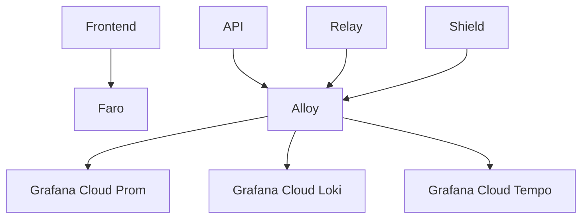

<Info>
**SDD Classification:** L4-Operational | **Authority:** Platform Engineering | **Review Cycle:** Monthly
</Info>

## Overview

This runbook describes Materi’s Grafana-based observability stack, including metrics collection, dashboards, alerting, distributed tracing, and frontend monitoring.

## Architecture



## Operations

### Alloy management (example)

```bash
brew install alloy
brew services start alloy
```

### Validate telemetry

-   Metrics: service `/metrics` endpoints scrape successfully
-   Logs: ingestion pipeline shows recent entries
-   Traces: end-to-end trace continuity for key workflows

## Troubleshooting

-   If dashboards are empty: confirm Alloy is running and remote-write credentials are valid.
-   If alerts don’t fire: confirm rules are loaded and routes are correct.
