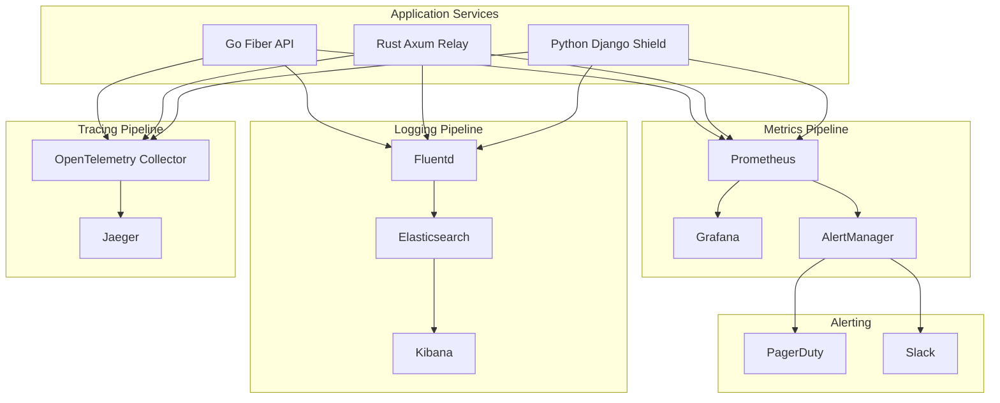

# Folio Observability Platform

<Info>
**SDD Classification:** L3-Technical | **Authority:** SRE Lead + CTO | **Review Cycle:** Monthly
</Info>

Folio is Materi's comprehensive observability platform providing unified monitoring, logging, tracing, and alerting across all services. This document covers the architecture, implementation patterns, and operational procedures for maintaining system observability.

**Metrics**: Prometheus + Grafana
**Logging**: ELK Stack (Elasticsearch, Logstash, Kibana)
**Tracing**: Jaeger + OpenTelemetry
**Alerting**: AlertManager + PagerDuty
**Availability Target**: 99.9% uptime (43 minutes/month maximum)

---

## Architecture Overview

### Observability Stack



---

## Metrics Collection

### Service Metrics Endpoints

| Service | Metrics Endpoint | Port | Scrape Interval |
|---------|------------------|------|-----------------|
| **API** | `/metrics` | 9090 | 15s |
| **Shield** | `/metrics` | 9091 | 15s |
| **Relay** | `/metrics` | 9092 | 15s |
| **PostgreSQL** | postgres_exporter | 9187 | 30s |
| **Redis** | redis_exporter | 9121 | 15s |

### Core Metrics

#### API Service (Go Fiber)

```go
var (
    httpRequestsTotal = prometheus.NewCounterVec(
        prometheus.CounterOpts{
            Name: "http_requests_total",
            Help: "Total HTTP requests",
        },
        []string{"method", "path", "status"},
    )
    httpRequestDuration = prometheus.NewHistogramVec(
        prometheus.HistogramOpts{
            Name:    "http_request_duration_seconds",
            Help:    "HTTP request latency",
            Buckets: []float64{.001, .005, .01, .025, .05, .1, .25, .5, 1},
        },
        []string{"method", "path"},
    )
)
```

#### Relay Service (Rust Axum)

```rust
pub struct CollaborationMetrics {
    pub operations_total: Counter,
    pub operation_latency: Histogram,
    pub active_connections: Gauge,
    pub websocket_messages_total: Counter,
}
```

### Key Performance Indicators

| Metric | Target | Warning | Critical |
|--------|--------|---------|----------|
| **API Latency (P95)** | <50ms | >40ms | >50ms |
| **Collaboration Latency (P95)** | <25ms | >30ms | >50ms |
| **Error Rate** | <0.1% | >0.05% | >0.1% |
| **Availability** | 99.9% | <99.95% | <99.9% |

---

## Logging Architecture

### Structured Logging Format

All services use structured JSON logging:

```json
{
  "timestamp": "2026-01-07T12:00:00.000Z",
  "level": "info",
  "service": "api",
  "request_id": "abc-123-def",
  "user_id": "user-456",
  "message": "Document created",
  "document_id": "doc-789",
  "duration_ms": 15,
  "trace_id": "trace-abc"
}
```

### Log Levels

| Level | Usage | Retention |
|-------|-------|-----------|
| **ERROR** | System errors, failures | 90 days |
| **WARN** | Degraded conditions | 30 days |
| **INFO** | Business events | 14 days |
| **DEBUG** | Development/troubleshooting | 7 days |

### Service-Specific Logging

**Go (Zap Logger):**
```go
logger.Info("document created",
    zap.String("request_id", requestID),
    zap.String("document_id", docID),
)
```

**Rust (tracing):**
```rust
info!(operation_id = %op.id, "Processing operation");
```

**Python (structlog):**
```python
logger.info("user authenticated", user_id=user.id)
```

---

## Distributed Tracing

### Trace Context Propagation

All services propagate trace context via headers:
- `X-Request-ID`: Unique request identifier
- `traceparent`: W3C Trace Context
- `tracestate`: Vendor-specific trace state

### Critical Trace Points

| Trace Point | Service | Purpose |
|-------------|---------|---------|
| **API Request** | API | Full request lifecycle |
| **Document Operation** | Relay | Collaboration operations |
| **Authentication** | Shield | Auth flow timing |
| **Database Query** | All | Query performance |
| **External API** | API | AI provider calls |

---

## Alerting Configuration

### Alert Severity Levels

| Severity | Response Time | Notification | Examples |
|----------|---------------|--------------|----------|
| **SEV-1 (Critical)** | <15 min | PagerDuty + Slack | Platform down |
| **SEV-2 (Major)** | <30 min | PagerDuty + Slack | Core feature broken |
| **SEV-3 (Moderate)** | <2 hours | Slack only | Single service issue |
| **SEV-4 (Minor)** | <24 hours | Ticket | Performance degradation |

### AlertManager Rules

```yaml
groups:
  - name: availability
    rules:
      - alert: ServiceDown
        expr: up == 0
        for: 1m
        labels:
          severity: critical
        annotations:
          summary: "Service {{ $labels.instance }} is down"

      - alert: HighErrorRate
        expr: rate(http_requests_total{status=~"5.."}[5m]) / rate(http_requests_total[5m]) > 0.01
        for: 5m
        labels:
          severity: warning
```

---

## Dashboards

### Core Dashboards

| Dashboard | Purpose | Key Metrics |
|-----------|---------|-------------|
| **Platform Overview** | High-level health | Availability, error rate |
| **API Performance** | API service health | Request rate, latency |
| **Collaboration** | Relay service health | WebSocket connections |
| **Infrastructure** | Resource utilization | CPU, memory, disk |

---

## Error Budget Management

### Error Budget Calculation

```
Monthly Error Budget = (1 - SLO) × Total Minutes
99.9% SLO = 0.1% × 43,200 minutes = 43.2 minutes/month
```

### Budget Policies

| Budget Remaining | Action |
|-----------------|--------|
| >75% | Normal operations |
| 50-75% | Increased monitoring |
| 25-50% | Freeze non-critical changes |
| <25% | Emergency mode |

---

## Health Check Endpoints

All services expose:

| Endpoint | Purpose | Expected Response |
|----------|---------|-------------------|
| `GET /health` | Basic health | `200 OK` |
| `GET /ready` | Readiness check | `200 OK` or `503` |
| `GET /metrics` | Prometheus metrics | Metrics payload |

---

## Cross-References

- [SLO/SLI/SLA](/internal/engineering/performance/slo-sli-sla) - Service level objectives
- [Disaster Recovery](/developer/operations/runbooks/disaster-recovery) - Recovery procedures
- [Backend Architecture](/developer/introduction/architecture) - Service architecture

---

**Document Status:** Complete
**Version:** 2.0
**Last Updated:** January 2026
**Authority:** SRE Lead + CTO
**Classification:** L3-Technical - Observability Platform

**Distribution:** SRE Team, Engineering Leadership
