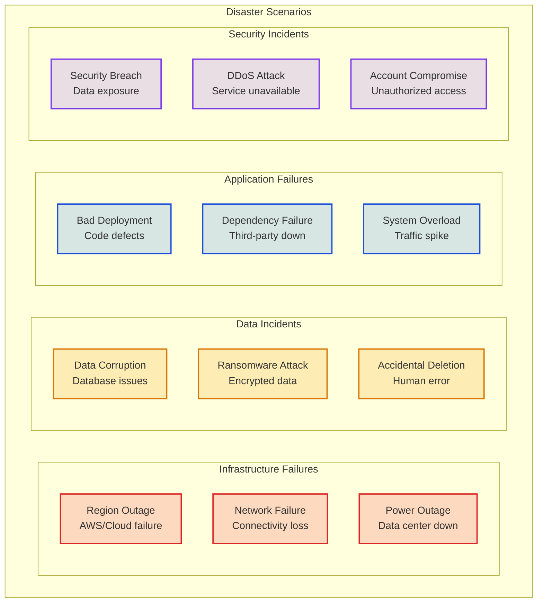
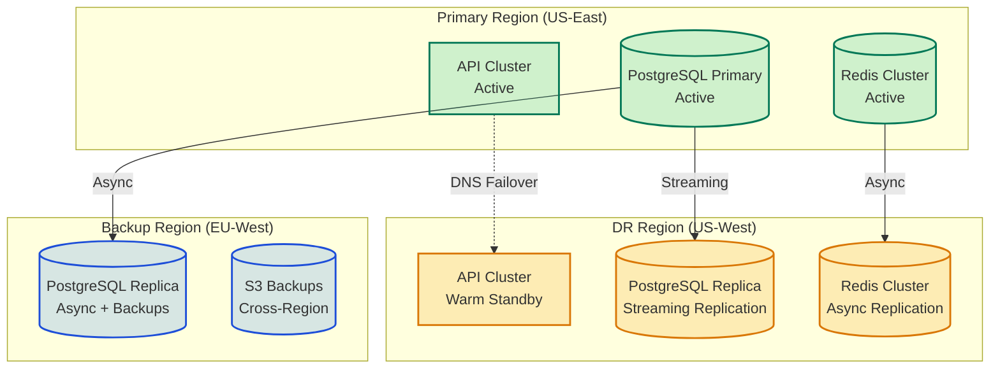
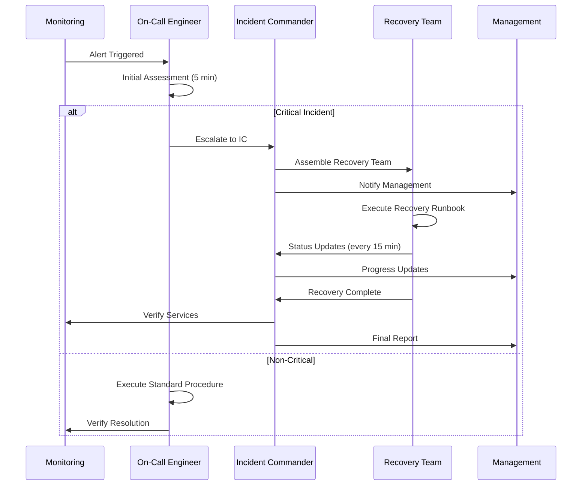

# Disaster Recovery & Business Continuity Plan

<Info>
**SDD Classification:** L2-System | **Authority:** CTO + Operations Lead + CISO | **Review Cycle:** Quarterly
</Info>

This Disaster Recovery Plan (DRP) defines procedures and strategies for recovering the Materi platform from catastrophic events, ensuring business continuity and minimizing data loss. It establishes recovery time objectives, procedures, and testing requirements.

**RTO (Recovery Time Objective)**: 4 hours for full platform recovery
**RPO (Recovery Point Objective)**: 15 minutes maximum data loss
**Availability Target**: 99.9% uptime (43 minutes/month maximum)
**DR Test Frequency**: Quarterly full tests, monthly partial tests

---

## Recovery Objectives

### Tiered Recovery Targets

| Service Tier | RTO | RPO | Priority | Examples |
|-------------|-----|-----|----------|----------|
| **Critical (Tier 1)** | 1 hour | 5 minutes | Highest | Authentication, core API |
| **Essential (Tier 2)** | 4 hours | 15 minutes | High | Document storage, collaboration |
| **Important (Tier 3)** | 8 hours | 1 hour | Medium | AI services, analytics |
| **Non-Critical (Tier 4)** | 24 hours | 4 hours | Low | Admin dashboards, reports |

### Business Impact Analysis

| Impact Category | Maximum Tolerable Downtime | Financial Impact/Hour |
|-----------------|---------------------------|----------------------|
| **Revenue** | 1 hour | $10,000+ |
| **Reputation** | 4 hours | Significant |
| **Compliance** | 24 hours | SLA penalties |
| **Operations** | 8 hours | Productivity loss |

---

## Disaster Scenarios

### Scenario Classification



---

## Recovery Architecture

### Multi-Region Deployment



### Data Replication Strategy

| Data Type | Primary Method | DR Method | RPO | Retention |
|-----------|---------------|-----------|-----|-----------|
| **User Data** | Streaming replication | Cross-region replica | 5 min | 7 years |
| **Documents** | Synchronous replication | Multi-region S3 | 1 min | Customer-defined |
| **Sessions** | Redis replication | Async cluster sync | 15 min | 24 hours |
| **Audit Logs** | Write-ahead logging | Immutable backup | 0 min | 7 years |
| **Configurations** | Git-based versioning | Multi-region sync | 0 min | Indefinite |

---

## Recovery Procedures

### Incident Response Workflow



### Database Recovery Procedure

**Step 1: Assess Damage**
```bash
# Check database status
psql -c "SELECT pg_is_in_recovery();"

# Check replication lag
psql -c "SELECT client_addr, state, sent_lsn, write_lsn, flush_lsn, replay_lsn FROM pg_stat_replication;"
```

**Step 2: Failover to Replica (if needed)**
```bash
# Promote replica to primary
pg_ctl promote -D /var/lib/postgresql/data

# Update DNS to point to new primary
aws route53 change-resource-record-sets --hosted-zone-id <zone> --change-batch file://failover.json
```

**Step 3: Point-in-Time Recovery (if data loss)**
```bash
# Restore from backup with PITR
pg_restore --dbname=materi_recovery --jobs=4 /backups/latest.dump

# Apply WAL logs up to recovery point
recovery_target_time = '2026-01-07 12:00:00 UTC'
```

**Step 4: Verify Data Integrity**
```bash
# Run integrity checks
psql -c "SELECT COUNT(*) FROM documents WHERE updated_at > NOW() - INTERVAL '1 hour';"

# Verify foreign key constraints
psql -c "SELECT conrelid::regclass, confrelid::regclass FROM pg_constraint WHERE contype = 'f';"
```

### Application Recovery Procedure

**Step 1: Deploy to DR Region**
```bash
# Trigger DR deployment
kubectl config use-context dr-cluster
kubectl apply -f k8s/dr-deployment.yaml

# Verify pods are running
kubectl get pods -n materi-production
```

**Step 2: Update Load Balancer**
```bash
# Switch traffic to DR region
aws elbv2 modify-listener --listener-arn <arn> --default-actions Type=forward,TargetGroupArn=<dr-target-group>
```

**Step 3: Verify Services**
```bash
# Health check endpoints
curl https://api.materi.dev/health
curl https://api.materi.dev/ready

# Run smoke tests
./scripts/smoke-test.sh --environment=dr
```

---

## Backup Strategy

### Backup Schedule

| Backup Type | Frequency | Retention | Storage Location |
|-------------|-----------|-----------|------------------|
| **Full Database** | Daily | 30 days | S3 (multi-region) |
| **Incremental** | Hourly | 7 days | S3 (same region) |
| **WAL Archives** | Continuous | 7 days | S3 (streaming) |
| **Document Storage** | Real-time | Customer-defined | S3 (versioned) |
| **Configuration** | On change | Indefinite | Git repository |

### Backup Verification

| Check | Frequency | Method | Owner |
|-------|-----------|--------|-------|
| **Backup Completion** | Daily | Automated monitoring | DevOps |
| **Restore Test** | Weekly | Automated to staging | DevOps |
| **Full DR Test** | Quarterly | Manual with runbook | Operations |
| **Integrity Validation** | Monthly | Checksum verification | DevOps |

---

## Communication Plan

### Notification Matrix

| Incident Severity | Internal Notification | Customer Notification | Time Frame |
|-------------------|----------------------|----------------------|------------|
| **SEV-1 (Critical)** | All hands + executive | Status page + email | Immediate |
| **SEV-2 (Major)** | On-call + leads | Status page | <15 minutes |
| **SEV-3 (Moderate)** | On-call team | Status page (if extended) | <1 hour |
| **SEV-4 (Minor)** | Ticket only | None | N/A |

### Communication Templates

**Initial Notification:**
> We are currently investigating an issue affecting [service]. Our team has been engaged and we will provide updates every [X] minutes. Current impact: [description].

**Progress Update:**
> Update on [incident]: Our team has identified [root cause/action]. We are implementing [solution]. Expected resolution: [time]. Current impact: [description].

**Resolution:**
> The incident affecting [service] has been resolved. Root cause: [summary]. Duration: [time]. We will conduct a post-incident review and share findings.

---

## DR Testing

### Test Types

| Test Type | Scope | Frequency | Duration | Risk |
|-----------|-------|-----------|----------|------|
| **Tabletop Exercise** | Process review | Monthly | 2 hours | None |
| **Component Test** | Single service | Monthly | 1 hour | Low |
| **Partial Failover** | Non-production | Monthly | 4 hours | Low |
| **Full DR Test** | Complete failover | Quarterly | 8 hours | Medium |

### Test Checklist

- [ ] Pre-test notification sent to stakeholders
- [ ] Backup verification completed
- [ ] Runbooks reviewed and updated
- [ ] Communication channels tested
- [ ] Monitoring dashboards ready
- [ ] Rollback procedure documented
- [ ] Post-test review scheduled

### Success Criteria

| Metric | Target | Acceptable |
|--------|--------|------------|
| **RTO Achievement** | <4 hours | <6 hours |
| **RPO Achievement** | <15 minutes | <30 minutes |
| **Data Integrity** | 100% | 99.99% |
| **Service Restoration** | All critical | All Tier 1-2 |

---

## Post-Incident Procedures

### Post-Incident Review (PIR)

**Timeline:** Within 72 hours of resolution

**Agenda:**
1. Incident timeline reconstruction
2. Root cause analysis (5 Whys)
3. Impact assessment
4. Response effectiveness review
5. Action items and owners
6. Process improvements

### PIR Template

```markdown
# Post-Incident Review: [Incident Title]

## Summary
- **Date/Time:** [Start - End]
- **Duration:** [Total time]
- **Severity:** [SEV-1/2/3/4]
- **Impact:** [Description]

## Timeline
- [Time] - Initial alert
- [Time] - Team engaged
- [Time] - Root cause identified
- [Time] - Fix deployed
- [Time] - Service restored

## Root Cause
[Detailed analysis]

## Action Items
| Action | Owner | Due Date |
|--------|-------|----------|
| [Action 1] | [Name] | [Date] |

## Lessons Learned
- [Lesson 1]
- [Lesson 2]
```

---

## Roles and Responsibilities

### DR Team Structure

| Role | Responsibility | Primary | Backup |
|------|---------------|---------|--------|
| **Incident Commander** | Overall coordination | CTO | VP Engineering |
| **Technical Lead** | Technical decisions | Principal Engineer | Senior Engineer |
| **Communications** | Stakeholder updates | Product Manager | Support Lead |
| **Database Admin** | Database recovery | DBA Lead | Senior DBA |
| **Infrastructure** | Cloud/K8s recovery | DevOps Lead | SRE |

### Contact Information

| Role | Primary Contact | Escalation |
|------|-----------------|------------|
| **On-Call** | PagerDuty rotation | Slack #incidents |
| **Management** | CTO direct line | CEO |
| **Cloud Provider** | AWS Support | Premium support |
| **Security** | CISO | Security team |

---

## Cross-References

- [System Architecture](/internal/architecture/system-design/overview) - Infrastructure design
- [Security Architecture](/internal/security/practices/overview) - Security incident handling
- [SLO/SLI/SLA](/internal/engineering/performance/slo-sli-sla) - Recovery objectives
- [Incident Response](/developer/operations/runbooks/incident-response) - Detailed procedures

---

**Document Status:** Complete
**Version:** 2.0
**Last Updated:** January 2026
**Authority:** CTO + Operations Lead + CISO
**Classification:** L2-System - Operational Procedures

**Distribution:** Operations Team, Engineering Leadership, Executive Team
**Review Schedule:** Quarterly testing, annual full review
