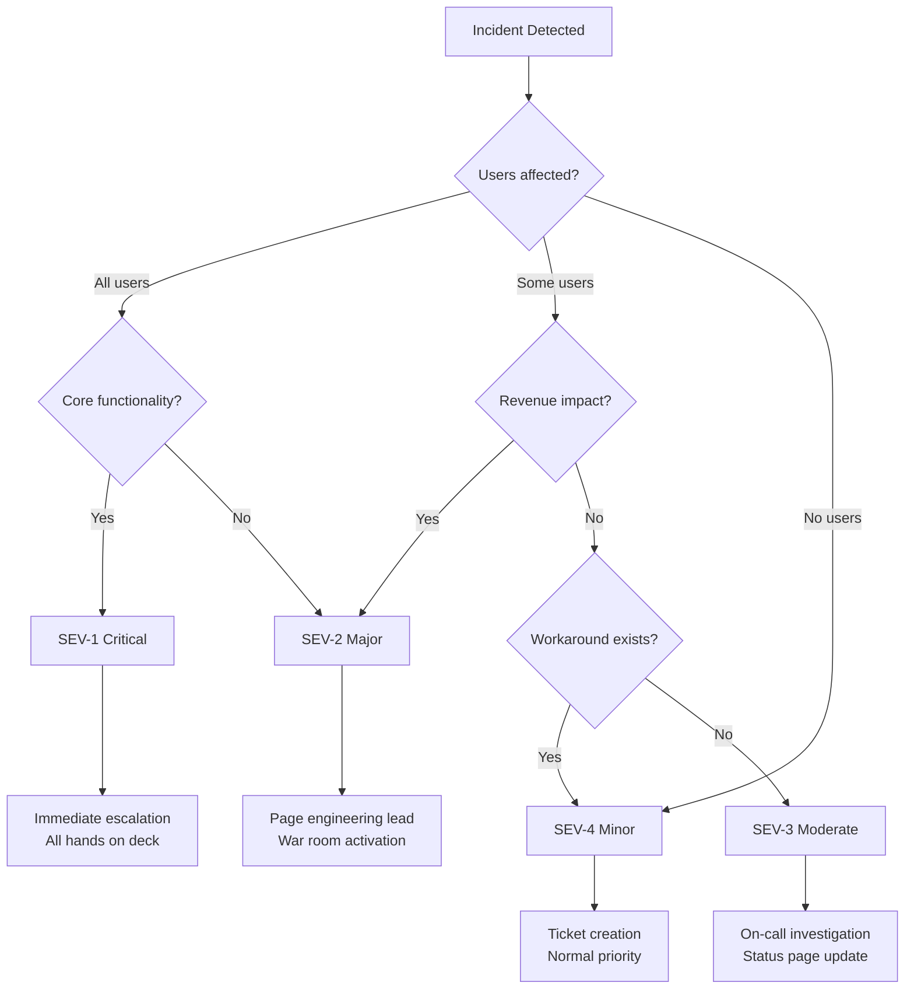
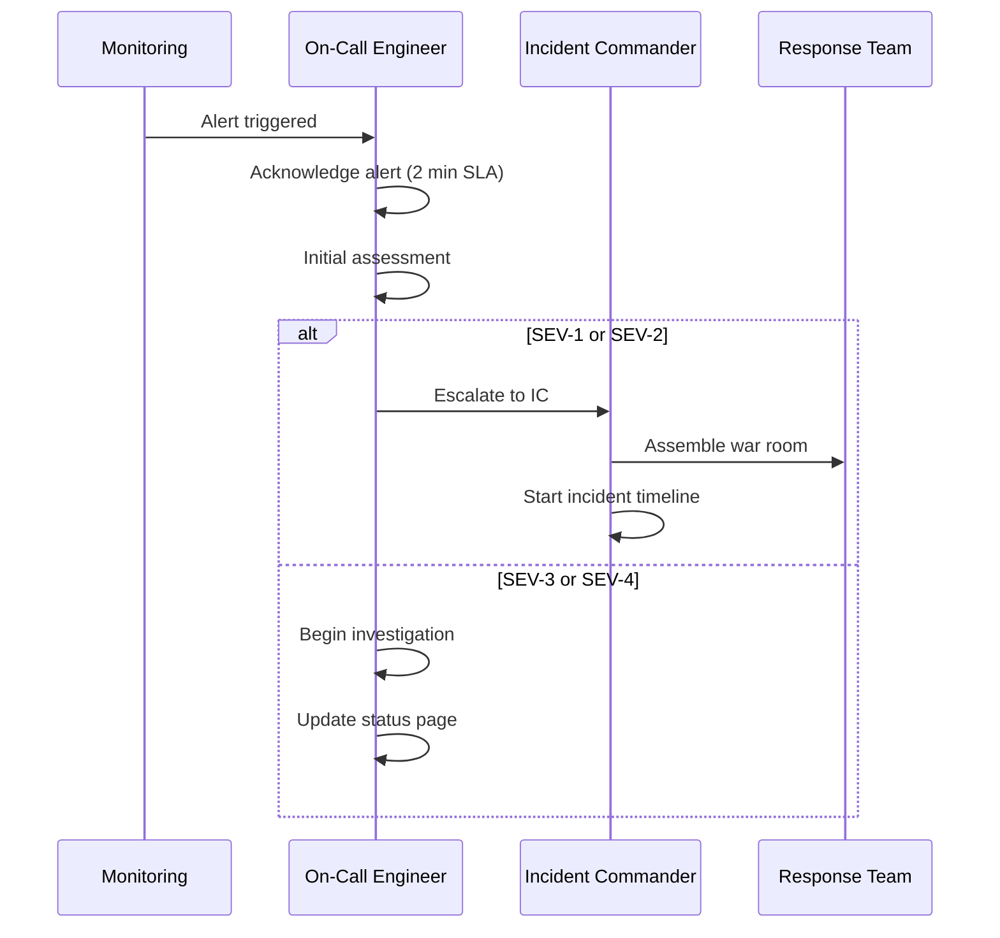

# Incident Response & DevOps Debugging Runbook

<Info>
**SDD Classification:** L4-Operational | **Authority:** SRE Lead + CTO | **Review Cycle:** Monthly
</Info>

This runbook provides procedures for incident detection, response, resolution, and post-incident analysis for the Materi platform. It covers infrastructure debugging, service-level troubleshooting, and escalation procedures.

**Response Targets**: SEV-1 <15 min, SEV-2 <30 min, SEV-3 <2 hours
**On-Call Rotation**: PagerDuty managed, 24/7 coverage
**Communication**: Slack #incidents, Status Page, Email notifications

---

## Incident Classification

### Severity Levels

| Severity | Impact | Response Time | Escalation | Examples |
|----------|--------|---------------|------------|----------|
| **SEV-1 Critical** | Full platform outage | <15 minutes | Immediate all-hands | Database down, Auth failure |
| **SEV-2 Major** | Core feature broken | <30 minutes | Engineering lead | Collaboration unavailable |
| **SEV-3 Moderate** | Single service issue | <2 hours | On-call engineer | Search degraded |
| **SEV-4 Minor** | Performance degradation | <24 hours | Next business day | Slow queries |

### Classification Decision Tree



---

## Incident Response Workflow

### Phase 1: Detection & Triage (0-5 minutes)



#### Initial Assessment Checklist

```bash
# Quick health check commands
# 1. Check service status
kubectl get pods -n materi-production
kubectl top pods -n materi-production

# 2. Check recent deployments
kubectl rollout history deployment/api -n materi-production
kubectl rollout history deployment/relay -n materi-production

# 3. Check error rates
curl -s http://prometheus:9090/api/v1/query?query=rate(http_requests_total{status=~"5.."}[5m])

# 4. Check database connectivity
PGPASSWORD=$DB_PASSWORD psql -h $DB_HOST -U $DB_USER -d materi -c "SELECT 1"

# 5. Check Redis connectivity
redis-cli -h $REDIS_HOST ping
```

### Phase 2: Investigation (5-30 minutes)

#### Service-Specific Debugging

**API Service (Go Fiber)**:
```bash
# Check API logs
kubectl logs -f deployment/api -n materi-production --tail=100

# Check for panic/errors
kubectl logs deployment/api -n materi-production | grep -E "panic|error|fatal"

# Check resource usage
kubectl top pod -l app=api -n materi-production

# Port-forward for local debugging
kubectl port-forward svc/api 8080:8080 -n materi-production

# Check health endpoint
curl http://localhost:8080/health
curl http://localhost:8080/ready
```

**Relay Service (Rust Axum)**:
```bash
# Check Relay logs
kubectl logs -f deployment/relay -n materi-production --tail=100

# Check WebSocket connections
curl http://localhost:8081/metrics | grep websocket_connections

# Check operation latency
curl http://localhost:8081/metrics | grep operation_latency

# Debug CRDT state
kubectl exec -it deployment/relay -n materi-production -- /bin/sh -c "curl localhost:9092/debug/state"
```

**Shield Service (Python Django)**:
```bash
# Check Shield logs
kubectl logs -f deployment/shield -n materi-production --tail=100

# Check authentication metrics
curl http://localhost:9091/metrics | grep auth_

# Run Django management commands
kubectl exec -it deployment/shield -n materi-production -- python manage.py check
kubectl exec -it deployment/shield -n materi-production -- python manage.py dbshell
```

#### Database Debugging

```bash
# Check PostgreSQL status
psql -c "SELECT pg_is_in_recovery();"
psql -c "SELECT * FROM pg_stat_activity WHERE state = 'active';"
psql -c "SELECT * FROM pg_stat_replication;"

# Check for long-running queries
psql -c "SELECT pid, now() - pg_stat_activity.query_start AS duration, query
FROM pg_stat_activity
WHERE state = 'active' AND now() - pg_stat_activity.query_start > interval '5 minutes';"

# Check for locks
psql -c "SELECT blocked_locks.pid AS blocked_pid,
       blocking_locks.pid AS blocking_pid,
       blocked_activity.usename AS blocked_user,
       blocking_activity.usename AS blocking_user
FROM pg_catalog.pg_locks blocked_locks
JOIN pg_catalog.pg_stat_activity blocked_activity ON blocked_activity.pid = blocked_locks.pid
JOIN pg_catalog.pg_locks blocking_locks ON blocking_locks.locktype = blocked_locks.locktype
JOIN pg_catalog.pg_stat_activity blocking_activity ON blocking_activity.pid = blocking_locks.pid
WHERE NOT blocked_locks.granted;"

# Kill problematic query (use with caution)
psql -c "SELECT pg_terminate_backend(<pid>);"
```

#### Redis Debugging

```bash
# Check Redis info
redis-cli INFO

# Check memory usage
redis-cli INFO memory

# Check slow log
redis-cli SLOWLOG GET 10

# Monitor commands in real-time
redis-cli MONITOR

# Check pub/sub channels
redis-cli PUBSUB CHANNELS "materi:*"

# Clear cache (use with caution)
redis-cli FLUSHDB
```

### Phase 3: Mitigation (15-60 minutes)

#### Common Mitigation Actions

| Issue | Immediate Action | Command |
|-------|-----------------|---------|
| **High Error Rate** | Rollback deployment | `kubectl rollout undo deployment/api` |
| **Database Overload** | Enable read replicas | Update connection string to replica |
| **Memory Exhaustion** | Restart pods | `kubectl rollout restart deployment/api` |
| **Rate Limiting** | Increase limits | Update rate limiter config |
| **External Service Down** | Enable fallback | Toggle circuit breaker |

#### Rollback Procedures

```bash
# Check deployment history
kubectl rollout history deployment/api -n materi-production

# Rollback to previous version
kubectl rollout undo deployment/api -n materi-production

# Rollback to specific revision
kubectl rollout undo deployment/api --to-revision=3 -n materi-production

# Monitor rollback progress
kubectl rollout status deployment/api -n materi-production

# Verify rollback success
kubectl get pods -l app=api -n materi-production
curl http://api.materi.dev/health
```

#### Circuit Breaker Activation

```bash
# Enable circuit breaker for AI service
curl -X POST http://api.materi.dev/admin/circuit-breaker/ai/open \
  -H "Authorization: Bearer $ADMIN_TOKEN"

# Enable fallback mode
kubectl set env deployment/api AI_FALLBACK_ENABLED=true -n materi-production

# Disable feature flag
kubectl set env deployment/api FEATURE_AI_GENERATION=false -n materi-production
```

### Phase 4: Resolution & Verification

```bash
# Verify service health
for svc in api relay shield; do
  echo "Checking $svc..."
  curl -s "http://$svc.materi.dev/health" | jq .
done

# Run smoke tests
./scripts/smoke-test.sh --environment=production

# Verify metrics returning to normal
curl -s http://prometheus:9090/api/v1/query?query=rate(http_requests_total{status=~"2.."}[5m])

# Check error budget consumption
curl -s http://prometheus:9090/api/v1/query?query=error_budget_remaining
```

---

## Communication Templates

### Initial Notification (SEV-1/SEV-2)

```markdown
**[INCIDENT] Platform Issue Detected**

**Status**: Investigating
**Severity**: SEV-1 / SEV-2
**Impact**: [Brief description of user impact]
**Start Time**: [UTC timestamp]

**Current Status**:
- Incident Commander: [Name]
- Team engaged: [Names]
- Investigation in progress

**Next Update**: In 15 minutes

**Incident Channel**: #incident-YYYY-MM-DD
```

### Status Update

```markdown
**[UPDATE] Platform Issue - [HH:MM UTC]**

**Status**: [Investigating / Mitigating / Monitoring]
**Duration**: [X minutes/hours]

**What we know**:
- [Finding 1]
- [Finding 2]

**What we're doing**:
- [Action 1]
- [Action 2]

**Expected resolution**: [Estimate or "Investigating"]
**Next update**: In [X] minutes
```

### Resolution Notification

```markdown
**[RESOLVED] Platform Issue**

**Status**: Resolved
**Duration**: [Total time]
**Impact**: [Summary of impact]

**Root Cause**: [Brief summary]
**Resolution**: [What was done to fix]

**Post-Incident Review**: Scheduled for [Date/Time]

Thank you for your patience.
```

---

## Escalation Procedures

### Escalation Matrix

| Level | Trigger | Contact | Method |
|-------|---------|---------|--------|
| **L1** | Initial alert | On-call engineer | PagerDuty |
| **L2** | >30 min unresolved | Engineering Lead | Slack + Phone |
| **L3** | >1 hour SEV-1 | VP Engineering | Phone |
| **L4** | Customer impact | CTO | Phone + SMS |
| **L5** | Data breach | CISO + Legal | Emergency protocol |

### On-Call Responsibilities

**Primary On-Call**:
- Acknowledge alerts within 2 minutes
- Perform initial triage
- Start incident timeline
- Escalate if needed

**Secondary On-Call**:
- Available for escalation
- Provides domain expertise
- Assists with communication

**Incident Commander**:
- Coordinates response
- Manages communication
- Makes escalation decisions
- Ensures post-incident review

---

## Post-Incident Process

### Post-Incident Review (PIR) Template

```markdown
# Post-Incident Review: [Incident Title]

## Incident Summary
- **Date/Time**: [Start - End UTC]
- **Duration**: [Total time]
- **Severity**: [SEV-1/2/3/4]
- **Impact**: [User/revenue impact]

## Timeline
| Time (UTC) | Event |
|------------|-------|
| HH:MM | Initial alert triggered |
| HH:MM | On-call acknowledged |
| HH:MM | Root cause identified |
| HH:MM | Mitigation applied |
| HH:MM | Service restored |
| HH:MM | Incident declared resolved |

## Root Cause Analysis
### What happened?
[Detailed technical explanation]

### Why did it happen?
[Contributing factors]

### 5 Whys Analysis
1. Why? [Answer]
2. Why? [Answer]
3. Why? [Answer]
4. Why? [Answer]
5. Why? [Answer]

## Impact Assessment
- **Users affected**: [Number]
- **Error budget consumed**: [Minutes]
- **Revenue impact**: [If applicable]
- **Reputational impact**: [Assessment]

## Action Items
| Action | Owner | Priority | Due Date | Status |
|--------|-------|----------|----------|--------|
| [Action 1] | [Name] | P1 | [Date] | Open |
| [Action 2] | [Name] | P2 | [Date] | Open |

## Lessons Learned
### What went well
- [Point 1]
- [Point 2]

### What could be improved
- [Point 1]
- [Point 2]

## Prevention Measures
[Steps to prevent recurrence]
```

---

## Common Incident Scenarios

### Scenario: Database Connection Exhaustion

**Symptoms**: 500 errors, slow response times, "too many connections" in logs

**Diagnosis**:
```bash
# Check connection count
psql -c "SELECT count(*) FROM pg_stat_activity;"
psql -c "SELECT max_connections FROM pg_settings WHERE name = 'max_connections';"

# Check connection by application
psql -c "SELECT application_name, count(*) FROM pg_stat_activity GROUP BY application_name;"
```

**Resolution**:
```bash
# Kill idle connections
psql -c "SELECT pg_terminate_backend(pid) FROM pg_stat_activity WHERE state = 'idle' AND query_start < now() - interval '5 minutes';"

# Restart connection pool
kubectl rollout restart deployment/api -n materi-production

# Increase pool size (temporary)
kubectl set env deployment/api DB_MAX_CONNECTIONS=50 -n materi-production
```

### Scenario: Memory Leak in Relay Service

**Symptoms**: Increasing memory usage, eventual OOM kills

**Diagnosis**:
```bash
# Check memory trends
kubectl top pods -l app=relay -n materi-production

# Check for OOM events
kubectl describe pod -l app=relay -n materi-production | grep -A 5 "OOMKilled"

# Get memory profile
kubectl exec -it deployment/relay -n materi-production -- curl localhost:9092/debug/pprof/heap > heap.prof
```

**Resolution**:
```bash
# Restart affected pods
kubectl rollout restart deployment/relay -n materi-production

# Increase memory limits (temporary)
kubectl set resources deployment/relay --limits=memory=2Gi -n materi-production

# Enable memory profiling for investigation
kubectl set env deployment/relay RUST_BACKTRACE=1 -n materi-production
```

---

## Related Documentation

- [Disaster Recovery](/developer/operations/runbooks/disaster-recovery) - DR procedures
- [Folio Alerting](/developer/operations/folio/alerting) - Alert configuration
- [SLO/SLI/SLA](/internal/engineering/performance/slo-sli-sla) - Service level objectives
- [Reliability Architecture](/internal/engineering/performance/overview) - System resilience

---

**Document Status:** Complete
**Version:** 2.0
**Last Updated:** January 2026
**Authority:** SRE Lead + CTO
**Classification:** L4-Operational - Incident Response Runbook

**Distribution:** SRE Team, Engineering On-Call
