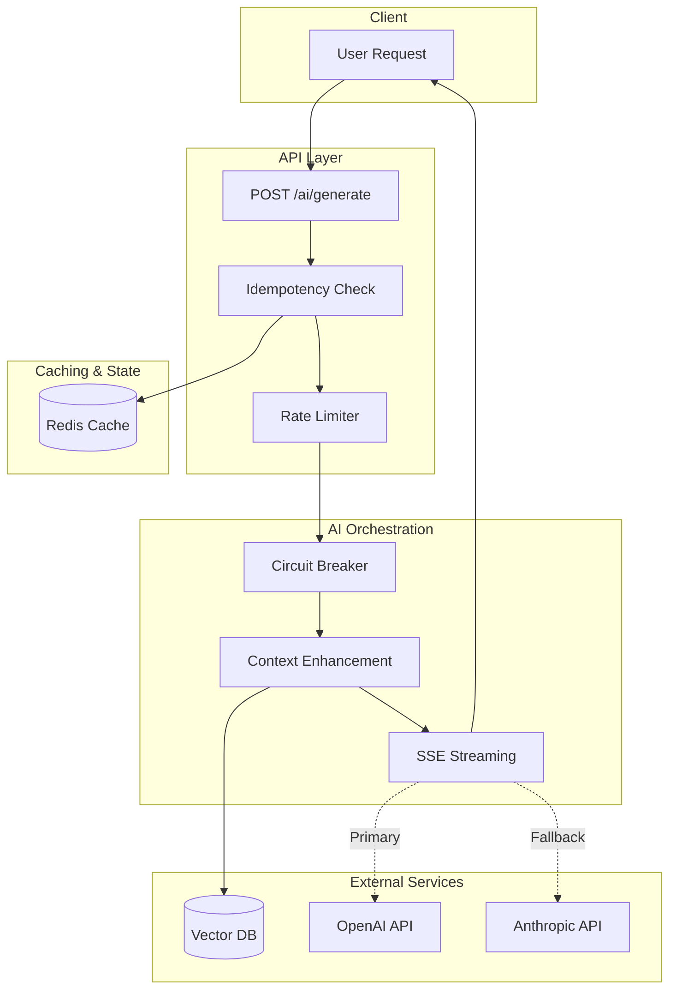
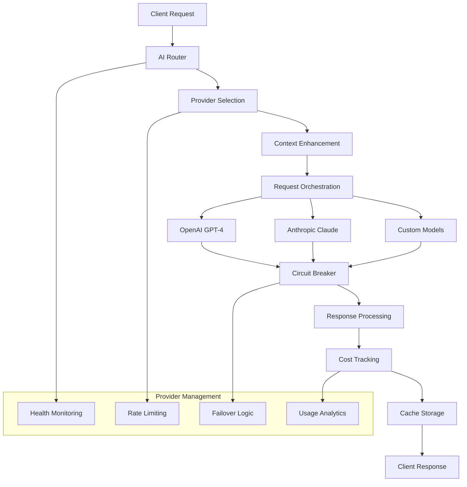

# AI Provider Integration

<Info>
**SDD Classification:** L3-Technical | **Authority:** AI Engineering Lead + CTO | **Review Cycle:** Monthly
</Info>

This document defines the multi-provider AI integration architecture for Materi's content generation system, covering provider orchestration, context enhancement, circuit breakers, streaming responses, and cost optimization strategies.

**Primary Providers**: OpenAI GPT-4, Anthropic Claude
**Architecture Pattern**: Multi-provider with automatic failover
**Streaming**: Server-Sent Events (SSE)
**Cost Target**: <$0.025 per generation

---

## Architecture Overview

### AI Integration Flow



### Multi-Provider Orchestration



**Key Components:**

1. **AI Router** - Intelligent request routing based on model capabilities
2. **Provider Selection** - Dynamic provider choice based on request characteristics
3. **Context Enhancement** - Document-aware prompt augmentation
4. **Circuit Breaker** - Fault tolerance and automatic failover
5. **Cost Optimization** - Usage tracking and budget management

---

## Provider Configuration

### Model Definitions

| Model | Provider | Best For | Context Window | Cost (per 1K tokens) |
|-------|----------|----------|----------------|----------------------|
| **gpt-4-turbo** | OpenAI | Analysis, reasoning, code | 128K | $0.01 / $0.03 |
| **claude-3-5-sonnet** | Anthropic | Creative writing, long context | 200K | $0.003 / $0.015 |
| **gpt-3.5-turbo** | OpenAI | Fast responses, simple tasks | 16K | $0.0005 / $0.0015 |
| **claude-3-haiku** | Anthropic | Quick drafts, summaries | 200K | $0.00025 / $0.00125 |

### Provider Priority (Fallback Order)

1. **OpenAI** - Primary provider for most tasks
2. **Anthropic** - Fallback and long-context specialist
3. **Custom** - Self-hosted models for specific use cases

---

## Implementation

### Base Provider Interface

```python
# app/services/ai/providers/base.py
from abc import ABC, abstractmethod
from typing import Dict, Any, Optional, AsyncIterator, List
from pydantic import BaseModel

class GenerationRequest(BaseModel):
    """Standard request format for all providers"""
    prompt: str
    model: str
    max_tokens: Optional[int] = None
    temperature: Optional[float] = 0.7
    top_p: Optional[float] = None
    stream: bool = False
    stop: Optional[List[str]] = None
    context: Optional[Dict[str, Any]] = None
    functions: Optional[List[Dict[str, Any]]] = None
    metadata: Optional[Dict[str, Any]] = None

class GenerationResponse(BaseModel):
    """Standard response format for all providers"""
    content: str
    model: str
    usage: Dict[str, int]
    cost: Optional[float] = None
    latency: float
    provider: str
    metadata: Optional[Dict[str, Any]] = None
    finish_reason: Optional[str] = None

class BaseAIProvider(ABC):
    """Abstract base class for AI providers"""

    @abstractmethod
    async def generate(self, request: GenerationRequest) -> GenerationResponse:
        """Generate content using the provider"""
        pass

    @abstractmethod
    async def generate_stream(self, request: GenerationRequest) -> AsyncIterator[dict]:
        """Generate content with streaming"""
        pass

    @abstractmethod
    async def health_check(self) -> bool:
        """Check provider health"""
        pass
```

### OpenAI Provider

```python
# app/services/ai/providers/openai_provider.py
import openai
import time
from typing import Dict, Any, AsyncIterator

class OpenAIProvider(BaseAIProvider):
    """OpenAI API provider implementation"""

    def __init__(self, config: Dict[str, Any]):
        self.client = openai.AsyncOpenAI(
            api_key=config.get("api_key"),
            organization=config.get("org_id"),
            timeout=config.get("timeout", 60),
            max_retries=config.get("max_retries", 3)
        )

    async def generate(self, request: GenerationRequest) -> GenerationResponse:
        """Generate content using OpenAI API"""
        start_time = time.time()

        params = {
            "model": request.model,
            "messages": self._format_messages(request.prompt, request.context),
            "max_tokens": request.max_tokens,
            "temperature": request.temperature,
            "stream": False
        }
        params = {k: v for k, v in params.items() if v is not None}

        response = await self.client.chat.completions.create(**params)
        latency = time.time() - start_time

        return GenerationResponse(
            content=response.choices[0].message.content or "",
            model=response.model,
            usage={
                "prompt_tokens": response.usage.prompt_tokens,
                "completion_tokens": response.usage.completion_tokens,
                "total_tokens": response.usage.total_tokens
            },
            cost=self._calculate_cost(response.usage.dict(), request.model),
            latency=latency,
            provider="openai",
            finish_reason=response.choices[0].finish_reason
        )

    async def generate_stream(self, request: GenerationRequest) -> AsyncIterator[dict]:
        """Generate content with streaming"""
        params = {
            "model": request.model,
            "messages": self._format_messages(request.prompt, request.context),
            "max_tokens": request.max_tokens,
            "temperature": request.temperature,
            "stream": True
        }

        stream = await self.client.chat.completions.create(**params)
        content_buffer = ""

        async for chunk in stream:
            if chunk.choices[0].delta.content:
                delta = chunk.choices[0].delta.content
                content_buffer += delta
                yield {"content": content_buffer, "delta": delta, "is_complete": False}

            if chunk.choices[0].finish_reason:
                yield {
                    "content": content_buffer,
                    "delta": "",
                    "is_complete": True,
                    "finish_reason": chunk.choices[0].finish_reason
                }
```

---

## Context Enhancement

### Context Enhancement Service

```python
# app/services/ai/context_enhancer.py
from typing import Dict, Any, List, Optional

class ContextEnhancer:
    """Enhance AI prompts with relevant context"""

    def __init__(self):
        self.vector_search = VectorSearchService()
        self.cache = get_cache()

    async def enhance(self, context: Dict[str, Any]) -> Dict[str, Any]:
        """Enhance context with additional information"""
        enhanced_context = context.copy()

        # Add document-specific context
        if context.get("document_id"):
            doc_context = await self._get_document_context(context["document_id"])
            enhanced_context.update(doc_context)

        # Add similar content context via vector search
        if context.get("prompt"):
            similar_content = await self.vector_search.find_relevant_context(
                query=context["prompt"],
                workspace_id=context.get("workspace_id"),
                limit=3
            )
            enhanced_context["similar_content"] = similar_content

        return enhanced_context

    async def _get_document_context(self, document_id: str) -> Dict[str, Any]:
        """Get context from document content and metadata"""
        cache_key = f"doc_context:{document_id}"
        cached_context = await self.cache.get(cache_key)

        if cached_context:
            return cached_context

        document = await document_service.get_document(document_id)
        context = {
            "document_title": document.title,
            "document_length": len(document.content),
            "document_type": document.metadata.get("type", "general"),
            "last_modified": document.updated_at.isoformat(),
        }

        if document.content:
            context["document_topics"] = await self._extract_topics(document.content)

        await self.cache.set(cache_key, context, ttl=300)
        return context
```

---

## Circuit Breaker & Failover

### Circuit Breaker Implementation

```python
# app/services/ai/circuit_breaker.py
import time
import asyncio
from enum import Enum

class CircuitState(str, Enum):
    CLOSED = "closed"
    OPEN = "open"
    HALF_OPEN = "half_open"

class CircuitBreaker:
    """Circuit breaker implementation for AI providers"""

    def __init__(self, failure_threshold: int = 5, recovery_timeout: int = 60):
        self.failure_threshold = failure_threshold
        self.recovery_timeout = recovery_timeout
        self.failure_count = 0
        self.last_failure_time = None
        self.state = CircuitState.CLOSED
        self.lock = asyncio.Lock()

    async def can_execute(self) -> bool:
        """Check if requests can be executed"""
        async with self.lock:
            if self.state == CircuitState.CLOSED:
                return True
            elif self.state == CircuitState.OPEN:
                if time.time() - self.last_failure_time > self.recovery_timeout:
                    self.state = CircuitState.HALF_OPEN
                    return True
                return False
            else:  # HALF_OPEN
                return True

    async def on_success(self):
        """Record successful execution"""
        async with self.lock:
            if self.state == CircuitState.HALF_OPEN:
                self.state = CircuitState.CLOSED
                self.failure_count = 0

    async def on_failure(self):
        """Record failed execution"""
        async with self.lock:
            self.failure_count += 1
            self.last_failure_time = time.time()

            if self.failure_count >= self.failure_threshold:
                self.state = CircuitState.OPEN
```

---

## Cost Optimization

### Usage Tracking & Plan Limits

```python
# app/services/ai/usage_tracker.py
from datetime import datetime
from typing import Dict, Any

class UsageTracker:
    """Track AI usage, costs, and optimize spending"""

    async def track_usage(
        self,
        user_id: str,
        provider: str,
        model: str,
        tokens: int,
        cost: float,
        request_type: str = "generation"
    ) -> None:
        """Track AI usage for billing and optimization"""
        usage_record = {
            "user_id": user_id,
            "provider": provider,
            "model": model,
            "tokens": tokens,
            "cost": cost,
            "request_type": request_type,
            "timestamp": datetime.utcnow()
        }

        await self.db.ai_usage.insert_one(usage_record)
        await self._update_cached_metrics(user_id, tokens, cost)

    async def check_user_limits(self, user_id: str) -> Dict[str, Any]:
        """Check if user is within usage limits"""
        user = await self.db.users.find_one({"id": user_id})
        plan_limits = PLAN_LIMITS.get(user.get("plan", "free"), {})

        start_of_month = datetime.utcnow().replace(day=1, hour=0, minute=0, second=0)
        usage = await self.db.ai_usage.aggregate([
            {"$match": {"user_id": user_id, "timestamp": {"$gte": start_of_month}}},
            {"$group": {
                "_id": None,
                "total_requests": {"$sum": 1},
                "total_tokens": {"$sum": "$tokens"},
                "total_cost": {"$sum": "$cost"}
            }}
        ]).to_list(1)

        current = usage[0] if usage else {"total_requests": 0, "total_tokens": 0, "total_cost": 0}

        return {
            "requests_used": current["total_requests"],
            "requests_limit": plan_limits.get("requests_per_month", 0),
            "requests_remaining": max(0, plan_limits.get("requests_per_month", 0) - current["total_requests"]),
            "is_over_limit": current["total_requests"] >= plan_limits.get("requests_per_month", 0)
        }

# Plan limits configuration
PLAN_LIMITS = {
    "free": {
        "requests_per_month": 100,
        "max_tokens_per_request": 1000,
        "models": ["gpt-3.5-turbo", "claude-3-haiku"]
    },
    "professional": {
        "requests_per_month": 1000,
        "max_tokens_per_request": 4000,
        "models": ["gpt-4", "gpt-4-turbo", "claude-3-sonnet"]
    },
    "enterprise": {
        "requests_per_month": -1,  # Unlimited
        "max_tokens_per_request": 8000,
        "models": ["*"]  # All models
    }
}
```

---

## AI Service Integration

### Main Orchestration Service

```python
# app/services/ai/ai_service.py
from typing import Dict, Any, Optional, AsyncIterator

class AIService:
    """Main AI service orchestrating multiple providers"""

    def __init__(self):
        self.router = AIRouter()
        self.usage_tracker = UsageTracker()
        self.context_enhancer = ContextEnhancer()

    async def generate_content(
        self,
        prompt: str,
        model: str = "gpt-4-turbo",
        user_id: Optional[str] = None,
        context: Optional[Dict[str, Any]] = None,
        stream: bool = False,
        **kwargs
    ) -> Dict[str, Any]:
        """Generate AI content with full orchestration"""

        # Check user limits
        if user_id:
            limits = await self.usage_tracker.check_user_limits(user_id)
            if limits["is_over_limit"]:
                raise AIUsageLimitError("Monthly AI request limit exceeded")

        # Enhance context
        if context:
            context = await self.context_enhancer.enhance(context)

        # Build request
        request = GenerationRequest(
            prompt=prompt,
            model=model,
            context=context,
            stream=stream,
            **kwargs
        )

        # Route and generate
        if stream:
            return self._generate_stream(request, user_id)
        else:
            response = await self.router.generate(request, user_id=user_id)
            return {
                "content": response.content,
                "model": response.model,
                "usage": response.usage,
                "cost": response.cost,
                "latency": response.latency,
                "provider": response.provider
            }
```

---

## Performance Targets

| Metric | Target | Measurement |
|--------|--------|-------------|
| **Time to First Token** | <2s | Request timer |
| **Generation Success Rate** | >95% | Success/total ratio |
| **Context Assembly** | <100ms | Pre-processing timer |
| **Cost per Generation** | <$0.025 | Usage tracker |
| **Cache Hit Rate** | >30% | Redis metrics |

---

## Cross-References

- [Backend Architecture](/developer/introduction/architecture) - API service integration
- [Canvas Architecture](/developer/products/canvas/architecture) - Frontend AI panel
- [Testing Strategy](/developer/testing/overview) - AI testing patterns
- [SLO/SLI/SLA](/internal/engineering/performance/slo-sli-sla) - Performance targets

---

**Document Status:** Complete
**Version:** 2.0
**Last Updated:** January 2026
**Authority:** AI Engineering Lead + CTO
**Classification:** L3-Technical - AI Integration

**Distribution:** AI Team, Engineering Leadership
