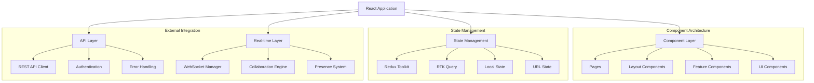
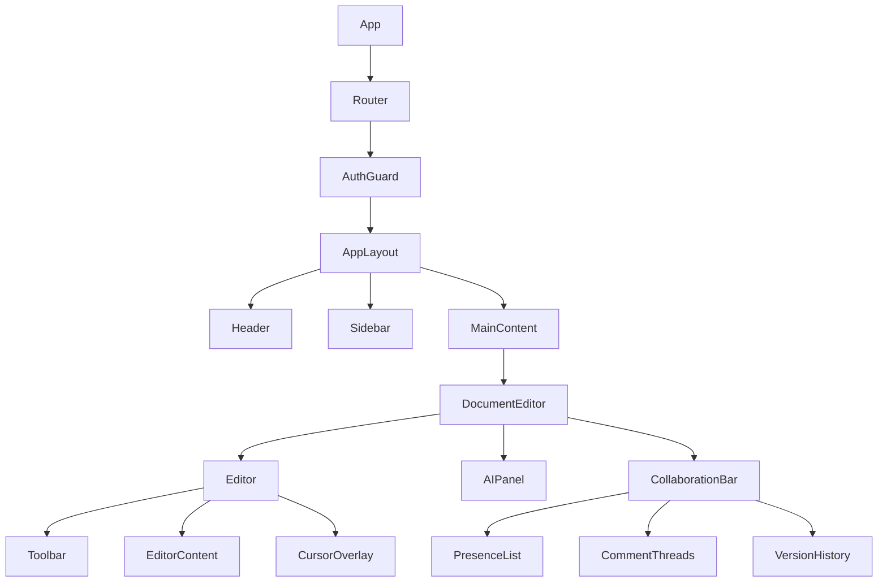

# Canvas Frontend Architecture

<Info>
**SDD Classification:** L3-Technical | **Authority:** Frontend Engineering Lead + CTO | **Review Cycle:** Monthly
</Info>

This document defines the React-based frontend architecture for Materi's Canvas document editor, covering component design, state management, real-time integration, and performance optimization strategies.

**Framework**: React 18 + TypeScript
**State Management**: Redux Toolkit + RTK Query
**Editor Foundation**: TipTap (ProseMirror)
**Build Tool**: Vite
**Target**: <3s Time to Interactive, <100KB initial bundle

---

## Architecture Overview

### Frontend System Design



**Key Architecture Principles:**

1. **Component Composition** - Small, reusable components with clear responsibilities
2. **Unidirectional Data Flow** - Redux for predictable state management
3. **Type Safety** - TypeScript throughout for reliability
4. **Performance First** - Code splitting, lazy loading, and optimization
5. **Real-time Ready** - Built-in WebSocket integration for collaboration

---

## Project Structure

```
src/
├── components/
│   ├── editor/
│   │   ├── Editor.tsx                # Main editor component
│   │   ├── Toolbar.tsx               # Editor toolbar
│   │   ├── extensions/               # TipTap extensions
│   │   │   ├── CollaborationExtension.ts
│   │   │   ├── AIExtension.ts
│   │   │   └── MentionExtension.ts
│   │   └── plugins/                  # ProseMirror plugins
│   ├── collaboration/
│   │   ├── CursorOverlay.tsx         # Live cursors
│   │   ├── PresenceBar.tsx           # User presence
│   │   ├── CommentThread.tsx         # Comment system
│   │   └── VersionHistory.tsx        # Document versions
│   ├── ai/
│   │   ├── AIPanel.tsx               # AI generation interface
│   │   ├── PromptInput.tsx           # Prompt input component
│   │   └── GenerationHistory.tsx     # AI generation history
│   ├── layout/
│   │   ├── AppLayout.tsx             # Main application layout
│   │   ├── Sidebar.tsx               # Navigation sidebar
│   │   └── Header.tsx                # Top navigation
│   └── ui/                           # Reusable UI components
│       ├── Button.tsx
│       ├── Input.tsx
│       ├── Modal.tsx
│       └── index.ts                  # Component exports
├── hooks/
│   ├── useWebSocket.ts               # WebSocket management
│   ├── useDocument.ts                # Document operations
│   ├── useCollaboration.ts           # Real-time features
│   ├── useAI.ts                      # AI generation
│   └── useLocalStorage.ts            # Local state persistence
├── store/
│   ├── index.ts                      # Store configuration
│   ├── slices/
│   │   ├── authSlice.ts              # Authentication state
│   │   ├── documentsSlice.ts         # Documents state
│   │   ├── editorSlice.ts            # Editor state
│   │   └── collaborationSlice.ts     # Real-time state
│   └── api/
│       ├── baseApi.ts                # RTK Query base
│       ├── documentsApi.ts           # Documents API
│       ├── workspacesApi.ts          # Workspaces API
│       └── aiApi.ts                  # AI generation API
├── pages/
│   ├── Dashboard.tsx                 # User dashboard
│   ├── DocumentEditor.tsx            # Document editing page
│   ├── WorkspaceSettings.tsx         # Workspace management
│   └── Login.tsx                     # Authentication
├── services/
│   ├── api.ts                        # HTTP client
│   ├── websocket.ts                  # WebSocket service
│   └── auth.ts                       # Authentication service
├── utils/
│   ├── types.ts                      # TypeScript types
│   ├── constants.ts                  # Application constants
│   ├── formatters.ts                 # Data formatting
│   └── validators.ts                 # Input validation
└── App.tsx                           # Root component
```

---

## Component Architecture

### Component Hierarchy



### Core Editor Component

The editor is built on TipTap with collaborative extensions:

```typescript
// src/components/editor/Editor.tsx
import { useEditor, EditorContent } from '@tiptap/react';
import StarterKit from '@tiptap/starter-kit';
import Collaboration from '@tiptap/extension-collaboration';
import CollaborationCursor from '@tiptap/extension-collaboration-cursor';

interface EditorProps {
    documentId: string;
    initialContent?: string;
    readOnly?: boolean;
    onContentChange?: (content: string) => void;
}

export const Editor: React.FC<EditorProps> = ({
    documentId,
    initialContent = '',
    readOnly = false,
    onContentChange,
}) => {
    const { ydoc, provider, activeUsers } = useCollaboration(documentId);

    const editor = useEditor({
        extensions: [
            StarterKit.configure({ history: false }),
            Collaboration.configure({ document: ydoc }),
            CollaborationCursor.configure({
                provider,
                user: { name: 'Current User', color: '#3b82f6' },
            }),
            AIExtension.configure({ onGenerate: handleAIGeneration }),
            MentionExtension.configure({ onMention: handleMention }),
        ],
        content: initialContent,
        editable: !readOnly,
        onUpdate: ({ editor }) => {
            onContentChange?.(editor.getHTML());
            debouncedSave(editor.getHTML());
        },
    });

    return (
        <div className="editor-container">
            <Toolbar editor={editor} disabled={readOnly} />
            <EditorContent editor={editor} className="prose max-w-none" />
            <CursorOverlay activeUsers={activeUsers} />
        </div>
    );
};
```

---

## State Management

### Redux Toolkit Configuration

```typescript
// src/store/index.ts
import { configureStore } from '@reduxjs/toolkit';
import { setupListeners } from '@reduxjs/toolkit/query';

import authSlice from './slices/authSlice';
import documentsSlice from './slices/documentsSlice';
import editorSlice from './slices/editorSlice';
import collaborationSlice from './slices/collaborationSlice';
import { baseApi } from './api/baseApi';

export const store = configureStore({
    reducer: {
        auth: authSlice,
        documents: documentsSlice,
        editor: editorSlice,
        collaboration: collaborationSlice,
        [baseApi.reducerPath]: baseApi.reducer,
    },
    middleware: (getDefaultMiddleware) =>
        getDefaultMiddleware({
            serializableCheck: {
                ignoredActions: ['persist/PERSIST', 'persist/REHYDRATE'],
            },
        }).concat(baseApi.middleware),
    devTools: process.env.NODE_ENV !== 'production',
});

setupListeners(store.dispatch);

export type RootState = ReturnType<typeof store.getState>;
export type AppDispatch = typeof store.dispatch;
```

### Document State Slice

```typescript
// src/store/slices/documentsSlice.ts
import { createSlice, createAsyncThunk, PayloadAction } from '@reduxjs/toolkit';

interface DocumentsState {
    documents: Document[];
    currentDocument: Document | null;
    isLoading: boolean;
    error: string | null;
    lastSaved: number | null;
    isDirty: boolean;
}

const documentsSlice = createSlice({
    name: 'documents',
    initialState,
    reducers: {
        setCurrentDocument: (state, action: PayloadAction<Document>) => {
            state.currentDocument = action.payload;
            state.isDirty = false;
        },
        updateDocumentContent: (state, action: PayloadAction<string>) => {
            if (state.currentDocument) {
                state.currentDocument.content = action.payload;
                state.isDirty = true;
            }
        },
        markSaved: (state) => {
            state.isDirty = false;
            state.lastSaved = Date.now();
        },
    },
});
```

### RTK Query API Integration

```typescript
// src/store/api/documentsApi.ts
import { createApi } from '@reduxjs/toolkit/query/react';
import { baseQuery } from './baseApi';

export const documentsApi = createApi({
    reducerPath: 'documentsApi',
    baseQuery,
    tagTypes: ['Document', 'DocumentList'],
    endpoints: (builder) => ({
        getDocuments: builder.query<Document[], { workspaceId?: string }>({
            query: (params) => ({ url: '/documents', params }),
            providesTags: ['DocumentList'],
        }),
        getDocument: builder.query<Document, string>({
            query: (id) => `/documents/${id}`,
            providesTags: (result, error, id) => [{ type: 'Document', id }],
        }),
        updateDocument: builder.mutation<Document, { id: string; updates: DocumentUpdate }>({
            query: ({ id, updates }) => ({
                url: `/documents/${id}`,
                method: 'PATCH',
                body: updates,
            }),
            invalidatesTags: (result, error, { id }) => [{ type: 'Document', id }],
            // Optimistic update
            onQueryStarted: async ({ id, updates }, { dispatch, queryFulfilled }) => {
                const patchResult = dispatch(
                    documentsApi.util.updateQueryData('getDocument', id, (draft) => {
                        Object.assign(draft, updates);
                    })
                );
                try {
                    await queryFulfilled;
                } catch {
                    patchResult.undo();
                }
            },
        }),
    }),
});

export const { useGetDocumentsQuery, useGetDocumentQuery, useUpdateDocumentMutation } = documentsApi;
```

---

## Real-time Integration

### WebSocket Hook

```typescript
// src/hooks/useWebSocket.ts
import { useEffect, useRef, useState, useCallback } from 'react';

interface UseWebSocketOptions {
    documentId: string;
    accessToken: string;
    onMessage?: (message: any) => void;
    reconnectAttempts?: number;
}

export const useWebSocket = ({
    documentId,
    accessToken,
    onMessage,
    reconnectAttempts = 5,
}: UseWebSocketOptions) => {
    const [isConnected, setIsConnected] = useState(false);
    const [connectionState, setConnectionState] = useState<'connecting' | 'connected' | 'disconnected' | 'reconnecting'>('disconnected');
    const wsRef = useRef<WebSocket | null>(null);
    const reconnectAttemptsRef = useRef(0);

    const connect = useCallback(() => {
        const wsUrl = `${process.env.REACT_APP_WS_URL}/documents/${documentId}?token=${accessToken}`;
        const ws = new WebSocket(wsUrl);

        ws.onopen = () => {
            setIsConnected(true);
            setConnectionState('connected');
            reconnectAttemptsRef.current = 0;
        };

        ws.onmessage = (event) => {
            const message = JSON.parse(event.data);
            onMessage?.(message);
        };

        ws.onclose = (event) => {
            setIsConnected(false);
            if (event.code !== 1000 && reconnectAttemptsRef.current < reconnectAttempts) {
                scheduleReconnect();
            }
        };

        wsRef.current = ws;
    }, [documentId, accessToken, onMessage, reconnectAttempts]);

    const sendMessage = useCallback((message: any) => {
        if (wsRef.current?.readyState === WebSocket.OPEN) {
            wsRef.current.send(JSON.stringify(message));
        }
    }, []);

    return { isConnected, connectionState, sendMessage, connect };
};
```

### Collaboration Hook

```typescript
// src/hooks/useCollaboration.ts
import { useEffect, useState, useCallback } from 'react';
import * as Y from 'yjs';
import { WebsocketProvider } from 'y-websocket';

interface CollaborationUser {
    id: string;
    name: string;
    color: string;
    cursor?: { position: number; selection?: { start: number; end: number } };
}

export const useCollaboration = (documentId: string) => {
    const [ydoc] = useState(() => new Y.Doc());
    const [provider, setProvider] = useState<WebsocketProvider | null>(null);
    const [activeUsers, setActiveUsers] = useState<CollaborationUser[]>([]);

    useEffect(() => {
        const wsProvider = new WebsocketProvider(
            process.env.REACT_APP_WS_URL!,
            documentId,
            ydoc,
            { connect: false }
        );

        wsProvider.on('status', ({ status }: { status: string }) => {
            console.log('Yjs status:', status);
        });

        setProvider(wsProvider);
        return () => wsProvider.destroy();
    }, [documentId, ydoc]);

    const updateCursor = useCallback((position: number, selection?: { start: number; end: number }) => {
        // Send cursor position to other collaborators
    }, []);

    return { ydoc, provider, activeUsers, updateCursor, isConnected: !!provider };
};
```

---

## Performance Optimization

### Code Splitting & Lazy Loading

```typescript
// src/App.tsx
import React, { Suspense } from 'react';
import { BrowserRouter, Routes, Route } from 'react-router-dom';
import { LoadingSpinner } from './components/ui/LoadingSpinner';

// Lazy load pages
const Dashboard = React.lazy(() => import('./pages/Dashboard'));
const DocumentEditor = React.lazy(() => import('./pages/DocumentEditor'));
const WorkspaceSettings = React.lazy(() => import('./pages/WorkspaceSettings'));
const Login = React.lazy(() => import('./pages/Login'));

// Lazy load heavy components
const AIPanel = React.lazy(() => import('./components/ai/AIPanel'));
const VersionHistory = React.lazy(() => import('./components/collaboration/VersionHistory'));

function App() {
    return (
        <BrowserRouter>
            <Suspense fallback={<LoadingSpinner />}>
                <Routes>
                    <Route path="/login" element={<Login />} />
                    <Route path="/" element={<AuthGuard />}>
                        <Route index element={<Dashboard />} />
                        <Route path="document/:id" element={<DocumentEditor />} />
                        <Route path="workspace/:id/settings" element={<WorkspaceSettings />} />
                    </Route>
                </Routes>
            </Suspense>
        </BrowserRouter>
    );
}
```

### Virtualization for Large Lists

```typescript
// src/components/editor/DocumentList.tsx
import React, { useMemo, useCallback } from 'react';
import { useVirtualizer } from '@tanstack/react-virtual';

export const DocumentList: React.FC<DocumentListProps> = React.memo(
    ({ documents, onDocumentSelect, searchQuery = '' }) => {
        const filteredDocuments = useMemo(() => {
            if (!searchQuery) return documents;
            return documents.filter(
                (doc) =>
                    doc.title.toLowerCase().includes(searchQuery.toLowerCase()) ||
                    doc.content.toLowerCase().includes(searchQuery.toLowerCase())
            );
        }, [documents, searchQuery]);

        const parentRef = React.useRef<HTMLDivElement>(null);
        const rowVirtualizer = useVirtualizer({
            count: filteredDocuments.length,
            getScrollElement: () => parentRef.current,
            estimateSize: () => 80,
            overscan: 5,
        });

        return (
            <div ref={parentRef} style={{ height: '400px', overflow: 'auto' }}>
                <div style={{ height: `${rowVirtualizer.getTotalSize()}px`, position: 'relative' }}>
                    {rowVirtualizer.getVirtualItems().map((virtualRow) => (
                        <DocumentCard
                            key={virtualRow.key}
                            document={filteredDocuments[virtualRow.index]}
                            onClick={onDocumentSelect}
                            style={{
                                position: 'absolute',
                                top: 0,
                                transform: `translateY(${virtualRow.start}px)`,
                            }}
                        />
                    ))}
                </div>
            </div>
        );
    }
);
```

### Bundle Configuration

```typescript
// vite.config.ts
import { defineConfig } from 'vite';
import react from '@vitejs/plugin-react';

export default defineConfig({
    plugins: [react()],
    build: {
        rollupOptions: {
            output: {
                manualChunks: {
                    'react-vendor': ['react', 'react-dom', 'react-router-dom'],
                    'redux-vendor': ['@reduxjs/toolkit', 'react-redux'],
                    'editor-vendor': ['@tiptap/react', '@tiptap/starter-kit'],
                    collaboration: ['yjs', 'y-websocket', 'y-protocols'],
                },
            },
        },
        chunkSizeWarningLimit: 1000,
    },
});
```

---

## Performance Targets

| Metric | Target | Measurement |
|--------|--------|-------------|
| **Time to Interactive** | <3s | Lighthouse |
| **First Contentful Paint** | <1.5s | Lighthouse |
| **Initial Bundle Size** | <100KB | Build output |
| **Editor Load Time** | <500ms | Performance API |
| **Collaboration Latency** | <25ms | Custom metrics |

---

## Cross-References

- [Backend Architecture](/developer/introduction/architecture) - API integration
- [Relay Architecture](/developer/domain/relay/architecture) - WebSocket collaboration
- [AI Integration](/developer/platform/aria/model-integration) - AI features
- [Testing Strategy](/developer/testing/overview) - Frontend testing

---

**Document Status:** Complete
**Version:** 2.0
**Last Updated:** January 2026
**Authority:** Frontend Engineering Lead + CTO
**Classification:** L3-Technical - Frontend Implementation

**Distribution:** Frontend Team, Engineering Leadership
