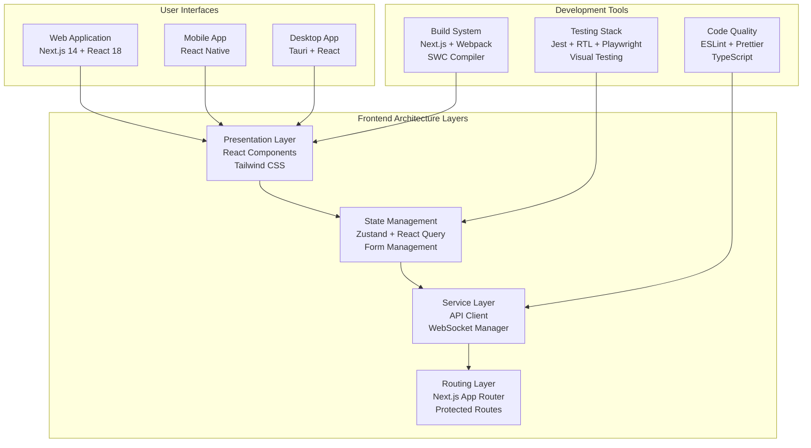

# Frontend E2E Testing & Debugging Guide

<Info>
**SDD Classification:** L4-Operational | **Authority:** Frontend Lead + QA Lead | **Review Cycle:** Monthly
</Info>

This document provides comprehensive guidance for end-to-end testing and frontend debugging across the Materi platform. It covers Playwright testing patterns, React debugging tools, performance optimization, and common frontend issues.

**Framework**: React 18 + Next.js 14 + TypeScript
**E2E Testing**: Playwright
**Component Testing**: Jest + React Testing Library
**Performance Targets**: <2s initial load, <100ms interactions

---

## Frontend Architecture Overview

### Technology Stack



---

## Playwright E2E Testing

### Test Configuration

```typescript
// playwright.config.ts
import { defineConfig, devices } from '@playwright/test';

export default defineConfig({
  testDir: './tests/e2e',
  fullyParallel: true,
  forbidOnly: !!process.env.CI,
  retries: process.env.CI ? 2 : 0,
  workers: process.env.CI ? 1 : undefined,
  reporter: [
    ['html', { open: 'never' }],
    ['junit', { outputFile: 'results.xml' }],
  ],

  use: {
    baseURL: 'http://localhost:3000',
    trace: 'on-first-retry',
    screenshot: 'only-on-failure',
    video: 'retain-on-failure',
  },

  projects: [
    {
      name: 'chromium',
      use: { ...devices['Desktop Chrome'] },
    },
    {
      name: 'firefox',
      use: { ...devices['Desktop Firefox'] },
    },
    {
      name: 'webkit',
      use: { ...devices['Desktop Safari'] },
    },
    {
      name: 'mobile',
      use: { ...devices['iPhone 13'] },
    },
  ],

  webServer: {
    command: 'npm run dev',
    url: 'http://localhost:3000',
    reuseExistingServer: !process.env.CI,
  },
});
```

### Authentication Test Flow

```typescript
// tests/e2e/auth.spec.ts
import { test, expect } from '@playwright/test';

test.describe('Authentication Flow', () => {
  test.beforeEach(async ({ page }) => {
    await page.goto('/');
  });

  test('should login with valid credentials', async ({ page }) => {
    // Navigate to login
    await page.click('text=Sign In');
    await expect(page).toHaveURL('/login');

    // Fill login form
    await page.fill('[data-testid="email-input"]', 'test@example.com');
    await page.fill('[data-testid="password-input"]', 'SecurePass123!');

    // Submit and verify
    await page.click('[data-testid="login-button"]');
    await expect(page).toHaveURL('/dashboard');
    await expect(page.locator('[data-testid="user-menu"]')).toBeVisible();
  });

  test('should show error for invalid credentials', async ({ page }) => {
    await page.goto('/login');

    await page.fill('[data-testid="email-input"]', 'test@example.com');
    await page.fill('[data-testid="password-input"]', 'WrongPassword');
    await page.click('[data-testid="login-button"]');

    await expect(page.locator('[data-testid="error-message"]')).toContainText(
      'Invalid credentials'
    );
    await expect(page).toHaveURL('/login');
  });

  test('should handle OAuth login', async ({ page }) => {
    await page.goto('/login');
    await page.click('[data-testid="google-oauth-button"]');

    // Mock OAuth response in test environment
    await expect(page).toHaveURL(/accounts\.google\.com|\/oauth\/callback/);
  });
});
```

### Document Editor Testing

```typescript
// tests/e2e/document-editor.spec.ts
import { test, expect, Page } from '@playwright/test';

test.describe('Document Editor', () => {
  let page: Page;

  test.beforeAll(async ({ browser }) => {
    const context = await browser.newContext({
      storageState: 'tests/e2e/.auth/user.json', // Pre-authenticated state
    });
    page = await context.newPage();
  });

  test('should create and edit document', async () => {
    // Create new document
    await page.goto('/dashboard');
    await page.click('[data-testid="new-document-button"]');

    // Wait for editor to load
    await expect(page.locator('.tiptap-editor')).toBeVisible();

    // Type content
    await page.locator('.tiptap-editor').click();
    await page.keyboard.type('Hello, World!');

    // Verify auto-save indicator
    await expect(page.locator('[data-testid="save-status"]')).toContainText('Saved');

    // Apply formatting
    await page.keyboard.press('Control+a');
    await page.click('[data-testid="bold-button"]');

    // Verify formatting applied
    await expect(page.locator('.tiptap-editor strong')).toContainText('Hello, World!');
  });

  test('should support real-time collaboration', async ({ browser }) => {
    // Create second user context
    const context2 = await browser.newContext({
      storageState: 'tests/e2e/.auth/collaborator.json',
    });
    const page2 = await context2.newPage();

    // Both users open same document
    const docUrl = '/documents/test-doc-id';
    await page.goto(docUrl);
    await page2.goto(docUrl);

    // User 1 types
    await page.locator('.tiptap-editor').click();
    await page.keyboard.type('User 1 edit');

    // Verify User 2 sees the change
    await expect(page2.locator('.tiptap-editor')).toContainText('User 1 edit', {
      timeout: 5000,
    });

    // User 2 types
    await page2.locator('.tiptap-editor').click();
    await page2.keyboard.press('End');
    await page2.keyboard.type(' - User 2 edit');

    // Verify User 1 sees both edits
    await expect(page.locator('.tiptap-editor')).toContainText('User 2 edit', {
      timeout: 5000,
    });

    await context2.close();
  });

  test('should handle offline mode', async () => {
    await page.goto('/documents/test-doc-id');

    // Go offline
    await page.context().setOffline(true);

    // Attempt to edit
    await page.locator('.tiptap-editor').click();
    await page.keyboard.type('Offline edit');

    // Verify offline indicator
    await expect(page.locator('[data-testid="connection-status"]')).toContainText('Offline');

    // Go back online
    await page.context().setOffline(false);

    // Verify sync happens
    await expect(page.locator('[data-testid="connection-status"]')).toContainText('Connected');
    await expect(page.locator('[data-testid="save-status"]')).toContainText('Saved');
  });
});
```

### Visual Regression Testing

```typescript
// tests/e2e/visual.spec.ts
import { test, expect } from '@playwright/test';

test.describe('Visual Regression', () => {
  test('dashboard matches snapshot', async ({ page }) => {
    await page.goto('/dashboard');
    await page.waitForLoadState('networkidle');

    await expect(page).toHaveScreenshot('dashboard.png', {
      maxDiffPixels: 100,
    });
  });

  test('document editor matches snapshot', async ({ page }) => {
    await page.goto('/documents/test-doc-id');
    await page.waitForSelector('.tiptap-editor');

    await expect(page.locator('.document-container')).toHaveScreenshot('document-editor.png');
  });

  test('responsive design - mobile', async ({ page }) => {
    await page.setViewportSize({ width: 375, height: 812 });
    await page.goto('/dashboard');

    await expect(page).toHaveScreenshot('dashboard-mobile.png');
  });
});
```

---

## Component Testing with React Testing Library

### Button Component Tests

```typescript
// components/Button/Button.test.tsx
import { render, screen, fireEvent } from '@testing-library/react';
import { Button } from './Button';

describe('Button Component', () => {
  it('renders with correct text', () => {
    render(<Button>Click me</Button>);
    expect(screen.getByRole('button', { name: 'Click me' })).toBeInTheDocument();
  });

  it('handles click events', () => {
    const handleClick = jest.fn();
    render(<Button onClick={handleClick}>Click me</Button>);

    fireEvent.click(screen.getByRole('button'));
    expect(handleClick).toHaveBeenCalledTimes(1);
  });

  it('disables when loading', () => {
    render(<Button loading>Click me</Button>);

    const button = screen.getByRole('button');
    expect(button).toBeDisabled();
    expect(screen.getByText('Loading...')).toBeInTheDocument();
  });

  it('applies variant styles', () => {
    render(<Button variant="danger">Delete</Button>);

    const button = screen.getByRole('button');
    expect(button).toHaveClass('bg-red-600');
  });
});
```

### Custom Hook Testing

```typescript
// hooks/useDocument.test.ts
import { renderHook, waitFor } from '@testing-library/react';
import { QueryClient, QueryClientProvider } from '@tanstack/react-query';
import { useDocument } from './useDocument';

const wrapper = ({ children }: { children: React.ReactNode }) => {
  const queryClient = new QueryClient({
    defaultOptions: {
      queries: { retry: false },
    },
  });
  return <QueryClientProvider client={queryClient}>{children}</QueryClientProvider>;
};

describe('useDocument', () => {
  it('fetches document data', async () => {
    global.fetch = jest.fn().mockResolvedValue({
      ok: true,
      json: () => Promise.resolve({ id: '123', title: 'Test Doc' }),
    });

    const { result } = renderHook(() => useDocument('123'), { wrapper });

    await waitFor(() => expect(result.current.isSuccess).toBe(true));

    expect(result.current.data).toEqual({ id: '123', title: 'Test Doc' });
  });

  it('handles fetch error', async () => {
    global.fetch = jest.fn().mockResolvedValue({
      ok: false,
      status: 404,
    });

    const { result } = renderHook(() => useDocument('invalid'), { wrapper });

    await waitFor(() => expect(result.current.isError).toBe(true));
  });
});
```

---

## Frontend Debugging Tools

### React DevTools Usage

```typescript
// Enable component profiling
if (process.env.NODE_ENV === 'development') {
  // Add profiler to track renders
  const Profiler = React.Profiler;

  const onRenderCallback = (
    id: string,
    phase: 'mount' | 'update',
    actualDuration: number,
    baseDuration: number,
    startTime: number,
    commitTime: number
  ) => {
    console.log(`Component ${id} rendered in ${actualDuration}ms (${phase})`);
  };

  // Wrap components for profiling
  <Profiler id="DocumentEditor" onRender={onRenderCallback}>
    <DocumentEditor />
  </Profiler>
}
```

### Performance Debugging

```typescript
// Performance monitoring hook
function usePerformanceMonitor(componentName: string) {
  const renderCount = useRef(0);
  const lastRenderTime = useRef(Date.now());

  useEffect(() => {
    renderCount.current += 1;
    const now = Date.now();
    const timeSinceLastRender = now - lastRenderTime.current;
    lastRenderTime.current = now;

    console.log(`[${componentName}] Render #${renderCount.current}, Time since last: ${timeSinceLastRender}ms`);
  });

  return { renderCount: renderCount.current };
}

// Usage
function DocumentEditor() {
  usePerformanceMonitor('DocumentEditor');
  // ... component logic
}
```

### Network Request Debugging

```typescript
// API client with request logging
import axios from 'axios';

const apiClient = axios.create({
  baseURL: process.env.NEXT_PUBLIC_API_URL,
});

// Request interceptor
apiClient.interceptors.request.use((config) => {
  const requestId = crypto.randomUUID();
  config.headers['X-Request-ID'] = requestId;

  console.group(`🔵 Request [${requestId}]`);
  console.log('URL:', config.url);
  console.log('Method:', config.method?.toUpperCase());
  console.log('Headers:', config.headers);
  console.log('Data:', config.data);
  console.groupEnd();

  return config;
});

// Response interceptor
apiClient.interceptors.response.use(
  (response) => {
    const requestId = response.config.headers['X-Request-ID'];

    console.group(`🟢 Response [${requestId}]`);
    console.log('Status:', response.status);
    console.log('Data:', response.data);
    console.groupEnd();

    return response;
  },
  (error) => {
    const requestId = error.config?.headers['X-Request-ID'];

    console.group(`🔴 Error [${requestId}]`);
    console.log('Status:', error.response?.status);
    console.log('Message:', error.message);
    console.log('Data:', error.response?.data);
    console.groupEnd();

    return Promise.reject(error);
  }
);
```

---

## Common Frontend Issues

### Issue Resolution Matrix

| Issue | Symptoms | Diagnosis | Resolution |
|-------|----------|-----------|------------|
| **Excessive Re-renders** | Laggy UI, high CPU | React DevTools Profiler | useMemo, useCallback, memo() |
| **Memory Leak** | Increasing memory | Chrome DevTools Memory | Cleanup useEffect, unsubscribe |
| **Bundle Size** | Slow initial load | Webpack Bundle Analyzer | Code splitting, dynamic imports |
| **Hydration Mismatch** | Console warnings | SSR/CSR diff | useEffect for client-only code |
| **State Sync Issues** | Stale data | React Query DevTools | Invalidate queries, refetch |

### Debugging Re-renders

```typescript
// why-did-you-render integration
if (process.env.NODE_ENV === 'development') {
  const whyDidYouRender = require('@welldone-software/why-did-you-render');
  whyDidYouRender(React, {
    trackAllPureComponents: true,
    trackHooks: true,
    logOnDifferentValues: true,
  });
}

// Component with tracking
function DocumentList() {
  // This will be tracked
}
DocumentList.whyDidYouRender = true;
```

### Memory Leak Prevention

```typescript
// Proper cleanup pattern
function useWebSocket(documentId: string) {
  const [socket, setSocket] = useState<WebSocket | null>(null);

  useEffect(() => {
    const ws = new WebSocket(`${WS_URL}/documents/${documentId}`);
    setSocket(ws);

    ws.onopen = () => console.log('Connected');
    ws.onmessage = (event) => {
      // Handle message
    };

    // Cleanup function
    return () => {
      console.log('Cleaning up WebSocket');
      ws.close();
    };
  }, [documentId]);

  return socket;
}
```

---

## Test Commands Reference

### Playwright Commands

```bash
# Run all E2E tests
npx playwright test

# Run specific test file
npx playwright test tests/e2e/auth.spec.ts

# Run with UI mode
npx playwright test --ui

# Run in headed mode
npx playwright test --headed

# Run specific browser
npx playwright test --project=chromium

# Generate tests with codegen
npx playwright codegen http://localhost:3000

# View test report
npx playwright show-report

# Debug specific test
npx playwright test --debug tests/e2e/auth.spec.ts
```

### Jest Commands

```bash
# Run all unit tests
npm test

# Run with coverage
npm test -- --coverage

# Run specific test file
npm test -- Button.test.tsx

# Run in watch mode
npm test -- --watch

# Update snapshots
npm test -- --updateSnapshot

# Run with verbose output
npm test -- --verbose
```

### Development Commands

```bash
# Analyze bundle size
npx @next/bundle-analyzer

# Check for unused dependencies
npx depcheck

# Audit npm packages
npm audit

# Performance testing
npx lighthouse http://localhost:3000

# Visual regression testing
npx percy exec -- npm run test:e2e
```

---

## Related Documentation

- [Integration Tests](/developer/testing/integration-tests) - API testing
- [Testing Overview](/developer/testing/overview) - Testing strategy
- [Canvas Architecture](/developer/products/canvas/architecture) - Frontend architecture
- [Incident Response](/developer/operations/runbooks/incident-response) - Debugging in production

---

**Document Status:** Complete
**Version:** 2.0
**Last Updated:** January 2026
**Authority:** Frontend Lead + QA Lead
**Classification:** L4-Operational - Developer Reference

**Distribution:** Frontend Engineering Team
