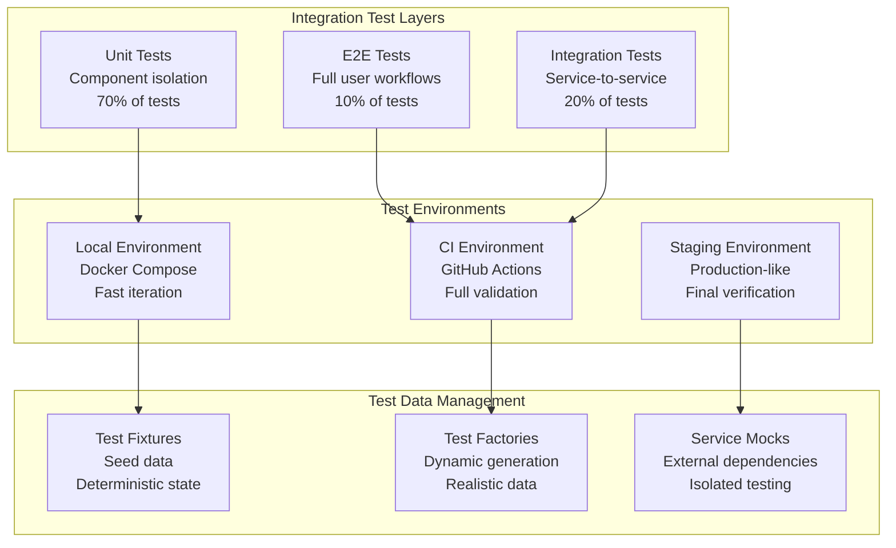

# API Integration Testing & Debugging Guide

<Info>
**SDD Classification:** L4-Operational | **Authority:** Engineering Lead + QA Lead | **Review Cycle:** Monthly
</Info>

This document provides comprehensive guidance for API integration testing and debugging across the Materi platform. It covers testing strategies, debugging tools, common issues, and resolution patterns for backend services.

**Primary Stack**: Go Fiber, Rust Axum, Python Django
**Testing Frameworks**: testify (Go), tokio-test (Rust), pytest (Python)
**Debugging Tools**: Delve, rust-gdb/rust-lldb, pdb, OpenTelemetry

---

## Integration Testing Architecture

### Testing Pyramid for API Services



---

## Service-Specific Testing

### Go (API Service) Testing

#### Test Structure

```go
// document_service_test.go
package service_test

import (
    "context"
    "testing"
    "time"

    "github.com/stretchr/testify/assert"
    "github.com/stretchr/testify/mock"
    "github.com/stretchr/testify/suite"
)

type DocumentServiceTestSuite struct {
    suite.Suite
    service    *DocumentService
    mockRepo   *MockDocumentRepository
    mockCache  *MockCacheService
    mockEvents *MockEventBus
}

func (s *DocumentServiceTestSuite) SetupTest() {
    s.mockRepo = new(MockDocumentRepository)
    s.mockCache = new(MockCacheService)
    s.mockEvents = new(MockEventBus)

    s.service = NewDocumentService(
        s.mockRepo,
        s.mockCache,
        s.mockEvents,
    )
}

func (s *DocumentServiceTestSuite) TestCreateDocument_Success() {
    ctx := context.Background()
    userID := "user-123"
    workspaceID := "workspace-456"

    input := CreateDocumentInput{
        Title:       "Test Document",
        Content:     "Initial content",
        WorkspaceID: workspaceID,
    }

    expectedDoc := &Document{
        ID:          "doc-789",
        Title:       input.Title,
        Content:     input.Content,
        WorkspaceID: workspaceID,
        OwnerID:     userID,
        CreatedAt:   time.Now(),
    }

    // Setup mocks
    s.mockRepo.On("Create", ctx, mock.AnythingOfType("*Document")).
        Return(expectedDoc, nil)
    s.mockCache.On("Set", ctx, mock.Anything, mock.Anything, mock.Anything).
        Return(nil)
    s.mockEvents.On("Publish", ctx, "documents.created", mock.Anything).
        Return(nil)

    // Execute
    result, err := s.service.CreateDocument(ctx, userID, input)

    // Assert
    s.NoError(err)
    s.NotNil(result)
    s.Equal(expectedDoc.ID, result.ID)
    s.Equal(input.Title, result.Title)

    s.mockRepo.AssertExpectations(s.T())
    s.mockCache.AssertExpectations(s.T())
    s.mockEvents.AssertExpectations(s.T())
}

func (s *DocumentServiceTestSuite) TestCreateDocument_ValidationError() {
    ctx := context.Background()
    userID := "user-123"

    input := CreateDocumentInput{
        Title:   "", // Invalid: empty title
        Content: "Content",
    }

    result, err := s.service.CreateDocument(ctx, userID, input)

    s.Error(err)
    s.Nil(result)
    s.Contains(err.Error(), "title is required")
}

func TestDocumentServiceTestSuite(t *testing.T) {
    suite.Run(t, new(DocumentServiceTestSuite))
}
```

#### Integration Test with Real Database

```go
// integration_test.go
//go:build integration

package integration_test

import (
    "context"
    "testing"

    "github.com/stretchr/testify/require"
    "github.com/testcontainers/testcontainers-go"
    "github.com/testcontainers/testcontainers-go/modules/postgres"
)

func TestDocumentCRUD_Integration(t *testing.T) {
    ctx := context.Background()

    // Start PostgreSQL container
    pgContainer, err := postgres.RunContainer(ctx,
        testcontainers.WithImage("postgres:15"),
        postgres.WithDatabase("materi_test"),
        postgres.WithUsername("test"),
        postgres.WithPassword("test"),
    )
    require.NoError(t, err)
    defer pgContainer.Terminate(ctx)

    // Get connection string
    connStr, err := pgContainer.ConnectionString(ctx, "sslmode=disable")
    require.NoError(t, err)

    // Initialize database
    db, err := NewDatabase(connStr)
    require.NoError(t, err)

    // Run migrations
    err = db.Migrate()
    require.NoError(t, err)

    // Create service with real dependencies
    repo := NewDocumentRepository(db)
    service := NewDocumentService(repo, nil, nil)

    // Test Create
    doc, err := service.CreateDocument(ctx, "user-1", CreateDocumentInput{
        Title:       "Integration Test Doc",
        Content:     "Test content",
        WorkspaceID: "workspace-1",
    })
    require.NoError(t, err)
    require.NotEmpty(t, doc.ID)

    // Test Read
    retrieved, err := service.GetDocument(ctx, doc.ID)
    require.NoError(t, err)
    require.Equal(t, doc.Title, retrieved.Title)

    // Test Update
    updated, err := service.UpdateDocument(ctx, doc.ID, UpdateDocumentInput{
        Title: "Updated Title",
    })
    require.NoError(t, err)
    require.Equal(t, "Updated Title", updated.Title)

    // Test Delete
    err = service.DeleteDocument(ctx, doc.ID)
    require.NoError(t, err)

    // Verify deletion
    _, err = service.GetDocument(ctx, doc.ID)
    require.Error(t, err)
}
```

### Rust (Relay Service) Testing

```rust
// tests/collaboration_test.rs
use axum::{
    body::Body,
    http::{Request, StatusCode},
};
use tower::ServiceExt;
use sqlx::PgPool;
use tokio_tungstenite::connect_async;

#[sqlx::test]
async fn test_document_collaboration(pool: PgPool) {
    let app = create_test_app(pool.clone()).await;

    // Create a test document
    let create_response = app
        .clone()
        .oneshot(
            Request::builder()
                .method("POST")
                .uri("/api/v1/documents")
                .header("Content-Type", "application/json")
                .header("Authorization", "Bearer test_token")
                .body(Body::from(r#"{"title": "Test Doc"}"#))
                .unwrap(),
        )
        .await
        .unwrap();

    assert_eq!(create_response.status(), StatusCode::CREATED);

    let body = hyper::body::to_bytes(create_response.into_body()).await.unwrap();
    let doc: Document = serde_json::from_slice(&body).unwrap();

    // Test WebSocket connection
    let ws_url = format!("ws://localhost:8081/ws/documents/{}", doc.id);
    let (ws_stream, _) = connect_async(&ws_url).await.expect("Failed to connect");

    // Send operation
    let operation = Operation {
        op_type: OpType::Insert,
        position: 0,
        content: Some("Hello".to_string()),
        ..Default::default()
    };

    ws_stream.send(Message::Text(serde_json::to_string(&operation).unwrap())).await.unwrap();

    // Verify operation was applied
    let message = ws_stream.next().await.unwrap().unwrap();
    let response: OperationResponse = serde_json::from_str(&message.to_text().unwrap()).unwrap();

    assert!(response.success);
    assert_eq!(response.version, 1);
}

#[tokio::test]
async fn test_concurrent_editing() {
    let pool = setup_test_db().await;
    let doc_id = create_test_document(&pool).await;

    // Simulate 10 concurrent editors
    let handles: Vec<_> = (0..10)
        .map(|i| {
            let pool = pool.clone();
            let doc_id = doc_id.clone();

            tokio::spawn(async move {
                let client = create_test_client(&pool).await;

                for j in 0..10 {
                    let operation = Operation {
                        op_type: OpType::Insert,
                        position: i * 100 + j,
                        content: Some(format!("User {} Edit {}", i, j)),
                        user_id: format!("user-{}", i),
                        ..Default::default()
                    };

                    let result = client.apply_operation(doc_id.clone(), operation).await;
                    assert!(result.is_ok());
                }
            })
        })
        .collect();

    // Wait for all operations to complete
    for handle in handles {
        handle.await.unwrap();
    }

    // Verify document state is consistent
    let final_doc = get_document(&pool, &doc_id).await.unwrap();
    assert_eq!(final_doc.version, 100); // 10 users × 10 operations
}
```

### Python (Shield Service) Testing

```python
# tests/test_authentication.py
import pytest
from django.test import TestCase, override_settings
from rest_framework.test import APIClient
from unittest.mock import patch, MagicMock

from apps.users.models import User
from apps.auth.services import AuthenticationService
from apps.auth.tokens import TokenService


@pytest.mark.django_db
class TestAuthenticationFlow:
    """Integration tests for authentication flow."""

    @pytest.fixture
    def api_client(self):
        return APIClient()

    @pytest.fixture
    def test_user(self, db):
        return User.objects.create_user(
            email="test@example.com",
            password="SecurePass123!",
            name="Test User",
        )

    def test_login_success(self, api_client, test_user):
        """Test successful login returns access and refresh tokens."""
        response = api_client.post("/api/v1/auth/login", {
            "email": "test@example.com",
            "password": "SecurePass123!",
        })

        assert response.status_code == 200
        assert "access_token" in response.data
        assert "refresh_token" in response.data
        assert "user" in response.data
        assert response.data["user"]["email"] == "test@example.com"

    def test_login_invalid_credentials(self, api_client, test_user):
        """Test login with invalid credentials returns 401."""
        response = api_client.post("/api/v1/auth/login", {
            "email": "test@example.com",
            "password": "WrongPassword",
        })

        assert response.status_code == 401
        assert "error" in response.data

    def test_token_refresh(self, api_client, test_user):
        """Test refreshing access token with valid refresh token."""
        # Login first
        login_response = api_client.post("/api/v1/auth/login", {
            "email": "test@example.com",
            "password": "SecurePass123!",
        })

        refresh_token = login_response.data["refresh_token"]

        # Refresh token
        response = api_client.post("/api/v1/auth/refresh", {
            "refresh_token": refresh_token,
        })

        assert response.status_code == 200
        assert "access_token" in response.data
        assert response.data["access_token"] != login_response.data["access_token"]

    def test_protected_endpoint_requires_auth(self, api_client):
        """Test protected endpoints return 401 without auth."""
        response = api_client.get("/api/v1/users/me")

        assert response.status_code == 401

    def test_protected_endpoint_with_valid_token(self, api_client, test_user):
        """Test protected endpoints work with valid token."""
        # Login and get token
        login_response = api_client.post("/api/v1/auth/login", {
            "email": "test@example.com",
            "password": "SecurePass123!",
        })

        access_token = login_response.data["access_token"]

        # Access protected endpoint
        api_client.credentials(HTTP_AUTHORIZATION=f"Bearer {access_token}")
        response = api_client.get("/api/v1/users/me")

        assert response.status_code == 200
        assert response.data["email"] == "test@example.com"


@pytest.mark.django_db
class TestOAuthIntegration:
    """Tests for OAuth provider integration."""

    @patch('apps.auth.oauth.GoogleOAuthProvider.get_user_info')
    def test_google_oauth_login(self, mock_get_user_info, api_client):
        """Test OAuth login with Google."""
        mock_get_user_info.return_value = {
            "id": "google-123",
            "email": "oauth@example.com",
            "name": "OAuth User",
            "picture": "https://example.com/avatar.jpg",
        }

        response = api_client.post("/api/v1/auth/oauth/google", {
            "code": "mock_auth_code",
        })

        assert response.status_code == 200
        assert "access_token" in response.data

        # Verify user was created
        user = User.objects.get(email="oauth@example.com")
        assert user.name == "OAuth User"
        assert user.oauth_provider == "google"
```

---

## API Debugging Techniques

### Request/Response Debugging

#### Go API Debugging

```go
// middleware/debug.go
package middleware

import (
    "bytes"
    "io"
    "time"

    "github.com/gofiber/fiber/v2"
    "go.uber.org/zap"
)

func DebugMiddleware(logger *zap.Logger) fiber.Handler {
    return func(c *fiber.Ctx) error {
        start := time.Now()

        // Log request details
        requestBody := c.Body()
        logger.Debug("Incoming request",
            zap.String("method", c.Method()),
            zap.String("path", c.Path()),
            zap.String("query", c.OriginalURL()),
            zap.ByteString("body", requestBody),
            zap.Any("headers", c.GetReqHeaders()),
        )

        // Continue processing
        err := c.Next()

        // Log response details
        duration := time.Since(start)
        logger.Debug("Outgoing response",
            zap.Int("status", c.Response().StatusCode()),
            zap.Duration("duration", duration),
            zap.ByteString("body", c.Response().Body()),
        )

        return err
    }
}
```

#### Using Delve for Go Debugging

```bash
# Start service with Delve debugger
dlv debug ./cmd/api/main.go -- --config=config.dev.yaml

# Attach to running process
dlv attach $(pgrep api)

# Common Delve commands
(dlv) break internal/service/document.go:45
(dlv) continue
(dlv) print ctx
(dlv) stack
(dlv) next
(dlv) step
(dlv) goroutines
```

### Distributed Tracing

```go
// tracing/setup.go
package tracing

import (
    "context"

    "go.opentelemetry.io/otel"
    "go.opentelemetry.io/otel/attribute"
    "go.opentelemetry.io/otel/trace"
)

func StartSpan(ctx context.Context, name string, attrs ...attribute.KeyValue) (context.Context, trace.Span) {
    tracer := otel.Tracer("materi-api")
    ctx, span := tracer.Start(ctx, name)
    span.SetAttributes(attrs...)
    return ctx, span
}

// Usage in service
func (s *DocumentService) GetDocument(ctx context.Context, id string) (*Document, error) {
    ctx, span := tracing.StartSpan(ctx, "DocumentService.GetDocument",
        attribute.String("document_id", id),
    )
    defer span.End()

    // Check cache
    ctx, cacheSpan := tracing.StartSpan(ctx, "CacheCheck")
    doc, err := s.cache.Get(ctx, id)
    cacheSpan.End()

    if err == nil {
        span.SetAttributes(attribute.Bool("cache_hit", true))
        return doc, nil
    }

    // Fetch from database
    ctx, dbSpan := tracing.StartSpan(ctx, "DatabaseFetch")
    doc, err = s.repo.FindByID(ctx, id)
    dbSpan.End()

    if err != nil {
        span.RecordError(err)
        return nil, err
    }

    return doc, nil
}
```

---

## Common Integration Issues

### Issue Resolution Matrix

| Issue | Symptoms | Diagnosis | Resolution |
|-------|----------|-----------|------------|
| **Connection Timeout** | 504 Gateway Timeout | Check database pool size, network | Increase pool size, check firewall |
| **Serialization Error** | 500 Internal Error | Check JSON/protobuf schema mismatch | Update DTOs, regenerate clients |
| **Auth Token Invalid** | 401 Unauthorized | Token expired or malformed | Refresh token, check JWT secret |
| **Rate Limited** | 429 Too Many Requests | Exceeded API rate limits | Implement backoff, increase limits |
| **Data Inconsistency** | Stale/wrong data | Cache invalidation issues | Clear cache, check TTL settings |

### Database Connection Issues

```go
// Diagnosing connection pool issues
func (db *Database) HealthCheck(ctx context.Context) error {
    stats := db.pool.Stats()

    log.Info("Database pool stats",
        zap.Int("max_open", stats.MaxOpenConnections),
        zap.Int("open", stats.OpenConnections),
        zap.Int("in_use", stats.InUse),
        zap.Int("idle", stats.Idle),
        zap.Int64("wait_count", stats.WaitCount),
        zap.Duration("wait_duration", stats.WaitDuration),
    )

    // Check if pool is exhausted
    if stats.InUse == stats.MaxOpenConnections {
        return fmt.Errorf("connection pool exhausted: %d/%d in use",
            stats.InUse, stats.MaxOpenConnections)
    }

    // Check wait time
    if stats.WaitDuration > 5*time.Second {
        return fmt.Errorf("high connection wait time: %v", stats.WaitDuration)
    }

    return db.pool.PingContext(ctx)
}
```

---

## Test Commands Reference

### Go API Testing

```bash
# Run all tests
cd api && go test ./...

# Run specific test
go test -v -run TestDocumentService ./internal/service/

# Run with coverage
go test -coverprofile=coverage.out ./...
go tool cover -html=coverage.out

# Run integration tests
go test -tags=integration ./tests/integration/

# Run with race detection
go test -race ./...

# Benchmark tests
go test -bench=. -benchmem ./internal/service/
```

### Rust Relay Testing

```bash
# Run all tests
cd relay && cargo test

# Run specific test
cargo test test_document_collaboration

# Run with output
cargo test -- --nocapture

# Run integration tests
cargo test --test '*' -- --test-threads=1

# Generate coverage
cargo tarpaulin --out Html
```

### Python Shield Testing

```bash
# Run all tests
cd shield && pytest

# Run specific test file
pytest tests/test_authentication.py -v

# Run with coverage
pytest --cov=apps --cov-report=html

# Run only unit tests (fast)
pytest -m "not integration"

# Run with parallel execution
pytest -n auto
```

---

## Related Documentation

- [Testing Overview](/developer/testing/overview) - Testing strategy and frameworks
- [E2E Tests](/developer/testing/e2e-tests) - End-to-end testing with Playwright
- [Observability](/developer/operations/folio/overview) - Monitoring and tracing
- [Incident Response](/developer/operations/runbooks/incident-response) - Debugging in production

---

**Document Status:** Complete
**Version:** 2.0
**Last Updated:** January 2026
**Authority:** Engineering Lead + QA Lead
**Classification:** L4-Operational - Developer Reference

**Distribution:** Engineering Teams
