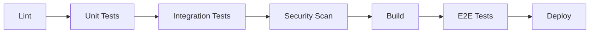

# Testing Overview

<Info>
**SDD Classification:** L3-Technical | **Authority:** QA Lead + Engineering Leadership | **Review Cycle:** Monthly
</Info>

This document defines the testing strategy, frameworks, and practices for the Materi platform. It establishes quality standards across all service layers and provides guidance for implementing effective tests.

**Testing Pyramid**: 70% Unit, 20% Integration, 10% E2E
**Coverage Target**: >85% line coverage
**Performance Target**: <10ms unit test avg, <500ms integration
**Quality Gate**: Zero critical defects in production

---

## Testing Philosophy

### Core Principles

1. **Deterministic Tests** - Tests must be reproducible and run reliably in CI
2. **Fast Feedback** - Unit tests complete in seconds, integration in minutes
3. **Test at Boundaries** - Focus testing on integration points and contracts
4. **Concrete Examples** - Include real request/response examples for all endpoints
5. **Documentation Sync** - Test changes that affect user-visible behavior require doc updates

---

## Test Layers

### Unit Tests

Fast, isolated behavior validation (preferred for most logic).

| Service | Framework | Command |
|---------|-----------|---------|
| **API (Go)** | testify | `go test ./...` |
| **Relay (Rust)** | tokio-test | `cargo test` |
| **Shield (Python)** | pytest | `pytest apps/` |

**Characteristics:**
- Execute in <10ms average
- No external dependencies (mocked)
- Single responsibility per test
- >85% line coverage requirement

### Integration Tests

Validate persistence, auth boundaries, and service contracts.

| Integration Type | Purpose | Location |
|------------------|---------|----------|
| **Database** | Schema, migrations, queries | `*/tests/integration/` |
| **API Contracts** | OpenAPI compliance | `testing/contracts/` |
| **Event Schemas** | Protobuf compatibility | `shared/proto/` |
| **Cross-Service** | Service-to-service calls | `testing/integration/` |

**Characteristics:**
- Execute in <500ms average
- Use test containers or test databases
- Validate contract boundaries
- Run in CI on every PR

### End-to-End Tests

Validate cross-service user flows including collaboration.

| Test Category | Tool | Location |
|---------------|------|----------|
| **UI Flows** | Playwright | `testing/e2e/` |
| **API Flows** | pytest | `testing/e2e/api/` |
| **Collaboration** | Custom WebSocket | `testing/e2e/collab/` |

**Characteristics:**
- Execute in <30s per test
- Full service stack required
- Covers critical user journeys
- Run on merge to main

---

## Service-Specific Testing

### API Service (Go)

```bash
cd api

# Run all tests
make test

# Run with coverage
make test-coverage

# Run specific test
go test -v -run TestDocumentService ./internal/service/
```

**Test Structure:**
```
api/
├── internal/
│   ├── handler/
│   │   └── document_handler_test.go
│   ├── service/
│   │   └── document_service_test.go
│   └── repository/
│       └── document_repository_test.go
└── tests/
    └── integration/
        └── document_integration_test.go
```

### Relay Service (Rust)

```bash
cd relay

# Run all tests
make test

# Run with coverage
cargo tarpaulin --out Html

# Run benchmarks
cargo bench
```

**Test Structure:**
```
relay/
├── src/
│   ├── crdt/
│   │   └── document_test.rs
│   └── websocket/
│       └── handler_test.rs
├── tests/
│   └── integration_test.rs
└── benches/
    └── crdt_benchmark.rs
```

### Shield Service (Python)

```bash
cd shield

# Run all tests
make test

# Run with coverage
pytest --cov=apps --cov-report=html

# Run specific app tests
pytest apps/users/tests/ -v
```

**Test Structure:**
```
shield/
└── apps/
    ├── users/
    │   └── tests/
    │       ├── test_models.py
    │       ├── test_views.py
    │       └── test_services.py
    └── workspaces/
        └── tests/
```

---

## What to Run Before Opening a PR

At minimum:

1. **Run the service's standard test target** (see its `Makefile`)
2. **If you changed an integration surface**, update contracts and docs:
   - HTTP behavior: update OpenAPI and ensure reference drift check passes
   - Events: update protobuf schemas and ensure consumers remain compatible

### Pre-PR Checklist

```bash
# API Service
cd api && make lint && make test

# Relay Service
cd relay && make fmt-check && make lint && make test

# Shield Service
cd shield && flake8 . && pytest

# Contract validation
cd platform/atlas && python3 scripts/sync_reference.py --check
```

---

## Test Data Management

### Test Fixtures

| Service | Location | Format |
|---------|----------|--------|
| **API** | `api/testdata/` | JSON |
| **Relay** | `relay/tests/fixtures/` | JSON |
| **Shield** | `shield/fixtures/` | JSON/YAML |

### Test Databases

| Service | Database | Port |
|---------|----------|------|
| **API** | `materi_test` | 5432 |
| **Relay** | `materi_relay_test` | 5433 |
| **Shield** | Auto-created by Django | - |

---

## Continuous Integration

### CI Pipeline Stages



### Quality Gates

| Gate | Criteria | Required |
|------|----------|----------|
| **Lint** | Zero errors | Yes |
| **Unit Tests** | 100% pass, >85% coverage | Yes |
| **Integration** | 100% pass | Yes |
| **Security** | No high/critical findings | Yes |
| **Performance** | P95 < threshold | Yes |

---

## Performance Testing

### Load Testing

```bash
# Run k6 load test
cd testing/load
k6 run api-load-test.js

# Run with specific VUs
k6 run --vus 100 --duration 5m api-load-test.js
```

### Performance Targets

| Metric | Target | Measurement |
|--------|--------|-------------|
| **API P95 Latency** | <50ms | k6 |
| **Collaboration P95** | <25ms | Custom benchmark |
| **Throughput** | >100K req/sec | k6 |

---

## Security Testing

### Automated Security Scans

| Tool | Service | Command |
|------|---------|---------|
| **gosec** | API | `gosec ./...` |
| **cargo-audit** | Relay | `cargo audit` |
| **bandit** | Shield | `bandit -r apps/` |
| **Semgrep** | All | `semgrep --config auto` |

### Security Test Categories

1. **SAST** - Static analysis (gosec, bandit, Semgrep)
2. **Dependency Scan** - Known vulnerabilities (cargo-audit, pip-audit)
3. **Container Scan** - Image vulnerabilities (Trivy)
4. **DAST** - Dynamic testing (OWASP ZAP)

---

## Mocking and Test Doubles

### Go Mocking (testify)

```go
type MockDocumentRepository struct {
    mock.Mock
}

func (m *MockDocumentRepository) Create(ctx context.Context, doc *model.Document) error {
    args := m.Called(ctx, doc)
    return args.Error(0)
}
```

### Rust Mocking (mockall)

```rust
#[automock]
trait DocumentRepository {
    async fn create(&self, doc: Document) -> Result<Document, Error>;
}
```

### Python Mocking (pytest-mock)

```python
def test_create_document(mocker):
    mock_repo = mocker.patch('apps.documents.services.DocumentRepository')
    mock_repo.create.return_value = Document(id='doc-123')
```

---

## Related Documentation

- [Verification Matrix](/internal/architecture/specs/verification-matrix) - Full VVP
- [Git Workflow](/developer/contributing/git-workflow) - CI integration
- [Contributing Overview](/developer/contributing/overview) - Development process
- [SLO/SLI/SLA](/internal/engineering/performance/slo-sli-sla) - Performance targets

---

**Document Status:** Complete
**Version:** 2.0
**Last Updated:** January 2026
**Authority:** QA Lead + Engineering Leadership
**Classification:** L3-Technical - Testing Strategy

**Distribution:** Engineering Teams, QA Team
