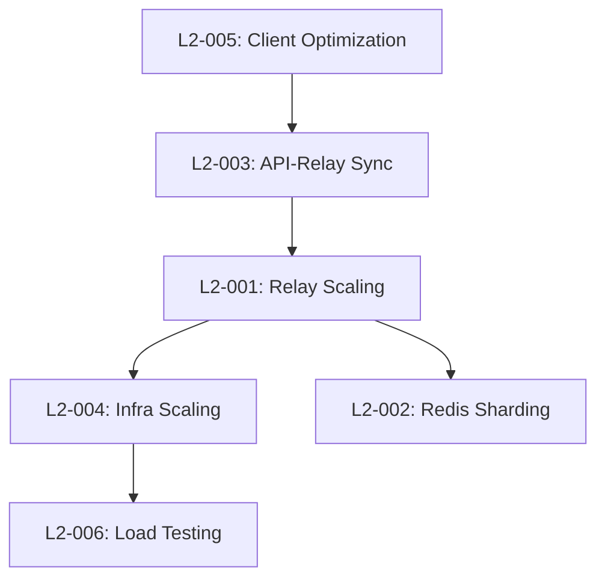

# System Requirement Specification: Issue Templates & Workflow Orchestration

**Document Version:** 1.0.0
**Date:** 2025-12-22
**Status:** Draft
**Authors:** Platform Engineering Team
**Classification:** Internal - Architecture

---

## Table of Contents

1. [Executive Summary](#executive-summary)
2. [System Overview](#system-overview)
3. [Architectural Context](#architectural-context)
4. [Issue Template Specifications](#issue-template-specifications)
5. [GitHub-to-Linear Synchronization](#github-to-linear-synchronization)
6. [L1/L2 Level Specifications](#l1l2-level-specifications)
7. [Workflow Orchestration](#workflow-orchestration)
8. [Technical Requirements](#technical-requirements)
9. [Security & Compliance](#security-compliance)
10. [Implementation Roadmap](#implementation-roadmap)

---

## 1. Executive Summary

### 1.1 Purpose

This System Requirement Specification (SRS) defines the comprehensive issue template system and workflow orchestration for the Materi ecosystem across its four main architectural segments:

- **Domain** - Core microservices (API, Relay, Shield, Manuscript, Printery)
- **Platform** - Cross-cutting services (Aria AI, Intelligence tools)
- **Products** - User-facing applications and specifications
- **Operations** - Infrastructure, deployment, and observability

### 1.2 Objectives

1. **Standardize Issue Creation** - Consistent, structured issue templates across all segments
2. **Enable Traceability** - Link issues to requirements, PRs, and implementations
3. **Automate Workflows** - GitHub-to-Linear readonly sync for unified project tracking
4. **Support Multi-Level Planning** - L1 (Strategic) and L2 (Tactical) specifications
5. **Improve Visibility** - Cross-segment dependency tracking and reporting

### 1.3 Scope

**In Scope:**
- GitHub issue templates for all 4 architectural segments
- GitHub PR templates with segment-specific customizations
- GitHub-to-Linear synchronization (readonly, comment-enabled)
- L1/L2 specification templates and workflows
- Cross-segment dependency tracking
- Automated labeling and routing

**Out of Scope:**
- Linear-to-GitHub sync (unidirectional only)
- External ticketing system integrations (Jira, Azure DevOps)
- Custom GitHub Apps (using Actions + webhooks only)

---

## 2. System Overview

### 2.1 Architecture Context

```
┌─────────────────────────────────────────────────────────────────┐
│                    MATERI ECOSYSTEM                              │
├─────────────────────────────────────────────────────────────────┤
│                                                                  │
│  ┌──────────────┐  ┌──────────────┐  ┌──────────────┐         │
│  │   DOMAIN     │  │   PLATFORM   │  │   PRODUCTS   │         │
│  │  (Services)  │  │     (AI)     │  │   (Apps)     │         │
│  └──────────────┘  └──────────────┘  └──────────────┘         │
│         │                  │                  │                 │
│         └──────────────────┴──────────────────┘                 │
│                           │                                     │
│                  ┌──────────────┐                               │
│                  │  OPERATIONS  │                               │
│                  │   (Infra)    │                               │
│                  └──────────────┘                               │
│                                                                  │
│  ┌──────────────────────────────────────────────────────────┐  │
│  │           ISSUE & WORKFLOW ORCHESTRATION                 │  │
│  │                                                          │  │
│  │  GitHub Issues → GitHub Actions → Linear (readonly)     │  │
│  │       ↓              ↓                 ↓                 │  │
│  │  Templates    Automation         Project Views          │  │
│  └──────────────────────────────────────────────────────────┘  │
└─────────────────────────────────────────────────────────────────┘
```

### 2.2 Key Principles

1. **Segment-Aware Templates** - Each architectural segment has tailored issue types
2. **Traceability First** - All issues link to requirements, PRs, and implementations
3. **Readonly Sync** - Linear is a readonly mirror with commenting enabled
4. **Progressive Disclosure** - Simple templates with optional advanced fields
5. **Automation by Default** - Minimize manual categorization and routing

---

## 3. Architectural Context

### 3.1 Segment Definitions

#### 3.1.1 Domain Segment

**Scope:** Core business logic microservices
**Services:** API (Go), Relay (Rust), Shield (Python), Manuscript (Proto), Printery (Go)
**Issue Focus:** Service implementation, event-driven architecture, performance, reliability

**Key Characteristics:**
- Event-driven communication via Redis Streams
- Polyglot architecture (Go, Rust, Python)
- High-performance requirements (<50ms p95)
- Shared infrastructure (PostgreSQL, Redis)

#### 3.1.2 Platform Segment

**Scope:** Cross-cutting enhancement services
**Services:** Aria (AI/FastAPI), Scribe (Documentation), GitHub integrations
**Issue Focus:** AI features, content analysis, safety gates, platform intelligence

**Key Characteristics:**
- Enhancement, not dependency (graceful degradation)
- Python-based (FastAPI, spaCy, transformers)
- External AI API integration (Claude, OpenAI)
- Observability-first design

#### 3.1.3 Products Segment

**Scope:** User-facing applications and specifications
**Components:** Canvas (React/TS monorepo), Atlas (Documentation), __spec__ (Requirements)
**Issue Focus:** Frontend features, UX/UI, requirements traceability, documentation

**Key Characteristics:**
- Turborepo monorepo with pnpm workspaces
- Requirements-driven development
- ADHD-friendly documentation standards
- Design system with Storybook

#### 3.1.4 Operations Segment

**Scope:** Infrastructure, deployment, monitoring
**Services:** Folio (Observability), GitOps, Terraform, Kubernetes, N8N workflows
**Issue Focus:** Infrastructure, deployment pipelines, monitoring, incident response

**Key Characteristics:**
- Infrastructure as Code (Terraform)
- GitOps deployment patterns
- Prometheus + Grafana + Jaeger observability
- Automated runbooks and alerting

### 3.2 Cross-Segment Dependencies

```yaml
Common Dependencies:
  - All segments use GitHub for version control
  - All segments publish to shared event streams
  - All segments integrate with observability stack
  - All segments follow common security policies

Integration Patterns:
  - Domain ↔ Platform: Event-driven AI enhancement
  - Domain ↔ Products: HTTP/WebSocket API consumption
  - Domain ↔ Operations: Deployment and monitoring
  - Products ↔ Platform: AI feature integration
  - All ↔ Operations: Infrastructure dependencies
```

---

## 4. Issue Template Specifications

### 4.1 Template Hierarchy

```
Issue Templates
├── Common (All Segments)
│   ├── bug_report.yml
│   ├── feature_request.yml
│   ├── documentation.yml
│   └── question.yml
│
├── Domain-Specific
│   ├── service_enhancement.yml
│   ├── performance_optimization.yml
│   ├── event_schema_change.yml
│   └── integration_issue.yml
│
├── Platform-Specific
│   ├── ai_feature_request.yml
│   ├── safety_gate_issue.yml
│   └── intelligence_enhancement.yml
│
├── Products-Specific
│   ├── ui_ux_issue.yml
│   ├── requirement_addition.yml
│   ├── design_system_issue.yml
│   └── frontend_bug.yml
│
└── Operations-Specific
    ├── infrastructure_issue.yml
    ├── deployment_issue.yml
    ├── monitoring_alert.yml
    └── runbook_request.yml
```

### 4.2 Common Issue Template: Bug Report

**File:** `.github/ISSUE_TEMPLATE/bug_report.yml`

```yaml
name: Bug Report
description: Report a bug or unexpected behavior
title: "[BUG] "
labels: ["type:bug", "status:triage"]
assignees: []

body:
  - type: markdown
    attributes:
      value: |
        ## Bug Report
        Thank you for taking the time to report this issue. Please provide as much detail as possible.

  - type: dropdown
    id: segment
    attributes:
      label: Architectural Segment
      description: Which part of the system does this affect?
      options:
        - Domain (API, Relay, Shield, Manuscript, Printery)
        - Platform (Aria, Intelligence, Integrations)
        - Products (Canvas, Atlas, Specifications)
        - Operations (Infrastructure, Deployment, Monitoring)
    validations:
      required: true

  - type: dropdown
    id: service
    attributes:
      label: Specific Service/Component
      description: Which service or component is affected?
      options:
        # Domain services
        - domain/api
        - domain/relay
        - domain/shield
        - domain/manuscript
        - domain/printery
        # Platform services
        - platform/aria
        - platform/scribe
        - platform/github
        # Product components
        - products/canvas
        - products/atlas
        - products/__spec__
        # Operations
        - operations/folio
        - operations/terraform
        - operations/kubernetes
        - operations/gitops
        - operations/n8n
        - Unknown / Multiple
    validations:
      required: true

  - type: dropdown
    id: severity
    attributes:
      label: Severity
      description: How severe is this bug?
      options:
        - Critical (System down, data loss)
        - High (Major feature broken)
        - Medium (Feature impaired)
        - Low (Minor issue, workaround exists)
    validations:
      required: true

  - type: textarea
    id: description
    attributes:
      label: Bug Description
      description: A clear and concise description of the bug
      placeholder: What happened? What did you expect to happen?
    validations:
      required: true

  - type: textarea
    id: reproduce
    attributes:
      label: Steps to Reproduce
      description: Detailed steps to reproduce the behavior
      placeholder: |
        1. Go to '...'
        2. Execute command '...'
        3. Observe error '...'
    validations:
      required: true

  - type: textarea
    id: expected
    attributes:
      label: Expected Behavior
      description: What you expected to happen
    validations:
      required: true

  - type: textarea
    id: actual
    attributes:
      label: Actual Behavior
      description: What actually happened
    validations:
      required: true

  - type: textarea
    id: environment
    attributes:
      label: Environment
      description: System information
      placeholder: |
        - OS: [e.g., macOS 14, Ubuntu 22.04]
        - Version: [e.g., v1.2.3]
        - Browser (if applicable): [e.g., Chrome 120]
        - Node version (if applicable): [e.g., 20.10.0]
    validations:
      required: false

  - type: textarea
    id: logs
    attributes:
      label: Logs and Error Messages
      description: Relevant logs, stack traces, or error messages
      render: shell
    validations:
      required: false

  - type: textarea
    id: context
    attributes:
      label: Additional Context
      description: Any other context, screenshots, or relevant information
    validations:
      required: false

  - type: input
    id: requirement_link
    attributes:
      label: Related Requirement (if applicable)
      description: Link to requirement document (e.g., FR-DOC-001)
      placeholder: FR-XXX-YYY
    validations:
      required: false

  - type: checkboxes
    id: checklist
    attributes:
      label: Pre-submission Checklist
      options:
        - label: I have searched existing issues to avoid duplicates
          required: true
        - label: I have included all relevant information
          required: true
        - label: I have assigned appropriate labels (will be auto-labeled)
          required: false
```

### 4.3 Domain-Specific: Service Enhancement

**File:** `.github/ISSUE_TEMPLATE/domain_service_enhancement.yml`

```yaml
name: Domain Service Enhancement
description: Propose an enhancement to a domain service
title: "[DOMAIN-ENHANCE] "
labels: ["segment:domain", "type:enhancement", "status:triage"]

body:
  - type: markdown
    attributes:
      value: |
        ## Domain Service Enhancement
        For improvements to API, Relay, Shield, Manuscript, or Printery services.

  - type: dropdown
    id: service
    attributes:
      label: Target Service
      options:
        - domain/api (Go/Fiber)
        - domain/relay (Rust/Axum)
        - domain/shield (Python/Django)
        - domain/manuscript (Protocol Buffers)
        - domain/printery (Go Event Consumer)
        - Cross-service (multiple services affected)
    validations:
      required: true

  - type: dropdown
    id: enhancement_type
    attributes:
      label: Enhancement Type
      options:
        - New API Endpoint
        - Performance Optimization
        - Event Schema Addition/Change
        - Security Enhancement
        - Observability Improvement
        - Database Schema Change
        - Refactoring
        - Other
    validations:
      required: true

  - type: textarea
    id: motivation
    attributes:
      label: Motivation
      description: Why is this enhancement needed?
      placeholder: Business case, user need, or technical debt resolution
    validations:
      required: true

  - type: textarea
    id: proposal
    attributes:
      label: Proposed Solution
      description: Detailed description of the proposed enhancement
    validations:
      required: true

  - type: textarea
    id: design
    attributes:
      label: Design Considerations
      description: Architecture, event flows, database changes
      placeholder: |
        - Event streams affected: materi:events:*
        - Database migrations required: Yes/No
        - Breaking changes: Yes/No
        - Backward compatibility: Describe strategy
    validations:
      required: true

  - type: textarea
    id: testing
    attributes:
      label: Testing Strategy
      description: How will this be tested?
      placeholder: |
        - Unit tests
        - Integration tests
        - Performance benchmarks
        - Load testing requirements
    validations:
      required: true

  - type: input
    id: performance_target
    attributes:
      label: Performance Target (if applicable)
      description: Target latency, throughput, or other metrics
      placeholder: "e.g., <50ms p95, 1000 req/s"
    validations:
      required: false

  - type: textarea
    id: dependencies
    attributes:
      label: Dependencies
      description: Other services, PRs, or issues this depends on
      placeholder: |
        - Requires: #123, #456
        - Blocks: #789
        - Related to: FR-XXX-001
    validations:
      required: false

  - type: dropdown
    id: breaking_change
    attributes:
      label: Breaking Change?
      options:
        - No (backward compatible)
        - Yes (requires migration)
        - Potentially (needs investigation)
    validations:
      required: true

  - type: input
    id: requirement_link
    attributes:
      label: Linked Requirement
      description: Link to requirement ID (e.g., FR-API-DOC-001)
    validations:
      required: false

  - type: checkboxes
    id: checklist
    attributes:
      label: Implementation Checklist
      options:
        - label: Event schema documented in Manuscript
        - label: Database migrations planned
        - label: Observability metrics defined
        - label: Rollback strategy documented
        - label: Documentation updates identified
```

### 4.4 Platform-Specific: AI Feature Request

**File:** `.github/ISSUE_TEMPLATE/platform_ai_feature.yml`

```yaml
name: Platform AI Feature
description: Request a new AI feature or enhancement
title: "[PLATFORM-AI] "
labels: ["segment:platform", "service:aria", "type:feature", "status:triage"]

body:
  - type: markdown
    attributes:
      value: |
        ## Platform AI Feature Request
        For Aria AI service enhancements and new analysis capabilities.

  - type: dropdown
    id: feature_category
    attributes:
      label: Feature Category
      options:
        - Content Analysis (text, code, diagrams)
        - Safety Gates (code safety, risk detection)
        - Enhancement Suggestions (grammar, clarity, tone)
        - New Analysis Type
        - Model Integration
        - Performance Optimization
        - Other
    validations:
      required: true

  - type: textarea
    id: use_case
    attributes:
      label: Use Case
      description: What problem does this solve for users?
    validations:
      required: true

  - type: textarea
    id: feature_description
    attributes:
      label: Feature Description
      description: Detailed description of the AI feature
    validations:
      required: true

  - type: textarea
    id: input_output
    attributes:
      label: Input/Output Specification
      description: What data goes in? What data comes out?
      placeholder: |
        Input:
        - Content type: text/code/diagram
        - Format: markdown/JSON/mermaid
        - Size limits: max 10KB

        Output:
        - Analysis results
        - Confidence scores
        - Suggestions array
    validations:
      required: true

  - type: dropdown
    id: model_requirement
    attributes:
      label: Model Requirement
      description: Does this require external AI APIs?
      options:
        - Local models only (spaCy, transformers)
        - Claude API required
        - OpenAI API required
        - Multiple models (hybrid approach)
        - No model required (rule-based)
    validations:
      required: true

  - type: textarea
    id: performance_requirements
    attributes:
      label: Performance Requirements
      description: Latency and throughput expectations
      placeholder: |
        - Max latency: 5s (p95)
        - Throughput: 100 analyses/minute
        - Cache strategy: Redis with 1h TTL
    validations:
      required: true

  - type: dropdown
    id: graceful_degradation
    attributes:
      label: Graceful Degradation Strategy
      description: How should the system behave if this feature fails?
      options:
        - Skip analysis, return empty result
        - Use cached result if available
        - Fall back to simpler analysis
        - Retry with exponential backoff
    validations:
      required: true

  - type: textarea
    id: safety_considerations
    attributes:
      label: Safety & Privacy Considerations
      description: Data handling, PII concerns, GDPR compliance
    validations:
      required: true

  - type: input
    id: requirement_link
    attributes:
      label: Linked Requirement
      description: Link to requirement (e.g., FR-AI-001)
    validations:
      required: false

  - type: checkboxes
    id: checklist
    attributes:
      label: Implementation Checklist
      options:
        - label: Graceful degradation strategy defined
        - label: Performance benchmarks specified
        - label: Privacy/GDPR compliance reviewed
        - label: Cost estimate for external APIs
        - label: Monitoring metrics defined
```

### 4.5 Products-Specific: Frontend Feature

**File:** `.github/ISSUE_TEMPLATE/products_frontend_feature.yml`

```yaml
name: Products Frontend Feature
description: Request a new frontend feature or UI enhancement
title: "[PRODUCTS-FEATURE] "
labels: ["segment:products", "component:canvas", "type:feature", "status:triage"]

body:
  - type: markdown
    attributes:
      value: |
        ## Products Frontend Feature
        For Canvas monorepo, Atlas documentation, or UI/UX enhancements.

  - type: dropdown
    id: component
    attributes:
      label: Component
      options:
        - Canvas (Frontend monorepo)
        - Atlas (Documentation)
        - Design System (Storybook)
        - Requirements (__spec__)
        - Cross-component
    validations:
      required: true

  - type: dropdown
    id: feature_type
    attributes:
      label: Feature Type
      options:
        - New Component
        - Component Enhancement
        - Page/Route
        - API Integration
        - State Management
        - Performance Optimization
        - Accessibility Improvement
        - Design System Addition
        - Documentation
        - Other
    validations:
      required: true

  - type: textarea
    id: user_story
    attributes:
      label: User Story
      description: As a [role], I want [feature] so that [benefit]
      placeholder: "As a content creator, I want real-time collaboration so that I can work with my team simultaneously."
    validations:
      required: true

  - type: textarea
    id: acceptance_criteria
    attributes:
      label: Acceptance Criteria
      description: Conditions that must be met for this feature to be complete
      placeholder: |
        - [ ] User can see other users' cursors
        - [ ] Changes sync within 50ms
        - [ ] Conflicts are automatically resolved
        - [ ] UI shows connection status
    validations:
      required: true

  - type: textarea
    id: design_mockups
    attributes:
      label: Design Mockups / Wireframes
      description: Links to Figma, screenshots, or ASCII diagrams
    validations:
      required: false

  - type: dropdown
    id: priority
    attributes:
      label: Priority
      options:
        - P0 (Critical - Blocker)
        - P1 (High - Important)
        - P2 (Medium - Nice to have)
        - P3 (Low - Future enhancement)
    validations:
      required: true

  - type: textarea
    id: technical_approach
    attributes:
      label: Technical Approach
      description: Proposed implementation strategy
      placeholder: |
        - React component structure
        - State management (Context/Redux)
        - API integration points
        - Reusable design tokens
    validations:
      required: false

  - type: dropdown
    id: device_support
    attributes:
      label: Device Support
      options:
        - Desktop only
        - Mobile responsive required
        - Tablet support required
        - Cross-platform (all devices)
    validations:
      required: true

  - type: dropdown
    id: accessibility
    attributes:
      label: Accessibility Requirements
      options:
        - WCAG 2.1 AA compliance required
        - Keyboard navigation required
        - Screen reader support required
        - All of the above
        - Not applicable
    validations:
      required: true

  - type: input
    id: requirement_link
    attributes:
      label: Linked Requirement
      description: Link to requirement (e.g., FR-COLLAB-001)
    validations:
      required: false

  - type: textarea
    id: dependencies
    attributes:
      label: Dependencies
      description: Backend APIs, design system components, other features
    validations:
      required: false

  - type: checkboxes
    id: checklist
    attributes:
      label: Definition of Done
      options:
        - label: Unit tests written (Jest + RTL)
        - label: Storybook story created
        - label: Accessibility tested
        - label: Responsive design verified
        - label: Performance benchmarked
        - label: Documentation updated
```

### 4.6 Operations-Specific: Infrastructure Issue

**File:** `.github/ISSUE_TEMPLATE/operations_infrastructure.yml`

```yaml
name: Operations Infrastructure Issue
description: Report or request infrastructure changes
title: "[OPS-INFRA] "
labels: ["segment:operations", "type:infrastructure", "status:triage"]

body:
  - type: markdown
    attributes:
      value: |
        ## Operations Infrastructure Issue
        For infrastructure, deployment, monitoring, and operational concerns.

  - type: dropdown
    id: category
    attributes:
      label: Category
      options:
        - Infrastructure Provisioning
        - Deployment Pipeline
        - Monitoring & Alerting
        - Incident Response
        - Performance Issue
        - Cost Optimization
        - Security & Compliance
        - Disaster Recovery
        - Other
    validations:
      required: true

  - type: dropdown
    id: service
    attributes:
      label: Operational Service
      options:
        - operations/folio (Observability)
        - operations/terraform (IaC)
        - operations/kubernetes (K8s)
        - operations/gitops (ArgoCD)
        - operations/n8n (Workflow automation)
        - operations/prometheus (Metrics)
        - operations/alertmanager (Alerts)
        - Cross-operational
    validations:
      required: true

  - type: dropdown
    id: environment
    attributes:
      label: Environment
      options:
        - Development
        - Staging
        - Production
        - All Environments
    validations:
      required: true

  - type: dropdown
    id: urgency
    attributes:
      label: Urgency
      options:
        - Emergency (Production down)
        - High (Service degraded)
        - Medium (Operational improvement)
        - Low (Nice to have)
    validations:
      required: true

  - type: textarea
    id: description
    attributes:
      label: Issue Description
      description: Detailed description of the infrastructure issue or request
    validations:
      required: true

  - type: textarea
    id: impact
    attributes:
      label: Impact Analysis
      description: What services/users are affected?
      placeholder: |
        - Affected services: API, Relay
        - User impact: 30% latency increase
        - Revenue impact: Potential SLA breach
    validations:
      required: true

  - type: textarea
    id: current_state
    attributes:
      label: Current State
      description: Current infrastructure configuration
    validations:
      required: false

  - type: textarea
    id: desired_state
    attributes:
      label: Desired State
      description: What should the infrastructure look like after this issue is resolved?
    validations:
      required: true

  - type: textarea
    id: technical_details
    attributes:
      label: Technical Details
      description: Terraform modules, K8s manifests, configuration changes
      render: yaml
    validations:
      required: false

  - type: textarea
    id: monitoring
    attributes:
      label: Monitoring & Alerts
      description: Relevant metrics, dashboards, or alert rules
      placeholder: |
        - Dashboard: Grafana - API Performance
        - Alert: High latency (>200ms p95)
        - Metric: http_request_duration_seconds
    validations:
      required: false

  - type: textarea
    id: rollback_plan
    attributes:
      label: Rollback Plan
      description: How to revert if changes cause issues
    validations:
      required: false

  - type: input
    id: runbook_link
    attributes:
      label: Related Runbook
      description: Link to operational runbook if applicable
    validations:
      required: false

  - type: checkboxes
    id: checklist
    attributes:
      label: Operational Checklist
      options:
        - label: Change window scheduled (if production)
        - label: Rollback plan documented
        - label: Monitoring dashboards updated
        - label: On-call team notified
        - label: Post-mortem required (if incident)
```

---

## 5. GitHub-to-Linear Synchronization

### 5.1 Synchronization Requirements

#### 5.1.1 Sync Direction

```yaml
Direction: GitHub → Linear (Unidirectional)

GitHub:
  - Source of truth for issues
  - Full editing capabilities
  - Automated workflows
  - Label management

Linear:
  - Readonly mirror
  - Comments enabled (synced back to GitHub)
  - Project management views
  - Reporting and analytics
```

#### 5.1.2 Sync Scope

**Synchronized Elements:**
- Issue title
- Issue description/body
- Issue labels (mapped to Linear labels)
- Issue assignees
- Issue status (open/closed)
- Issue comments (bidirectional for comments only)
- Issue metadata (created_at, updated_at)

**Not Synchronized:**
- GitHub Projects (use Linear projects instead)
- GitHub Milestones (map to Linear cycles)
- Pull Requests (link to issues via keywords)
- GitHub Discussions
- Draft issues

### 5.2 Label Mapping Schema

```yaml
# .github/linear-sync-config.yml

label_mapping:
  # Architectural Segments
  segment:domain:
    linear_label: "Segment: Domain"
    linear_color: "#4A90E2"

  segment:platform:
    linear_label: "Segment: Platform"
    linear_color: "#7B68EE"

  segment:products:
    linear_label: "Segment: Products"
    linear_color: "#50C878"

  segment:operations:
    linear_label: "Segment: Operations"
    linear_color: "#FF6B6B"

  # Issue Types
  type:bug:
    linear_label: "Type: Bug"
    linear_priority: 2  # High

  type:feature:
    linear_label: "Type: Feature"
    linear_priority: 3  # Medium

  type:enhancement:
    linear_label: "Type: Enhancement"
    linear_priority: 3  # Medium

  type:documentation:
    linear_label: "Type: Documentation"
    linear_priority: 4  # Low

  # Status
  status:triage:
    linear_state: "Triage"

  status:in-progress:
    linear_state: "In Progress"

  status:blocked:
    linear_state: "Blocked"

  status:review:
    linear_state: "In Review"

  status:done:
    linear_state: "Done"

  # Priority
  priority:critical:
    linear_priority: 0  # Urgent

  priority:high:
    linear_priority: 1  # High

  priority:medium:
    linear_priority: 2  # Medium

  priority:low:
    linear_priority: 3  # Low

  # Services (Domain)
  service:api:
    linear_label: "Service: API"
    linear_team: "domain-services"

  service:relay:
    linear_label: "Service: Relay"
    linear_team: "domain-services"

  service:shield:
    linear_label: "Service: Shield"
    linear_team: "domain-services"

  # Services (Platform)
  service:aria:
    linear_label: "Service: Aria"
    linear_team: "platform-services"

  # Components (Products)
  component:canvas:
    linear_label: "Component: Canvas"
    linear_team: "product-team"

  component:atlas:
    linear_label: "Component: Atlas"
    linear_team: "product-team"

  # Operational
  ops:infrastructure:
    linear_label: "Ops: Infrastructure"
    linear_team: "operations-team"

  ops:deployment:
    linear_label: "Ops: Deployment"
    linear_team: "operations-team"
```

### 5.3 Sync Implementation

#### 5.3.1 GitHub Action Workflow

**File:** `.github/workflows/linear-sync.yml`

```yaml
name: GitHub to Linear Sync

on:
  issues:
    types: [opened, edited, closed, reopened, labeled, unlabeled, assigned, unassigned]
  issue_comment:
    types: [created, edited, deleted]

jobs:
  sync-to-linear:
    runs-on: ubuntu-latest
    steps:
      - name: Checkout repository
        uses: actions/checkout@v4

      - name: Sync Issue to Linear
        uses: linear/linear-github-sync@v1
        with:
          linear-api-key: ${{ secrets.LINEAR_API_KEY }}
          github-token: ${{ secrets.GITHUB_TOKEN }}
          config-file: .github/linear-sync-config.yml
          sync-mode: readonly
          enable-comments: true

      - name: Add Linear Link Comment
        if: github.event.action == 'opened'
        uses: actions/github-script@v7
        with:
          script: |
            const linearIssueId = context.payload.issue.number;
            github.rest.issues.createComment({
              issue_number: context.issue.number,
              owner: context.repo.owner,
              repo: context.repo.repo,
              body: `🔗 This issue has been synced to Linear: [View in Linear](https://linear.app/materi/issue/${linearIssueId})`
            });
```

#### 5.3.2 Comment Sync (Bidirectional)

**Linear Comment → GitHub Comment:**

```yaml
# Linear Webhook Configuration
webhook:
  url: https://api.github.com/repos/materi/platform/issues/{issue_number}/comments
  events:
    - comment.created
    - comment.updated

  payload_transform:
    body: |
      💬 **Linear Comment by {user}**

      {comment_body}

      _Posted via Linear at {timestamp}_
```

### 5.4 Sync Rules & Constraints

```yaml
sync_rules:
  # Only sync issues with specific labels
  filter_labels:
    - "sync:linear"
    - OR any segment label (segment:*)

  # Exclude certain issues
  exclude_labels:
    - "no-sync"
    - "draft"

  # Rate limiting
  rate_limit:
    max_requests_per_minute: 60
    backoff_strategy: exponential

  # Conflict resolution
  conflict_resolution:
    strategy: github_wins  # GitHub is source of truth
    log_conflicts: true
    notify_on_conflict: true

  # Retry policy
  retry:
    max_attempts: 3
    retry_on_errors: [429, 500, 502, 503, 504]
    backoff_multiplier: 2
```

---

## 6. L1/L2 Level Specifications

### 6.1 Specification Hierarchy

```
L0: Vision & Strategy (CEO, CTO, VPs)
  ↓
L1: Strategic Specifications (Product, Architecture)
  ↓
L2: Tactical Specifications (Engineering Teams)
  ↓
L3: Implementation (Individual Engineers)
```

### 6.2 L1 Specification Template

**Level:** Strategic Planning
**Audience:** Product Managers, Engineering Managers, Architects
**Timeframe:** Quarterly to Annual

#### 6.2.1 L1 Template Structure

**File:** `.github/ISSUE_TEMPLATE/l1_strategic_spec.yml`

```yaml
name: L1 Strategic Specification
description: High-level strategic planning document
title: "[L1] "
labels: ["level:L1", "type:strategic", "status:draft"]

body:
  - type: markdown
    attributes:
      value: |
        ## L1 Strategic Specification
        For quarterly and annual strategic initiatives spanning multiple segments.

  - type: input
    id: initiative_id
    attributes:
      label: Initiative ID
      description: Unique identifier (e.g., L1-2025-Q1-COLLAB)
      placeholder: L1-YYYY-QN-NAME
    validations:
      required: true

  - type: dropdown
    id: strategic_theme
    attributes:
      label: Strategic Theme
      options:
        - Platform Scalability
        - User Experience Enhancement
        - AI/ML Integration
        - Enterprise Readiness
        - Developer Experience
        - Operational Excellence
        - Security & Compliance
        - Cost Optimization
    validations:
      required: true

  - type: textarea
    id: vision
    attributes:
      label: Vision Statement
      description: What is the desired end state?
      placeholder: "In 6 months, Materi will support 10,000 concurrent users with sub-50ms latency..."
    validations:
      required: true

  - type: textarea
    id: business_objectives
    attributes:
      label: Business Objectives
      description: Measurable business outcomes
      placeholder: |
        1. Increase user engagement by 30%
        2. Reduce infrastructure costs by 20%
        3. Achieve SOC 2 compliance
    validations:
      required: true

  - type: textarea
    id: affected_segments
    attributes:
      label: Affected Architectural Segments
      description: Which segments are impacted?
      placeholder: |
        - Domain: API (performance), Relay (scaling)
        - Platform: Aria (AI features)
        - Products: Canvas (UI updates)
        - Operations: Infrastructure scaling
    validations:
      required: true

  - type: textarea
    id: l2_breakdown
    attributes:
      label: L2 Tactical Breakdown
      description: High-level decomposition into L2 initiatives
      placeholder: |
        - L2-001: API performance optimization
        - L2-002: Relay horizontal scaling
        - L2-003: Frontend latency reduction
        - L2-004: Infrastructure cost analysis
    validations:
      required: true

  - type: textarea
    id: success_metrics
    attributes:
      label: Success Metrics (KPIs)
      description: How will success be measured?
      placeholder: |
        - API p95 latency: <50ms (current: 200ms)
        - Concurrent users: 10,000 (current: 500)
        - Infrastructure cost: $10k/month (current: $15k/month)
        - User satisfaction: 4.5/5 (current: 3.8/5)
    validations:
      required: true

  - type: dropdown
    id: risk_level
    attributes:
      label: Risk Assessment
      options:
        - Low (well-understood, low complexity)
        - Medium (some unknowns, moderate complexity)
        - High (significant unknowns, high complexity)
    validations:
      required: true

  - type: textarea
    id: risks
    attributes:
      label: Identified Risks
      description: Key risks and mitigation strategies
      placeholder: |
        Risk 1: Database migration may cause downtime
        Mitigation: Blue-green deployment with rollback plan

        Risk 2: External AI API costs may exceed budget
        Mitigation: Implement caching and rate limiting
    validations:
      required: true

  - type: textarea
    id: dependencies
    attributes:
      label: Cross-Segment Dependencies
      description: Dependencies between segments
      placeholder: |
        - Domain/API depends on Operations/Infrastructure scaling
        - Platform/Aria depends on Domain/API event stream updates
        - Products/Canvas depends on Domain/Relay WebSocket changes
    validations:
      required: true

  - type: input
    id: timeline
    attributes:
      label: Timeline
      description: Expected duration (e.g., Q1 2025, 12 weeks)
      placeholder: Q1 2025 (Jan-Mar)
    validations:
      required: true

  - type: textarea
    id: resources
    attributes:
      label: Resource Requirements
      description: Teams, budget, external dependencies
      placeholder: |
        Teams:
        - Domain team (2 engineers, 8 weeks)
        - Platform team (1 engineer, 4 weeks)
        - Operations team (1 SRE, 12 weeks)

        Budget:
        - Infrastructure: $5k
        - External APIs: $2k/month
        - Tools/licenses: $1k
    validations:
      required: true

  - type: checkboxes
    id: stakeholders
    attributes:
      label: Stakeholder Sign-off Required
      options:
        - label: Product Management
        - label: Engineering Management
        - label: Architecture Review
        - label: Security Review
        - label: Finance Approval
```

#### 6.2.2 L1 Specification Examples

**Example 1: Real-Time Collaboration at Scale**

```markdown
# [L1] L1-2025-Q1-COLLAB: Real-Time Collaboration at Scale

**Initiative ID:** L1-2025-Q1-COLLAB
**Strategic Theme:** Platform Scalability
**Timeline:** Q1 2025 (12 weeks)

## Vision Statement
Enable 10,000 concurrent users to collaborate on documents in real-time with sub-50ms operation latency, positioning Materi as the fastest collaborative document platform in the market.

## Business Objectives
1. Support 10,000 concurrent users (20x current capacity)
2. Achieve <50ms p95 latency for real-time operations
3. Maintain 99.95% uptime during peak usage
4. Reduce infrastructure cost per user by 30%

## Affected Segments
- **Domain/Relay:** Horizontal scaling, connection pooling, operation batching
- **Domain/API:** WebSocket → HTTP sync optimization
- **Operations/Infrastructure:** K8s auto-scaling, Redis Cluster
- **Products/Canvas:** Client-side optimistic UI updates

## L2 Tactical Breakdown
1. **L2-001:** Relay horizontal scaling architecture
2. **L2-002:** Redis Streams sharding strategy
3. **L2-003:** API-Relay bidirectional sync optimization
4. **L2-004:** Infrastructure auto-scaling policies
5. **L2-005:** Client-side performance optimization
6. **L2-006:** Load testing framework (1M operations/day)

## Success Metrics
| Metric | Current | Target | Measurement |
|--------|---------|--------|-------------|
| Concurrent users | 500 | 10,000 | Relay connections |
| Operation latency (p95) | 150ms | <50ms | OpenTelemetry |
| Uptime | 99.5% | 99.95% | Prometheus |
| Cost per user/month | $2.50 | $1.75 | AWS Cost Explorer |

## Risk Assessment: Medium

### Identified Risks
1. **Risk:** WebSocket connection limits on load balancers
   **Mitigation:** Use sticky sessions + connection draining

2. **Risk:** Redis Streams may become bottleneck
   **Mitigation:** Implement sharding by document ID

3. **Risk:** Database write contention under load
   **Mitigation:** Read replicas + write batching

## Cross-Segment Dependencies


## Resource Requirements
- **Domain Team:** 2 engineers × 10 weeks = 20 eng-weeks
- **Operations Team:** 1 SRE × 12 weeks = 12 eng-weeks
- **Products Team:** 1 engineer × 6 weeks = 6 eng-weeks
- **Budget:** $15,000 (infrastructure upgrades, load testing tools)

## Stakeholder Sign-off
- [x] Product Management (Jane Doe)
- [x] Engineering Management (John Smith)
- [x] Architecture Review (Alice Johnson)
- [ ] Security Review (Pending)
- [x] Finance Approval (Bob Williams)
```

### 6.3 L2 Specification Template

**Level:** Tactical Implementation
**Audience:** Engineering Teams, Tech Leads
**Timeframe:** Sprint to Quarter

#### 6.3.1 L2 Template Structure

**File:** `.github/ISSUE_TEMPLATE/l2_tactical_spec.yml`

```yaml
name: L2 Tactical Specification
description: Tactical implementation plan for engineering teams
title: "[L2] "
labels: ["level:L2", "type:tactical", "status:planning"]

body:
  - type: markdown
    attributes:
      value: |
        ## L2 Tactical Specification
        Detailed implementation plan derived from L1 strategic initiatives.

  - type: input
    id: l2_id
    attributes:
      label: L2 ID
      description: Unique identifier (e.g., L2-001-RELAY-SCALING)
      placeholder: L2-NNN-SERVICE-FEATURE
    validations:
      required: true

  - type: input
    id: parent_l1
    attributes:
      label: Parent L1 Initiative
      description: Link to parent L1 spec (e.g., #123)
      placeholder: "#123"
    validations:
      required: true

  - type: dropdown
    id: primary_segment
    attributes:
      label: Primary Segment
      options:
        - Domain
        - Platform
        - Products
        - Operations
    validations:
      required: true

  - type: dropdown
    id: primary_service
    attributes:
      label: Primary Service/Component
      options:
        - domain/api
        - domain/relay
        - domain/shield
        - domain/manuscript
        - domain/printery
        - platform/aria
        - products/canvas
        - products/atlas
        - operations/infrastructure
        - operations/folio
    validations:
      required: true

  - type: textarea
    id: objective
    attributes:
      label: Tactical Objective
      description: Specific, measurable goal for this L2 initiative
      placeholder: "Implement Redis Streams sharding to support 10,000 concurrent users"
    validations:
      required: true

  - type: textarea
    id: scope
    attributes:
      label: Scope
      description: What is included and excluded
      placeholder: |
        In Scope:
        - Redis Cluster setup (3-node)
        - Sharding logic by document_id
        - Migration from single instance

        Out of Scope:
        - Redis Sentinel (use K8s health checks)
        - Cross-region replication (future L2)
    validations:
      required: true

  - type: textarea
    id: technical_approach
    attributes:
      label: Technical Approach
      description: High-level technical solution
      placeholder: |
        1. Architecture Decision: Hash-based sharding on document_id
        2. Implementation:
           - Deploy Redis Cluster (3 masters, 3 replicas)
           - Update connection pool to use cluster client
           - Implement consistent hashing for stream keys
        3. Migration:
           - Dual-write to old + new clusters
           - Gradually migrate traffic
           - Cutover with zero downtime
    validations:
      required: true

  - type: textarea
    id: implementation_tasks
    attributes:
      label: Implementation Tasks
      description: Breakdown into GitHub issues/PRs
      placeholder: |
        - [ ] #501 - Redis Cluster Terraform module
        - [ ] #502 - Relay connection pool update
        - [ ] #503 - Sharding logic implementation
        - [ ] #504 - Migration script
        - [ ] #505 - Load testing validation
        - [ ] #506 - Monitoring dashboard
        - [ ] #507 - Documentation update
    validations:
      required: true

  - type: textarea
    id: acceptance_criteria
    attributes:
      label: Acceptance Criteria
      description: Definition of done
      placeholder: |
        - [ ] Redis Cluster deployed in staging + production
        - [ ] 10,000 concurrent users supported (load tested)
        - [ ] Zero data loss during migration
        - [ ] <50ms p95 latency maintained
        - [ ] Monitoring dashboards showing cluster health
        - [ ] Runbook documentation complete
    validations:
      required: true

  - type: textarea
    id: testing_strategy
    attributes:
      label: Testing Strategy
      description: How will this be validated?
      placeholder: |
        Unit Tests:
        - Sharding logic correctness
        - Connection pool handling

        Integration Tests:
        - Multi-node cluster operations
        - Failover scenarios

        Load Tests:
        - 10,000 concurrent connections
        - 1M operations/day sustained
        - Chaos engineering (node failures)
    validations:
      required: true

  - type: input
    id: timeline
    attributes:
      label: Timeline
      description: Expected duration (e.g., 4 weeks, Sprint 23-24)
      placeholder: 4 weeks (Sprint 23-24)
    validations:
      required: true

  - type: textarea
    id: dependencies
    attributes:
      label: Dependencies
      description: Blocking issues, PRs, or external dependencies
      placeholder: |
        Blocks: L2-002, L2-003
        Blocked by: Infrastructure team approval (#450)
        Related: Manuscript event schema v2 (#478)
    validations:
      required: false

  - type: dropdown
    id: risk_level
    attributes:
      label: Risk Level
      options:
        - Low
        - Medium
        - High
    validations:
      required: true

  - type: textarea
    id: rollback_plan
    attributes:
      label: Rollback Plan
      description: How to revert if this fails
      placeholder: |
        1. Immediate: Route traffic back to old Redis instance
        2. Data sync: Run reverse migration script
        3. Cleanup: Remove Redis Cluster resources
        4. Validation: Verify old system operational

        Rollback time: <30 minutes
    validations:
      required: true

  - type: checkboxes
    id: checklist
    attributes:
      label: Pre-Implementation Checklist
      options:
        - label: Architecture review completed
        - label: Security review completed (if applicable)
        - label: Load testing plan defined
        - label: Monitoring metrics defined
        - label: Rollback plan validated
        - label: Documentation plan created
```

#### 6.3.2 L2 Specification Examples

**Example 1: Redis Streams Sharding**

```markdown
# [L2] L2-002-REDIS-SHARDING: Redis Streams Sharding Strategy

**L2 ID:** L2-002-REDIS-SHARDING
**Parent L1:** #450 (L1-2025-Q1-COLLAB)
**Primary Segment:** Operations
**Primary Service:** operations/infrastructure

## Tactical Objective
Implement Redis Cluster with hash-based sharding to support 10,000 concurrent users and 1M events/day with <5ms event publishing latency.

## Scope

### In Scope
- Redis Cluster deployment (3 master nodes, 3 replicas)
- Hash-based sharding on `document_id`
- Connection pool updates in API, Relay, Shield
- Zero-downtime migration from single Redis instance
- Monitoring dashboards for cluster health

### Out of Scope
- Redis Sentinel (using K8s health checks instead)
- Cross-region replication (deferred to L2-015)
- Redis Streams TTL management (handled separately)

## Technical Approach

### Architecture Decision: Hash-Based Sharding

```
document_id → CRC16(document_id) % 16384 → Redis Cluster Slot
```

**Rationale:**
- Evenly distributes load across nodes
- Native Redis Cluster support (no custom routing)
- Automatic slot rebalancing on node addition

### Implementation Steps

1. **Deploy Redis Cluster**
   - Terraform module: `operations/terraform/modules/redis-cluster`
   - 3 master nodes (m5.large)
   - 3 replica nodes (m5.large)
   - Total: 6 nodes in cluster

2. **Update Client Libraries**
   - API (Go): `go-redis/redis/v9` with cluster support
   - Relay (Rust): `redis-rs` with cluster feature
   - Shield (Python): `redis-py-cluster`

3. **Migration Strategy**
   - Phase 1: Dual-write (old + new cluster, 1 week)
   - Phase 2: Validate data consistency
   - Phase 3: Read from new cluster, write to both
   - Phase 4: Cutover to new cluster only
   - Phase 5: Decommission old instance

### Event Stream Sharding

```yaml
Stream Key Format:
  Old: materi:events:documents
  New: materi:events:documents:{document_id}

Example:
  document_id: 01JFXYZ...
  stream_key: materi:events:documents:{01JFXYZ}
  slot: CRC16("01JFXYZ") % 16384 = 7352
  node: slot 7352 → Master Node 2
```

## Implementation Tasks

```markdown
- [ ] #501 - Terraform: Redis Cluster module
      Labels: ops:infrastructure, priority:high
      Estimate: 3 days

- [ ] #502 - API: Update redis client to cluster mode
      Labels: service:api, priority:high
      Estimate: 2 days

- [ ] #503 - Relay: Update redis-rs with cluster feature
      Labels: service:relay, priority:high
      Estimate: 2 days

- [ ] #504 - Shield: Update redis-py-cluster
      Labels: service:shield, priority:medium
      Estimate: 1 day

- [ ] #505 - Migration: Dual-write implementation
      Labels: ops:infrastructure, priority:critical
      Estimate: 3 days

- [ ] #506 - Load Testing: 10K concurrent users
      Labels: ops:testing, priority:high
      Estimate: 2 days

- [ ] #507 - Monitoring: Grafana dashboards
      Labels: ops:monitoring, priority:medium
      Estimate: 1 day

- [ ] #508 - Documentation: Runbook + architecture docs
      Labels: type:documentation, priority:medium
      Estimate: 1 day
```

## Acceptance Criteria

- [ ] Redis Cluster deployed in staging (3 masters, 3 replicas)
- [ ] Redis Cluster deployed in production (3 masters, 3 replicas)
- [ ] Load test: 10,000 concurrent users supported
- [ ] Load test: 1M events/day sustained
- [ ] Event publishing latency: <5ms (p95)
- [ ] Zero data loss during migration (validation script passed)
- [ ] Monitoring dashboards showing:
  - Cluster node health
  - Slot distribution
  - Memory usage per node
  - Network throughput
- [ ] Runbook documentation complete:
  - Node failure response
  - Slot rebalancing
  - Backup/restore procedures
- [ ] All services successfully migrated (API, Relay, Shield)

## Testing Strategy

### Unit Tests
- Sharding logic (document_id → slot calculation)
- Connection pool handling (failover, reconnection)

### Integration Tests
- Multi-node operations (publish/consume across nodes)
- Slot migration scenarios
- Node failure scenarios

### Load Tests
```bash
# Target: 10,000 concurrent users
./load-test-relay.sh --concurrent-users=10000 --duration=30m

# Target: 1M events/day (11.5 events/second)
./load-test-events.sh --events-per-second=15 --duration=24h
```

### Chaos Engineering
- Random node failures (kill master nodes)
- Network partition scenarios
- Resource exhaustion (memory limits)

## Timeline

**Duration:** 4 weeks (Sprint 23-24)

```
Week 1:
  - Deploy Redis Cluster (staging)
  - Update client libraries

Week 2:
  - Implement dual-write
  - Integration testing

Week 3:
  - Load testing
  - Production deployment
  - Migration execution

Week 4:
  - Cutover to new cluster
  - Monitoring validation
  - Documentation finalization
```

## Dependencies

**Blocks:**
- L2-003: API-Relay sync optimization (needs sharded streams)
- L2-004: Infrastructure auto-scaling (cluster metrics)

**Blocked by:**
- #450: Infrastructure budget approval ✅ APPROVED

**Related:**
- Manuscript v2 event schemas (#478)
- Observability stack upgrades (#485)

## Risk Assessment: Medium

### Identified Risks

1. **Risk:** Data loss during migration
   **Likelihood:** Low
   **Impact:** Critical
   **Mitigation:**
   - Dual-write phase with validation
   - Automated consistency checks
   - Rollback plan tested in staging

2. **Risk:** Client library cluster support incomplete
   **Likelihood:** Medium
   **Impact:** High
   **Mitigation:**
   - Early spike: Test all client libraries in staging
   - Fallback: Custom cluster-aware connection pool

3. **Risk:** Performance regression under load
   **Likelihood:** Low
   **Impact:** High
   **Mitigation:**
   - Comprehensive load testing before cutover
   - Blue-green deployment strategy

## Rollback Plan

**Trigger:** Critical issues in production within 48 hours of cutover

**Steps:**
1. Immediate (5 minutes):
   - Route all traffic back to old Redis instance
   - Update connection strings in K8s ConfigMaps
   - Rolling restart of affected services

2. Data Sync (30 minutes):
   - Run reverse migration script (new → old)
   - Validate data consistency

3. Cleanup (1 hour):
   - Scale down Redis Cluster
   - Remove cluster-related configs

4. Post-Rollback:
   - Root cause analysis
   - Fix issues in staging
   - Re-plan migration

**Rollback Time:** <1 hour
**Data Loss:** None (dual-write ensures consistency)

## Monitoring & Observability

### Grafana Dashboards

**Redis Cluster Health:**
- Node status (up/down)
- Slot distribution
- Memory usage per node
- CPU usage per node
- Network I/O

**Application Metrics:**
- Event publishing latency (p50, p95, p99)
- Consumer lag per stream
- Connection pool stats
- Error rates (connection failures, timeouts)

### Alerts

```yaml
- alert: RedisClusterNodeDown
  expr: redis_cluster_node_up == 0
  for: 1m
  severity: critical

- alert: RedisClusterSlotMigration
  expr: redis_cluster_slots_migrating > 0
  for: 5m
  severity: warning

- alert: EventPublishingLatencyHigh
  expr: histogram_quantile(0.95, event_publish_duration_seconds) > 0.005
  for: 5m
  severity: warning
```

## Pre-Implementation Checklist

- [x] Architecture review completed (2024-12-10)
- [x] Security review completed (2024-12-12)
- [x] Load testing plan defined
- [x] Monitoring metrics defined
- [x] Rollback plan validated in staging
- [x] Documentation plan created

---

**Status:** ✅ Ready for Implementation
**Assigned Team:** Operations Team (Lead: Alice Johnson)
**Start Date:** 2025-01-15
**Target Completion:** 2025-02-12
```

---

## 7. Workflow Orchestration

### 7.1 Automated Label Application

**File:** `.github/workflows/auto-label.yml`

```yaml
name: Auto-Label Issues

on:
  issues:
    types: [opened, edited]

jobs:
  auto-label:
    runs-on: ubuntu-latest
    steps:
      - name: Checkout
        uses: actions/checkout@v4

      - name: Auto-label based on template
        uses: actions/github-script@v7
        with:
          script: |
            const issue = context.payload.issue;
            const body = issue.body || '';
            const title = issue.title || '';
            const labels = [];

            // Detect segment from issue body
            if (body.includes('domain/api') || body.includes('domain/relay')) {
              labels.push('segment:domain');
            } else if (body.includes('platform/aria')) {
              labels.push('segment:platform');
            } else if (body.includes('products/canvas')) {
              labels.push('segment:products');
            } else if (body.includes('operations/')) {
              labels.push('segment:operations');
            }

            // Detect priority from severity
            if (body.includes('Critical') || body.includes('Emergency')) {
              labels.push('priority:critical');
            } else if (body.includes('High')) {
              labels.push('priority:high');
            } else if (body.includes('Medium')) {
              labels.push('priority:medium');
            } else if (body.includes('Low')) {
              labels.push('priority:low');
            }

            // Detect type from title
            if (title.includes('[BUG]')) {
              labels.push('type:bug');
            } else if (title.includes('[FEATURE]') || title.includes('[ENHANCE]')) {
              labels.push('type:feature');
            } else if (title.includes('[L1]')) {
              labels.push('level:L1', 'type:strategic');
            } else if (title.includes('[L2]')) {
              labels.push('level:L2', 'type:tactical');
            }

            // Apply labels
            if (labels.length > 0) {
              await github.rest.issues.addLabels({
                owner: context.repo.owner,
                repo: context.repo.repo,
                issue_number: issue.number,
                labels: labels
              });
            }
```

### 7.2 Automated Issue Routing

**File:** `.github/workflows/issue-routing.yml`

```yaml
name: Route Issues to Teams

on:
  issues:
    types: [labeled]

jobs:
  route-issue:
    runs-on: ubuntu-latest
    steps:
      - name: Route to team based on segment
        uses: actions/github-script@v7
        with:
          script: |
            const issue = context.payload.issue;
            const labels = issue.labels.map(l => l.name);

            let team, teamMention;

            if (labels.includes('segment:domain')) {
              team = 'domain-services';
              teamMention = '@materi/domain-team';
            } else if (labels.includes('segment:platform')) {
              team = 'platform-services';
              teamMention = '@materi/platform-team';
            } else if (labels.includes('segment:products')) {
              team = 'product-team';
              teamMention = '@materi/product-team';
            } else if (labels.includes('segment:operations')) {
              team = 'operations-team';
              teamMention = '@materi/operations-team';
            }

            if (teamMention) {
              await github.rest.issues.createComment({
                owner: context.repo.owner,
                repo: context.repo.repo,
                issue_number: issue.number,
                body: `🔔 This issue has been routed to ${teamMention} for triage.`
              });
            }
```

### 7.3 PR Template with Requirement Linking

**File:** `.github/PULL_REQUEST_TEMPLATE.md`

```markdown
## Pull Request

### Description
<!-- Clear description of what this PR does -->

### Type of Change
- [ ] Bug fix (non-breaking change which fixes an issue)
- [ ] New feature (non-breaking change which adds functionality)
- [ ] Breaking change (fix or feature that would cause existing functionality to not work as expected)
- [ ] Performance improvement
- [ ] Refactoring (no functional changes)
- [ ] Documentation update
- [ ] Infrastructure/Operations change

### Architectural Segment
- [ ] Domain (API, Relay, Shield, Manuscript, Printery)
- [ ] Platform (Aria, Intelligence, Integrations)
- [ ] Products (Canvas, Atlas, Specifications)
- [ ] Operations (Infrastructure, Deployment, Monitoring)

### Related Issues
<!-- Link related issues using keywords: Fixes #123, Closes #456, Related to #789 -->

Fixes #
Closes #
Related to #

### Linked Requirements
<!-- Link to requirement specifications if applicable -->

- Implements: FR-XXX-YYY
- Satisfies: BR-NNN
- Verified by: VER-XXX-YYY

### Testing
- [ ] Unit tests added/updated
- [ ] Integration tests added/updated
- [ ] E2E tests added/updated (if applicable)
- [ ] Manual testing completed
- [ ] Load/performance testing completed (if applicable)

**Test Coverage:**
- Current coverage: _%
- Target coverage: >80%

### Documentation
- [ ] Code comments added/updated
- [ ] API documentation updated
- [ ] README updated (if applicable)
- [ ] Architecture docs updated (if applicable)
- [ ] Runbook updated (if operations change)

### Pre-Merge Checklist
- [ ] Code follows project style guidelines
- [ ] Self-review of code completed
- [ ] Tests pass locally
- [ ] CI/CD pipeline passes
- [ ] No merge conflicts
- [ ] Breaking changes documented (if applicable)
- [ ] Database migrations tested (if applicable)
- [ ] Rollback plan documented (if infrastructure change)

### Deployment Notes
<!-- Any special deployment instructions, rollback procedures, or monitoring notes -->

### Screenshots (if applicable)
<!-- Add screenshots for UI changes -->

---

**Reviewer Assignment:**
<!-- Auto-assigned based on CODEOWNERS, or manually request reviewers -->

**Segment Reviewers:**
- Domain: @materi/domain-reviewers
- Platform: @materi/platform-reviewers
- Products: @materi/product-reviewers
- Operations: @materi/operations-reviewers
```

### 7.4 Dependency Tracking Automation

**File:** `.github/workflows/dependency-tracker.yml`

```yaml
name: Track Cross-Segment Dependencies

on:
  issues:
    types: [opened, edited, labeled]

jobs:
  track-dependencies:
    runs-on: ubuntu-latest
    steps:
      - name: Parse dependencies from issue body
        uses: actions/github-script@v7
        with:
          script: |
            const issue = context.payload.issue;
            const body = issue.body || '';

            // Regex to find dependency mentions: Depends on #123, Blocks #456
            const dependsPattern = /(?:Depends on|Blocked by|Requires):\s*#(\d+)/gi;
            const blocksPattern = /(?:Blocks):\s*#(\d+)/gi;

            const dependencies = [];
            const blocking = [];

            let match;
            while ((match = dependsPattern.exec(body)) !== null) {
              dependencies.push(parseInt(match[1]));
            }

            while ((match = blocksPattern.exec(body)) !== null) {
              blocking.push(parseInt(match[1]));
            }

            // Create dependency graph comment
            if (dependencies.length > 0 || blocking.length > 0) {
              let comment = '## 🔗 Dependency Tracking\n\n';

              if (dependencies.length > 0) {
                comment += '**This issue depends on:**\n';
                for (const dep of dependencies) {
                  comment += `- #${dep}\n`;
                }
              }

              if (blocking.length > 0) {
                comment += '\n**This issue blocks:**\n';
                for (const block of blocking) {
                  comment += `- #${block}\n`;
                }
              }

              comment += '\n_Auto-tracked by dependency-tracker workflow_';

              await github.rest.issues.createComment({
                owner: context.repo.owner,
                repo: context.repo.repo,
                issue_number: issue.number,
                body: comment
              });
            }
```

---

## 8. Technical Requirements

### 8.1 GitHub Repository Structure

```
materi/
├── .github/
│   ├── ISSUE_TEMPLATE/
│   │   ├── config.yml                          # Template chooser config
│   │   ├── bug_report.yml                      # Common bug template
│   │   ├── feature_request.yml                 # Common feature template
│   │   ├── domain_service_enhancement.yml
│   │   ├── platform_ai_feature.yml
│   │   ├── products_frontend_feature.yml
│   │   ├── operations_infrastructure.yml
│   │   ├── l1_strategic_spec.yml
│   │   └── l2_tactical_spec.yml
│   │
│   ├── PULL_REQUEST_TEMPLATE.md
│   │
│   ├── workflows/
│   │   ├── auto-label.yml
│   │   ├── issue-routing.yml
│   │   ├── linear-sync.yml
│   │   ├── dependency-tracker.yml
│   │   └── requirement-linking.yml
│   │
│   ├── CODEOWNERS                              # Auto-reviewer assignment
│   ├── linear-sync-config.yml                  # Linear sync configuration
│   └── labeler.yml                             # Path-based auto-labeling
│
├── domain/                                     # Domain services
├── platform/                                   # Platform services
├── products/                                   # Product applications
├── operations/                                 # Operations infrastructure
└── docs/                                       # Documentation
    └── SRS-ISSUE-TEMPLATES-WORKFLOW-ORCHESTRATION.md  # This document
```

### 8.2 Required GitHub Labels

```yaml
# .github/labels.yml

# Architectural Segments
- name: "segment:domain"
  color: "4A90E2"
  description: "Domain services (API, Relay, Shield, Manuscript, Printery)"

- name: "segment:platform"
  color: "7B68EE"
  description: "Platform services (Aria, Intelligence, Integrations)"

- name: "segment:products"
  color: "50C878"
  description: "Product applications (Canvas, Atlas, Specifications)"

- name: "segment:operations"
  color: "FF6B6B"
  description: "Operations (Infrastructure, Deployment, Monitoring)"

# Issue Types
- name: "type:bug"
  color: "D73A4A"
  description: "Something isn't working"

- name: "type:feature"
  color: "A2EEEF"
  description: "New feature or request"

- name: "type:enhancement"
  color: "84B6EB"
  description: "Enhancement to existing feature"

- name: "type:documentation"
  color: "0075CA"
  description: "Improvements or additions to documentation"

- name: "type:performance"
  color: "F9D0C4"
  description: "Performance optimization"

- name: "type:security"
  color: "D93F0B"
  description: "Security vulnerability or enhancement"

- name: "type:infrastructure"
  color: "FEF2C0"
  description: "Infrastructure or deployment change"

- name: "type:strategic"
  color: "FBCA04"
  description: "Strategic planning (L1)"

- name: "type:tactical"
  color: "D4C5F9"
  description: "Tactical implementation (L2)"

# Status
- name: "status:triage"
  color: "EDEDED"
  description: "Needs triage and prioritization"

- name: "status:planning"
  color: "FBCA04"
  description: "In planning phase"

- name: "status:in-progress"
  color: "0E8A16"
  description: "Currently being worked on"

- name: "status:blocked"
  color: "B60205"
  description: "Blocked by dependency or external factor"

- name: "status:review"
  color: "0E8A16"
  description: "In review (code, architecture, security)"

- name: "status:done"
  color: "0E8A16"
  description: "Completed and verified"

# Priority
- name: "priority:critical"
  color: "B60205"
  description: "Critical priority (P0)"

- name: "priority:high"
  color: "D93F0B"
  description: "High priority (P1)"

- name: "priority:medium"
  color: "FBCA04"
  description: "Medium priority (P2)"

- name: "priority:low"
  color: "0E8A16"
  description: "Low priority (P3)"

# Services (Domain)
- name: "service:api"
  color: "C5DEF5"
  description: "API service (Go/Fiber)"

- name: "service:relay"
  color: "C5DEF5"
  description: "Relay service (Rust/Axum)"

- name: "service:shield"
  color: "C5DEF5"
  description: "Shield service (Python/Django)"

- name: "service:manuscript"
  color: "C5DEF5"
  description: "Manuscript (Protocol Buffers)"

- name: "service:printery"
  color: "C5DEF5"
  description: "Printery (Go Event Consumer)"

# Services (Platform)
- name: "service:aria"
  color: "E4E669"
  description: "Aria AI service"

- name: "service:scribe"
  color: "E4E669"
  description: "Scribe documentation tooling"

# Components (Products)
- name: "component:canvas"
  color: "BFD4F2"
  description: "Canvas frontend monorepo"

- name: "component:atlas"
  color: "BFD4F2"
  description: "Atlas documentation hub"

- name: "component:spec"
  color: "BFD4F2"
  description: "Requirements specifications"

# Operations
- name: "ops:infrastructure"
  color: "F9D0C4"
  description: "Infrastructure provisioning"

- name: "ops:deployment"
  color: "F9D0C4"
  description: "Deployment pipelines"

- name: "ops:monitoring"
  color: "F9D0C4"
  description: "Monitoring and observability"

# Special Labels
- name: "sync:linear"
  color: "5319E7"
  description: "Sync this issue to Linear"

- name: "no-sync"
  color: "D4C5F9"
  description: "Do not sync to Linear"

- name: "level:L1"
  color: "FBCA04"
  description: "Strategic L1 specification"

- name: "level:L2"
  color: "D4C5F9"
  description: "Tactical L2 specification"

- name: "breaking-change"
  color: "D93F0B"
  description: "Breaking change requiring migration"

- name: "good-first-issue"
  color: "7057FF"
  description: "Good for newcomers"

- name: "help-wanted"
  color: "008672"
  description: "Extra attention is needed"
```

### 8.3 CODEOWNERS Configuration

**File:** `.github/CODEOWNERS`

```
# Materi CODEOWNERS
# Auto-assign reviewers based on file paths

# Global owners (fallback)
* @materi/platform-engineering

# Domain Services
/domain/api/ @materi/domain-team @materi/api-reviewers
/domain/relay/ @materi/domain-team @materi/relay-reviewers
/domain/shield/ @materi/domain-team @materi/shield-reviewers
/domain/manuscript/ @materi/domain-team @materi/manuscript-reviewers
/domain/printery/ @materi/domain-team

# Platform Services
/platform/aria/ @materi/platform-team @materi/ai-reviewers
/platform/scribe/ @materi/platform-team
/platform/github/ @materi/platform-team

# Products
/products/app/canvas/ @materi/product-team @materi/frontend-reviewers
/products/app/atlas/ @materi/product-team @materi/docs-reviewers
/products/app/__spec__/ @materi/product-team @materi/requirements-reviewers

# Operations
/operations/terraform/ @materi/operations-team @materi/infra-reviewers
/operations/kubernetes/ @materi/operations-team @materi/k8s-reviewers
/operations/folio/ @materi/operations-team @materi/sre-reviewers
/operations/gitops/ @materi/operations-team

# Shared / Cross-Cutting
/shared/ @materi/platform-engineering
/.github/ @materi/platform-engineering
/docs/ @materi/platform-engineering @materi/docs-reviewers

# Security-sensitive files (require security team approval)
**/*security* @materi/security-team
**/*auth* @materi/security-team
**/secrets* @materi/security-team
**/terraform/modules/security/ @materi/security-team @materi/operations-team
```

---

## 9. Security & Compliance

### 9.1 Sensitive Data Handling

```yaml
security_policies:
  # Secrets in issues
  prevent_secrets:
    - AWS access keys
    - API tokens
    - Private keys
    - Database credentials
    - Action: Auto-redact and notify security team

  # PII in issues
  pii_handling:
    - User emails (masked)
    - IP addresses (masked)
    - Personal data (require justification)

  # Access control
  issue_visibility:
    - Public: Default for features, bugs, documentation
    - Private: Security vulnerabilities, incidents, sensitive data
```

### 9.2 Linear API Security

```yaml
linear_api_key_management:
  storage: GitHub Secrets (encrypted at rest)
  rotation: Every 90 days
  access: Limited to GitHub Actions workflow
  audit: Log all Linear API calls

webhook_security:
  authentication: HMAC signature verification
  rate_limiting: 100 requests/minute
  ip_allowlist: GitHub Actions IPs only
```

### 9.3 Compliance Tracking

```yaml
compliance_labels:
  - "compliance:gdpr"       # GDPR-related issues
  - "compliance:soc2"       # SOC 2 requirements
  - "compliance:hipaa"      # HIPAA (if applicable)

audit_trail:
  - All issue state changes logged
  - Linear sync events tracked
  - Failed syncs alerted to ops team
```

---

## 10. Implementation Roadmap

### 10.1 Phase 1: Foundation (Weeks 1-2)

**Objectives:**
- GitHub issue templates deployed
- Label taxonomy defined
- Basic automation (auto-labeling, routing)

**Tasks:**
- [ ] Create all issue template YAML files
- [ ] Define and apply label taxonomy
- [ ] Configure CODEOWNERS
- [ ] Deploy auto-label workflow
- [ ] Deploy issue routing workflow
- [ ] Documentation: Template usage guide

**Success Criteria:**
- All templates available in GitHub
- Auto-labeling working for 90% of issues
- Team routing functional

### 10.2 Phase 2: GitHub-Linear Sync (Weeks 3-4)

**Objectives:**
- Linear integration configured
- Readonly sync operational
- Comment sync enabled

**Tasks:**
- [ ] Linear API key provisioning
- [ ] Label mapping configuration
- [ ] Deploy linear-sync workflow
- [ ] Test sync in staging repository
- [ ] Enable bidirectional comment sync
- [ ] Monitoring dashboards for sync health

**Success Criteria:**
- Issues sync to Linear within 5 minutes
- Label mapping 100% accurate
- Comments sync bidirectionally
- Zero sync failures (with retry)

### 10.3 Phase 3: L1/L2 Specifications (Weeks 5-6)

**Objectives:**
- L1 strategic template deployed
- L2 tactical template deployed
- Cross-segment dependency tracking

**Tasks:**
- [ ] Create L1 specification template
- [ ] Create L2 specification template
- [ ] Deploy dependency-tracker workflow
- [ ] Create example L1 specification
- [ ] Create example L2 specifications (3-5)
- [ ] Train teams on L1/L2 process

**Success Criteria:**
- First L1 specification created and reviewed
- At least 3 L2 specifications linked to L1
- Dependency graph visualized
- Team adoption >50%

### 10.4 Phase 4: Advanced Workflows (Weeks 7-8)

**Objectives:**
- Requirement linking automation
- PR-to-issue traceability
- Reporting dashboards

**Tasks:**
- [ ] Deploy requirement-linking workflow
- [ ] PR template with requirement fields
- [ ] Cross-segment dependency visualization
- [ ] GitHub Projects integration (optional)
- [ ] Metrics dashboard (issue velocity, lead time)

**Success Criteria:**
- PRs automatically linked to requirements
- Dependency graph auto-generated
- Metrics dashboard operational
- Team satisfaction >80%

### 10.5 Phase 5: Optimization & Training (Weeks 9-10)

**Objectives:**
- Performance optimization
- Team training complete
- Documentation finalized

**Tasks:**
- [ ] Optimize workflow performance (reduce latency)
- [ ] Conduct team training sessions (4 sessions)
- [ ] Create video tutorials
- [ ] Finalize documentation
- [ ] Gather feedback and iterate

**Success Criteria:**
- Workflow latency <30 seconds
- 100% of teams trained
- Documentation 95% complete
- Continuous improvement process established

---

## Appendix A: Issue Template Chooser

**File:** `.github/ISSUE_TEMPLATE/config.yml`

```yaml
blank_issues_enabled: false
contact_links:
  - name: 📚 Documentation
    url: https://docs.materi.com
    about: Check our documentation for answers to common questions

  - name: 💬 Community Discussions
    url: https://github.com/materi/platform/discussions
    about: Ask questions and discuss ideas with the community

  - name: 🔒 Security Vulnerability
    url: https://github.com/materi/platform/security/advisories/new
    about: Report a security vulnerability (private disclosure)

templates:
  - name: "🐛 Bug Report"
    filename: bug_report.yml
    description: "Report a bug or unexpected behavior"
    labels: ["type:bug", "status:triage"]
    assignees: []

  - name: "✨ Feature Request"
    filename: feature_request.yml
    description: "Suggest a new feature or enhancement"
    labels: ["type:feature", "status:triage"]
    assignees: []

  - name: "🌐 Domain Service Enhancement"
    filename: domain_service_enhancement.yml
    description: "Propose enhancement to API, Relay, Shield, Manuscript, or Printery"
    labels: ["segment:domain", "type:enhancement", "status:triage"]
    assignees: []

  - name: "🤖 Platform AI Feature"
    filename: platform_ai_feature.yml
    description: "Request AI feature for Aria or Platform services"
    labels: ["segment:platform", "service:aria", "type:feature", "status:triage"]
    assignees: []

  - name: "🎨 Products Frontend Feature"
    filename: products_frontend_feature.yml
    description: "Request frontend feature for Canvas or Atlas"
    labels: ["segment:products", "component:canvas", "type:feature", "status:triage"]
    assignees: []

  - name: "⚙️ Operations Infrastructure Issue"
    filename: operations_infrastructure.yml
    description: "Report or request infrastructure changes"
    labels: ["segment:operations", "type:infrastructure", "status:triage"]
    assignees: []

  - name: "📋 L1 Strategic Specification"
    filename: l1_strategic_spec.yml
    description: "Create high-level strategic planning document (quarterly)"
    labels: ["level:L1", "type:strategic", "status:draft"]
    assignees: []

  - name: "🎯 L2 Tactical Specification"
    filename: l2_tactical_spec.yml
    description: "Create tactical implementation plan (sprint/quarter)"
    labels: ["level:L2", "type:tactical", "status:planning"]
    assignees: []

  - name: "📖 Documentation"
    filename: documentation.yml
    description: "Improvements or additions to documentation"
    labels: ["type:documentation", "status:triage"]
    assignees: []
```

---

## Appendix B: Glossary

**Architectural Segment**: One of the four main divisions of the Materi ecosystem (Domain, Platform, Products, Operations).

**Domain Services**: Core microservices providing business logic (API, Relay, Shield, Manuscript, Printery).

**Event-Driven Architecture**: Communication pattern where services publish and consume events via Redis Streams.

**GitHub-to-Linear Sync**: Unidirectional synchronization from GitHub issues to Linear for project management.

**L1 Specification**: Strategic-level planning document spanning quarters to years, focused on business objectives.

**L2 Specification**: Tactical-level implementation plan spanning sprints to quarters, focused on engineering execution.

**Linear**: Project management tool serving as readonly mirror of GitHub issues with enhanced reporting capabilities.

**Manuscript**: Protocol Buffer-based event schema definition service, single source of truth for all events.

**Operational Transform (OT)**: Algorithm for conflict-free concurrent editing in real-time collaboration (Relay service).

**Platform Services**: Cross-cutting enhancement services (Aria AI, Scribe, GitHub integrations).

**Products**: User-facing applications and specifications (Canvas frontend, Atlas docs, Requirements).

**Operations**: Infrastructure, deployment, monitoring, and operational tooling (Folio, Terraform, Kubernetes).

**Readonly Sync**: Synchronization pattern where Linear is a readonly mirror; GitHub remains source of truth.

**Redis Streams**: Append-only log data structure in Redis used for event-driven communication between services.

**Segment-Aware**: Templates and workflows customized for each architectural segment's unique needs.

**Traceability**: Ability to link issues, PRs, requirements, and implementations across the entire development lifecycle.

---

**Document Status:** Draft
**Next Review:** 2025-01-15
**Approval Required From:**
- [ ] Platform Engineering Lead
- [ ] Product Management
- [ ] Engineering Managers (Domain, Platform, Products, Operations)
- [ ] Security Team

---

**End of Document**
