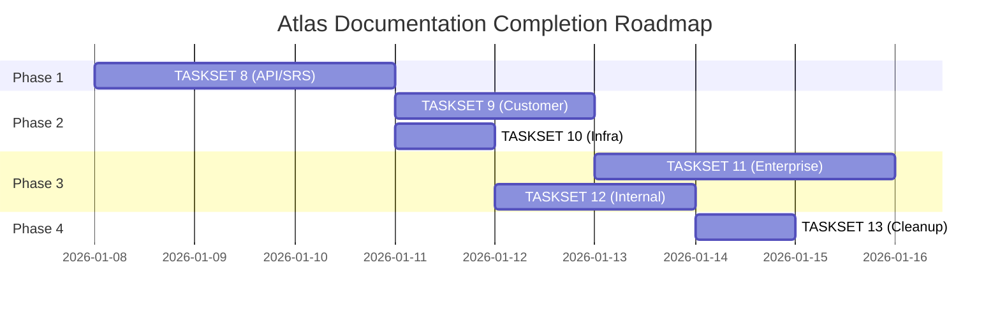

# TASKSET 7: Atlas Documentation Gap Audit

> **Generated**: 2026-01-07
> **Purpose**: Comprehensive gap analysis of Atlas documentation library
> **Audit Scope**: All 449 markdown files in `/platform/atlas/`

---

## Executive Summary

| Metric | Count |
|--------|-------|
| **Total Atlas Files** | 449 |
| **Enriched Files** (100+ lines) | 50 |
| **Stub Files** (≤10 lines) | 382 |
| **Navigation Paths** (docs.json) | 564 |
| **Legacy Blueprints** | 85 MDX files |
| **Migrated Documents** | 27 (TASKSET 2-5) |
| **Remaining Stubs** | ~355 files |

### Coverage Analysis

```
┌─────────────────────────────────────────────────────────────┐
│                  ATLAS DOCUMENTATION STATE                   │
├─────────────────────────────────────────────────────────────┤
│  Enriched (100+ lines)  ██████████░░░░░░░░░░░░░░░░░░  11%   │
│  Stub Files (≤10 lines) ░░░░░░░░░░░░░░░░░░░░░░████████ 85%  │
│  Partial (11-99 lines)  ██░░░░░░░░░░░░░░░░░░░░░░░░░░░  4%   │
└─────────────────────────────────────────────────────────────┘
```

---

## Section 1: Enriched Documents (No Action Required)

These 50 files contain substantive content (100+ lines) and require no further migration work.

### Strategic & Architecture Documents

| File | Lines | Status |
|------|-------|--------|
| `internal/architecture/specs/concept-of-operations.md` | 951 | ✅ Complete |
| `internal/architecture/specs/technology-strategy.md` | 718 | ✅ Complete |
| `internal/architecture/specs/verification-matrix.md` | 533 | ✅ Complete |
| `internal/architecture/specs/l1-strategic-specs.md` | 388 | ✅ Complete |
| `internal/architecture/specs/l2-tactical-specs.md` | 306 | ✅ Complete |
| `internal/architecture/specs/taxonomy-index.md` | 307 | ✅ Complete |
| `internal/architecture/system-design/overview.md` | 591 | ✅ Complete |
| `internal/architecture/system-design/data-models.md` | 391 | ✅ Complete |
| `internal/architecture/system-design/cross-segment-integration.md` | 412 | ✅ Complete |
| `internal/architecture/system-design/platform-services.md` | 359 | ✅ Complete |
| `internal/architecture/system-design/office-frontend.md` | 280 | ✅ Complete |

### Developer Documentation

| File | Lines | Status |
|------|-------|--------|
| `developer/introduction/architecture.md` | 430 | ✅ Complete |
| `developer/products/canvas/architecture.md` | 587 | ✅ Complete |
| `developer/domain/relay/architecture.md` | 528 | ✅ Complete |
| `developer/platform/aria/model-integration.md` | 549 | ✅ Complete |
| `developer/operations/folio/overview.md` | 296 | ✅ Complete |
| `developer/operations/folio/alerting.md` | 697 | ✅ Complete |
| `developer/operations/runbooks/incident-response.md` | 499 | ✅ Complete |
| `developer/operations/runbooks/disaster-recovery.md` | 398 | ✅ Complete |
| `developer/testing/overview.md` | 342 | ✅ Complete |
| `developer/testing/integration-tests.md` | 701 | ✅ Complete |
| `developer/testing/e2e-tests.md` | 631 | ✅ Complete |

### Internal/Engineering Documents

| File | Lines | Status |
|------|-------|--------|
| `internal/overview/tools.md` | 815 | ✅ Complete |
| `internal/overview/team-structure.md` | 339 | ✅ Complete |
| `internal/engineering/performance/overview.md` | 736 | ✅ Complete |
| `internal/engineering/performance/slo-sli-sla.md` | 312 | ✅ Complete |
| `internal/product/strategy/vision.md` | 486 | ✅ Complete |
| `internal/security/practices/overview.md` | 444 | ✅ Complete |

### Reference Documents (Non-Navigation)

| File | Lines | Purpose |
|------|-------|---------|
| `docs/SRS-ISSUE-TEMPLATES-WORKFLOW-ORCHESTRATION.md` | 2850 | Reference |
| `docs/SDD-GITHUB-ORG-STRUCTURE.md` | 2430 | Reference |
| `docs/ARIA-AUDIT-ISSUES.md` | 1726 | Audit |
| `docs/MINTLIFY-STRUCTURE.md` | 1205 | Scaffolding |
| `docs/SDD_MIGRATION_MANIFEST.md` | 402 | Tracking |
| `materi/hardware-spec.md` | 821 | Infrastructure |

---

## Section 2: HIGH Priority Stubs (Immediate Action Required)

These stubs have legacy source documents ready for migration.

### 2.1 API Documentation (78 stub files)

**Source Documents Available:**
- `api:api-overview.mdx` (775 lines) → `api/introduction/overview.md`
- `api:websocket-api-guide.mdx` (1,151 lines) → `api/websocket/overview.md`
- `api:api-srs-diagrams.mdx` (418 lines) → `developer/domain/api/architecture.md`
- `api:scribe.mdx` (571 lines) → `developer/platform/intelligence/scribe.md`

**Stub Categories:**

| Category | Files | Priority |
|----------|-------|----------|
| REST API Introduction | 7 | 🔴 HIGH |
| REST API Endpoints | 51 | 🔴 HIGH |
| WebSocket API | 7 | 🔴 HIGH |
| GraphQL API | 5 | 🟡 MEDIUM |
| SDKs | 6 | 🟡 MEDIUM |
| Event Schemas | 8 | 🟡 MEDIUM |

### 2.2 SRS Service Documentation (15 stub files)

**Source Documents Available:**
- `sdd:srs:auth.mdx` (1,133 lines) → Shield service docs
- `sdd:srs:collaboration.mdx` (979 lines) → Relay service docs
- `sdd:srs:api.mdx` (1,288 lines) → API service docs

**Stubs Requiring Content:**

| Target Path | Lines | Source |
|-------------|-------|--------|
| `developer/domain/shield/overview.md` | 3 | `sdd:srs:auth.mdx` |
| `developer/domain/shield/architecture.md` | 3 | `sdd:srs:auth.mdx` |
| `developer/domain/shield/authentication.md` | 3 | `sdd:srs:auth.mdx` |
| `developer/domain/shield/authorization.md` | 3 | `sdd:srs:auth.mdx` |
| `developer/domain/relay/overview.md` | 31 | `sdd:srs:collaboration.mdx` |
| `developer/domain/relay/websocket-protocol.md` | 3 | `sdd:srs:collaboration.mdx` |
| `developer/domain/relay/operational-transform.md` | 3 | `sdd:srs:collaboration.mdx` |
| `developer/domain/api/overview.md` | 36 | `sdd:srs:api.mdx` |
| `developer/domain/api/architecture.md` | 3 | `sdd:srs:api.mdx` |
| `developer/domain/api/endpoints.md` | 3 | `sdd:srs:api.mdx` |

### 2.3 Infrastructure & Operations (12 stub files)

**Source Documents Available:**
- `sdd:sys:cid.mdx` (578 lines) → Cloud Infrastructure
- `sdd:sys:rcm.mdx` (954 lines) → Requirements Continuity
- `sdd:configuration.mdx` (184 lines) → Configuration Management

**Stubs Requiring Content:**

| Target Path | Lines | Source |
|-------------|-------|--------|
| `developer/operations/infrastructure/overview.md` | 3 | `sdd:sys:cid.mdx` |
| `developer/operations/infrastructure/kubernetes.md` | 3 | `sdd:sys:cid.mdx` |
| `developer/operations/infrastructure/terraform.md` | 3 | `sdd:sys:cid.mdx` |
| `developer/operations/deployment/ci-cd.md` | 3 | existing CI/CD docs |
| `developer/operations/deployment/blue-green.md` | 3 | `sdd:sys:drp.mdx` |
| `internal/architecture/specs/requirement-traceability.md` | 3 | `sdd:sys:rcm.mdx` |

---

## Section 3: MEDIUM Priority Stubs

### 3.1 Customer Documentation (74 stub files)

**Source Documents Available:**
- `guide:document-collaboration.mdx` (664 lines)
- `guide:ai-content-generation.mdx` (665 lines)
- `guide:workspace-management.mdx` (665 lines)
- `guide:document-creation-editing.mdx` (636 lines)

**Categories:**

| Category | Files | Lines Each | Source |
|----------|-------|------------|--------|
| AI Features | 7 | 3 | `guide:ai-content-generation.mdx` |
| Collaboration | 6 | 3 | `guide:document-collaboration.mdx` |
| Documents | 6 | 3 | `guide:document-creation-editing.mdx` |
| Workspaces | 5 | 3 | `guide:workspace-management.mdx` |
| Getting Started | 4 | 3-32 | `guide:getting-started.mdx` |
| Integrations | 6 | 3 | NEW content needed |
| Security | 6 | 3 | `sdd:sec:*` docs |
| Support | 5 | 3 | NEW content needed |

### 3.2 Enterprise Documentation (85 stub files)

**No Direct Legacy Sources** - Requires new content creation

| Category | Files | Priority |
|----------|-------|----------|
| Deployment (Self-Hosted) | 7 | 🟡 MEDIUM |
| Deployment (Cloud/Hybrid) | 9 | 🟡 MEDIUM |
| Security & Compliance | 11 | 🟡 MEDIUM |
| Administration | 7 | 🟡 MEDIUM |
| Integration | 8 | 🟡 MEDIUM |
| Monitoring | 7 | 🟢 LOW |
| HA & Scalability | 12 | 🟢 LOW |
| Migration | 6 | 🟢 LOW |
| Support | 6 | 🟢 LOW |

### 3.3 Internal Engineering (68 stub files)

**Partial Sources Available:**
- `sdd:sw:env.mdx` (607 lines) → Environment setup
- `sdd:debt.mdx` (249 lines) → Technical debt
- `sdd:guidelines.mdx` (539 lines) → Development guidelines

**Categories:**

| Category | Files | Source Available |
|----------|-------|------------------|
| Architecture ADRs | 8 | Partial (need expansion) |
| Engineering Standards | 6 | `sdd:guidelines.mdx` |
| Engineering Workflow | 6 | `sdd:sw:git.mdx` |
| Engineering Ownership | 6 | NEW content needed |
| Operations (Incidents) | 6 | `sdd:sw:debug:devops.mdx` |
| Operations (Releases) | 5 | NEW content needed |
| Operations (Capacity) | 4 | `sdd:sys:vif.mdx` |
| Operations (Cost) | 4 | `sdd:sys:vif.mdx` |
| Product Strategy | 4 | NEW content needed |
| Product Development | 4 | NEW content needed |
| Product Research | 5 | NEW content needed |
| Security Practices | 6 | `sdd:sec:*` docs |
| Security Vulnerabilities | 5 | `sdd:sec:sis.mdx` |
| Security Compliance | 5 | `sdd:sec:sad.mdx` |
| Analytics | 5 | NEW content needed |
| HR & Legal | 12 | NEW content needed |

---

## Section 4: Legacy Blueprint Deprecation Candidates

### 4.1 Safe to Archive (Content Migrated)

These legacy documents have been fully migrated and can be archived:

| Legacy File | Target | Status |
|-------------|--------|--------|
| `sdd:cls:hierarchy.mdx` | `l1-strategic-specs.md` | ✅ Migrated |
| `sdd:cls:index.mdx` | `taxonomy-index.md` | ✅ Migrated |
| `sdd:sys:brs.mdx` | `l1-strategic-specs.md` | ✅ Migrated |
| `sdd:sys:psd.mdx` | `vision.md` | ✅ Migrated |
| `sdd:sys:sad.mdx` | `system-design/overview.md` | ✅ Migrated |
| `sdd:sys:pad.mdx` | `platform-services.md` | ✅ Migrated |
| `sdd:sec:sad.mdx` | `security/practices/overview.md` | ✅ Migrated |
| `sdd:sys:nfr.mdx` | `slo-sli-sla.md` | ✅ Migrated |
| `sdd:sys:drp.mdx` | `disaster-recovery.md` | ✅ Migrated |
| `sdd:sys:tax.mdx` | `l2-tactical-specs.md` | ✅ Migrated |
| `sdd:integration.mdx` | `cross-segment-integration.md` | ✅ Migrated |
| `dev:backend-architecture.mdx` | `developer/introduction/architecture.md` | ✅ Migrated |
| `dev:frontend-architecture.mdx` | `canvas/architecture.md` | ✅ Migrated |
| `dev:engine-architecture.mdx` | `relay/architecture.md` | ✅ Migrated |
| `dev:ai-provider-integration.mdx` | `aria/model-integration.md` | ✅ Migrated |
| `sdd:observability.mdx` | `folio/overview.md` | ✅ Migrated |
| `sdd:vvp.mdx` | `verification-matrix.md` | ✅ Migrated |
| `sdd:sys:vtm.mdx` | `verification-matrix.md` | ✅ Migrated |
| `sdd:sys:qas.mdx` | `testing/overview.md` | ✅ Migrated |
| `sdd:sw:git.mdx` | `git-workflow.mdx` | ✅ Migrated |
| `sdd:sw:debug:api.mdx` | `integration-tests.md` | ✅ Migrated |
| `sdd:sw:debug:devops.mdx` | `incident-response.md` | ✅ Migrated |
| `sdd:sw:debug:front.mdx` | `e2e-tests.md` | ✅ Migrated |
| `sdd:ops:vc-heat-suite.mdx` | `alerting.md` | ✅ Migrated |
| `sdd:reliability.mdx` | `performance/overview.md` | ✅ Migrated |
| `sdd:knowledge.mdx` | `overview/tools.md` | ✅ Migrated |

**Total: 26 legacy files safe to archive**

### 4.2 Pending Migration (High Value Content)

| Legacy File | Lines | Target | Priority |
|-------------|-------|--------|----------|
| `sdd:srs:auth.mdx` | 1,133 | Shield service docs | 🔴 HIGH |
| `sdd:srs:collaboration.mdx` | 979 | Relay service docs | 🔴 HIGH |
| `sdd:srs:api.mdx` | 1,288 | API service docs | 🔴 HIGH |
| `api:api-overview.mdx` | 775 | API introduction | 🔴 HIGH |
| `api:websocket-api-guide.mdx` | 1,151 | WebSocket API | 🔴 HIGH |
| `sdd:sys:rcm.mdx` | 954 | requirement-traceability.md | 🔴 HIGH |
| `sdd:sys:cid.mdx` | 578 | infrastructure/overview.md | 🔴 HIGH |
| `sdd:sec:sis.mdx` | 1,554 | security practices | 🟡 MEDIUM |
| `sdd:sys:frm.mdx` | 1,192 | fault resilience | 🟡 MEDIUM |
| `guide:document-collaboration.mdx` | 664 | customer/collaboration | 🟡 MEDIUM |
| `guide:ai-content-generation.mdx` | 665 | customer/ai | 🟡 MEDIUM |
| `guide:workspace-management.mdx` | 665 | customer/workspaces | 🟡 MEDIUM |
| `guide:document-creation-editing.mdx` | 636 | customer/documents | 🟡 MEDIUM |
| `api:scribe.mdx` | 571 | intelligence/scribe.md | 🟡 MEDIUM |
| `api:api-srs-diagrams.mdx` | 418 | api/architecture.md | 🟡 MEDIUM |

**Total: 15 legacy files pending migration (~14,233 lines)**

### 4.3 Skip/Deprecate (No Migration Value)

| Legacy File | Reason |
|-------------|--------|
| `ii:acronyms.mdx` | Internal tooling |
| `ii:cs:definitions.mdx` | Docusaurus-specific |
| `ii:cs:docusaurus.mdx` | Docusaurus config |
| `ii:cs:rex-masterclass.mdx` | Training material |
| `ii:ppt:saas-2-docs.mdx` | Presentation |
| `ii:ppt:cut-the-fluff.mdx` | Presentation |
| `ii:cfg:ofs.mdx` | Legacy config |
| `TODO-*` files (6) | Incomplete drafts |
| `sdd:sys:ofs.mdx` | Empty file (0 lines) |
| `guide:best-practices.mdx` | Minimal content (14 lines) |

**Total: 16 legacy files to deprecate**

---

## Section 5: Recommended TASKSET Structure

### TASKSET 8: API & SRS Documentation
**Scope**: 93 stub files
**Sources**: 5 legacy documents (~4,785 lines)
**Priority**: 🔴 HIGH

| Sub-task | Files | Source |
|----------|-------|--------|
| 8.1 API Introduction | 7 | `api:api-overview.mdx` |
| 8.2 REST API Endpoints | 51 | OpenAPI spec + `api:rest-api-reference.mdx` |
| 8.3 WebSocket API | 7 | `api:websocket-api-guide.mdx` |
| 8.4 Shield SRS | 8 | `sdd:srs:auth.mdx` |
| 8.5 Relay SRS | 7 | `sdd:srs:collaboration.mdx` |
| 8.6 API SRS | 8 | `sdd:srs:api.mdx` |

### TASKSET 9: Customer Documentation
**Scope**: 74 stub files
**Sources**: 5 legacy documents (~3,266 lines)
**Priority**: 🟡 MEDIUM

| Sub-task | Files | Source |
|----------|-------|--------|
| 9.1 AI Features | 7 | `guide:ai-content-generation.mdx` |
| 9.2 Collaboration | 6 | `guide:document-collaboration.mdx` |
| 9.3 Documents | 6 | `guide:document-creation-editing.mdx` |
| 9.4 Workspaces | 5 | `guide:workspace-management.mdx` |
| 9.5 Getting Started | 4 | `guide:getting-started.mdx` |
| 9.6 Integrations | 6 | NEW content |
| 9.7 Security | 6 | `sdd:sec:*` |
| 9.8 Support | 5 | NEW content |

### TASKSET 10: Infrastructure & Operations
**Scope**: 22 stub files
**Sources**: 3 legacy documents (~1,716 lines)
**Priority**: 🟡 MEDIUM

| Sub-task | Files | Source |
|----------|-------|--------|
| 10.1 Infrastructure | 5 | `sdd:sys:cid.mdx` |
| 10.2 Deployment | 5 | `sdd:sys:drp.mdx` (partial) |
| 10.3 Requirements Traceability | 1 | `sdd:sys:rcm.mdx` |
| 10.4 Folio Extensions | 4 | `sdd:observability.mdx` (partial) |
| 10.5 Event System | 8 | `sdd:integration.mdx` (partial) |

### TASKSET 11: Enterprise Documentation
**Scope**: 85 stub files
**Sources**: Limited legacy sources
**Priority**: 🟢 LOW

| Sub-task | Files | Notes |
|----------|-------|-------|
| 11.1 Self-Hosted Deployment | 7 | Use existing deployment guides |
| 11.2 Security & Compliance | 11 | Adapt from `sdd:sec:*` |
| 11.3 Administration | 7 | NEW content |
| 11.4 Integration | 8 | NEW content |
| 11.5 HA & Scalability | 12 | Use `sdd:sys:frm.mdx` |
| 11.6 Monitoring | 7 | Adapt from Folio docs |
| 11.7 Migration | 6 | NEW content |

### TASKSET 12: Internal Engineering
**Scope**: 68 stub files
**Sources**: 4 legacy documents (~1,770 lines)
**Priority**: 🟢 LOW

| Sub-task | Files | Source |
|----------|-------|--------|
| 12.1 ADRs | 7 | NEW content (architectural decisions) |
| 12.2 Standards | 6 | `sdd:guidelines.mdx` |
| 12.3 Workflow | 6 | `sdd:sw:git.mdx` (partial) |
| 12.4 Ownership | 6 | NEW content |
| 12.5 Operations | 19 | `sdd:sw:debug:*`, `sdd:sys:vif.mdx` |
| 12.6 Product | 13 | NEW content |
| 12.7 Security | 16 | `sdd:sec:sis.mdx`, `sdd:sec:sad.mdx` |
| 12.8 Analytics | 5 | NEW content |
| 12.9 HR & Legal | 12 | NEW content (placeholder only) |

### TASKSET 13: Legacy Cleanup & Validation
**Scope**: Archive 26 migrated files, deprecate 16 files
**Priority**: 🟢 LOW

| Sub-task | Action |
|----------|--------|
| 13.1 Archive migrated | Move to `.atlas/.spec/__blueprints__/archived/` |
| 13.2 Deprecate skip files | Delete or archive |
| 13.3 Final cross-reference audit | Validate all links |
| 13.4 Update navigation | Ensure docs.json complete |

---

## Section 6: Work Effort Estimation

| TASKSET | Stub Files | Legacy Lines | Effort |
|---------|-----------|--------------|--------|
| 8 | 93 | ~4,785 | Large |
| 9 | 74 | ~3,266 | Medium |
| 10 | 22 | ~1,716 | Small |
| 11 | 85 | ~0 (NEW) | Large |
| 12 | 68 | ~1,770 | Medium |
| 13 | N/A | N/A | Small |
| **Total** | **342** | **~11,537** | |

### Recommended Execution Order



---

## Section 7: Quality Gates

Before marking any TASKSET complete:

1. **Line Count Threshold**: All enriched files must have ≥50 lines
2. **Mintlify Syntax**: All `<Info>`, `<Note>`, `<Warning>` tags balanced
3. **Mermaid Diagrams**: All code blocks render correctly
4. **Cross-References**: All internal links validated
5. **Navigation**: All paths in docs.json have corresponding files
6. **SDD Classification**: All L1-L4 documents have classification headers

---

_Generated: 2026-01-07_
_TASKSET 7: Comprehensive Gap Audit_
_Atlas Files: 449 | Stubs: 382 | Legacy: 85 | Migrated: 27_
