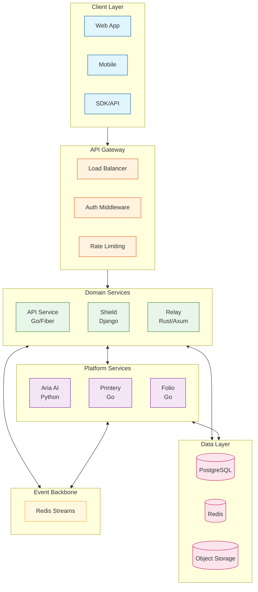
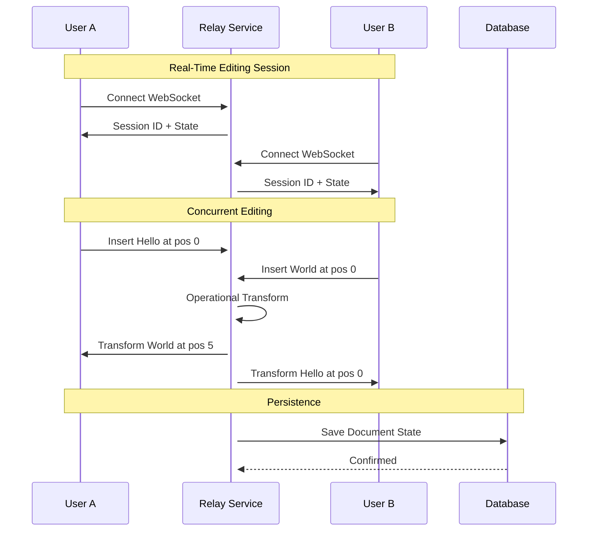
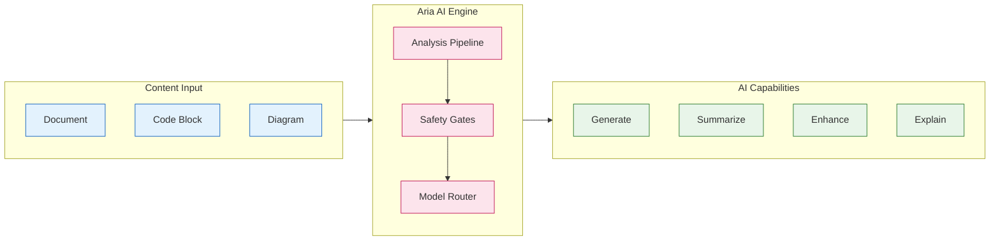
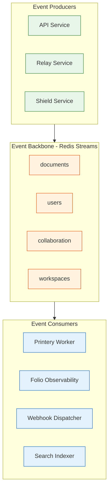
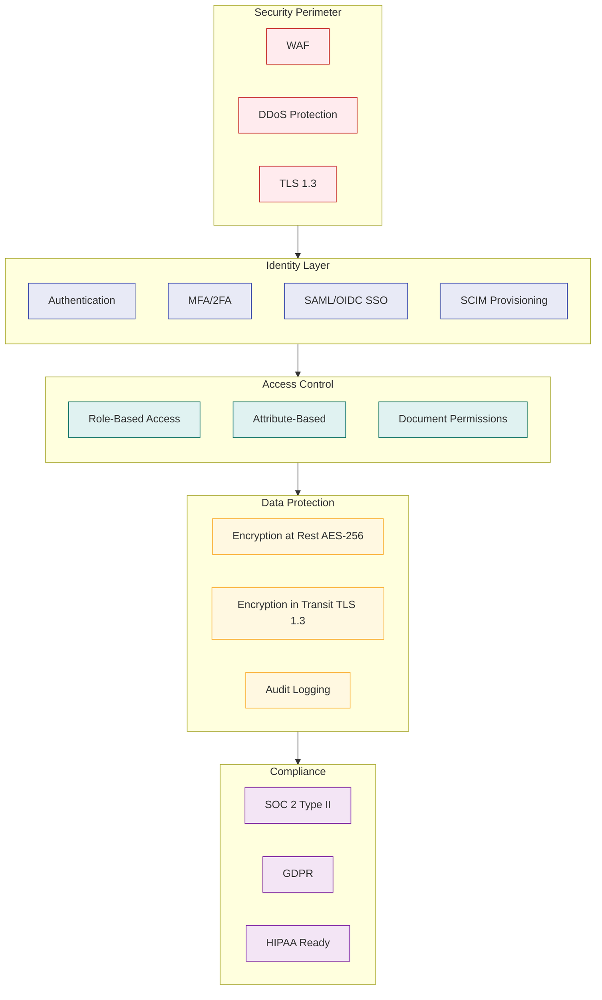

# Build. Collaborate. Ship.

Materi is the AI-native content platform that combines real-time collaboration, intelligent assistance, and enterprise-grade security—designed for teams who move fast.

<CardGroup cols={2}>
  <Card title="Get Started Free" icon="rocket" href="/customer/getting-started/sign-up">
    Create your account in 30 seconds
  </Card>
  <Card title="View Documentation" icon="book" href="/developer/introduction/overview">
    Explore our technical guides
  </Card>
</CardGroup>

---

## Platform Architecture

Materi's event-driven architecture ensures real-time collaboration feels instant while maintaining enterprise-grade reliability and auditability.

<Frame>

</Frame>

---

## Quick Start by Role

<CardGroup cols={3}>
  <Card title="Product Users" icon="users" href="/customer/overview/what-is-materi">
    Learn how to use Materi for your team's content workflows.

    **Popular:**
    - [Create your first document](/customer/getting-started/first-document)
    - [Set up your workspace](/customer/getting-started/workspace-setup)
    - [AI features overview](/customer/ai/overview)
  </Card>

  <Card title="Developers" icon="code" href="/developer/introduction/overview">
    Integrate with our APIs, extend functionality, or contribute to the platform.

    **Popular:**
    - [API Reference](/api/introduction/overview)
    - [WebSocket Protocol](/api/websocket/overview)
    - [Event Schemas](/api/events/overview)
  </Card>

  <Card title="Enterprise" icon="building" href="/enterprise/overview/what-is-enterprise">
    Deploy on your infrastructure with advanced security and compliance.

    **Popular:**
    - [Self-hosted deployment](/enterprise/deployment/self-hosted/overview)
    - [SSO/SAML setup](/enterprise/security/sso-saml)
    - [High availability](/enterprise/ha/overview)
  </Card>
</CardGroup>

---

## Real-Time Collaboration

Experience collaboration that feels instantaneous. Multiple users can edit simultaneously with sub-100ms latency.

<Frame>

</Frame>

<Tabs>
  <Tab title="Presence Awareness">
    See who's viewing and editing in real-time with colored cursors and selection highlights.

    - **Live cursors** with user avatars
    - **Selection broadcasting** shows what others are selecting
    - **Typing indicators** for active editing
    - **Away/active status** detection
  </Tab>

  <Tab title="Conflict Resolution">
    Our Operational Transform (OT) engine ensures edits never collide, even at high concurrency.

    - **Vector clock ordering** for causal consistency
    - **Automatic merge** of concurrent edits
    - **No data loss** guarantee
    - **Sub-second convergence** across clients
  </Tab>

  <Tab title="Offline Support">
    Keep working without internet—changes sync when you reconnect.

    - **Local-first** editing experience
    - **Automatic sync** on reconnection
    - **Conflict detection** for offline changes
    - **Version reconciliation** preserves all work
  </Tab>
</Tabs>

---

## AI-Powered Intelligence

Aria, our AI service, enhances every part of your content workflow while respecting privacy and safety boundaries.

<Frame>

</Frame>

<CardGroup cols={2}>
  <Card title="Content Generation" icon="wand-magic-sparkles">
    Generate first drafts, expand outlines, or create content from prompts.

    ```
    /ai generate "Write an introduction for our Q4 product roadmap"
    ```
  </Card>

  <Card title="Smart Summarization" icon="compress">
    Get TL;DR summaries of long documents, meeting notes, or research.

    ```
    /ai summarize --style=executive
    ```
  </Card>

  <Card title="Code Analysis" icon="microscope">
    Explain code, find bugs, generate documentation, or convert between languages.

    ```
    /ai explain --language=go --detail=high
    ```
  </Card>

  <Card title="Enhancement Suggestions" icon="lightbulb">
    Improve clarity, fix grammar, adjust tone, or restructure content.

    ```
    /ai enhance --focus=clarity,conciseness
    ```
  </Card>
</CardGroup>

---

## Event-Driven Architecture

Every action in Materi produces events that flow through our reliable event backbone, enabling real-time sync and extensibility.

<Frame>

</Frame>

<Accordion title="Event Schema Example">
  All events follow a consistent envelope structure defined in Protocol Buffers:

  ```protobuf
  message EventEnvelope {
    string event_id = 1;           // UUID v4
    string event_type = 2;         // e.g., "document.created"
    string aggregate_type = 3;     // e.g., "document"
    string aggregate_id = 4;       // Entity UUID
    int64 version = 5;             // Aggregate version
    google.protobuf.Timestamp occurred_at = 6;
    string correlation_id = 7;     // Request trace ID
    string causation_id = 8;       // Parent event ID
    map<string, string> metadata = 9;
    bytes payload = 10;            // Type-specific payload
  }
  ```
</Accordion>

---

## Security and Compliance

Enterprise-grade security is built into every layer, from authentication to data encryption.

<Frame>

</Frame>

<CardGroup cols={3}>
  <Card title="SOC 2 Type II" icon="shield-check">
    Annual audit of security controls with continuous monitoring.
  </Card>
  <Card title="GDPR Compliant" icon="globe">
    Full data subject rights, EU data residency options.
  </Card>
  <Card title="99.99% SLA" icon="chart-line">
    Enterprise SLA with service credits for breaches.
  </Card>
</CardGroup>

---

## Developer Experience

Build on Materi with our comprehensive APIs, SDKs, and developer tools.

<Tabs>
  <Tab title="REST API">
    ```bash
    # Create a document
    curl -X POST https://api.materi.dev/api/v1/documents \
      -H "Authorization: Bearer $TOKEN" \
      -H "Content-Type: application/json" \
      -d '{
        "title": "My Document",
        "content": "Initial content...",
        "workspace_id": "ws_abc123"
      }'
    ```

    Response:
    ```json
    {
      "success": true,
      "data": {
        "id": "doc_xyz789",
        "title": "My Document",
        "version": 1,
        "created_at": "2025-01-07T10:00:00Z"
      }
    }
    ```
  </Tab>

  <Tab title="WebSocket">
    ```javascript
    // Connect to real-time collaboration
    const ws = new WebSocket('wss://relay.materi.dev/ws');

    ws.onopen = () => {
      ws.send(JSON.stringify({
        type: 'join',
        document_id: 'doc_xyz789',
        token: accessToken
      }));
    };

    ws.onmessage = (event) => {
      const op = JSON.parse(event.data);
      if (op.type === 'operation') {
        applyOperation(op.data);
      }
    };
    ```
  </Tab>

  <Tab title="TypeScript SDK">
    ```typescript
    import { Materi } from '@materi/sdk';

    const client = new Materi({
      apiKey: process.env.MATERI_API_KEY
    });

    // Create document with AI generation
    const doc = await client.documents.create({
      title: 'Q4 Roadmap',
      workspace_id: 'ws_abc123',
      content: await client.ai.generate({
        prompt: 'Write a product roadmap template'
      })
    });

    // Subscribe to real-time updates
    const session = await client.collaborate(doc.id);
    session.on('operation', (op) => {
      console.log('Remote edit:', op);
    });
    ```
  </Tab>

  <Tab title="Go SDK">
    ```go
    package main

    import (
        "context"
        "github.com/materi/materi-go"
    )

    func main() {
        client := materi.NewClient(
            materi.WithAPIKey(os.Getenv("MATERI_API_KEY")),
        )

        doc, err := client.Documents.Create(context.Background(), &materi.CreateDocumentInput{
            Title:       "Q4 Roadmap",
            WorkspaceID: "ws_abc123",
        })
        if err != nil {
            log.Fatal(err)
        }

        fmt.Printf("Created document: %s\n", doc.ID)
    }
    ```
  </Tab>
</Tabs>

---

## Service Architecture

<AccordionGroup>
  <Accordion title="API Service (Go/Fiber)" icon="server">
    The primary HTTP API handling document management, AI integration, and file operations.

    **Key Features:**
    - Full CRUD for documents, workspaces, users
    - AI integration via Aria service
    - File upload with MinIO/S3
    - Prometheus metrics on port 9090
  </Accordion>

  <Accordion title="Shield Service (Django)" icon="shield">
    Centralized authentication, authorization, and user management.

    **Key Features:**
    - JWT RS256 token issuance
    - OAuth 2.0 / SAML 2.0 SSO
    - RBAC permission management
    - GDPR compliance tools
  </Accordion>

  <Accordion title="Relay Service (Rust/Axum)" icon="bolt">
    Real-time collaboration via WebSocket with Operational Transform.

    **Key Features:**
    - Sub-100ms operation latency
    - Vector clock conflict resolution
    - Horizontal scaling via Redis pub/sub
    - Automatic reconnection handling
  </Accordion>

  <Accordion title="Aria Service (Python)" icon="robot">
    AI capabilities including generation, summarization, and code analysis.

    **Key Features:**
    - Multi-model support (GPT-4, Claude)
    - Content safety filtering
    - Streaming responses
    - Graceful degradation
  </Accordion>
</AccordionGroup>

---

## Performance Metrics

<CardGroup cols={4}>
  <Card title="API Latency" icon="gauge-high">
    **< 200ms** p95

    Average response time for REST API calls
  </Card>
  <Card title="Sync Latency" icon="bolt">
    **< 100ms** p99

    Real-time operation propagation
  </Card>
  <Card title="Uptime" icon="server">
    **99.99%** SLA

    Enterprise availability guarantee
  </Card>
  <Card title="Scale" icon="users">
    **10K+** concurrent

    Users per document session
  </Card>
</CardGroup>

---

## Documentation Sections

<CardGroup cols={2}>
  <Card title="Customer Documentation" icon="book-open" href="/customer/overview/what-is-materi">
    Product guides for end users covering workspace setup, document management, collaboration features, AI capabilities, and integrations.
  </Card>

  <Card title="Developer Guide" icon="code" href="/developer/introduction/overview">
    Technical documentation for integrators and contributors covering architecture, APIs, service details, and development workflows.
  </Card>

  <Card title="API Reference" icon="terminal" href="/api/introduction/overview">
    Complete REST, WebSocket, and GraphQL API reference with request/response schemas, authentication, and SDKs.
  </Card>

  <Card title="Enterprise" icon="building" href="/enterprise/overview/what-is-enterprise">
    Self-hosted deployment, security hardening, compliance certifications, and enterprise administration guides.
  </Card>
</CardGroup>

---

## Latest Updates

<AccordionGroup>
  <Accordion title="v2.5.0 - AI Context Windows" icon="wand-magic-sparkles">
    **Released: January 2025**

    - Extended AI context window to 128K tokens
    - New `/ai analyze` command for code review
    - Improved summarization for long documents
    - 40% faster AI response times
  </Accordion>

  <Accordion title="v2.4.0 - Enhanced Collaboration" icon="users">
    **Released: December 2024**

    - Offline mode with automatic sync
    - Improved conflict resolution algorithm
    - Real-time comments and mentions
    - Mobile app support (iOS/Android)
  </Accordion>

  <Accordion title="v2.3.0 - Enterprise Features" icon="building">
    **Released: November 2024**

    - SCIM 2.0 user provisioning
    - Custom data retention policies
    - Advanced audit log export
    - IP allowlisting
  </Accordion>
</AccordionGroup>

---

## Community and Support

<CardGroup cols={3}>
  <Card title="Discord Community" icon="discord" href="https://discord.gg/materi">
    Join 5,000+ users discussing workflows, integrations, and tips.
  </Card>

  <Card title="GitHub" icon="github" href="https://github.com/materi-ai">
    Report issues, request features, or contribute to open-source components.
  </Card>

  <Card title="Status Page" icon="signal" href="https://status.materi.com">
    Real-time system status and incident history.
  </Card>
</CardGroup>

---

## Ready to get started?

<CardGroup cols={2}>
  <Card title="Start Free" icon="rocket" href="/customer/getting-started/sign-up">
    Create an account in 30 seconds. No credit card required.
  </Card>
  <Card title="Talk to Sales" icon="phone" href="/customer/support/contact-support">
    Get a demo and discuss enterprise requirements.
  </Card>
</CardGroup>
