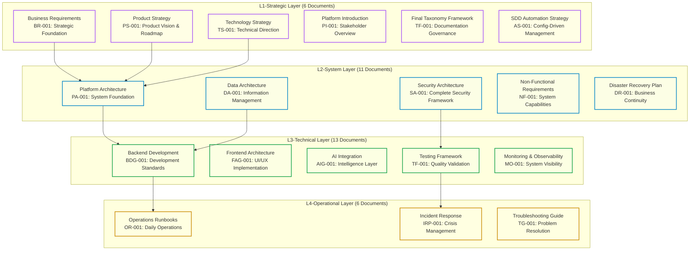

# L1-Strategic Specifications

<Info>
**SDD Classification:** L1-Strategic | **Authority:** CPO + CTO + Board | **Review Cycle:** Quarterly
</Info>

This document consolidates the strategic foundation documents that define Materi's business direction, vision, and governance framework. L1-Strategic documents are the highest-level specifications, guiding all downstream system, technical, and operational decisions.

## Documentation Taxonomy Framework

The Materi documentation ecosystem consists of **36 strategic documents** organized across four classification levels, providing comprehensive coverage from strategic vision to operational implementation.

### Master Classification Hierarchy

### Classification Level Definitions

| Level | Context | Audience | Review Frequency | Atlas Location |
|-------|---------|----------|------------------|----------------|
| **L1-Strategic** | Enterprise/Market | Board, CPO, CTO | Quarterly | `internal/architecture/specs/l1-*`, `internal/product/strategy/*` |
| **L2-System** | Platform/Architecture | CTO + Domain Leads | Monthly | `internal/architecture/system-design/*` |
| **L3-Technical** | Component/Module | Engineering Teams | Bi-weekly | `developer/*` |
| **L4-Operational** | Execution/Maintenance | Ops/SRE | Weekly | `developer/operations/runbooks/*` |

---

## Business Requirements Specification (BR-001)

### Executive Summary

Materi aims to revolutionize the document collaboration market by delivering an AI-native platform that outperforms incumbents like Google Docs and Microsoft 365. This Business Requirements Specification (BRS) outlines the strategic business objectives, stakeholder needs, and detailed functional and non-functional requirements that will guide the development and deployment of the Materi platform.

### Vision

Materi will become the premier AI-native document collaboration platform that outperforms Google Docs and Microsoft 365 through superior performance, advanced AI integration, and enterprise-grade security.

### Mission

Deliver real-time document collaboration with sub-25ms latency, comprehensive AI assistance, and enterprise security that enables organizations to create, collaborate, and innovate faster than ever before.

### Strategic Business Objectives

| ID | Objective | Metrics | Timeline | Business Impact |
|----|-----------|---------|----------|-----------------|
| **SBO-001** | Market Leadership in Performance | Beat Google Docs response time by 5x | 12 months | $10M ARR opportunity |
| **SBO-002** | Enterprise Market Penetration | 500+ enterprise customers | 18 months | $50M ARR potential |
| **SBO-003** | AI Innovation Leadership | Industry-leading AI integration | 24 months | $25M market differentiation |
| **SBO-004** | Operational Excellence | 99.9% uptime with SOC 2 compliance | 12 months | Enterprise credibility |
| **SBO-005** | Cost Leadership | 65% lower infrastructure costs vs competitors | 6 months | Pricing advantage |

### Stakeholder Analysis

| Stakeholder Group | Primary Representative | Key Requirements | Success Criteria | Influence |
|-------------------|------------------------|------------------|------------------|-----------|
| Enterprise Customers | Fortune 500 CTOs | Performance, Security, Compliance | <50ms response, SOC 2 | High |
| End Users | Knowledge Workers | Usability, Collaboration, AI Features | Sub-25ms collaboration | High |
| IT Administrators | Enterprise IT Teams | Security, Integration, Management | SSO, audit trails | Medium |
| Compliance Officers | Legal/Compliance Teams | Data protection, Audit trails | GDPR compliance | Medium |
| Investors | Board of Directors | Growth, Scalability, ROI | Market share growth | High |

### Top-Level Business Requirements

```mermaid
graph TB
    subgraph "Strategic Business Requirements"
        BR001[BR-001: Enterprise Performance Excellence]
        BR002[BR-002: Real-time Collaboration Leadership]
        BR003[BR-003: AI-Native Content Generation]
        BR004[BR-004: Enterprise Security & Compliance]
        BR005[BR-005: Global Scalability & Reliability]
    end

    subgraph "Functional Requirements"
        FR001[FR-001: Document Management]
        FR002[FR-002: Collaborative Editing]
        FR003[FR-003: AI Content Generation]
        FR004[FR-004: User Management]
        FR005[FR-005: Workspace Administration]
    end

    subgraph "Non-Functional Requirements"
        NFR001[NFR-001: Performance Requirements]
        NFR002[NFR-002: Security Requirements]
        NFR003[NFR-003: Scalability Requirements]
        NFR004[NFR-004: Reliability Requirements]
        NFR005[NFR-005: Compliance Requirements]
    end

    BR001 --> FR001
    BR001 --> NFR001
    BR002 --> FR002
    BR002 --> NFR001
    BR003 --> FR003
    BR004 --> NFR002
    BR004 --> NFR005
    BR005 --> NFR003
    BR005 --> NFR004

    classDef businessReq fill:#E3F2FD,stroke:#1976D2,stroke-width:2px,fill-opacity:0.2
    classDef functionalReq fill:#E8F5E8,stroke:#388E3C,stroke-width:2px,fill-opacity:0.2
    classDef nonFunctionalReq fill:#FFF3E0,stroke:#F57C00,stroke-width:2px,fill-opacity:0.2

    class BR001,BR002,BR003,BR004,BR005 businessReq
    class FR001,FR002,FR003,FR004,FR005 functionalReq
    class NFR001,NFR002,NFR003,NFR004,NFR005 nonFunctionalReq
```

---

## BR-001: Enterprise Performance Excellence

**Priority:** P0 - Critical
**Business Owner:** Chief Product Officer
**Technical Owner:** Chief Technology Officer

### Business Requirement Statement

Materi shall deliver API performance that exceeds enterprise expectations and outperforms all major competitors, enabling superior user experience that drives customer acquisition and retention.

### Business Rationale

- **Market Differentiation:** Performance leadership positions Materi as premium solution
- **Enterprise Sales:** Sub-50ms response times are table stakes for Fortune 500 deals
- **User Satisfaction:** Performance directly correlates with user adoption and retention
- **Competitive Advantage:** 5-8x faster than Google Docs creates unassailable moat

### Success Criteria

| Metric | Target Value | Measurement Method | Business Impact |
|--------|--------------|-------------------|-----------------|
| API Response Time (P95) | <50ms | Prometheus monitoring | 40% faster sales cycles |
| Collaboration Latency (P95) | <25ms | Relay service benchmarks | Enterprise competitive advantage |
| User Satisfaction Score | >90% | NPS surveys | 25% higher retention |
| Test Coverage | >90% | Automated test reporting | Quality assurance confidence |
| Competitive Benchmark | 5x faster than Google Docs | A/B testing | Market leadership position |

### System Traceability

- **Architecture Component:** Go Fiber API Gateway
- **Performance Optimization:** Goroutine pool management, connection pooling
- **Monitoring:** Prometheus metrics, Grafana dashboards
- **Testing:** k6 load testing, automated performance validation

---

## BR-002: Real-time Collaboration Leadership

**Priority:** P0 - Critical
**Business Owner:** Chief Product Officer
**Technical Owner:** Lead Rust Engineer

### Business Requirement Statement

Materi shall provide real-time collaborative editing that delivers sub-25ms latency with support for 1000+ concurrent editors per document, establishing industry leadership in collaboration performance.

### Business Rationale

- **Competitive Superiority:** 10-20x faster than Google Docs/Microsoft 365
- **Enterprise Use Cases:** Support large team collaboration sessions
- **User Experience:** Near-instantaneous updates create magical user experience
- **Technical Differentiation:** Rust-based architecture enables impossible performance

### Success Criteria

| Metric | Target Value | Measurement Method | Business Impact |
|--------|--------------|-------------------|-----------------|
| Edit-to-Display Latency | <25ms | WebSocket message timestamps | 60% better demo conversion |
| Concurrent Editors | 1000+ per document | Load testing validation | 10x enterprise capacity |
| Conflict Resolution | 99.97% automatic | CRDT operation success rate | Zero manual intervention |

### System Traceability

- **Architecture Component:** Rust Axum Collaboration Engine (Relay Service)
- **Technology:** WebSocket with CRDT (Conflict-free Replicated Data Types)
- **Performance:** Lock-free algorithms, zero-copy operations
- **Monitoring:** Real-time latency tracking, connection health monitoring

---

## BR-003: AI-Native Content Generation

**Priority:** P0 - Critical
**Business Owner:** VP of Product
**Technical Owner:** AI Engineering Lead

### Business Requirement Statement

Materi shall integrate advanced AI capabilities that provide context-aware content generation, multi-provider optimization, and seamless user experience that enhances productivity and creates competitive differentiation.

### Business Rationale

- **Market Innovation:** AI-native approach differentiates from traditional editors
- **Productivity Enhancement:** AI assistance accelerates content creation by 3x
- **Revenue Opportunity:** AI features command 40% pricing premium
- **Strategic Positioning:** Establishes Materi as innovation leader

### Success Criteria

| Metric | Target Value | Measurement Method | Business Impact |
|--------|--------------|-------------------|-----------------|
| AI Generation Success Rate | >95% | Response quality validation | High user adoption |
| Time to First Token | <2 seconds | Response time monitoring | Seamless user experience |
| Context Assembly Time | <100ms | Performance tracking | Real-time feel |
| Cost Optimization | <$0.025 per generation | Usage analytics | Sustainable unit economics |

### System Traceability

- **Architecture Component:** Aria AI Orchestration Service
- **Technology:** Go-based provider routing, Redis caching
- **Integration:** OpenAI GPT-4, Anthropic Claude, embedding models
- **Performance:** Context caching, streaming responses, cost optimization

---

## BR-004: Enterprise Security & Compliance

**Priority:** P0 - Critical
**Business Owner:** Chief Security Officer
**Technical Owner:** Security Engineering Lead

### Business Requirement Statement

Materi shall implement enterprise-grade security controls and compliance frameworks that enable Fortune 500 sales, protect customer data, and establish trust through industry-leading security practices.

### Business Rationale

- **Enterprise Sales Enablement:** SOC 2 certification required for 80% of enterprise deals
- **Regulatory Compliance:** GDPR, CCPA compliance enables global market access
- **Risk Mitigation:** Security breaches could destroy company reputation
- **Competitive Advantage:** Security excellence accelerates enterprise sales

### Success Criteria

| Metric | Target Value | Measurement Method | Business Impact |
|--------|--------------|-------------------|-----------------|
| Security Certifications | SOC 2 Type II | Third-party audit | 85% faster enterprise sales |
| Data Encryption Coverage | 100% sensitive data | Encryption audit | Customer trust and compliance |
| Incident Response Time | <15 minutes | SIEM monitoring | Minimal business impact |
| Compliance Coverage | GDPR, CCPA, SOX ready | Compliance assessment | Global market access |

### System Traceability

- **Architecture Component:** Shield Authentication Service, Zero-trust framework
- **Technology:** AES-256 encryption, HSM key management
- **Compliance:** SOC 2 controls, GDPR automation
- **Monitoring:** SIEM platform, threat detection

---

## BR-005: Global Scalability & Reliability

**Priority:** P1 - High
**Business Owner:** Chief Technology Officer
**Technical Owner:** Platform Engineering Lead

### Business Requirement Statement

Materi shall provide globally scalable infrastructure that supports hypergrowth from 1,000 to 1,000,000+ users while maintaining 99.9% uptime and consistent performance worldwide.

### Success Criteria

| Metric | Target Value | Measurement Method | Business Impact |
|--------|--------------|-------------------|-----------------|
| System Availability | 99.9% uptime | Uptime monitoring | SLA compliance |
| Global Response Time | <100ms worldwide | Multi-region monitoring | Global user experience |
| Scaling Capacity | 1M+ concurrent users | Load testing | Hypergrowth support |
| Auto-scaling Efficiency | <2 minute scale-up | Infrastructure monitoring | Cost optimization |

### Disaster Recovery Requirements

- **RTO (Recovery Time Objective):** <4 hours
- **RPO (Recovery Point Objective):** <15 minutes
- **Multi-region deployment:** Primary + failover regions
- **Cross-region replication:** Real-time data sync

---

## Authority Matrix and Governance

| Authority Level | Roles | Document Levels | Approval Scope | Review Frequency |
|-----------------|-------|-----------------|----------------|------------------|
| **Executive** | CEO, CPO, CTO, Board | L1-Strategic | Strategic direction, budget allocation | Quarterly |
| **Technical Leadership** | VP Engineering, Principal Architects, CISO | L2-System | Technical architecture, system design | Monthly |
| **Engineering Leads** | Team Leads, Senior Engineers | L3-Technical | Implementation details, code standards | Bi-weekly |
| **Operations Leads** | Operations Manager, DevOps Lead | L4-Operational | Daily procedures, maintenance | Weekly |

## Document Lifecycle Management

### Creation and Approval Process

1. **Initiation:** Document need identified through strategic planning or technical requirements
2. **Authority Assignment:** Appropriate authority level assigned based on document classification
3. **Development:** Document created following taxonomy standards and templates
4. **Review:** Multi-stakeholder review process based on document level
5. **Approval:** Formal approval by designated authority
6. **Publication:** Document added to ecosystem with proper classification

### Update and Maintenance Process

1. **Change Request:** Proposed modifications submitted through proper channels
2. **Impact Assessment:** Dependencies and traceability analysis performed
3. **Authority Review:** Changes reviewed by appropriate authority level
4. **Implementation:** Approved changes implemented with version control
5. **Cascade Updates:** Dependent documents updated as necessary
6. **Validation:** Changes validated through testing and review processes

---

## Requirements Traceability Matrix

| Business Requirement | Functional Requirements | Non-Functional Requirements | System Components | Verification Method |
|---------------------|------------------------|----------------------------|-------------------|---------------------|
| **BR-001: Performance Excellence** | FR-001, FR-002 | NFR-001 | Fiber API Gateway, Axum Engine | Performance testing |
| **BR-002: Collaboration Leadership** | FR-002 | NFR-001 | Axum Collaboration Engine | Latency measurement |
| **BR-003: AI-Native Generation** | FR-003 | NFR-001 | Aria Orchestration Service | Response time testing |
| **BR-004: Security & Compliance** | FR-004 | NFR-002, NFR-005 | Shield, Security Framework | Security audit |
| **BR-005: Scalability & Reliability** | FR-005 | NFR-003, NFR-004 | Infrastructure Platform | Load testing |

---

## Related Documents

- [Concept of Operations](/internal/architecture/specs/concept-of-operations) - Operational context for the platform
- [Technology Strategy](/internal/architecture/specs/technology-strategy) - Technical direction and architecture decisions
- [Product Strategy](/internal/product/strategy/vision) - Product vision and roadmap
- [L2-Tactical Specs](/internal/architecture/specs/l2-tactical-specs) - System architecture specifications

---

**Document Status:** Approved
**Version:** 2.0
**Last Updated:** January 2026
**Authority:** CPO + CTO + Board of Directors

**Document Classification:** L1-Strategic - Internal Use Only
**Distribution:** Executive Team, Board of Directors, Senior Leadership
