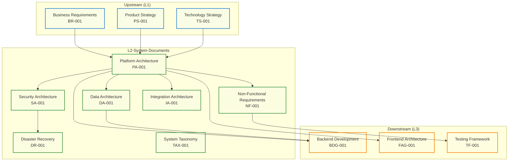
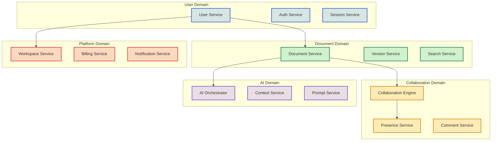

# L2-System Tactical Specifications

<Info>
**SDD Classification:** L2-System | **Authority:** CTO + Architecture Council | **Review Cycle:** Monthly
</Info>

This document provides the L2-System layer specifications, serving as the tactical bridge between L1-Strategic business requirements and L3-Technical implementation details. It defines system-level architecture decisions, service boundaries, and integration patterns.

---

## System Architecture Taxonomy

### Classification Hierarchy

---

## L2 Document Registry

### Document Index

| Document ID | Title | Status | Authority | Dependencies |
|-------------|-------|--------|-----------|--------------|
| **PA-001** | Platform Architecture | Complete | CTO + VP Engineering | BR-001, PS-001, TS-001 |
| **DA-001** | Data Architecture | Complete | CTO + Data Lead | PA-001, BR-001 |
| **SA-001** | Security Architecture | Complete | CTO + CISO | PA-001, DA-001 |
| **NF-001** | Non-Functional Requirements | Complete | CTO + VP Engineering | BR-001, PS-001 |
| **DR-001** | Disaster Recovery | Complete | CTO + Operations Lead | PA-001, SA-001 |
| **IA-001** | Integration Architecture | Complete | VP Engineering | PA-001, DA-001 |
| **TAX-001** | System Taxonomy | Complete | CTO + Architecture Council | All L2 documents |

### Document Relationships

| From | To | Relationship Type | Description |
|------|-----|------------------|-------------|
| PA-001 | DA-001 | Defines | Platform defines data requirements |
| PA-001 | SA-001 | Constrains | Architecture constrains security design |
| SA-001 | DR-001 | Informs | Security informs recovery procedures |
| NF-001 | PA-001 | Validates | NFRs validate architecture decisions |
| IA-001 | PA-001 | Implements | Integration implements platform design |

---

## System Component Taxonomy

### Service Classification

| Category | Services | Responsibility | Technology |
|----------|----------|----------------|------------|
| **Core Platform** | API, Shield | Business logic, authentication | Go Fiber, Python Django |
| **Real-Time** | Relay | Collaboration, WebSocket | Rust Axum |
| **Intelligence** | Aria | AI orchestration | Go/Python |
| **Infrastructure** | Database, Cache, Queue | Data persistence | PostgreSQL, Redis |
| **Client** | Canvas | User interface | React TypeScript |

### Domain Boundaries

---

## Architecture Decision Records

### ADR Index

| ADR ID | Title | Status | Impact | Date |
|--------|-------|--------|--------|------|
| **ADR-001** | Polyglot Architecture | Accepted | High | Nov 2025 |
| **ADR-002** | Event-Driven Communication | Accepted | High | Nov 2025 |
| **ADR-003** | Hybrid Authentication | Accepted | High | Nov 2025 |
| **ADR-004** | CRDT for Collaboration | Accepted | Medium | Nov 2025 |
| **ADR-005** | Multi-Provider AI | Accepted | Medium | Nov 2025 |

### ADR-001: Polyglot Architecture

**Context:** Need to optimize for both performance and developer productivity.

**Decision:** Use language best suited for each domain:
- Go Fiber for HTTP APIs (performance + concurrency)
- Rust Axum for real-time collaboration (zero GC pauses)
- Python Django for authentication (ecosystem + libraries)
- TypeScript React for frontend (type safety + tooling)

**Consequences:**
- (+) Optimal performance per domain
- (+) Best practices per language
- (-) Multiple language expertise required
- (-) More complex deployment

### ADR-002: Event-Driven Communication

**Context:** Services need to stay synchronized without tight coupling.

**Decision:** Use Redis Streams with Protocol Buffers for inter-service events.

**Consequences:**
- (+) Loose coupling between services
- (+) Eventual consistency with guaranteed delivery
- (+) Easy to add new consumers
- (-) Eventual consistency complexity
- (-) Debugging distributed events

---

## Technology Standards

### Language and Framework Standards

| Domain | Language | Framework | Version | Rationale |
|--------|----------|-----------|---------|-----------|
| **API Services** | Go | Fiber | v2.x | Performance + simplicity |
| **Real-Time** | Rust | Axum | 0.7.x | Zero-cost abstractions |
| **Authentication** | Python | Django | 4.2+ | Ecosystem + rapid development |
| **Frontend** | TypeScript | React | 18.x | Type safety + community |
| **Mobile** | React Native | Expo | Latest | Code sharing |

### Database Standards

| Database | Use Case | Version | Configuration |
|----------|----------|---------|---------------|
| **PostgreSQL** | Primary data | 15+ | HA cluster, streaming replication |
| **Redis** | Cache, sessions, events | 7+ | Cluster mode, persistence |
| **Elasticsearch** | Full-text search | 8.x | 3-node cluster |

### Infrastructure Standards

| Component | Technology | Configuration |
|-----------|------------|---------------|
| **Container Runtime** | Docker | OCI compliant |
| **Orchestration** | Kubernetes | 1.28+ |
| **Service Mesh** | Istio | Optional for enterprise |
| **CI/CD** | GitHub Actions | Branch-based workflows |
| **Monitoring** | Prometheus + Grafana | Full observability |

---

## Quality Attributes

### System Quality Matrix

| Quality Attribute | Target | Measurement | Priority |
|------------------|--------|-------------|----------|
| **Performance** | P95 <50ms | Prometheus metrics | P0 |
| **Availability** | 99.9% | Uptime monitoring | P0 |
| **Scalability** | 100K concurrent | Load testing | P1 |
| **Security** | SOC 2 compliant | Audit | P0 |
| **Maintainability** | <4h MTTR | Incident tracking | P1 |
| **Testability** | >80% coverage | CI metrics | P1 |

### Performance Budget

| Component | Budget | Allocation |
|-----------|--------|------------|
| **Network** | 10ms | DNS + TLS + routing |
| **Gateway** | 5ms | Auth + rate limiting |
| **Service** | 25ms | Business logic |
| **Database** | 10ms | Query execution |
| **Total** | 50ms | End-to-end P95 |

---

## Governance

### Review Process

| Review Type | Frequency | Participants | Artifacts |
|-------------|-----------|--------------|-----------|
| **Architecture Review** | Monthly | Architecture Council | ADRs, design docs |
| **Security Review** | Bi-weekly | Security team | Threat models |
| **Performance Review** | Weekly | Performance team | Metrics reports |
| **Incident Review** | Per incident | On-call + leads | PIR documents |

### Change Management

| Change Type | Approval Required | Lead Time |
|-------------|-------------------|-----------|
| **Schema Change** | DBA + Architecture | 2 weeks |
| **API Breaking Change** | Product + Engineering | 1 month |
| **New Service** | Architecture Council | 2 weeks |
| **Technology Addition** | CTO approval | 1 month |

---

## Cross-References

### Upstream Documents
- [Business Requirements](/internal/architecture/specs/l1-strategic-specs) - L1-Strategic
- [Product Strategy](/internal/product/strategy/vision) - L1-Strategic
- [Technology Strategy](/internal/architecture/specs/technology-strategy) - L1-Strategic

### Peer Documents
- [Platform Architecture](/internal/architecture/system-design/overview) - PA-001
- [Security Architecture](/internal/security/practices/overview) - SA-001
- [Integration Architecture](/internal/architecture/system-design/cross-segment-integration) - IA-001

### Downstream Documents
- [Backend Development](/developer/introduction/architecture) - L3-Technical
- [Frontend Architecture](/developer/products/canvas/architecture) - L3-Technical
- [Testing Framework](/developer/testing/overview) - L3-Technical

---

**Document Status:** Complete
**Version:** 2.0
**Last Updated:** January 2026
**Authority:** CTO + Architecture Council
**Classification:** L2-System - Architecture Taxonomy

**Distribution:** Architecture Council, Engineering Leadership, Product Team
