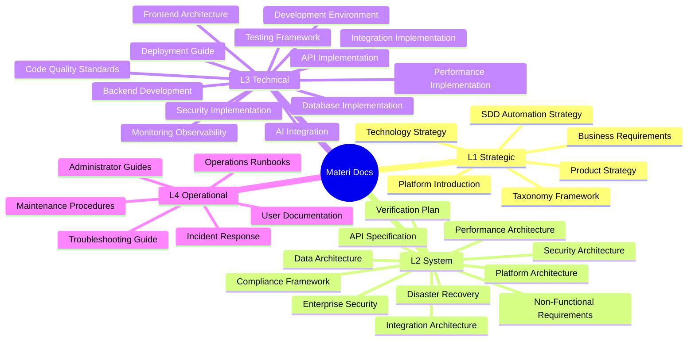

# Documentation Taxonomy Index

<Info>
**SDD Classification:** L1-Strategic | **Authority:** CTO + Documentation Council | **Review Cycle:** Quarterly
</Info>

This document serves as the master index and reference for all Materi project documentation, providing complete visibility into the documentation ecosystem with efficient document discovery, proper access control, and systematic knowledge management.

## Master Document Registry

**Total Documents:** 36 strategic documents across 4 classification levels
**Completion Status:** Framework complete
**Automation Level:** Config-driven taxonomy management
**Last Updated:** January 2026

### Quick Navigation Index

---

## L1-Strategic Documents Index

**Strategic Foundation and Governance Layer**

| Document ID | Title | Atlas Location | Status | Authority | Last Updated |
|-------------|-------|----------------|--------|-----------|--------------|
| **BR-001** | Business Requirements Specification | [l1-strategic-specs.md](/internal/architecture/specs/l1-strategic-specs) | Complete | CPO + Board | Jan 2026 |
| **PS-001** | Product Strategy Document | [vision.md](/internal/product/strategy/vision) | Complete | CEO + CPO + CTO | Jan 2026 |
| **TS-001** | Technology Strategy | [technology-strategy.md](/internal/architecture/specs/technology-strategy) | Complete | CTO + VP Engineering | Nov 2025 |
| **PI-001** | Platform Introduction | [introduction.mdx](/introduction) | Complete | CEO + CPO + CTO | Nov 2025 |
| **TF-001** | Taxonomy Framework | [l1-strategic-specs.md](/internal/architecture/specs/l1-strategic-specs) | Complete | CTO + Documentation Council | Jan 2026 |
| **COO-001** | Concept of Operations | [concept-of-operations.md](/internal/architecture/specs/concept-of-operations) | Complete | CTO + Operations | Nov 2025 |

**Strategic Document Access Control:**
- **Executive Team:** Full read/write access to all L1 documents
- **Board Members:** Read access to BR-001, PS-001, PI-001
- **Senior Leadership:** Read access to all L1 documents
- **Engineering Leadership:** Read access to TS-001, TF-001

---

## L2-System Documents Index

**System Architecture and Design Layer**

| Document ID | Title | Atlas Location | Status | Authority | Dependencies |
|-------------|-------|----------------|--------|-----------|--------------|
| **PA-001** | Platform Architecture Document | [platform-services.md](/internal/architecture/system-design/platform-services) | Stub | CTO + VP Engineering | BR-001, PS-001, TS-001 |
| **DA-001** | Data Architecture | [data-models.md](/internal/architecture/system-design/data-models) | Complete | CTO + Data Architecture Lead | PA-001, BR-001 |
| **SA-001** | Security Architecture | [security/overview.md](/internal/security/practices/overview) | Stub | CTO + CISO | PA-001, DA-001 |
| **NF-001** | Non-Functional Requirements | [slo-sli-sla.md](/internal/engineering/performance/slo-sli-sla) | Stub | CTO + VP Engineering + QA Lead | BR-001, PS-001 |
| **DR-001** | Disaster Recovery Plan | [disaster-recovery.md](/developer/operations/runbooks/disaster-recovery) | Stub | CTO + Operations Lead + CISO | PA-001, SA-001 |
| **VV-001** | Verification & Validation Plan | [verification-matrix.md](/internal/architecture/specs/verification-matrix) | Stub | QA Lead + CTO | All L1 documents |
| **IA-001** | Integration Architecture | [cross-segment-integration.md](/internal/architecture/system-design/cross-segment-integration) | Stub | VP Engineering + Integration Lead | PA-001 |
| **TAX-001** | System Taxonomy | [l2-tactical-specs.md](/internal/architecture/specs/l2-tactical-specs) | Stub | CTO + Architecture Council | TF-001 |

**System Document Access Control:**
- **Architecture Council:** Full read/write access to architecture documents
- **Engineering Leadership:** Read/write access to relevant technical domains
- **Security Team:** Full access to SA-001
- **Product Team:** Read access to PA-001, NF-001, VV-001

---

## L3-Technical Documents Index

**Implementation and Development Layer**

| Document ID | Title | Atlas Location | Status | Authority | Domain |
|-------------|-------|----------------|--------|-----------|--------|
| **BDG-001** | Backend Development Guide | [architecture.md](/developer/introduction/architecture) | Stub | Backend Lead + VP Engineering | Go Fiber, Rust Axum |
| **FAG-001** | Frontend Architecture Guide | [canvas/architecture.md](/developer/products/canvas/architecture) | Stub | Frontend Lead + UX Lead | React, TypeScript |
| **AIG-001** | AI Integration Guide | [aria/model-integration.md](/developer/platform/aria/model-integration) | Stub | AI Engineering Lead | AI services, ML |
| **DI-001** | Database Implementation | [data-models.md](/internal/architecture/system-design/data-models) | Complete | Database Lead | Data layer |
| **SI-001** | Security Implementation | [security/overview.md](/internal/security/practices/overview) | Stub | Security Engineering Lead | Security controls |
| **MO-001** | Monitoring & Observability | [folio/overview.md](/developer/operations/folio/overview) | Stub | DevOps Lead | System visibility |
| **TF-001** | Testing Framework | [testing/overview.md](/developer/testing/overview) | Partial | QA Lead | Quality validation |
| **DG-001** | Deployment Guide | [runbooks/](/developer/operations/runbooks) | Stub | DevOps Lead | CI/CD |
| **DE-001** | Development Environment | [getting-started.md](/developer/introduction/getting-started) | Stub | DevOps Lead | Setup, config |
| **CQS-001** | Code Quality Standards | [code-standards.mdx](/developer/contributing/code-standards) | Stub | Engineering Leads | Development excellence |
| **GW-001** | Git Workflow | [git-workflow.mdx](/developer/contributing/git-workflow) | Partial | Engineering Leads | Version control |

**Technical Document Access Control:**
- **Engineering Teams:** Read/write access to domain-specific documents
- **DevOps Team:** Full access to deployment and infrastructure documents
- **QA Team:** Full access to testing and validation documents
- **Security Team:** Review access to all technical implementations

---

## L4-Operational Documents Index

**Operations and Maintenance Layer**

| Document ID | Title | Atlas Location | Status | Authority | Domain |
|-------------|-------|----------------|--------|-----------|--------|
| **OR-001** | Operations Runbooks | [runbooks/](/developer/operations/runbooks) | Stub | Operations Lead + DevOps Lead | Daily operations |
| **IRP-001** | Incident Response Procedures | [incident-response.md](/developer/operations/runbooks/incident-response) | Stub | Operations Lead + CISO | Crisis management |
| **TG-001** | Troubleshooting Guide | [runbooks/](/developer/operations/runbooks) | Stub | Operations Lead | Problem resolution |
| **UD-001** | User Documentation | [customer/](/customer) | Partial | Technical Writing Lead | End user guidance |
| **AG-001** | Administrator Guides | [operations/](/developer/operations) | Stub | Operations Lead | System administration |
| **AL-001** | Alerting Guide | [folio/alerting.md](/developer/operations/folio/alerting) | Stub | DevOps Lead | Monitoring |

**Operational Document Access Control:**
- **Operations Team:** Full read/write access to all operational documents
- **Support Team:** Read access to troubleshooting and user documentation
- **Engineering Teams:** Read access to relevant technical procedures
- **Management:** Read access to incident response and maintenance procedures

---

## Document Status Summary

### Completion Status by Layer

| Layer | Total | Complete | Partial | Stub |
|-------|-------|----------|---------|------|
| **L1-Strategic** | 6 | 6 | 0 | 0 |
| **L2-System** | 8 | 1 | 0 | 7 |
| **L3-Technical** | 11 | 1 | 2 | 8 |
| **L4-Operational** | 6 | 0 | 1 | 5 |
| **Total** | 31 | 8 | 3 | 20 |

### Priority Development Pipeline

**Immediate Priority (HIGH):**
1. **SA-001** - Security Architecture (required for enterprise sales)
2. **BDG-001** - Backend Development Guide (critical for development team)
3. **FAG-001** - Frontend Architecture Guide (essential for UI development)
4. **MO-001** - Monitoring & Observability (operational visibility)

**High Priority (Next 4 Weeks):**
1. **NF-001** - Non-Functional Requirements (performance and reliability specs)
2. **DR-001** - Disaster Recovery Plan (operational readiness)
3. **AIG-001** - AI Integration Guide (core platform differentiator)
4. **IRP-001** - Incident Response Procedures (operational readiness)

**Medium Priority (Next 8 Weeks):**
1. **IA-001** - Integration Architecture (system connectivity)
2. **PA-001** - Platform Architecture (comprehensive system design)
3. **VV-001** - Verification & Validation (quality assurance)
4. **DE-001** - Development Environment (developer productivity)

---

## Document Discovery and Search

### Search by Stakeholder Role

| Role | Primary Documents |
|------|-------------------|
| **Executive** | L1-Strategic: BR-001, PS-001, TS-001, PI-001 |
| **Technical Leadership** | L2-System: PA-001, SA-001, NF-001 |
| **Engineering** | L3-Technical: BDG-001, FAG-001, AIG-001, TF-001 |
| **Operations** | L4-Operational: OR-001, IRP-001, TG-001 |
| **Product** | BR-001, PS-001, PI-001, NF-001, UD-001 |
| **Security** | SA-001, SI-001 |
| **Compliance** | VV-001, SA-001 |

### Search by Technical Domain

| Domain | Documents |
|--------|-----------|
| **Platform Architecture** | PA-001, DA-001, IA-001 |
| **Security** | SA-001, SI-001 |
| **Backend Development** | BDG-001, DI-001 |
| **Frontend Development** | FAG-001 |
| **AI/ML** | AIG-001, PS-001 |
| **Infrastructure** | DG-001, OR-001, DR-001 |
| **Quality Assurance** | TF-001, VV-001, CQS-001 |

### Search by Business Function

| Function | Documents |
|----------|-----------|
| **Strategy & Planning** | BR-001, PS-001, TS-001 |
| **Development** | All L3-Technical documents |
| **Operations** | All L4-Operational documents |
| **Governance** | TF-001, VV-001 |

---

## Document Access and Permissions

### Role-Based Access Control Matrix

| Role Level | L1-Strategic | L2-System | L3-Technical | L4-Operational |
|------------|--------------|-----------|--------------|----------------|
| **Executive** | Full Access | Read Access | Review Access | Summary Access |
| **Technical Leadership** | Read Access | Full Access | Full Access | Review Access |
| **Engineering Leads** | Read Access | Read Access | Full Access | Read Access |
| **Operations Leads** | Summary Access | Read Access | Read Access | Full Access |
| **Individual Contributors** | Summary Access | Read Access | Domain Access | Read Access |

### Document Security Classifications

| Classification | Document Types | Access |
|----------------|----------------|--------|
| **Internal Use Only** | All L1-Strategic and L2-System documents | Employees only |
| **Technical Team Access** | L3-Technical implementation documents | Engineering teams |
| **Operations Team Access** | L4-Operational procedures and runbooks | Operations teams |
| **Public Documentation** | Selected user-facing guides (UD-001 portions) | External users |

---

## Cross-Layer Dependencies

### Strategic → System Dependencies

- **Business Requirements** drive **Platform Architecture** decisions
- **Product Strategy** informs **API Specification** and **Data Architecture**
- **Technology Strategy** guides **Security Architecture** and **Performance Architecture**

### System → Technical Dependencies

- **Platform Architecture** defines **Database Implementation** and **Backend Development**
- **Security Architecture** mandates **Security Implementation** across all technical documents
- **API Specification** drives **API Implementation** and **Integration Implementation**

### Technical → Operational Dependencies

- **Database Implementation** requires **Operations Runbooks** and **Maintenance Procedures**
- **Security Implementation** necessitates **Incident Response Procedures**
- **Deployment Guide** supports **Administrator Guides** and **Troubleshooting**

---

## Maintenance and Update Procedures

### Automated Index Management

- **Real-time Updates:** Document status automatically tracked through SDD automation
- **Dependency Validation:** Cross-references automatically maintained
- **Access Control Sync:** Permissions updated based on role changes
- **Version Management:** All document versions tracked and accessible

### Manual Review Processes

| Review Type | Frequency | Responsible Party |
|-------------|-----------|-------------------|
| **Operational Status** | Weekly | Operations team |
| **Technical Progress** | Monthly | Engineering leads |
| **Strategic Alignment** | Quarterly | Executive team |
| **Framework Review** | Annual | Documentation council |

---

## Related Documents

- [L1-Strategic Specs](/internal/architecture/specs/l1-strategic-specs) - Business requirements and classification hierarchy
- [Technology Strategy](/internal/architecture/specs/technology-strategy) - Technical direction
- [Concept of Operations](/internal/architecture/specs/concept-of-operations) - Operational context
- [L2-Tactical Specs](/internal/architecture/specs/l2-tactical-specs) - System architecture specifications

---

**Index Status:** Complete and Current
**Framework Version:** 2.0
**Last Updated:** January 2026
**Authority:** CTO + Documentation Council

**Document Classification:** L1-Strategic - Internal Use Only
**Distribution:** All Materi staff with appropriate access level
