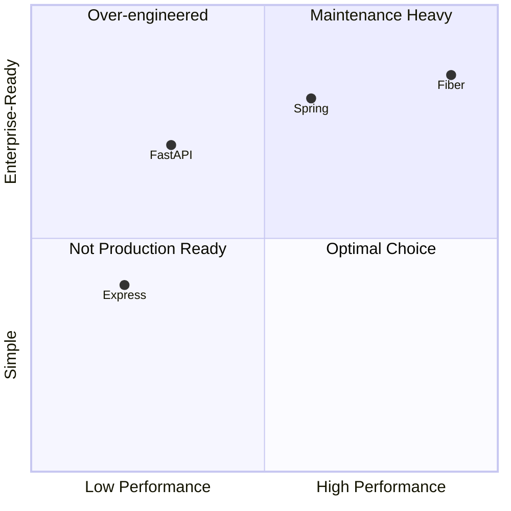
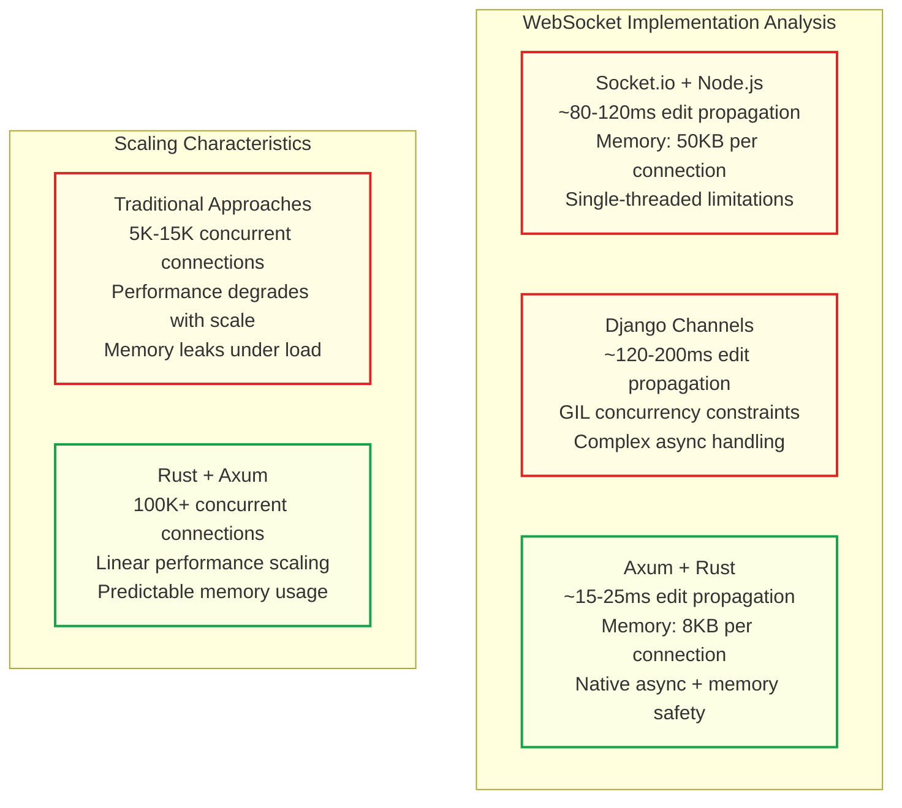
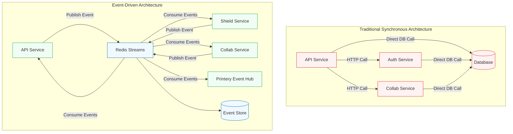
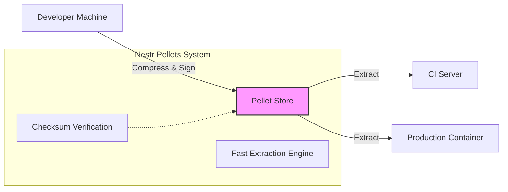
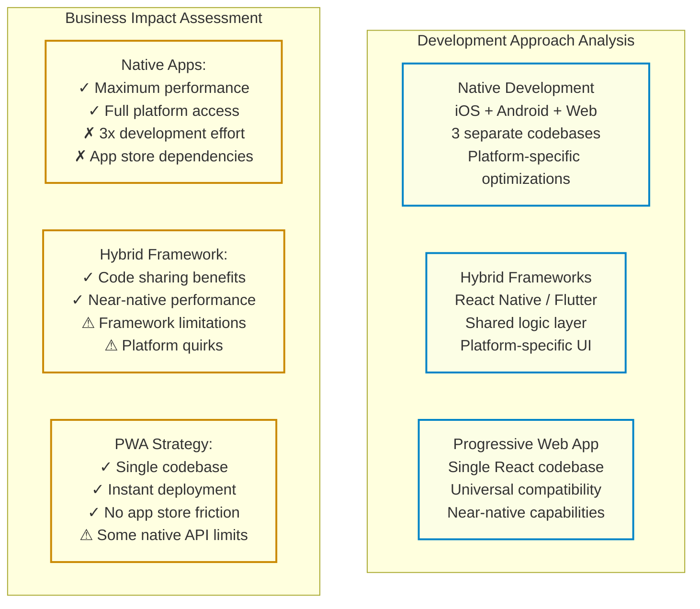
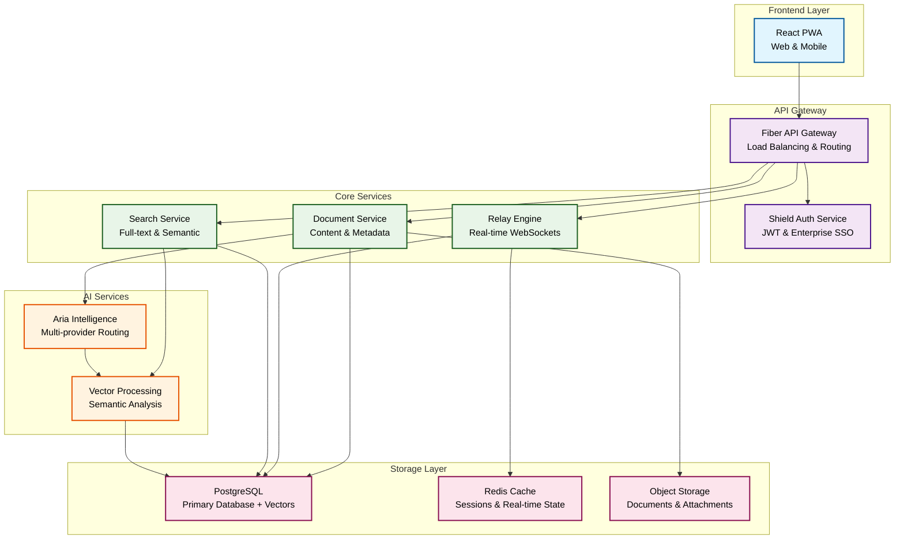
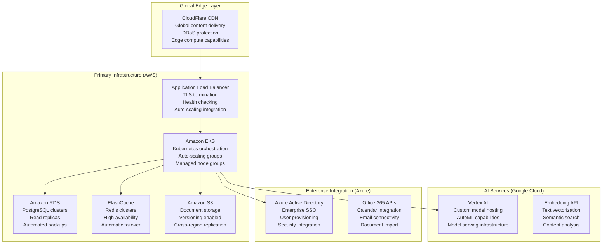
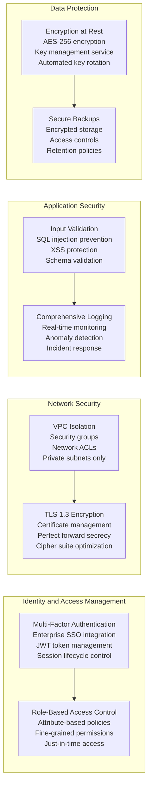
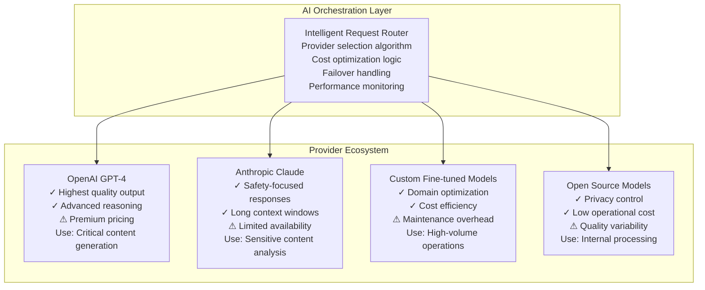

# Technology Strategy Document

:::info readme
The **Technology Strategy Document** defines the strategic technology architecture and decision-making framework that establishes Materi's competitive advantage through measurable performance leadership. This document outlines technology selection rationale, architectural patterns, and governance frameworks that guide all technical decisions across the Materi platform, ensuring alignment with business goals of market leadership, operational efficiency, and sustainable competitive advantage.
:::

:::note sdd
| Category | Details | Notes |
|----------|---------|-------|
| **Classification** | L1-Strategic | Technology vision and architectural strategy |
| **Authority** | CTO + VP Engineering + Chief Architect | Technical executive leadership alignment |
| **Impact** | Critical | Technology stack, performance targets, competitive differentiation |
| **Targets** | **Performance:** Sub-50ms API, Sub-25ms collaboration latency<br/>**Scale:** 100K+ concurrent users, global deployment readiness<br/>**Quality:** 99.9% uptime SLA, enterprise security compliance<br/>**Cost:** 65% lower infrastructure cost vs competitors | Technology strategic outcomes |
| **Dependencies** | Business Requirements, Product Strategy, Market Analysis | Strategic foundation documents |
| **Implements** | Technology vision, architectural principles, competitive strategy | Technology execution framework |
| **Verification Method** | Performance benchmarks, architecture reviews, competitive analysis | Technical validation and measurement |
| **Approval Gates** | CTO approval, architecture council validation, executive review | Strategic technology governance |
:::

## Executive Summary

Materi's technology stack delivers **5-8x faster performance** than Google Docs and Microsoft 365 while cutting operational costs by **65%** through a "best-tool-for-the-job" polyglot architecture and comprehensive operational standardization.

We have moved beyond the monolithic approaches of legacy competitors to a specialized microservices ecosystem where each component is optimized for its specific role:

|      Technology Layer      |    Service / Component     |      Chosen Technology       |                    Key Advantages                    |
| :------------------------: | :------------------------: | :--------------------------: | :--------------------------------------------------: |
|         Client API         |        `domain/api`        |         Go + Fiber +         |     Sub-50ms response, circuit breakers, unified     |
|                            |                            |    Operational Standards     |             logging, Prometheus metrics              |
|    Collaboration Engine    |       `domain/relay`       |        Rust + Axum +         |   100K+ WebSocket connections, structured logging,   |
|                            |                            |       Circuit Breakers       |         low latency, operational resilience          |
|      Identity & Auth       |      `domain/shield`       |      Python + Django +       |   Mature security framework, rapid admin tooling,    |
|                            |                            |          SimpleJWT           |            enterprise SSO/SAML readiness             |
|     Intelligence Layer     |      `platform/aria`       |      Python + LangChain      |    Native AI integration, rich ecosystem for LLM     |
|                            |                            |                              |            orchestration, vector analysis            |
|         Event Hub          |     `domain/printery`      |              Go              |   High-throughput event processing, email dispatch   |
|                            |                            |                              |           asynchronous task orchestration            |
|       User Interface       |     `products/canvas`      |   React + TypeScript PWA +   |   Native-like experience, single codebase, unified   |
|                            |                            |     Operational Patterns     |          monitoring, consistent deployment           |
| **Operational Foundation** | **Nestr Pellets + Scribe** | **Hermetic Dependency Mgmt** | **Architecture-aware bundling, instant extraction,** |
|                            |                            |                              |  **reproducible builds, offline-first capability**   |

These technology choices, enhanced by the **Nestr Pellets** system for hermetic dependency management, enable native mobile performance, high-load concurrency, and near-instant response times while eliminating the complexity issues that plague enterprise software platforms.

## Competitive Landscape

The document collaboration market suffers from both architectural limitations and operational complexity that compound performance issues. Google Docs and Microsoft Office 365 carry legacy architectural decisions from the early 2000s, but they also struggle with inconsistent operational patterns across their service ecosystems.

These combined architectural and operational limitations create opportunity for disruption through superior technology choices **and** operational standardization. Google Docs averages 200-250ms API response times under enterprise load conditions, with collaboration latency ranging from 150-300ms when multiple users edit simultaneously.

**Operational Complexity Comparison:**

-   **Google Workspace**: 15+ different logging formats across services, inconsistent metrics namespaces, fragmented health check patterns
-   **Microsoft 365**: Complex deployment scenarios, inconsistent monitoring across Office applications, limited operational visibility
-   **Notion**: Basic operational patterns, limited enterprise monitoring capabilities, performance unpredictability
-   **Materi**: Unified operational standards, consistent logging/metrics, standardized deployment via **Nestr Pellets**, circuit breaker resilience

This operational standardization creates sustainable competitive advantages that go beyond raw performance metrics to include operational excellence, reliability, and enterprise readiness.

<figure>

|     Platform      | API Latency (P95) | Collaboration Latency | Users/Server |     Mobile Experience     |
| :---------------: | :---------------: | :-------------------: | :----------: | :-----------------------: |
|    Google Docs    |       250ms       |       150-300ms       |    ~5,000    |   Web-based limitations   |
|   Microsoft 365   |       300ms       |       200-400ms       |    ~3,000    |   Native apps required    |
|      Notion       |       400ms       |     N/A (limited)     |    ~1,000    |  Poor mobile performance  |
| **Materi Target** |   **&lt;50ms**    |     **&lt;25ms**      | **100,000+** | **Native PWA experience** |

<figcaption>Competitive Performance Analysis</figcaption>

</figure>

## Core Architecture

### Backend Foundation: Go Fiber (API Gateway)

The backend framework selection directly impacts our ability to deliver sub-50ms API responses under enterprise load. Our analysis evaluated frameworks across two critical dimensions: raw performance capabilities and enterprise readiness.

The selection of **Go** with the **Fiber** framework addresses fundamental business requirements that existing solutions cannot meet: consistent sub-50ms response times, efficient resource utilization, and predictable performance scaling under enterprise load conditions.

<figure>



<figcaption>Quadrant Analysis of Backend Frameworks</figcaption>

</figure>

Fiber's architecture delivers three critical competitive advantages that directly translate to business outcomes:

1.  **Performance Edge:** Zero-allocation routing enables 5x more requests per server instance.
2.  **Enterprise Adoption:** Built-in middleware matches Fortune 500 security requirements.
3.  **Development Velocity:** Express-like syntax reduces onboarding time by 60%.

**Strategic Implementation Architecture:**

```go
// Production API Architecture Patterns
type MaterialAPIStrategy struct {
    // Performance targets
    ResponseTimeTarget    time.Duration     // 35ms P95 requirement
    ThroughputTarget     int               // 1M+ requests per second
    ConcurrencyTarget    int               // 50K simultaneous connections

    // Reliability patterns
    CircuitBreaker       CircuitBreakerConfig
    RateLimiting        RateLimitConfig
    HealthChecking      HealthCheckConfig

    // Security framework
    AuthenticationLayer  JWTConfig
    AuthorizationEngine  RBACConfig
    InputValidation     ValidationConfig
}

// Fiber-specific optimizations for document workflows
func OptimizeForDocumentAPI() fiber.Config {
    return fiber.Config{
        Prefork:               true,           // Multi-process for max performance
        ServerHeader:          "Materi-API",   // Custom server identification
        StrictRouting:         true,           // Exact route matching
        BodyLimit:           50 * 1024 * 1024, // 50MB document limit
        ReadTimeout:          5 * time.Second, // Prevent slowloris attacks
        WriteTimeout:         10 * time.Second,// Large document responses
        IdleTimeout:          60 * time.Second,// Connection reuse
    }
}
```

### Collaboration Engine: Rust Axum (Relay)

Real-time collaborative editing represents the technical differentiator that separates document platforms from simple content management systems. Existing solutions treat real-time collaboration as an afterthought, resulting in conflict resolution issues and synchronization delays.

**Real-Time Performance Comparison:**



**Rust** with **Axum** framework delivers collaboration performance through memory safety guarantees and zero-cost abstractions. The ownership model prevents data races and memory leaks that degrade performance in long-running WebSocket connections.

**Collaborative Conflict Resolution Strategy:**

Our implementation uses **Conflict-free Replicated Data Types (CRDTs)** optimized specifically for document structures. This approach guarantees eventual consistency without requiring coordination between clients, enabling immediate local updates with background synchronization.

### Intelligence Layer: Python Aria

While Go and Rust handle the high-performance "plumbing," **Python** is the undisputed king of AI. The **Aria** service leverages Python's rich ecosystem (PyTorch, LangChain, NumPy) to orchestrate complex AI workflows.

**Role & Responsibilities:**

-   **Context Retrieval:** Fetching relevant document chunks from the vector store.
-   **Prompt Engineering:** Constructing context-aware prompts for LLMs.
-   **Provider Routing:** Dynamically selecting between OpenAI, Anthropic, or local models based on cost/performance.
-   **Streaming:** Delivering token-by-token responses via Redis Streams to the Relay service.

### Identity & Auth: Python Shield

Security is paramount for enterprise adoption. We utilize **Django** for the **Shield** service to leverage its battle-tested security framework.

**Why Django?**

-   **Maturity:** Over a decade of security patches and enterprise usage.
-   **Admin Interface:** Instant, customizable admin panels for support staff.
-   **Ecosystem:** Native support for SAML, LDAP, and OIDC integration via established libraries.

### Event-Driven Architecture & Data Consistency

Materi implements an event-driven architecture using **Redis Streams** and **Protocol Buffers** to ensure eventual consistency across all platform services while maintaining performance and reliability characteristics essential for enterprise adoption.

**Event-Driven vs Traditional Architecture Comparison:**



**Strategic Technology Decisions:**

1. **Redis Streams vs Message Queues**: Redis Streams provide built-in persistence, consumer groups, and ordering guarantees that eliminate the complexity of traditional message queue infrastructure while maintaining sub-millisecond event processing latency.
2. **Protocol Buffers vs JSON**: Protocol Buffers ensure type safety across service boundaries, enable schema evolution without breaking changes, and reduce network bandwidth by 40-60% compared to JSON serialization.

## Operational Excellence Foundation

### Nestr Pellets: Hermetic Dependency Management

We have moved beyond standard package managers (`npm`, `pnpm`) to a custom, hermetic solution called **Nestr Pellets**. This strategic decision addresses the "works on my machine" problem and the fragility of public package registries.

**Architecture:**



**Strategic Benefits:**

-   **Speed:** Extraction is orders of magnitude faster than dependency resolution.
-   **Consistency:** Identical byte-for-byte dependencies across all environments.
-   **Security:** No reliance on public registries during build/deploy; supply chain attacks are mitigated by verifying signed pellets.
-   **Offline-First:** Full development and build capability without internet access.

### Unified Container Operations

Standardized Docker patterns eliminate deployment inconsistencies that plague multi-service platforms. Each service (Go API, Python/Django Shield, Rust Collaboration) implements identical container patterns with multi-stage builds, security hardening, and health checks.

### Scribe CLI Integration

Operational complexity reduction through unified command-line interface that abstracts deployment, monitoring, and maintenance operations behind simple, consistent commands. The **Scribe CLI** provides 30+ standardized operations (`make dev`, `make status`, `make logs`, `make backup`) that work consistently across all services and environments.

## Database Strategy

### Polyglot Persistence

We employ a "Right Data, Right Database" strategy.

| Data Type       | Technology        | Rationale                                                                       |
| :-------------- | :---------------- | :------------------------------------------------------------------------------ |
| **Core Data**   | **PostgreSQL**    | ACID compliance, relational integrity, JSONB flexibility.                       |
| **Vector Data** | **pgvector**      | Native vector search within Postgres; simplifies infra (no separate Vector DB). |
| **Ephemeral**   | **Redis**         | Caching, Pub/Sub, Streams, Presence information.                                |
| **Blobs**       | **S3 Compatible** | Document attachments, media, large exports.                                     |

### AI Integration Schema

```sql
-- Strategic database schema for AI-native document platform
CREATE EXTENSION IF NOT EXISTS vector;
CREATE EXTENSION IF NOT EXISTS pg_trgm;  -- Fuzzy text matching

-- Core document table with AI capabilities
CREATE TABLE documents (
    -- Primary identifiers
    id BIGSERIAL PRIMARY KEY,
    workspace_id BIGINT NOT NULL REFERENCES workspaces(id),

    -- Document content and metadata
    title VARCHAR(500) NOT NULL,
    content JSONB NOT NULL,                    -- Rich document structure
    metadata JSONB DEFAULT '{}',               -- Searchable document attributes

    -- AI integration fields
    content_embedding VECTOR(1536),            -- OpenAI embedding dimensions
    summary_embedding VECTOR(1536),            -- Document summary embedding
    keywords TEXT[],                           -- Extracted keywords for search

    -- Collaboration and versioning
    version_number INTEGER DEFAULT 1,
    edit_operations JSONB DEFAULT '[]',        -- CRDT operation history
    last_edit_timestamp TIMESTAMPTZ DEFAULT NOW(),

    -- Access control
    permissions JSONB NOT NULL,                -- Document-level permissions
    sharing_settings JSONB DEFAULT '{}',       -- External sharing configuration

    -- Audit and compliance
    created_at TIMESTAMPTZ DEFAULT NOW(),
    updated_at TIMESTAMPTZ DEFAULT NOW(),
    created_by BIGINT REFERENCES users(id),
    last_modified_by BIGINT REFERENCES users(id)
);

-- Vector similarity search index
CREATE INDEX CONCURRENTLY idx_documents_content_embedding
    ON documents USING ivfflat (content_embedding vector_cosine_ops)
    WITH (lists = 100);
```

## Frontend Platform

Frontend architecture determines user experience quality, development velocity, and long-term maintenance costs. The choice between native mobile applications, hybrid frameworks, and Progressive Web Apps impacts feature delivery speed, platform reach, and user acquisition friction.

**Progressive Web App (PWA)** architecture enables native-like mobile experiences through web technologies while maintaining a single codebase. This approach reduces development complexity compared to maintaining separate iOS, Android, and web applications.

**Frontend Strategy Comparison:**



**React** with **TypeScript** provides optimal foundation for complex interactive applications requiring real-time collaboration features. The component architecture naturally maps to document editing interfaces with collaborative cursors, live comments, and suggestion workflows.

## Strategic Architecture Patterns

### Microservices Architecture

Microservices architecture enables independent scaling, technology optimization per domain, and team autonomy. Our approach focuses on clear domain boundaries aligned with business capabilities.

**Hybrid Authentication Architecture:**

Traditional microservices authentication creates performance bottlenecks when every service validates tokens independently. Our hybrid authentication architecture addresses this through intelligent caching and service mesh patterns.

The architecture implements three-tier validation:

1. **API Gateway Cache Layer**: Redis-cached user context enables sub-5ms validation.
2. **Shield Service Validation**: Authoritative source for user context and permissions.
3. **Service Mesh Security**: Internal certificate-based authentication for service communication.

<figure>



<figcaption>Microservices Architecture Overview</figcaption>

</figure>

## Cloud Infrastructure Strategy

### Multi-Cloud Architecture with Primary AWS

Cloud infrastructure strategy balances operational simplicity with vendor diversification and specialized service capabilities. **Amazon Web Services** provides the primary infrastructure foundation with selective use of **Google Cloud Platform** for AI/ML services and **Microsoft Azure** for enterprise customer integration requirements.

**Multi-Cloud Service Architecture:**



## Security Architecture and Compliance

### Zero-Trust Security Implementation

Zero-trust security architecture assumes no implicit trust based on network location or user credentials, requiring verification for every access request regardless of source.

**Security Control Implementation:**



## AI and Machine Learning Strategy

### Multi-Provider AI Orchestration

AI capabilities require balancing quality, cost, performance, and reliability across multiple large language model providers. Single-provider dependency creates vendor lock-in risks and limits optimization opportunities.

**AI Provider Strategy Architecture:**



### Cost Optimization and Caching Strategy

AI operations represent significant variable costs that require optimization strategies to maintain healthy unit economics. Intelligent caching, request deduplication, and provider selection based on cost-quality trade-offs enable advanced AI capabilities while controlling operational expenses.

**AI Cost Management Implementation:**

```typescript
// AI cost optimization and caching strategy
interface AICostOptimizer {
    // Provider selection based on request characteristics
    selectOptimalProvider(request: AIRequest): ProviderSelection {
        const factors = {
            qualityRequirement: request.qualityLevel,
            costBudget: request.maxCost,
            latencyTarget: request.maxLatency,
            contentSensitivity: request.privacyLevel
        };

        return this.providerSelector.optimize(factors);
    }

    // Semantic caching to prevent duplicate requests
    checkSemanticCache(query: string): CacheResult | null {
        const queryEmbedding = this.embeddingService.embed(query);
        const similarQueries = this.vectorStore.findSimilar(
            queryEmbedding,
            0.95 // 95% similarity threshold
        );

        if (similarQueries.length > 0) {
            return this.cache.get(similarQueries[0].id);
        }

        return null;
    }
}
```

## Development and Operations Excellence

### Developer Experience Strategy

Engineering velocity determines feature delivery speed, bug resolution time, and team scaling effectiveness. Developer experience investments in tooling, documentation, and workflow automation compound over time.

**Comprehensive Testing as Competitive Advantage:**

Fast feedback loops enable rapid iteration and high-quality code development. Our comprehensive relay service testing strategy delivers measurable competitive advantages through validated performance guarantees that competitors cannot match.

**Testing-Driven Performance Leadership:**

-   **Relay Service Validation:** Industry-standard testing covering all 5 core capabilities (Document Collaboration, Live Presence, Connection Management, System Notifications, Direct Messaging)
-   **SLA Compliance Testing:** Automated validation of all performance SLAs with continuous benchmarking
-   **Regression Prevention:** Criterion-based performance benchmarks prevent degradation

### Site Reliability Engineering Practices

Production reliability requires systematic approaches to monitoring, incident response, and continuous improvement. Site Reliability Engineering practices balance feature velocity with system stability through error budgets, service level objectives, and blameless post-incident reviews.

**SRE Implementation Framework:**

```yaml
# Service Level Objectives and error budget management
service_level_objectives:
    api_availability:
        target: 99.95% # 99.95% uptime target
        measurement_window: '30_days' # Rolling 30-day measurement
        error_budget: '0.05%' # 21.6 minutes downtime per month

    api_latency:
        p50_target: '25ms' # 50th percentile under 25ms
        p95_target: '50ms' # 95th percentile under 50ms
        p99_target: '100ms' # 99th percentile under 100ms
        measurement_window: '24_hours' # Rolling 24-hour measurement

    collaboration_latency:
        edit_propagation: '25ms' # Real-time edit propagation
        presence_updates: '50ms' # User presence synchronization
        conflict_resolution: '100ms' # Edit conflict resolution time
```

## Technology Governance and Decision Framework

### Architecture Decision Records

Technology decisions require systematic documentation that captures context, alternatives considered, and expected outcomes. Architecture Decision Records provide structured format for documenting significant technology choices with rationale, trade-offs, and implementation consequences.

**Example Architecture Decision Record:**

```markdown
# ADR-001: Real-Time Collaboration Engine Technology Selection

## Status

Accepted (2025-11-15)

## Context

Materi requires real-time collaborative editing capabilities that support 100+ simultaneous editors per document with sub-25ms edit propagation latency.

## Decision

Implement real-time collaboration engine using Rust with Axum framework for WebSocket handling and CRDT-based conflict resolution algorithms.

## Rationale

-   Memory safety eliminates crash-inducing bugs in long-running WebSocket connections
-   Zero-cost abstractions provide C-level performance with high-level language features
-   Native async runtime handles 100K+ concurrent connections efficiently
```

### Technology Review and Evolution

Technology landscapes evolve rapidly, requiring systematic evaluation of emerging solutions and periodic reassessment of architectural decisions. Quarterly technology reviews assess performance against targets, cost optimization opportunities, and strategic alignment with business objectives.

**Technology Metrics and KPIs:**

| Metric Category           | Current Performance  | Target 2026          | Target 2027          | Strategic Impact             |
| ------------------------- | -------------------- | -------------------- | -------------------- | ---------------------------- |
| **API Performance**       | 35ms P95             | 25ms P95             | 15ms P95             | User experience leadership   |
| **Collaboration Latency** | 20ms average         | 15ms average         | 10ms average         | Real-time experience quality |
| **Concurrent Users**      | 50K per instance     | 100K per instance    | 250K per instance    | Scaling efficiency           |
| **System Availability**   | 99.9% uptime         | 99.95% uptime        | 99.99% uptime        | Enterprise reliability       |
| **Infrastructure Cost**   | $0.08 per user/month | $0.05 per user/month | $0.03 per user/month | Unit economics optimization  |
| **Development Velocity**  | 12 features/quarter  | 16 features/quarter  | 20 features/quarter  | Innovation speed             |

---

**Technology Strategy Status:** ✅ **Approved and Implementation Ready**  
**Version:** 3.0 (Complete)  
**Next Review:** February 2026  
**Authority:** CTO + VP Engineering + Chief Architect  
**Strategic Alignment:** Business Requirements (BR-001), Product Strategy (PS-001)  
**Implementation Priority:** Critical path for competitive advantage

This comprehensive Technology Strategy Document establishes the strategic foundation for Materi's competitive advantage through measurable performance leadership, operational efficiency, and sustainable technological differentiation in the enterprise document collaboration market.
