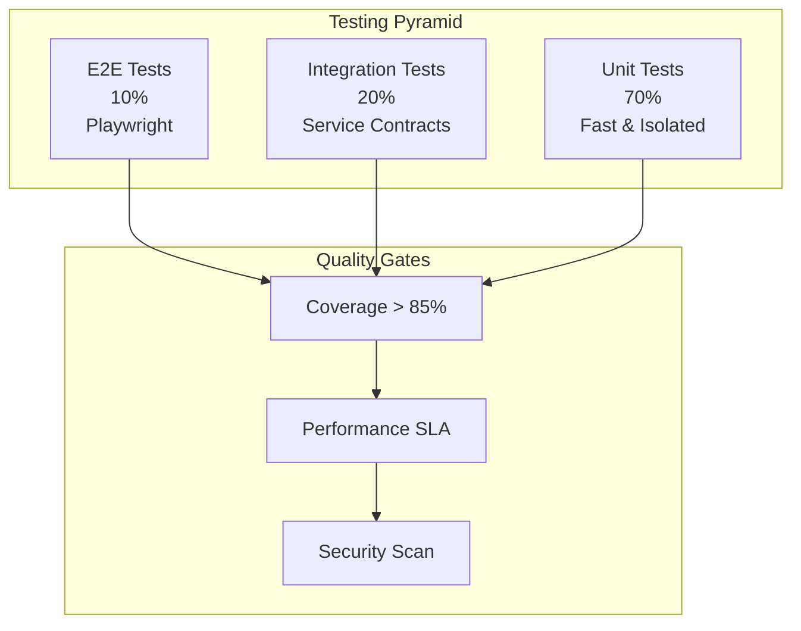

# Verification & Validation Matrix

<Info>
**SDD Classification:** L2-System | **Authority:** QA Lead + CTO | **Review Cycle:** Quarterly
</Info>

This document defines the comprehensive Verification and Validation Plan (VVP) for the Materi platform, establishing testing strategies, quality gates, and acceptance criteria across all service layers.

**Testing Pyramid**: 70% Unit, 20% Integration, 10% E2E
**Coverage Targets**: 85%+ line coverage, >95% critical path coverage
**Performance Gates**: <10ms unit test avg, <500ms integration tests
**Quality Standard**: Zero critical defects in production

---

## Testing Framework Overview

### Testing Pyramid



---

## Service-Specific Testing

### API Service (Go Fiber)

#### Unit Testing Framework

```go
// internal/service/document_test.go
package service_test

import (
    "testing"
    "github.com/stretchr/testify/assert"
    "github.com/stretchr/testify/mock"
)

func TestDocumentService_Create(t *testing.T) {
    // Arrange
    mockRepo := new(MockDocumentRepository)
    mockRepo.On("Create", mock.Anything, mock.AnythingOfType("*model.Document")).
        Return(nil)

    service := NewDocumentService(mockRepo)

    // Act
    doc, err := service.Create(context.Background(), &CreateDocumentRequest{
        Title:       "Test Document",
        WorkspaceID: "ws-123",
    })

    // Assert
    assert.NoError(t, err)
    assert.NotEmpty(t, doc.ID)
    assert.Equal(t, "Test Document", doc.Title)
    mockRepo.AssertExpectations(t)
}
```

#### HTTP Handler Testing

```go
// internal/handler/document_handler_test.go
func TestDocumentHandler_Create(t *testing.T) {
    app := fiber.New()
    handler := NewDocumentHandler(mockService)
    app.Post("/documents", handler.Create)

    req := httptest.NewRequest("POST", "/documents", strings.NewReader(`{
        "title": "Test Document",
        "workspace_id": "ws-123"
    }`))
    req.Header.Set("Content-Type", "application/json")
    req.Header.Set("Authorization", "Bearer valid-token")

    resp, err := app.Test(req)

    assert.NoError(t, err)
    assert.Equal(t, 201, resp.StatusCode)
}
```

### Relay Service (Rust Axum)

#### Unit Testing with tokio-test

```rust
// src/crdt/document_test.rs
#[cfg(test)]
mod tests {
    use super::*;
    use tokio_test;

    #[tokio_test]
    async fn test_apply_insert_operation() {
        // Arrange
        let mut doc_state = DocumentState::new();

        let operation = Operation {
            id: "op-1".to_string(),
            actor_id: "user-1".to_string(),
            timestamp: 1000,
            op_type: OperationType::Insert {
                content: "Hello".to_string(),
            },
            position: 0,
        };

        // Act
        let result = doc_state.apply_operation(operation).await;

        // Assert
        assert!(result.is_ok());
        assert_eq!(doc_state.get_content(), "Hello");
    }

    #[tokio_test]
    async fn test_concurrent_operations() {
        let mut doc_state = DocumentState::new();

        // Simulate concurrent edits from different users
        let op1 = Operation::insert("user-1", 0, "A");
        let op2 = Operation::insert("user-2", 0, "B");

        // Apply in different orders - should converge
        doc_state.apply_operation(op1.clone()).await.unwrap();
        doc_state.apply_operation(op2.clone()).await.unwrap();

        let content1 = doc_state.get_content();

        // Reset and apply in reverse order
        let mut doc_state2 = DocumentState::new();
        doc_state2.apply_operation(op2).await.unwrap();
        doc_state2.apply_operation(op1).await.unwrap();

        let content2 = doc_state2.get_content();

        // CRDT guarantee: eventual consistency
        assert_eq!(content1, content2);
    }
}
```

#### Performance Benchmarking with Criterion

```rust
// benches/crdt_benchmark.rs
use criterion::{criterion_group, criterion_main, Criterion, BenchmarkId};

fn benchmark_operation_throughput(c: &mut Criterion) {
    let mut group = c.benchmark_group("CRDT Operations");

    for size in [100, 1000, 10000].iter() {
        group.bench_with_input(
            BenchmarkId::new("insert_operations", size),
            size,
            |b, &size| {
                b.iter(|| {
                    let mut doc = DocumentState::new();
                    for i in 0..size {
                        let op = Operation::insert("user-1", i, "x");
                        doc.apply_operation(op).unwrap();
                    }
                });
            },
        );
    }

    group.finish();
}

criterion_group!(benches, benchmark_operation_throughput);
criterion_main!(benches);
```

### Shield Service (Python Django)

#### Unit Testing with pytest

```python
# apps/users/tests/test_views.py
import pytest
from django.test import TestCase
from rest_framework.test import APIClient
from apps.users.models import User

class TestUserAuthentication:
    @pytest.fixture
    def api_client(self):
        return APIClient()

    @pytest.fixture
    def user(self, db):
        return User.objects.create_user(
            email='test@example.com',
            password='secure-password'
        )

    def test_login_success(self, api_client, user):
        response = api_client.post('/api/auth/login/', {
            'email': 'test@example.com',
            'password': 'secure-password'
        })

        assert response.status_code == 200
        assert 'access_token' in response.data
        assert 'refresh_token' in response.data

    def test_login_invalid_credentials(self, api_client, user):
        response = api_client.post('/api/auth/login/', {
            'email': 'test@example.com',
            'password': 'wrong-password'
        })

        assert response.status_code == 401
```

---

## Integration Testing

### Cross-Service Integration

```python
# testing/integration/test_document_collaboration.py
import pytest
import asyncio
import websockets

class TestDocumentCollaboration:
    @pytest.fixture
    async def authenticated_user(self):
        # Create user via Shield
        user = await create_test_user()
        token = await get_auth_token(user)
        return user, token

    @pytest.fixture
    async def document(self, authenticated_user):
        user, token = authenticated_user
        # Create document via API
        doc = await create_document(token, {"title": "Test Doc"})
        return doc

    async def test_realtime_collaboration(self, authenticated_user, document):
        user, token = authenticated_user

        # Connect to Relay via WebSocket
        async with websockets.connect(
            f"ws://localhost:8081/documents/{document['id']}?token={token}"
        ) as ws:
            # Send operation
            await ws.send(json.dumps({
                "type": "operation",
                "data": {
                    "op_type": "insert",
                    "position": 0,
                    "content": "Hello"
                }
            }))

            # Verify operation acknowledged
            response = await asyncio.wait_for(ws.recv(), timeout=5.0)
            data = json.loads(response)

            assert data["type"] == "ack"
            assert data["success"] is True
```

### API Contract Testing

```yaml
# testing/contracts/document-api.yaml
openapi: 3.0.0
paths:
  /api/v1/documents:
    post:
      requestBody:
        content:
          application/json:
            schema:
              type: object
              required: [title, workspace_id]
              properties:
                title:
                  type: string
                  minLength: 1
                  maxLength: 255
                workspace_id:
                  type: string
                  format: uuid
      responses:
        '201':
          content:
            application/json:
              schema:
                $ref: '#/components/schemas/Document'
```

---

## End-to-End Testing

### Playwright E2E Tests

```typescript
// testing/e2e/document-editor.spec.ts
import { test, expect } from '@playwright/test';

test.describe('Document Editor', () => {
    test.beforeEach(async ({ page }) => {
        // Login
        await page.goto('/login');
        await page.fill('[data-testid="email"]', 'test@example.com');
        await page.fill('[data-testid="password"]', 'password');
        await page.click('[data-testid="login-button"]');
        await page.waitForURL('/dashboard');
    });

    test('should create and edit document', async ({ page }) => {
        // Create document
        await page.click('[data-testid="new-document"]');
        await page.fill('[data-testid="document-title"]', 'E2E Test Document');
        await page.click('[data-testid="create-document"]');

        // Wait for editor
        await page.waitForSelector('[data-testid="editor"]');

        // Type content
        await page.click('[data-testid="editor"]');
        await page.keyboard.type('Hello, World!');

        // Verify content saved
        await page.waitForSelector('[data-testid="save-indicator"]');
        expect(await page.textContent('[data-testid="editor"]')).toContain('Hello, World!');
    });

    test('should collaborate in real-time', async ({ browser }) => {
        // Create two browser contexts
        const context1 = await browser.newContext();
        const context2 = await browser.newContext();

        const page1 = await context1.newPage();
        const page2 = await context2.newPage();

        // Both users login and open same document
        await loginAndOpenDocument(page1, 'user1@example.com', 'doc-123');
        await loginAndOpenDocument(page2, 'user2@example.com', 'doc-123');

        // User 1 types
        await page1.click('[data-testid="editor"]');
        await page1.keyboard.type('User 1 text');

        // User 2 should see the update
        await expect(page2.locator('[data-testid="editor"]'))
            .toContainText('User 1 text', { timeout: 5000 });
    });
});
```

---

## Performance Testing

### Load Testing with k6

```javascript
// testing/load/api-load-test.js
import http from 'k6/http';
import { check, sleep } from 'k6';

export const options = {
    stages: [
        { duration: '2m', target: 100 },   // Ramp up
        { duration: '5m', target: 100 },   // Stay at 100 users
        { duration: '2m', target: 200 },   // Ramp up more
        { duration: '5m', target: 200 },   // Stay at 200 users
        { duration: '2m', target: 0 },     // Ramp down
    ],
    thresholds: {
        http_req_duration: ['p(95)<50'],   // 95% requests < 50ms
        http_req_failed: ['rate<0.01'],    // Error rate < 1%
    },
};

export default function() {
    const res = http.get('http://api:8080/api/v1/documents', {
        headers: { Authorization: `Bearer ${__ENV.AUTH_TOKEN}` },
    });

    check(res, {
        'status is 200': (r) => r.status === 200,
        'response time < 50ms': (r) => r.timings.duration < 50,
    });

    sleep(1);
}
```

---

## Security Testing

### OWASP ZAP Integration

```yaml
# testing/security/zap-config.yaml
env:
  contexts:
    - name: "Materi API"
      urls: ["http://api:8080"]
      authentication:
        method: "json"
        parameters:
          loginUrl: "http://api:8080/api/v1/auth/login"
          loginRequestData: '{"email":"","password":""}'

  policies:
    - name: "API Security Policy"
      rules:
        - id: 10045  # Source Code Disclosure
          strength: "HIGH"
        - id: 10035  # Strict-Transport-Security
          strength: "HIGH"
        - id: 10098  # Cross-Domain Misconfiguration
          strength: "HIGH"
```

### Dependency Scanning

```yaml
# .github/workflows/security.yml
security-scan:
  runs-on: ubuntu-latest
  steps:
    - uses: actions/checkout@v4

    # Go security scan
    - name: Run gosec
      run: |
        cd api
        gosec -fmt sarif -out gosec.sarif ./...

    # Rust security scan
    - name: Run cargo-audit
      run: |
        cd relay
        cargo audit

    # Python security scan
    - name: Run bandit
      run: |
        cd shield
        bandit -r apps/ -f json -o bandit-report.json
```

---

## Quality Gates

### CI/CD Quality Gates

| Gate | Criteria | Blocking |
|------|----------|----------|
| **Unit Tests** | 100% pass, >85% coverage | Yes |
| **Integration Tests** | 100% pass | Yes |
| **Security Scan** | No high/critical findings | Yes |
| **Performance** | P95 < SLA threshold | Yes |
| **Linting** | Zero errors | Yes |
| **Type Check** | Zero errors | Yes |

### Test Coverage Requirements

| Service | Line Coverage | Branch Coverage | Critical Path |
|---------|---------------|-----------------|---------------|
| **API** | >85% | >75% | >95% |
| **Relay** | >80% | >70% | >95% |
| **Shield** | >85% | >75% | >95% |

---

## Verification Matrix

### Requirement Traceability

| Requirement ID | Description | Test Type | Test Location |
|----------------|-------------|-----------|---------------|
| **REQ-AUTH-001** | JWT Authentication | Unit + Integration | `shield/tests/`, `api/tests/` |
| **REQ-COLLAB-001** | Real-time editing | Unit + E2E | `relay/tests/`, `testing/e2e/` |
| **REQ-PERF-001** | <50ms API latency | Performance | `testing/load/` |
| **REQ-PERF-002** | <25ms collaboration | Benchmark | `relay/benches/` |
| **REQ-SEC-001** | OWASP Top 10 | Security | `testing/security/` |

---

## Cross-References

- [SLO/SLI/SLA](/internal/engineering/performance/slo-sli-sla) - Performance targets
- [Testing Overview](/developer/testing/overview) - Testing practices
- [Git Workflow](/developer/contributing/git-workflow) - CI/CD integration
- [Disaster Recovery](/developer/operations/runbooks/disaster-recovery) - DR testing

---

**Document Status:** Complete
**Version:** 2.0
**Last Updated:** January 2026
**Authority:** QA Lead + CTO
**Classification:** L2-System - Verification & Validation

**Distribution:** QA Team, Engineering Leadership
**Review Schedule:** Quarterly with release cycles
