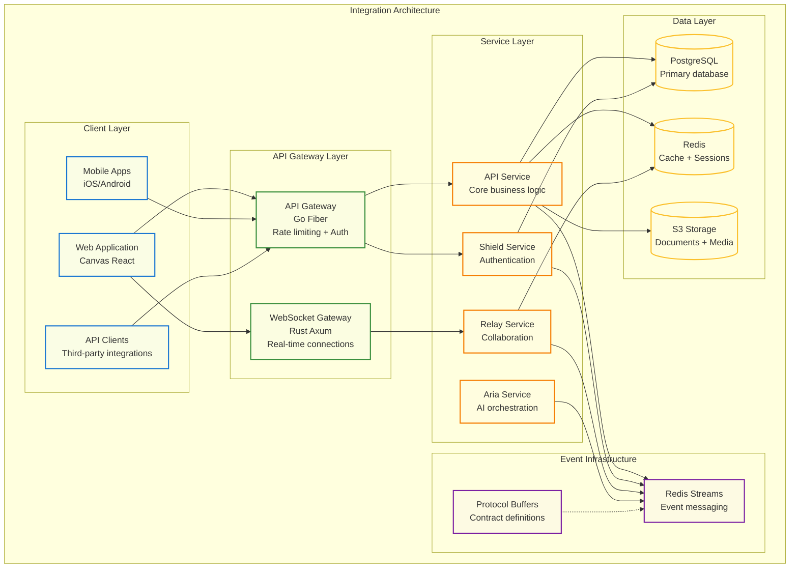
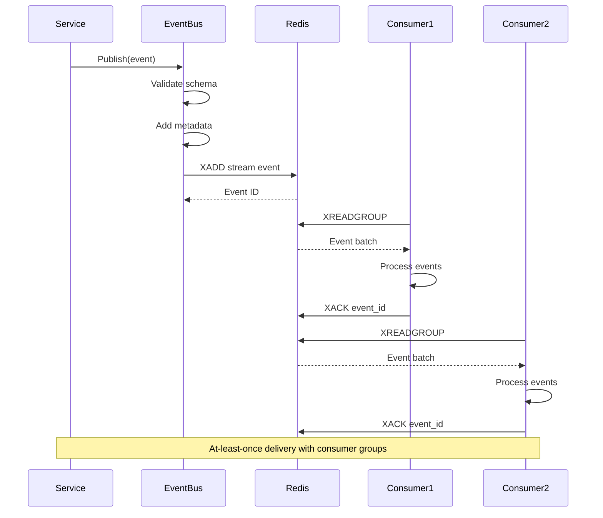
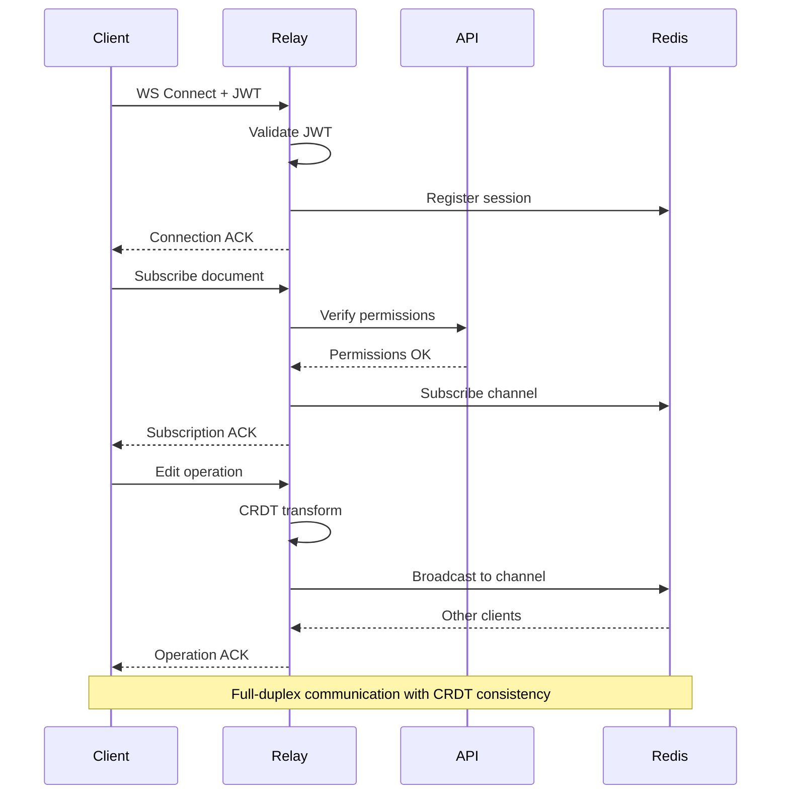
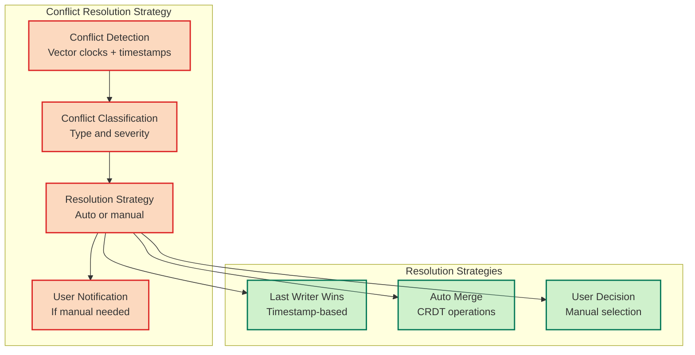

# Cross-Segment Integration Architecture

<Info>
**SDD Classification:** L2-System | **Authority:** VP Engineering + Integration Lead | **Review Cycle:** Monthly
</Info>

This Integration Architecture Document defines the patterns, protocols, and standards for cross-service and cross-segment integration within the Materi platform. It establishes the event-driven communication framework and API contract specifications.

**Integration Style**: Event-driven with synchronous fallback
**Message Protocol**: Protocol Buffers over Redis Streams
**API Standard**: REST + WebSocket hybrid
**Contract Management**: Schema registry with versioning

---

## Integration Architecture Overview



---

## Event-Driven Integration

### Event Streams

| Stream Name | Purpose | Publishers | Consumers | Retention |
|-------------|---------|------------|-----------|-----------|
| `materi:events:users` | User lifecycle events | Shield | API, Relay | 7 days |
| `materi:events:documents` | Document CRUD operations | API | Relay, Shield | 7 days |
| `materi:events:collaboration` | Real-time operations | Relay | API | 24 hours |
| `materi:events:ai` | AI generation events | Aria | API | 24 hours |
| `materi:events:system` | System notifications | All services | All services | 7 days |

### Event Schema (Protocol Buffers)

```protobuf
// Common event envelope
message EventEnvelope {
  string event_id = 1;           // UUID
  string event_type = 2;         // e.g., "user.created", "document.updated"
  string source_service = 3;     // e.g., "shield", "api"
  google.protobuf.Timestamp timestamp = 4;
  string correlation_id = 5;     // Request tracing
  bytes payload = 6;             // Service-specific payload
  map<string, string> metadata = 7;
}

// User events
message UserEvent {
  string user_id = 1;
  string email = 2;
  string action = 3;             // "created", "updated", "deleted"
  google.protobuf.Struct changes = 4;
}

// Document events
message DocumentEvent {
  string document_id = 1;
  string workspace_id = 2;
  string user_id = 3;
  string action = 4;             // "created", "updated", "deleted", "shared"
  google.protobuf.Struct content = 5;
}

// Collaboration events
message CollaborationEvent {
  string session_id = 1;
  string document_id = 2;
  string user_id = 3;
  string operation_type = 4;     // "edit", "cursor", "presence"
  bytes crdt_operation = 5;
  int64 vector_clock = 6;
}
```

### Event Publishing Pattern



---

## Synchronous Integration

### REST API Contracts

| Endpoint | Method | Service | Purpose | SLA |
|----------|--------|---------|---------|-----|
| `/api/v1/users/*` | CRUD | Shield | User management | <100ms |
| `/api/v1/documents/*` | CRUD | API | Document operations | <50ms |
| `/api/v1/workspaces/*` | CRUD | API | Workspace management | <50ms |
| `/api/v1/ai/generate` | POST | Aria | AI content generation | <5s |
| `/api/v1/auth/token` | POST | Shield | Token issuance | <100ms |

### Internal Service APIs

| Service | Internal Endpoint | Purpose | Authentication |
|---------|------------------|---------|----------------|
| **Shield** | `shield:8000/internal/validate` | Token validation | Service key |
| **Shield** | `shield:8000/internal/user/{id}` | User lookup | Service key |
| **Relay** | `relay:8081/internal/sessions` | Active sessions | Service key |
| **Aria** | `aria:8082/internal/status` | AI provider status | Service key |

### WebSocket Protocol



---

## Service Integration Matrix

### Service Dependencies

| Service | Depends On | Integration Type | Failure Strategy |
|---------|-----------|------------------|------------------|
| **API** | Shield, Relay, Aria | Sync + Async | Circuit breaker |
| **Shield** | PostgreSQL, Redis | Sync | Graceful degradation |
| **Relay** | Redis, API (events) | Async + Sync | Local cache |
| **Aria** | External AI APIs, Redis | Sync | Provider fallback |
| **Canvas** | API, Relay | HTTP + WS | Offline mode |

### Integration Patterns

```mermaid
graph TB
    subgraph "Synchronous Patterns"
        REQ_REPLY[Request-Reply<br/>Direct API calls]
        CIRCUIT_BREAKER[Circuit Breaker<br/>Failure protection]
        RETRY[Retry with Backoff<br/>Transient failures]
    end

    subgraph "Asynchronous Patterns"
        PUB_SUB[Publish-Subscribe<br/>Event broadcasting]
        CONSUMER_GROUP[Consumer Groups<br/>Load balancing]
        DLQ[Dead Letter Queue<br/>Failed events]
    end

    subgraph "Data Patterns"
        CQRS[CQRS<br/>Read/write separation]
        EVENT_SOURCING[Event Sourcing<br/>State reconstruction]
        SAGA[Saga Pattern<br/>Distributed transactions]
    end

    REQ_REPLY --> CIRCUIT_BREAKER
    CIRCUIT_BREAKER --> RETRY

    PUB_SUB --> CONSUMER_GROUP
    CONSUMER_GROUP --> DLQ

    CQRS --> EVENT_SOURCING
    EVENT_SOURCING --> SAGA

    classDef sync fill:#3B82F6,stroke:#1D4ED8,stroke-width:2px,fill-opacity:0.2
    classDef async fill:#10B981,stroke:#047857,stroke-width:2px,fill-opacity:0.2
    classDef data fill:#F59E0B,stroke:#D97706,stroke-width:2px,fill-opacity:0.2

    class REQ_REPLY,CIRCUIT_BREAKER,RETRY sync
    class PUB_SUB,CONSUMER_GROUP,DLQ async
    class CQRS,EVENT_SOURCING,SAGA data
```



---

## External Integrations

### Third-Party Services

| Service | Purpose | Integration Type | Fallback |
|---------|---------|------------------|----------|
| **OpenAI** | GPT-4 content generation | REST API | Anthropic |
| **Anthropic** | Claude AI models | REST API | OpenAI |
| **Cloudflare** | CDN, WAF, DDoS | Proxy | Direct access |
| **AWS S3** | File storage | SDK | Local storage |
| **SendGrid** | Email delivery | REST API | SMTP fallback |
| **Stripe** | Payments | REST API | Manual processing |

### Enterprise Integrations

| Integration | Protocol | Authentication | Use Case |
|-------------|----------|----------------|----------|
| **SAML 2.0** | XML/HTTPS | Certificate | Enterprise SSO |
| **OAuth 2.0** | REST | Client credentials | Third-party auth |
| **SCIM 2.0** | REST | Bearer token | User provisioning |
| **Webhooks** | HTTPS POST | HMAC signature | Event notifications |

---

## Data Consistency

### Consistency Model

| Data Type | Consistency Level | Mechanism | Trade-offs |
|-----------|------------------|-----------|------------|
| **User Data** | Strong | Synchronous replication | Higher latency |
| **Documents** | Strong | ACID transactions | Higher latency |
| **Sessions** | Eventual | Async replication | Lower latency |
| **Presence** | Eventual | Redis pub/sub | Best-effort |
| **Analytics** | Eventual | Batch processing | Delay acceptable |

### Conflict Resolution



---

## Error Handling

### Retry Policies

| Scenario | Max Retries | Backoff | Timeout |
|----------|-------------|---------|---------|
| **Network timeout** | 3 | Exponential (1s, 2s, 4s) | 30s |
| **Service unavailable** | 5 | Exponential (2s, 4s, 8s, 16s, 32s) | 2m |
| **Rate limited** | 3 | Linear (wait time from header) | 5m |
| **Validation error** | 0 | N/A | N/A |
| **Authentication error** | 1 (refresh token) | Immediate | 10s |

### Circuit Breaker Configuration

| Service | Failure Threshold | Recovery Time | Half-Open Requests |
|---------|------------------|---------------|-------------------|
| **Shield** | 5 failures / 10s | 30s | 3 |
| **AI Providers** | 3 failures / 30s | 60s | 2 |
| **Database** | 2 failures / 5s | 15s | 1 |
| **External APIs** | 3 failures / 60s | 120s | 2 |

---

## Monitoring and Observability

### Integration Metrics

| Metric | Description | Alert Threshold |
|--------|-------------|-----------------|
| `integration_request_duration_seconds` | Request latency | P95 > SLA |
| `integration_request_total` | Request count | N/A |
| `integration_errors_total` | Error count | Error rate > 1% |
| `event_processing_duration_seconds` | Event handling time | P95 > 100ms |
| `event_queue_depth` | Pending events | > 10,000 |
| `circuit_breaker_state` | Breaker status | Open state |

### Distributed Tracing

| Span Type | Attributes | Purpose |
|-----------|------------|---------|
| **HTTP Request** | method, path, status | API tracking |
| **Event Publish** | stream, type, size | Event flow |
| **Event Consume** | stream, consumer_group | Processing |
| **Database Query** | table, operation | DB performance |
| **External Call** | service, endpoint | Third-party |

---

## Cross-References

- [System Architecture Overview](/internal/architecture/system-design/overview) - Platform architecture
- [Platform Services](/internal/architecture/system-design/platform-services) - Service specifications
- [Event-Driven Architecture](/internal/architecture/system-design/event-driven-architecture) - Event details
- [API Documentation](/developer/api) - API specifications

---

**Document Status:** Complete
**Version:** 2.0
**Last Updated:** January 2026
**Authority:** VP Engineering + Integration Lead
**Classification:** L2-System - Integration Architecture

**Distribution:** Engineering Teams, Architecture Council
