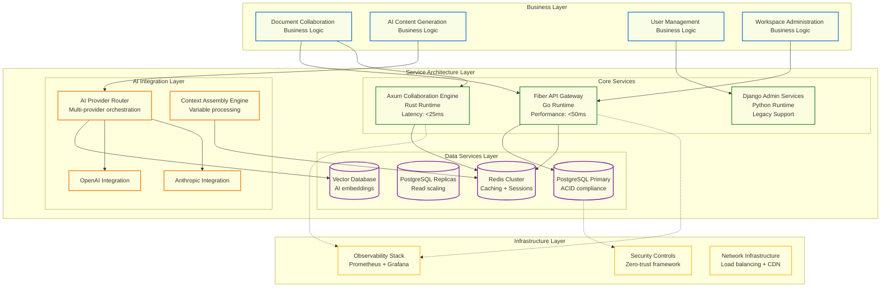
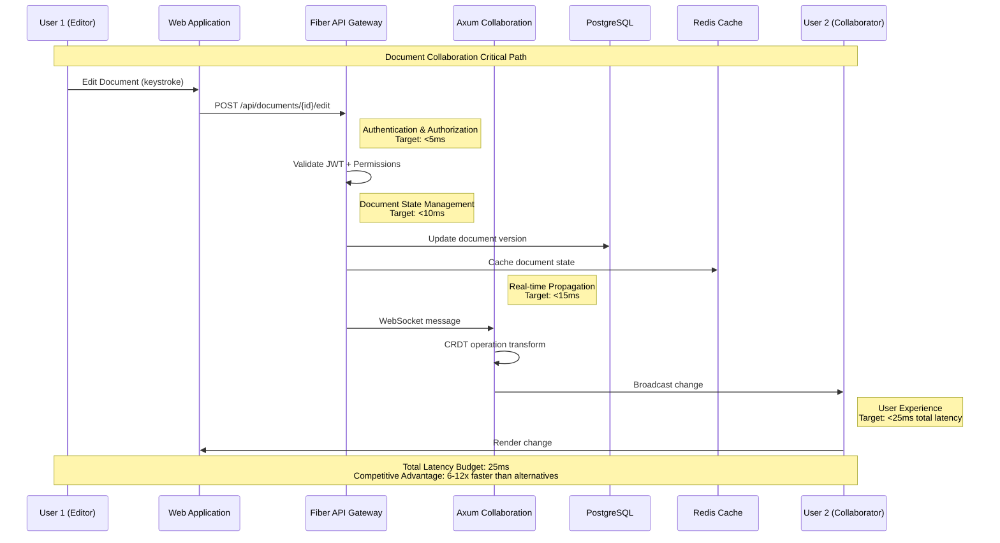
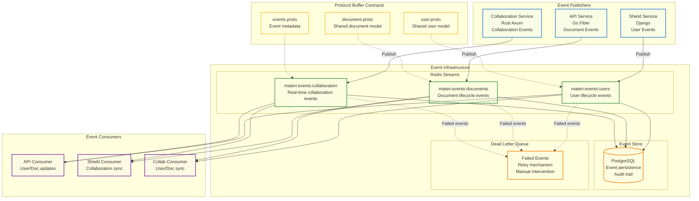
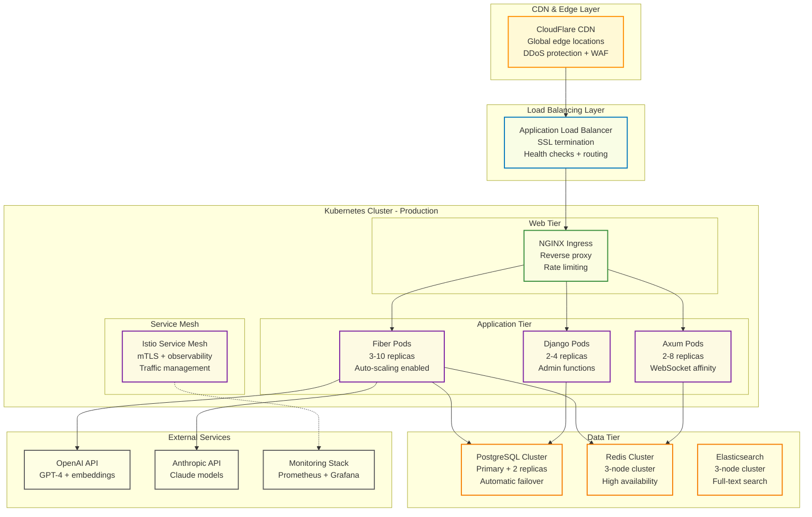
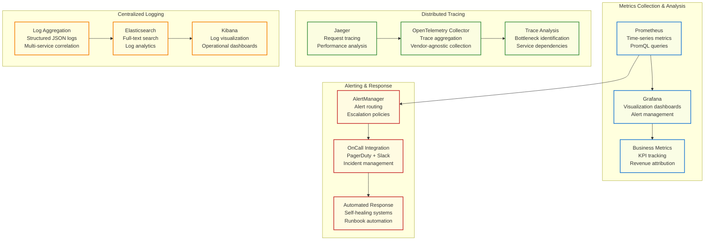

# System Architecture Overview

<Info>
**SDD Classification:** L2-System | **Authority:** CTO + Engineering Leadership | **Review Cycle:** Monthly
</Info>

This System Architecture Document serves as the authoritative specification bridging business requirements and technical implementation for Materi's AI-native document collaboration platform. It provides stakeholders with clear traceability from business objectives to technical solutions.

**Architecture Style**: Event-driven microservices with polyglot implementation
**Performance Target**: Sub-50ms API, sub-25ms real-time collaboration
**Scale**: 50,000+ concurrent users, global deployment
**Availability**: 99.9% uptime SLA

---

## Architecture Philosophy

Materi's architecture prioritizes performance, security, and scalability through modern programming languages (Go Fiber + Rust Axum) that eliminate traditional web application bottlenecks while enabling enterprise-grade reliability.

### Core Architecture Principles

The Materi platform is built on five foundational architectural principles that directly support our business objectives:

1. **Performance-First Design** - Every architectural decision prioritizes sub-50ms response times
2. **Security by Design** - Zero-trust architecture with end-to-end encryption
3. **Elastic Scalability** - Auto-scaling infrastructure supporting 10,000+ concurrent users
4. **AI-Native Integration** - Purpose-built for seamless AI content generation workflows
5. **Event-Driven Consistency** - Redis Streams-based event sourcing ensures data consistency across distributed services

---

## Business Requirements Mapping

The following table establishes clear traceability between strategic business requirements and architectural decisions:

| Business Requirement | Architectural Response | Technical Implementation | Success Metrics |
|---------------------|------------------------|-------------------------|-----------------|
| **BR-001: Enterprise Performance** | High-performance backend architecture | Go Fiber API Gateway (50ms response) | 95% requests <50ms |
| **BR-002: Real-time Collaboration** | Rust-based WebSocket engine | Axum collaboration service (<25ms latency) | Sub-25ms edit propagation |
| **BR-003: AI Integration Excellence** | Multi-provider AI orchestration | Provider routing with context caching | 95% AI generation success |
| **BR-004: Enterprise Security** | Zero-trust security framework | End-to-end encryption + SOC 2 compliance | 100% data encryption |
| **BR-005: Global Scalability** | Microservices with auto-scaling | Containerized services + K8s orchestration | 10,000+ concurrent users |
| **BR-006: Cost Optimization** | Language efficiency optimization | Memory-efficient Go/Rust vs Python | 65% lower infrastructure cost |
| **BR-007: Data Consistency** | Event-driven architecture | Redis Streams + Protocol Buffer contracts | 100% cross-service consistency |

---

## High-Level Architecture

---

## Service Responsibilities

| Service | Language | Primary Responsibility | Performance Target |
|---------|----------|------------------------|-------------------|
| **API** | Go/Fiber | REST API, business logic | <50ms response |
| **Shield** | Python/Django | Authentication, user management | <100ms auth |
| **Relay** | Rust/Axum | Real-time collaboration, WebSockets | <25ms latency |
| **Aria** | Python | AI orchestration, content generation | <2s generation |
| **Manuscript** | Protobuf | Schema definitions, contracts | N/A (build-time) |
| **Printery** | Go | Document rendering, exports | <5s render |
| **Canvas** | React/TS | Web application, UI | <500ms load |

---

## Service Decomposition

```mermaid
graph TB
    subgraph "Document Domain"
        direction TB
        DOC_API[Document API Service<br/>Fiber/Go<br/>Owner: Core Team]
        VERSION_SVC[Version Control Service<br/>Fiber/Go<br/>Owner: Core Team]
        SEARCH_SVC[Search Service<br/>Elasticsearch<br/>Owner: Platform Team]
    end

    subgraph "Collaboration Domain"
        direction TB
        COLLAB_ENGINE[Collaboration Engine<br/>Axum/Rust<br/>Owner: Real-time Team]
        PRESENCE_SVC[Presence Service<br/>Axum/Rust<br/>Owner: Real-time Team]
        COMMENT_SVC[Comment Service<br/>Fiber/Go<br/>Owner: Core Team]
    end

    subgraph "AI Domain"
        direction TB
        AI_ORCHESTRATOR[AI Orchestrator<br/>Fiber/Go<br/>Owner: AI Team]
        CONTEXT_SVC[Context Service<br/>Fiber/Go<br/>Owner: AI Team]
        VARIABLE_SVC[Variable Service<br/>Fiber/Go<br/>Owner: AI Team]
    end

    subgraph "User Domain"
        direction TB
        USER_SVC[User Service<br/>Django/Python<br/>Owner: Platform Team]
        AUTH_SVC[Authentication Service<br/>Fiber/Go<br/>Owner: Security Team]
        WORKSPACE_SVC[Workspace Service<br/>Fiber/Go<br/>Owner: Platform Team]
    end

    subgraph "Platform Domain"
        direction TB
        NOTIFICATION_SVC[Notification Service<br/>Fiber/Go<br/>Owner: Platform Team]
        AUDIT_SVC[Audit Service<br/>Fiber/Go<br/>Owner: Security Team]
        ANALYTICS_SVC[Analytics Service<br/>Python<br/>Owner: Data Team]
    end

    classDef documentService fill:#E3F2FD,stroke:#1976D2,stroke-width:2px,fill-opacity:0.2
    classDef collaborationService fill:#E8F5E8,stroke:#388E3C,stroke-width:2px,fill-opacity:0.2
    classDef aiService fill:#FFF3E0,stroke:#F57C00,stroke-width:2px,fill-opacity:0.2
    classDef userService fill:#F3E5F5,stroke:#7B1FA2,stroke-width:2px,fill-opacity:0.2
    classDef platformService fill:#FFF8E1,stroke:#FBC02D,stroke-width:2px,fill-opacity:0.2

    class DOC_API,VERSION_SVC,SEARCH_SVC documentService
    class COLLAB_ENGINE,PRESENCE_SVC,COMMENT_SVC collaborationService
    class AI_ORCHESTRATOR,CONTEXT_SVC,VARIABLE_SVC aiService
    class USER_SVC,AUTH_SVC,WORKSPACE_SVC userService
    class NOTIFICATION_SVC,AUDIT_SVC,ANALYTICS_SVC platformService
```

---

## Communication Patterns

### Inter-Service Communication Matrix

| Source Service | Target Service | Communication Pattern | Protocol | Rationale | SLA |
|----------------|----------------|----------------------|----------|-----------|-----|
| Document API | Version Control | Synchronous | HTTP/REST | Immediate consistency required | <10ms |
| Document API | Search Service | Asynchronous | Event/Redis | Eventually consistent indexing | <100ms |
| Collaboration Engine | Presence Service | Synchronous | gRPC | Real-time presence updates | <5ms |
| AI Orchestrator | Context Service | Synchronous | HTTP/REST | Context assembly blocking | <50ms |
| Authentication | User Service | Synchronous | gRPC | User validation required | <15ms |
| Audit Service | All Services | Asynchronous | Event/Redis | Non-blocking audit logging | <1s |

### Synchronous (HTTP/gRPC)

- **Client → API**: REST API calls for CRUD operations
- **API → Shield**: Token validation, permission checks
- **API → Aria**: AI content generation requests

### Asynchronous (Redis Streams)

- **Document Events**: Create, update, delete notifications
- **Collaboration Events**: User presence, cursor positions
- **AI Events**: Generation completion, context updates
- **System Events**: Audit logs, analytics, notifications

### Real-time (WebSocket)

- **Client ↔ Relay**: Bidirectional collaboration channel
- **CRDT Operations**: Conflict-free document synchronization
- **Presence Updates**: User cursors, selections, activity

---

## Data Flow Architecture

### Document Collaboration Critical Path

---

## Event-Driven Architecture

### Event-Driven Data Synchronization

### Event System Specifications

| Component | Technology | Purpose | SLA | Capacity |
|-----------|-----------|---------|-----|----------|
| **Redis Streams** | Redis 7.0+ | Event queuing and delivery | 99.9% availability | 10,000+ events/second |
| **Protocol Buffers** | protobuf 3.x | Cross-service data contracts | N/A - compile-time | Type safety + versioning |
| **Event Store** | PostgreSQL | Event persistence and audit | 99.99% durability | Unlimited retention |
| **Consumer Groups** | Redis Streams | Load balancing and reliability | At-least-once delivery | Auto-scaling consumers |
| **Dead Letter Queue** | Redis + PostgreSQL | Failed event handling | Manual intervention | 1% max failure rate |

### Event Flow Patterns

1. **User Management Flow**: Shield service publishes user lifecycle events → API and Collaboration services consume for local cache updates
2. **Document Synchronization**: API service publishes document changes → Collaboration service updates real-time sessions
3. **Collaboration Events**: Collaboration service publishes presence/operation events → API service updates document metadata
4. **Cross-Service Consistency**: All services maintain eventually consistent views through event consumption
5. **Error Recovery**: Failed events are retried with exponential backoff, permanent failures go to dead letter queue

---

## Technology Stack

### Language Selection Matrix

| Technology | Use Case | Business Justification | Performance Characteristics | Team Expertise |
|-----------|----------|------------------------|----------------------------|----------------|
| **Go (Fiber)** | API Gateway, Business Logic | Memory efficiency + high concurrency | 50,000+ goroutines, <2MB per 1K requests | High - Modern web development |
| **Rust (Axum)** | Real-time Collaboration | Zero GC pauses + memory safety | <10ms consistent latency, 1000+ concurrent editors | Medium - Growing expertise |
| **Python (Django)** | Admin Interface, Analytics | Rapid development + ecosystem | Legacy compatibility, <200ms response | High - Existing codebase |
| **TypeScript** | Frontend Application | Type safety + developer productivity | Client-side performance, rich UX | High - React ecosystem |
| **SQL (PostgreSQL)** | Primary Database | ACID compliance + performance | Petabyte scale, JSONB support | High - Database operations |

---

## Infrastructure Deployment Architecture

### Environment Configuration Strategy

| Environment | Purpose | Fiber Instances | Axum Instances | Database Config | Monitoring Level |
|-------------|---------|-----------------|----------------|-----------------|------------------|
| **Development** | Feature development | 1 pod (0.5 CPU/1GB) | 1 pod (0.5 CPU/1GB) | Single PostgreSQL | Basic logging |
| **Staging** | Integration testing | 2 pods (1 CPU/2GB) | 2 pods (1 CPU/2GB) | Primary + replica | Full monitoring |
| **Production** | Live customer traffic | 3-10 pods (2 CPU/4GB) | 2-8 pods (2 CPU/4GB) | Cluster with failover | Enterprise monitoring |
| **Disaster Recovery** | Business continuity | 2 pods (1 CPU/2GB) | 1 pod (1 CPU/2GB) | Cross-region replica | Critical alerts only |

---

## Deployment Architecture

### Production Environment

- **Platform**: Railway (backend), Vercel (frontend)
- **Database**: Railway Managed PostgreSQL
- **Cache**: Railway Managed Redis
- **CDN**: Cloudflare for global edge caching

### Scaling Strategy

- **Horizontal**: Auto-scaling based on CPU/memory
- **Vertical**: Database and cache tier upgrades
- **Geographic**: Multi-region deployment for latency

---

## Security Architecture

### Authentication Flow

1. User authenticates via Shield (OAuth/SAML/Password)
2. JWT token issued with RS256 signing
3. Token validated on each API request
4. Token cached in Redis for performance

### Authorization Model

- **RBAC**: Role-based access control
- **Resource-level**: Document and workspace permissions
- **Enterprise SSO**: SAML 2.0 integration

---

## Observability Architecture

### Service Level Objectives (SLOs)

| Service | SLO Metric | Target Value | Measurement Window | Error Budget | Business Impact |
|---------|-----------|--------------|-------------------|--------------|-----------------|
| **Fiber API Gateway** | Response time (P95) | <50ms | 30-day rolling | 0.1% (43 minutes/month) | User experience quality |
| **Axum Collaboration** | WebSocket latency (P95) | <25ms | 1-hour window | 0.05% (1.5 minutes/month) | Real-time collaboration |
| **AI Generation** | Time to first token | <2 seconds | 24-hour window | 1% (14 minutes/day) | AI feature usability |
| **Database Queries** | Query time (P95) | <15ms | 1-hour window | 0.1% (6 minutes/hour) | Overall system performance |
| **System Availability** | Uptime percentage | 99.9% | Monthly | 43 minutes/month | SLA compliance |

---

## Performance Scaling Matrix

| User Scale | Concurrent Users | Fiber Instances | Axum Instances | DB Configuration | Monthly Cost | Performance SLA |
|------------|------------------|-----------------|----------------|------------------|--------------|-----------------|
| **Startup** | 1,000 | 3 instances (2 CPU/4GB) | 2 instances (2 CPU/4GB) | Primary + 1 replica | $2,400 | 99.5% uptime |
| **Growth** | 10,000 | 6 instances (2 CPU/4GB) | 4 instances (2 CPU/4GB) | Primary + 2 replicas | $8,500 | 99.9% uptime |
| **Enterprise** | 50,000 | 12 instances (4 CPU/8GB) | 8 instances (4 CPU/8GB) | Sharded cluster | $28,000 | 99.95% uptime |
| **Hypergrowth** | 250,000+ | 20+ instances (auto-scale) | 15+ instances (auto-scale) | Multi-region cluster | $75,000+ | 99.99% uptime |

---

## Architecture Governance

### Architecture Decision Authority Matrix

| Decision Type | Authority Level | Required Approvers | Review Process | Documentation |
|---------------|-----------------|-------------------|----------------|---------------|
| **Technology Stack Changes** | Architecture Board | CTO + Engineering Leads | RFC process | Architecture Decision Record |
| **Security Architecture** | Security + Architecture | CISO + CTO | Security review | Security assessment |
| **Data Architecture** | Data + Architecture | Data Lead + CTO | Data governance review | Data impact assessment |
| **Infrastructure Changes** | Platform + Architecture | Platform Lead + CTO | Infrastructure review | Infrastructure plan |
| **External Integration** | Product + Architecture | CPO + CTO | Integration review | Integration specification |

---

## Cross-References

- [Platform Services](platform-services.md) - Detailed service specifications
- [Data Models](data-models.md) - Database schemas and data flow
- [Event-Driven Architecture](event-driven-architecture.md) - Messaging patterns
- [Domain Services](domain-services.md) - Business domain breakdown
- [Security Architecture](/internal/security/practices/overview) - Security framework details

---

**Document Status:** Complete
**Version:** 2.0
**Last Updated:** January 2026
**Authority:** CTO + Engineering Leadership
**Classification:** L2-System - Internal Architecture

**Distribution:** Engineering Teams, Product Leadership, Executive Team
