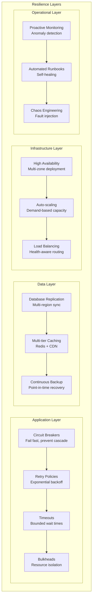
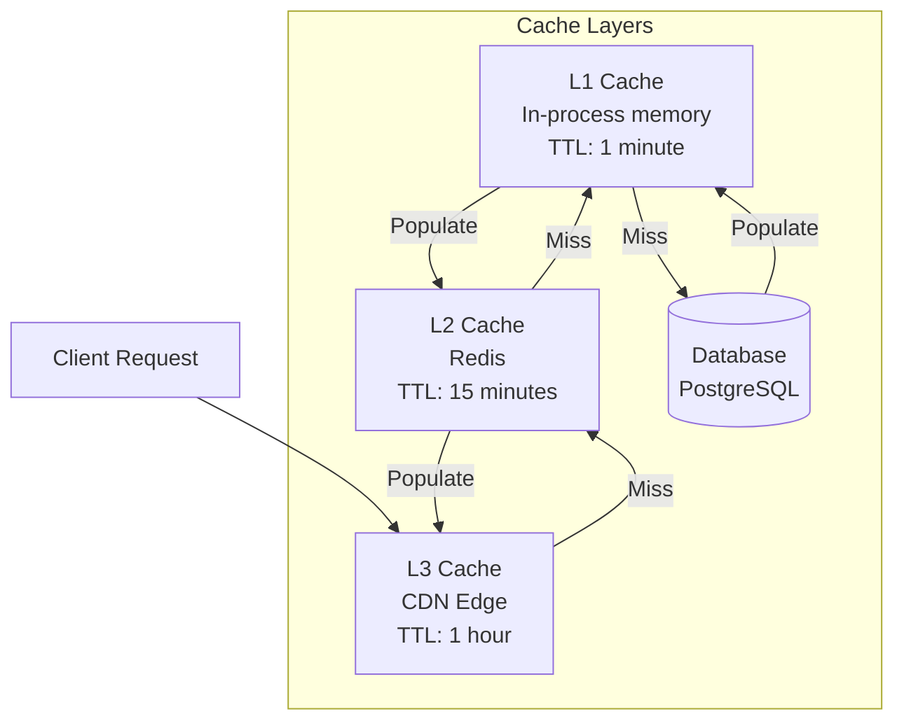

# Reliability Architecture & Performance Engineering

<Info>
**SDD Classification:** L3-Technical | **Authority:** CTO + VP Engineering | **Review Cycle:** Monthly
</Info>

This document defines the reliability architecture, fault resilience patterns, and performance engineering practices for the Materi platform. It covers system resilience, graceful degradation, chaos engineering, and performance optimization strategies.

**Availability Target**: 99.9% uptime (43 minutes/month maximum downtime)
**Performance Target**: <50ms API, <25ms collaboration, <2s page load
**Recovery Objectives**: RTO <4 hours, RPO <15 minutes

---

## Reliability Architecture Overview

### Resilience Patterns



---

## Circuit Breaker Implementation

### Go Circuit Breaker

```go
// circuit/breaker.go
package circuit

import (
    "context"
    "errors"
    "sync"
    "time"
)

type State int

const (
    StateClosed State = iota
    StateOpen
    StateHalfOpen
)

type CircuitBreaker struct {
    name          string
    maxFailures   int
    timeout       time.Duration
    halfOpenMax   int

    mu            sync.RWMutex
    state         State
    failures      int
    successes     int
    lastFailure   time.Time
    halfOpenCalls int
}

type Config struct {
    Name        string
    MaxFailures int           // Failures before opening
    Timeout     time.Duration // Time to wait before half-open
    HalfOpenMax int           // Requests allowed in half-open
}

func NewCircuitBreaker(cfg Config) *CircuitBreaker {
    return &CircuitBreaker{
        name:        cfg.Name,
        maxFailures: cfg.MaxFailures,
        timeout:     cfg.Timeout,
        halfOpenMax: cfg.HalfOpenMax,
        state:       StateClosed,
    }
}

func (cb *CircuitBreaker) Execute(ctx context.Context, fn func() error) error {
    if !cb.allowRequest() {
        return ErrCircuitOpen
    }

    err := fn()

    cb.recordResult(err)
    return err
}

func (cb *CircuitBreaker) allowRequest() bool {
    cb.mu.Lock()
    defer cb.mu.Unlock()

    switch cb.state {
    case StateClosed:
        return true

    case StateOpen:
        if time.Since(cb.lastFailure) > cb.timeout {
            cb.state = StateHalfOpen
            cb.halfOpenCalls = 0
            return true
        }
        return false

    case StateHalfOpen:
        if cb.halfOpenCalls < cb.halfOpenMax {
            cb.halfOpenCalls++
            return true
        }
        return false
    }

    return false
}

func (cb *CircuitBreaker) recordResult(err error) {
    cb.mu.Lock()
    defer cb.mu.Unlock()

    if err != nil {
        cb.failures++
        cb.lastFailure = time.Now()
        cb.successes = 0

        if cb.state == StateHalfOpen {
            cb.state = StateOpen
        } else if cb.failures >= cb.maxFailures {
            cb.state = StateOpen
        }
    } else {
        cb.successes++
        cb.failures = 0

        if cb.state == StateHalfOpen && cb.successes >= cb.halfOpenMax {
            cb.state = StateClosed
        }
    }
}

var ErrCircuitOpen = errors.New("circuit breaker is open")

// Usage example
func main() {
    aiBreaker := NewCircuitBreaker(Config{
        Name:        "ai-service",
        MaxFailures: 5,
        Timeout:     30 * time.Second,
        HalfOpenMax: 3,
    })

    err := aiBreaker.Execute(ctx, func() error {
        return aiClient.GenerateContent(ctx, prompt)
    })

    if errors.Is(err, ErrCircuitOpen) {
        // Use fallback
        return getCachedResponse(prompt)
    }
}
```

### Rust Circuit Breaker

```rust
// src/resilience/circuit_breaker.rs
use std::sync::atomic::{AtomicU32, AtomicU64, Ordering};
use std::sync::RwLock;
use std::time::{Duration, Instant};
use tokio::sync::Semaphore;

#[derive(Debug, Clone, Copy, PartialEq)]
pub enum CircuitState {
    Closed,
    Open,
    HalfOpen,
}

pub struct CircuitBreaker {
    name: String,
    max_failures: u32,
    timeout: Duration,
    half_open_permits: u32,

    state: RwLock<CircuitState>,
    failures: AtomicU32,
    last_failure: RwLock<Option<Instant>>,
    half_open_semaphore: Semaphore,
}

impl CircuitBreaker {
    pub fn new(name: &str, max_failures: u32, timeout: Duration, half_open_permits: u32) -> Self {
        Self {
            name: name.to_string(),
            max_failures,
            timeout,
            half_open_permits,
            state: RwLock::new(CircuitState::Closed),
            failures: AtomicU32::new(0),
            last_failure: RwLock::new(None),
            half_open_semaphore: Semaphore::new(half_open_permits as usize),
        }
    }

    pub async fn call<F, T, E>(&self, f: F) -> Result<T, CircuitError<E>>
    where
        F: std::future::Future<Output = Result<T, E>>,
    {
        if !self.allow_request().await {
            return Err(CircuitError::Open);
        }

        match f.await {
            Ok(result) => {
                self.record_success();
                Ok(result)
            }
            Err(e) => {
                self.record_failure();
                Err(CircuitError::Inner(e))
            }
        }
    }

    async fn allow_request(&self) -> bool {
        let state = *self.state.read().unwrap();

        match state {
            CircuitState::Closed => true,
            CircuitState::Open => {
                let last = self.last_failure.read().unwrap();
                if let Some(last_failure) = *last {
                    if last_failure.elapsed() > self.timeout {
                        *self.state.write().unwrap() = CircuitState::HalfOpen;
                        true
                    } else {
                        false
                    }
                } else {
                    false
                }
            }
            CircuitState::HalfOpen => {
                self.half_open_semaphore.try_acquire().is_ok()
            }
        }
    }

    fn record_success(&self) {
        self.failures.store(0, Ordering::SeqCst);

        let mut state = self.state.write().unwrap();
        if *state == CircuitState::HalfOpen {
            *state = CircuitState::Closed;
        }
    }

    fn record_failure(&self) {
        let failures = self.failures.fetch_add(1, Ordering::SeqCst) + 1;
        *self.last_failure.write().unwrap() = Some(Instant::now());

        let mut state = self.state.write().unwrap();
        if *state == CircuitState::HalfOpen || failures >= self.max_failures {
            *state = CircuitState::Open;
        }
    }
}

#[derive(Debug)]
pub enum CircuitError<E> {
    Open,
    Inner(E),
}
```

---

## Graceful Degradation

### Service Degradation Matrix

| Service | Full Mode | Degraded Mode | Minimal Mode |
|---------|-----------|---------------|--------------|
| **API** | All endpoints | Read-only, cached responses | Health check only |
| **Relay** | Real-time collaboration | Periodic sync (30s) | Offline queue |
| **Shield** | Full auth + MFA | Token validation only | Cached sessions |
| **AI** | Full generation | Cached suggestions | Disabled |

### Feature Flags for Degradation

```go
// degradation/manager.go
package degradation

import (
    "context"
    "sync"
)

type DegradationLevel int

const (
    LevelNormal DegradationLevel = iota
    LevelDegraded
    LevelMinimal
    LevelEmergency
)

type DegradationManager struct {
    mu       sync.RWMutex
    level    DegradationLevel
    features map[string]bool
}

type Feature string

const (
    FeatureAIGeneration   Feature = "ai_generation"
    FeatureRealTimeCollab Feature = "realtime_collab"
    FeatureFileUpload     Feature = "file_upload"
    FeatureSearch         Feature = "search"
    FeatureAnalytics      Feature = "analytics"
)

var degradationRules = map[DegradationLevel]map[Feature]bool{
    LevelNormal: {
        FeatureAIGeneration:   true,
        FeatureRealTimeCollab: true,
        FeatureFileUpload:     true,
        FeatureSearch:         true,
        FeatureAnalytics:      true,
    },
    LevelDegraded: {
        FeatureAIGeneration:   false,
        FeatureRealTimeCollab: true,
        FeatureFileUpload:     true,
        FeatureSearch:         true,
        FeatureAnalytics:      false,
    },
    LevelMinimal: {
        FeatureAIGeneration:   false,
        FeatureRealTimeCollab: false,
        FeatureFileUpload:     false,
        FeatureSearch:         false,
        FeatureAnalytics:      false,
    },
    LevelEmergency: {
        // All features disabled except core read operations
    },
}

func (dm *DegradationManager) SetLevel(level DegradationLevel) {
    dm.mu.Lock()
    defer dm.mu.Unlock()

    dm.level = level
    dm.features = degradationRules[level]

    log.Info("Degradation level changed",
        zap.Int("level", int(level)),
        zap.Any("features", dm.features),
    )
}

func (dm *DegradationManager) IsEnabled(feature Feature) bool {
    dm.mu.RLock()
    defer dm.mu.RUnlock()

    enabled, exists := dm.features[string(feature)]
    return exists && enabled
}

// Middleware for automatic degradation
func DegradationMiddleware(dm *DegradationManager) fiber.Handler {
    return func(c *fiber.Ctx) error {
        c.Locals("degradation_level", dm.level)
        c.Locals("degradation_manager", dm)
        return c.Next()
    }
}
```

---

## Chaos Engineering

### Fault Injection Framework

```yaml
# chaos/experiments.yml
experiments:
  - name: api-latency-injection
    description: Inject latency into API responses
    target:
      service: api
      percentage: 10
    fault:
      type: latency
      duration: 500ms
    duration: 5m
    success_criteria:
      - error_rate < 0.01
      - p95_latency < 600ms

  - name: database-connection-failure
    description: Simulate database connection failures
    target:
      service: api
      dependency: postgresql
    fault:
      type: connection_failure
      percentage: 25
    duration: 3m
    success_criteria:
      - circuit_breaker_triggered: true
      - fallback_activated: true

  - name: redis-partition
    description: Simulate Redis network partition
    target:
      service: relay
      dependency: redis
    fault:
      type: network_partition
      duration: 2m
    success_criteria:
      - websocket_reconnection < 5s
      - data_consistency: eventual

  - name: pod-failure
    description: Random pod termination
    target:
      namespace: materi-production
      label_selector: app=api
    fault:
      type: pod_kill
      count: 1
    duration: 10m
    success_criteria:
      - recovery_time < 30s
      - no_data_loss: true
```

### Chaos Testing Commands

```bash
# Inject latency using Chaos Mesh
kubectl apply -f - <<EOF
apiVersion: chaos-mesh.org/v1alpha1
kind: NetworkChaos
metadata:
  name: api-latency-test
  namespace: materi-production
spec:
  action: delay
  mode: all
  selector:
    namespaces:
      - materi-production
    labelSelectors:
      app: api
  delay:
    latency: "200ms"
    correlation: "50"
    jitter: "50ms"
  duration: "5m"
EOF

# Simulate pod failure
kubectl apply -f - <<EOF
apiVersion: chaos-mesh.org/v1alpha1
kind: PodChaos
metadata:
  name: pod-failure-test
  namespace: materi-production
spec:
  action: pod-kill
  mode: one
  selector:
    namespaces:
      - materi-production
    labelSelectors:
      app: api
EOF

# View chaos experiment status
kubectl get networkchaos,podchaos -n materi-production
```

---

## Performance Optimization

### Performance Targets

| Metric | Target | Warning | Critical |
|--------|--------|---------|----------|
| **API Response (P50)** | <25ms | >20ms | >25ms |
| **API Response (P95)** | <50ms | >40ms | >50ms |
| **API Response (P99)** | <100ms | >75ms | >100ms |
| **Collaboration Latency (P95)** | <25ms | >20ms | >25ms |
| **Database Query (P95)** | <15ms | >10ms | >15ms |
| **Page Load (TTI)** | <2s | >1.5s | >2s |
| **WebSocket Connection** | <100ms | >75ms | >100ms |

### Caching Strategy



### Go Cache Implementation

```go
// cache/multi_tier.go
package cache

import (
    "context"
    "time"

    "github.com/go-redis/redis/v9"
    "github.com/patrickmn/go-cache"
)

type MultiTierCache struct {
    l1         *cache.Cache      // In-memory
    l2         *redis.Client     // Redis
    l1TTL      time.Duration
    l2TTL      time.Duration
}

func NewMultiTierCache(redis *redis.Client) *MultiTierCache {
    return &MultiTierCache{
        l1:    cache.New(1*time.Minute, 2*time.Minute),
        l2:    redis,
        l1TTL: 1 * time.Minute,
        l2TTL: 15 * time.Minute,
    }
}

func (c *MultiTierCache) Get(ctx context.Context, key string, dest interface{}) error {
    // Check L1
    if value, found := c.l1.Get(key); found {
        metrics.CacheHit("l1")
        return json.Unmarshal(value.([]byte), dest)
    }

    // Check L2
    data, err := c.l2.Get(ctx, key).Bytes()
    if err == nil {
        metrics.CacheHit("l2")
        c.l1.Set(key, data, c.l1TTL)
        return json.Unmarshal(data, dest)
    }

    metrics.CacheMiss()
    return ErrCacheMiss
}

func (c *MultiTierCache) Set(ctx context.Context, key string, value interface{}) error {
    data, err := json.Marshal(value)
    if err != nil {
        return err
    }

    // Set in both tiers
    c.l1.Set(key, data, c.l1TTL)
    return c.l2.Set(ctx, key, data, c.l2TTL).Err()
}

func (c *MultiTierCache) Invalidate(ctx context.Context, key string) error {
    c.l1.Delete(key)
    return c.l2.Del(ctx, key).Err()
}
```

### Database Query Optimization

```sql
-- Optimized document retrieval with indexes
CREATE INDEX CONCURRENTLY idx_documents_workspace_updated
ON documents (workspace_id, updated_at DESC)
WHERE deleted_at IS NULL;

-- Partial index for active sessions
CREATE INDEX CONCURRENTLY idx_sessions_active
ON sessions (user_id, created_at DESC)
WHERE expires_at > NOW();

-- Covering index for common queries
CREATE INDEX CONCURRENTLY idx_documents_search
ON documents (workspace_id, title, created_at)
INCLUDE (id, owner_id, content_preview)
WHERE deleted_at IS NULL;
```

---

## Load Testing

### k6 Performance Tests

```javascript
// load-tests/api-load.js
import http from 'k6/http';
import { check, sleep } from 'k6';
import { Rate, Trend } from 'k6/metrics';

const errorRate = new Rate('errors');
const latencyTrend = new Trend('latency');

export const options = {
  stages: [
    { duration: '2m', target: 100 },   // Ramp up
    { duration: '5m', target: 100 },   // Steady state
    { duration: '2m', target: 200 },   // Peak load
    { duration: '5m', target: 200 },   // Sustained peak
    { duration: '2m', target: 0 },     // Ramp down
  ],
  thresholds: {
    'http_req_duration': ['p(95)<50', 'p(99)<100'],
    'errors': ['rate<0.01'],
  },
};

export default function () {
  const url = 'http://api.materi.dev/api/v1/documents';
  const params = {
    headers: {
      'Authorization': `Bearer ${__ENV.API_TOKEN}`,
      'Content-Type': 'application/json',
    },
  };

  // GET request
  const getRes = http.get(url, params);
  check(getRes, {
    'GET status is 200': (r) => r.status === 200,
    'GET latency < 50ms': (r) => r.timings.duration < 50,
  });
  errorRate.add(getRes.status !== 200);
  latencyTrend.add(getRes.timings.duration);

  sleep(1);

  // POST request
  const payload = JSON.stringify({
    title: `Load Test Doc ${Date.now()}`,
    content: 'Test content',
    workspace_id: 'test-workspace',
  });

  const postRes = http.post(url, payload, params);
  check(postRes, {
    'POST status is 201': (r) => r.status === 201,
    'POST latency < 100ms': (r) => r.timings.duration < 100,
  });
  errorRate.add(postRes.status !== 201);

  sleep(1);
}
```

---

## Related Documentation

- [SLO/SLI/SLA](/internal/engineering/performance/slo-sli-sla) - Service level objectives
- [Disaster Recovery](/developer/operations/runbooks/disaster-recovery) - Recovery procedures
- [Folio Alerting](/developer/operations/folio/alerting) - Alert configuration
- [Backend Architecture](/developer/introduction/architecture) - System architecture

---

**Document Status:** Complete
**Version:** 2.0
**Last Updated:** January 2026
**Authority:** CTO + VP Engineering
**Classification:** L3-Technical - Reliability Architecture

**Distribution:** Engineering Teams, SRE Team
