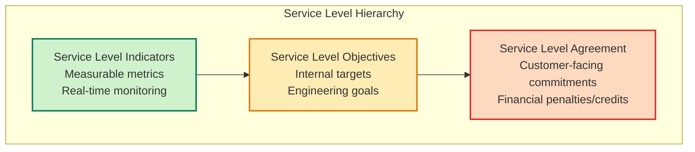
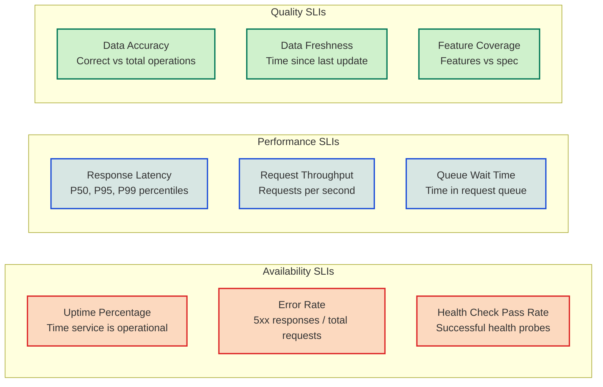
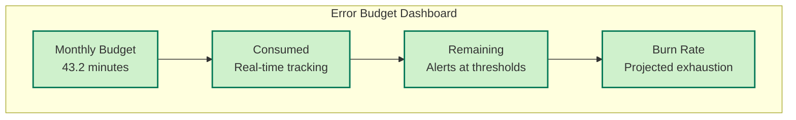

# Service Level Objectives & Non-Functional Requirements

<Info>
**SDD Classification:** L2-System | **Authority:** CTO + VP Engineering + QA Lead | **Review Cycle:** Monthly
</Info>

This document defines the Service Level Objectives (SLOs), Service Level Indicators (SLIs), and Service Level Agreements (SLAs) along with comprehensive non-functional requirements for the Materi platform. It establishes quantifiable quality targets and monitoring frameworks.

**Availability Target**: 99.9% uptime (43 minutes/month downtime)
**Performance Target**: <50ms API response, <25ms collaboration latency
**Quality Standard**: WCAG 2.1 AA compliance, 95% task completion rate
**Data Integrity**: 99.999999999% (eleven 9s) durability

---

## Service Level Framework

### SLO/SLI/SLA Hierarchy



---

## Platform SLOs

### API Gateway SLOs

| Metric | SLO Target | Error Budget | Measurement Window | Business Impact |
|--------|-----------|--------------|-------------------|-----------------|
| **Response Time (P50)** | <25ms | 5% deviation | 5-minute rolling | User experience |
| **Response Time (P95)** | <50ms | 2% deviation | 5-minute rolling | User experience |
| **Response Time (P99)** | <100ms | 1% deviation | 1-hour rolling | Performance SLA |
| **Availability** | 99.9% | 0.1% (43 min/month) | Monthly | SLA compliance |
| **Error Rate** | <0.1% | 0.05% | 1-hour rolling | Reliability |
| **Throughput** | 100K+ req/sec | N/A | Peak capacity | Scalability |

### Collaboration Engine SLOs

| Metric | SLO Target | Error Budget | Measurement Window | Business Impact |
|--------|-----------|--------------|-------------------|-----------------|
| **Edit Propagation (P95)** | <25ms | 1% deviation | 1-minute rolling | Real-time experience |
| **WebSocket Latency (P99)** | <50ms | 2% deviation | 5-minute rolling | Collaboration quality |
| **Concurrent Users** | 1000+ per document | N/A | Peak capacity | Enterprise scale |
| **Conflict Resolution** | 99.97% automatic | 0.03% manual | Daily | Data integrity |
| **Presence Updates** | <10ms | 5% deviation | 1-second rolling | User awareness |

### AI Service SLOs

| Metric | SLO Target | Error Budget | Measurement Window | Business Impact |
|--------|-----------|--------------|-------------------|-----------------|
| **Time to First Token** | <2 seconds | 5% deviation | 1-minute rolling | User experience |
| **Generation Success** | >95% | 5% failures | Daily | Feature reliability |
| **Context Assembly** | <100ms | 10% deviation | Per-request | Response quality |
| **Cost per Generation** | <$0.025 | 20% variance | Weekly average | Unit economics |

---

## Service Level Indicators

### Core SLIs



### SLI Calculation Formulas

| SLI | Formula | Data Source |
|-----|---------|-------------|
| **Availability** | `(total_time - downtime) / total_time * 100` | Prometheus uptime metrics |
| **Latency (P95)** | `histogram_quantile(0.95, request_duration)` | HTTP request duration histogram |
| **Error Rate** | `sum(rate(http_errors_total)) / sum(rate(http_requests_total))` | HTTP response codes |
| **Throughput** | `sum(rate(http_requests_total[1m]))` | Request counter |
| **Collaboration Latency** | `histogram_quantile(0.95, ws_message_duration)` | WebSocket metrics |

---

## Service Level Agreements

### Enterprise SLA Tiers

| Tier | Availability | Response Time | Support | Price Impact |
|------|-------------|---------------|---------|--------------|
| **Standard** | 99.5% | P95 <100ms | 8x5 email | Base price |
| **Professional** | 99.9% | P95 <75ms | 24x5 phone | +50% |
| **Enterprise** | 99.95% | P95 <50ms | 24x7 dedicated | +100% |
| **Enterprise Plus** | 99.99% | P95 <25ms | 24x7 + TAM | Custom |

### SLA Credits

| Availability | Credit Percentage |
|-------------|-------------------|
| 99.0% - 99.9% | 10% monthly credit |
| 95.0% - 99.0% | 25% monthly credit |
| 90.0% - 95.0% | 50% monthly credit |
| <90.0% | 100% monthly credit |

---

## Non-Functional Requirements

### Performance Requirements

| Category | Requirement | Target | Measurement |
|----------|-------------|--------|-------------|
| **API Response** | P95 response time | <50ms | Prometheus histogram |
| **Collaboration** | Edit propagation | <25ms | WebSocket latency |
| **AI Generation** | First token | <2s | Timer metrics |
| **Page Load** | Time to interactive | <3s | Lighthouse |
| **Database** | Query time P95 | <15ms | PostgreSQL metrics |

### Scalability Requirements

| Metric | Current | Target | Growth Strategy |
|--------|---------|--------|-----------------|
| **Concurrent Users** | 10,000 | 100,000+ | Horizontal scaling |
| **Documents** | 1M | 100M+ | Database sharding |
| **Storage** | 1TB | 1PB+ | Object storage |
| **API Requests** | 10K/sec | 100K/sec | Auto-scaling |

### Reliability Requirements

| Requirement | Target | Implementation |
|-------------|--------|----------------|
| **MTBF** | >720 hours | Chaos engineering |
| **MTTR** | <15 minutes | Automated recovery |
| **RTO** | <4 hours | Disaster recovery |
| **RPO** | <15 minutes | Continuous replication |

---

## Quality Attributes Framework

### Accessibility (WCAG 2.1 AA)

| Principle | Requirement | Implementation | Verification |
|-----------|-------------|----------------|--------------|
| **Perceivable** | Alt text, 4.5:1 contrast | Semantic HTML, ARIA | Axe-core testing |
| **Operable** | Keyboard navigation | Focus management | Manual testing |
| **Understandable** | Clear language | Content guidelines | Readability score |
| **Robust** | Assistive tech support | Screen reader compatible | VoiceOver/NVDA |

### Usability Metrics

| Metric | Target | Measurement |
|--------|--------|-------------|
| **Task Completion Rate** | >95% | User testing |
| **Clicks to Core Action** | <3 clicks | UX audit |
| **Error Recovery** | <30 seconds | Session recording |
| **Learning Curve** | <1 hour | Onboarding tracking |
| **User Satisfaction** | >4.5/5 NPS | Surveys |

### Data Integrity

| Layer | Implementation | Validation | Recovery |
|-------|----------------|------------|----------|
| **Application** | Input validation, business rules | Schema validation | Transaction rollback |
| **Database** | ACID transactions, constraints | Referential integrity | Point-in-time recovery |
| **Storage** | Checksums, replication | Hash verification | Replica failover |
| **Network** | TLS encryption, signing | Certificate validation | Retry with backoff |

---

## Internationalization

### Language Support

| Language | Status | Coverage | Quality |
|----------|--------|----------|---------|
| English (US) | Primary | 100% | Native |
| English (UK) | Supported | 100% | Native |
| French | Supported | 95% | Professional |
| German | Supported | 95% | Professional |
| Spanish | Supported | 95% | Professional |
| Japanese | Supported | 90% | Professional |
| Chinese (Simplified) | Supported | 90% | Professional |
| Portuguese (Brazil) | Planned | 0% | - |
| Korean | Planned | 0% | - |

### Localization Requirements

- **Date/Time Formats**: Locale-aware formatting
- **Currency Display**: Regional currency symbols
- **Number Formatting**: Locale-specific separators
- **RTL Support**: Arabic, Hebrew layouts
- **Character Sets**: Full Unicode UTF-8

---

## Error Budget Management

### Error Budget Calculation

```
Monthly Error Budget = (1 - SLO) × Total Minutes
99.9% SLO = 0.1% × 43,200 minutes = 43.2 minutes/month
```

### Error Budget Policies

| Budget Remaining | Action |
|-----------------|--------|
| >75% | Normal operations, deploy freely |
| 50-75% | Increased monitoring, cautious deploys |
| 25-50% | Freeze non-critical changes |
| <25% | Emergency mode, only critical fixes |
| 0% | Full freeze until budget resets |

### Budget Consumption Tracking



---

## Monitoring and Alerting

### Alert Thresholds

| Metric | Warning | Critical | Action |
|--------|---------|----------|--------|
| **Availability** | <99.95% | <99.9% | Page on-call |
| **Latency P95** | >40ms | >50ms | Auto-scale |
| **Error Rate** | >0.05% | >0.1% | Page on-call |
| **CPU Usage** | >70% | >85% | Auto-scale |
| **Memory Usage** | >75% | >90% | Alert + investigate |
| **Error Budget** | <50% | <25% | Change freeze |

### Incident Severity Levels

| Level | Impact | Response Time | Examples |
|-------|--------|---------------|----------|
| **SEV-1** | Full outage | <15 min | Platform down |
| **SEV-2** | Major degradation | <30 min | Core feature broken |
| **SEV-3** | Partial impact | <2 hours | Single service issue |
| **SEV-4** | Minor impact | <24 hours | Performance degradation |

---

## Cross-References

- [System Architecture Overview](/internal/architecture/system-design/overview) - Architecture context
- [Security Architecture](/internal/security/practices/overview) - Security SLOs
- [Disaster Recovery](/developer/operations/runbooks/disaster-recovery) - Recovery objectives
- [Monitoring & Observability](/developer/operations/folio/overview) - Metrics collection

---

**Document Status:** Complete
**Version:** 2.0
**Last Updated:** January 2026
**Authority:** CTO + VP Engineering + QA Lead
**Classification:** L2-System - Engineering Requirements

**Distribution:** Engineering Teams, Operations, Product Leadership
