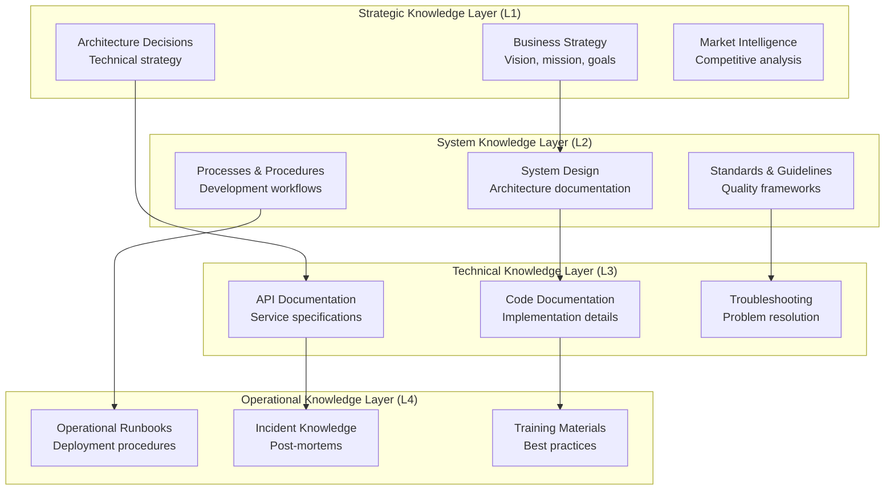
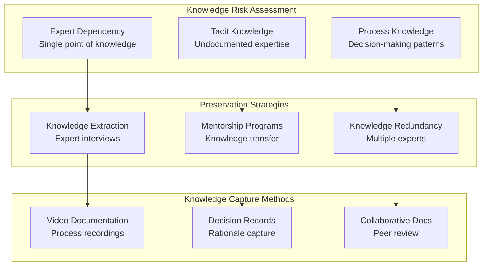
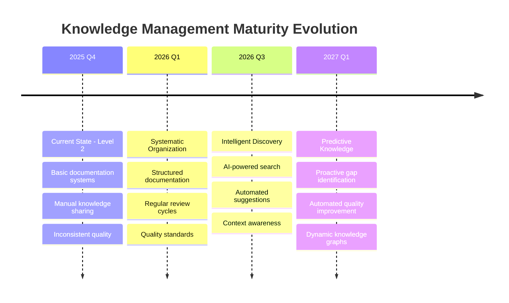

# Materi Technology Stack & Knowledge Management

<Info>
**SDD Classification:** L2-System | **Authority:** CTO + Knowledge Management Council | **Review Cycle:** Quarterly
</Info>

This document defines the Materi technology stack, tooling standards, and knowledge management framework. It covers backend/frontend technologies, infrastructure, development workflows, and institutional knowledge preservation strategies.

**Performance Targets**: <50ms API, <25ms collaboration, 99.9% uptime
**Knowledge Targets**: 95% findability, 90% accuracy, 100% team participation

---

## Technology Stack Philosophy

### Guiding Principles

- **Performance-First Architecture**: Every tool selection prioritizes sub-50ms API responses and sub-25ms collaboration latency
- **Best-in-Class Languages**: Multi-language architecture leveraging each language's strengths
- **Knowledge as Strategic Asset**: Information and expertise are competitive advantages requiring systematic management
- **Living Documentation**: Documentation that evolves with the system through systematic processes

### Technology Selection Criteria

| Criteria | Weight | Evaluation Method |
|----------|--------|-------------------|
| **Performance** | 30% | Benchmark against targets |
| **Developer Experience** | 25% | Team productivity metrics |
| **Operational Excellence** | 20% | Uptime, debugging ease |
| **Security** | 15% | Vulnerability surface |
| **Community/Support** | 10% | Ecosystem maturity |

---

## Backend Services Architecture

### Go (Fiber Framework)

**Usage**: Primary API services, high-performance HTTP handling
**Version**: Go 1.25.3, Fiber v2
**Services**: API Gateway, Authentication Services, Business Logic

**Key Libraries**:

- `github.com/gofiber/fiber/v2` - High-performance HTTP framework
- `github.com/jmoiron/sqlx` - SQL toolkit and query builder
- `github.com/go-redis/redis/v9` - Redis client for caching and sessions
- `github.com/prometheus/client_golang` - Metrics collection
- `go.opentelemetry.io/otel` - Distributed tracing

**Performance Characteristics**:

- Sub-50ms API response times
- 10,000+ concurrent connections
- Minimal memory footprint
- Excellent concurrency with goroutines

### Rust (Axum Framework)

**Usage**: Real-time collaboration engine, performance-critical services
**Version**: Rust 1.78+, Axum latest
**Services**: Real-time WebSocket handling, CRDT operations, Event streaming

**Key Dependencies**:

- `axum` - Modern async web framework
- `tokio` - Async runtime for high concurrency
- `sqlx` - Async SQL toolkit
- `serde` - Serialization/deserialization
- `tonic` - gRPC implementation
- `redis` - Async Redis client

**Performance Characteristics**:

- Sub-25ms collaboration latency
- 1000+ concurrent document editors
- Memory-safe high-performance computing
- Zero-cost abstractions

### Python (Django Framework)

**Usage**: Authentication services, admin interfaces, AI integration
**Version**: Python 3.11+, Django 4.2
**Services**: Shield (Auth), Aria (AI Orchestration)

**Key Libraries**:

- `django` - Full-featured web framework
- `django-rest-framework` - API development
- `celery` - Distributed task queue
- `redis-py` - Redis client
- `psycopg2` - PostgreSQL adapter

**AI/ML Specific**:

- `torch` - Deep learning framework
- `transformers` - Hugging Face model library
- `openai` - OpenAI API client
- `anthropic` - Claude API integration

---

## Frontend Technology Stack

### React + TypeScript

**Usage**: Primary web application, component library
**Framework**: Next.js 14+ for performance optimization
**Deployment**: Vercel for edge optimization

**Core Dependencies**:

- `react` - UI library
- `typescript` - Type safety and developer experience
- `next.js` - React framework with SSR/SSG
- `@tanstack/react-query` - Server state management
- `zustand` - Client state management
- `tailwindcss` - Utility-first CSS framework

**Real-time Integration**:

- `socket.io-client` - WebSocket communication
- `@tiptap/react` - Rich text editor
- `yjs` - Shared data types for collaboration
- `y-websocket` - WebSocket provider for Yjs

**Performance Tools**:

- `@next/bundle-analyzer` - Bundle size optimization
- `lighthouse` - Performance auditing
- `@sentry/nextjs` - Error tracking and monitoring

---

## Database & Storage

### PostgreSQL 15+

**Usage**: Primary database for all services
**Configuration**: Multi-tenant with schema-based isolation
**Extensions**: pgvector for AI embeddings, pg_stat_statements for monitoring

**Schema Design**:

- Shared schemas for user/auth data
- Service-specific schemas for domain data
- Optimized indexing for sub-15ms query response
- Read replicas for analytics and reporting

**Management Tools**:

- `pgAdmin` - Database administration
- `pg_dump/pg_restore` - Backup and recovery
- `pgbouncer` - Connection pooling
- `pg_stat_monitor` - Performance monitoring

### Redis 7+

**Usage**: Caching, session management, pub/sub messaging
**Configuration**: Clustered setup with different databases per service

**Use Cases by Database**:

- **DB 0**: API service caching and rate limiting
- **DB 1**: Shield service sessions and authentication
- **DB 2**: Relay service real-time event streaming
- **DB 3**: Aria service AI context caching
- **DB 4**: Cross-service pub/sub messaging

---

## Infrastructure & DevOps

### Container Orchestration

**Platform**: Kubernetes on Google Cloud Platform
**Management**: ArgoCD for GitOps deployment
**Monitoring**: Prometheus + Grafana stack

**Key Tools**:

- `kubectl` - Kubernetes command-line tool
- `helm` - Kubernetes package manager
- `argocd` - GitOps continuous deployment
- `kustomize` - Kubernetes configuration management

### CI/CD Pipeline

**Primary**: GitHub Actions for automation
**Secondary**: Sparki.tools for advanced orchestration
**Registry**: Google Container Registry

**Pipeline Stages**:

1. **Lint**: Code quality and standards enforcement
2. **Test**: Unit, integration, and performance tests
3. **Build**: Multi-architecture container builds
4. **Security**: Vulnerability scanning and compliance
5. **Deploy**: Automated deployment to staging/production

### Deployment & Hosting

**Production**: Railway for backend services
**Frontend**: Vercel for optimal edge performance
**DNS**: Cloudflare for global CDN and security

---

## Observability & Monitoring

### Metrics Collection

**Platform**: Prometheus for time-series metrics
**Visualization**: Grafana for dashboards and alerting
**Custom Metrics**: Service-specific business metrics

**Key Metrics Tracked**:

- API response times and throughput
- Real-time collaboration latency
- Database query performance
- Error rates and availability
- Business KPIs (user activity, feature adoption)

### Logging & Tracing

**Logging**: Structured JSON logs with centralized collection
**Tracing**: OpenTelemetry for distributed request tracing
**Error Tracking**: Sentry for error monitoring and alerting

**Log Structure**:

```json
{
  "timestamp": "2026-01-07T10:30:00Z",
  "service": "api",
  "level": "info",
  "trace_id": "abc123",
  "user_id": "user_456",
  "message": "Document created successfully",
  "duration_ms": 45
}
```

### Alerting & On-Call

**Platform**: PagerDuty for incident management
**Integration**: Grafana alerts -> PagerDuty -> Slack
**Escalation**: Automated escalation based on severity

**Alert Categories**:

- **P0 Critical**: Service down, data loss risk
- **P1 High**: Performance degradation, SLA breach
- **P2 Medium**: Capacity issues, quality problems
- **P3 Low**: Trend analysis, optimization opportunities

---

## Knowledge Management Framework

### Information Architecture Hierarchy



### Documentation Taxonomy & Classification

| Document Type | Authority | Update Frequency | Review Cycle | Retention |
|---------------|-----------|------------------|--------------|-----------|
| **Strategic Decisions** | CTO + Executive Team | As needed | Quarterly | Permanent |
| **Architecture Records** | CTO + Architecture Council | Per major change | Monthly | 7 years |
| **API Documentation** | API Owner + Tech Lead | Per API change | Weekly | Current + 2 versions |
| **Process Documentation** | Process Owner | Per process change | Quarterly | 3 years |
| **Incident Records** | Incident Commander | Per incident | Annually | 5 years |
| **Training Materials** | Learning & Development | Quarterly | Bi-annually | 2 years |
| **Troubleshooting Guides** | Engineering Teams | As discovered | Monthly | Current + archive |

### Knowledge Repository Structure

**Primary Knowledge Repositories**:

- **GitHub Repositories**: Code documentation, technical specifications, ADRs
- **Atlas (Mintlify)**: Platform documentation, guides, operational runbooks
- **Linear**: Project documentation, issue tracking context, decision records

**Specialized Knowledge Systems**:

- **Slack Knowledge**: Institutional conversations, quick references
- **Figma Documentation**: Design system docs, UI/UX specifications
- **Notion Workspace**: Process documentation, meeting notes

### Documentation Standards

```typescript
// Documentation standards and metadata framework
interface DocumentationStandard {
  documentType: 'strategic' | 'architectural' | 'technical' | 'operational' | 'process';
  classification: 'L1-Strategic' | 'L2-System' | 'L3-Technical' | 'L4-Operational';

  // Metadata requirements
  metadata: {
    title: string;
    description: string;
    author: string;
    owner: string;
    created: Date;
    lastUpdated: Date;
    version: string;
    status: 'draft' | 'review' | 'approved' | 'deprecated';

    // Classification and governance
    confidentiality: 'public' | 'internal' | 'confidential' | 'restricted';
    audience: string[];
    relatedDocuments: string[];

    // Quality assurance
    reviewCycle: 'weekly' | 'monthly' | 'quarterly' | 'annually';
    nextReview: Date;
    qualityScore?: number;
  };

  // Lifecycle management
  lifecycle: {
    approvalWorkflow: string[];
    maintenanceResponsibility: string;
    retentionPolicy: string;
    archivalCriteria: string;
  };
}

// Architecture Decision Record (ADR) template
interface ArchitectureDecisionRecord {
  adr_number: number;
  title: string;
  date: Date;
  status: 'proposed' | 'accepted' | 'deprecated' | 'superseded';

  context: {
    background: string;
    problem_statement: string;
    goals: string[];
    constraints: string[];
    assumptions: string[];
  };

  decision: {
    chosen_option: string;
    rationale: string;
    alternatives_considered: Array<{
      option: string;
      pros: string[];
      cons: string[];
      reason_rejected: string;
    }>;
  };

  consequences: {
    positive: string[];
    negative: string[];
    risks: string[];
    mitigation_strategies: string[];
  };

  implementation: {
    action_items: Array<{
      task: string;
      owner: string;
      deadline: Date;
      status: 'todo' | 'in_progress' | 'done';
    }>;
    success_criteria: string[];
  };
}
```

---

## Knowledge Discovery & Search

### Intelligent Knowledge Discovery

```python
# Intelligent knowledge discovery system
from typing import Dict, List, Optional
from dataclasses import dataclass
from datetime import datetime

@dataclass
class KnowledgeItem:
    id: str
    title: str
    content: str
    document_type: str
    classification: str
    author: str
    created_date: datetime
    last_updated: datetime
    tags: List[str]
    related_items: List[str]
    quality_score: float
    access_count: int

class IntelligentKnowledgeDiscovery:
    """AI-powered knowledge discovery and search system"""

    def __init__(self):
        self.quality_thresholds = {
            'accuracy': 0.9,
            'currency': 30,  # days
            'completeness': 0.85,
            'findability': 0.95,
        }

    async def semantic_search(
        self,
        query: str,
        context: Optional[str] = None
    ) -> List[KnowledgeItem]:
        """Perform semantic search across all knowledge repositories"""

        # Enhance query with context understanding
        enhanced_query = await self.enhance_query_with_context(query, context)

        # Generate semantic embeddings for the query
        query_embedding = await self.generate_embedding(enhanced_query)

        # Search across multiple dimensions
        search_results = await self.multi_dimensional_search(
            text_query=enhanced_query,
            semantic_embedding=query_embedding,
            user_context=context
        )

        # Rank results based on relevance, quality, and recency
        ranked_results = await self.rank_search_results(search_results, query)

        return ranked_results

    async def multi_dimensional_search(
        self,
        text_query: str,
        semantic_embedding: List[float],
        user_context: Optional[str]
    ) -> List[Dict]:
        """Search across text, semantic, and structural dimensions"""

        # Elasticsearch text-based search
        text_results = await self.elasticsearch_client.search(
            index="knowledge_base",
            body={
                "query": {
                    "multi_match": {
                        "query": text_query,
                        "fields": ["title^3", "content", "tags^2", "description^2"],
                        "type": "best_fields",
                        "fuzziness": "AUTO"
                    }
                },
                "highlight": {
                    "fields": {
                        "content": {"fragment_size": 150, "number_of_fragments": 3}
                    }
                },
                "size": 50
            }
        )

        # Semantic similarity search using vector embeddings
        semantic_results = await self.elasticsearch_client.search(
            index="knowledge_embeddings",
            body={
                "query": {
                    "script_score": {
                        "query": {"match_all": {}},
                        "script": {
                            "source": "cosineSimilarity(params.query_vector, 'content_embedding') + 1.0",
                            "params": {"query_vector": semantic_embedding}
                        }
                    }
                },
                "size": 30
            }
        )

        return self.combine_search_results(text_results, semantic_results)

    async def assess_document_quality(self, document_id: str) -> Dict:
        """Assess document quality across multiple dimensions"""
        document = await self.get_document(document_id)

        return {
            'document_id': document_id,
            'assessment_date': datetime.now(),
            'scores': {
                'accuracy': await self.assess_accuracy(document),
                'currency': await self.assess_currency(document),
                'completeness': await self.assess_completeness(document),
                'findability': await self.assess_findability(document),
                'usability': await self.assess_usability(document),
            },
            'recommendations': await self.generate_quality_recommendations(document),
        }

    async def assess_currency(self, document) -> float:
        """Assess how current the document content is"""
        days_since_update = (
            datetime.now() - document['last_updated']
        ).days
        expected_update_frequency = self.get_expected_update_frequency(
            document['type']
        )

        if days_since_update <= expected_update_frequency:
            return 1.0
        else:
            overdue_factor = days_since_update / expected_update_frequency
            return max(0, 1.0 - (overdue_factor - 1) * 0.5)
```

---

## Knowledge Management Metrics

### Knowledge Health Dashboard

| Metric | Current | Target | Trend | Action Threshold |
|--------|---------|--------|-------|------------------|
| **Documentation Coverage** | 85% | 95% | Improving | <80% |
| **Knowledge Findability** | 78% | 90% | Improving | <70% |
| **Documentation Accuracy** | 82% | 95% | Stable | <75% |
| **Content Freshness** | 72% | 85% | Improving | <60% |
| **Team Engagement** | 68% | 80% | Improving | <60% |
| **Knowledge Transfer Rate** | 15 sessions/month | 20 sessions/month | Improving | <10/month |

### Knowledge Quality Assessment

```python
class KnowledgeQualityTracker:
    """Track and improve knowledge base quality"""

    def __init__(self):
        self.quality_dimensions = {
            'accuracy': 0.25,
            'completeness': 0.20,
            'currency': 0.20,
            'findability': 0.15,
            'usability': 0.10,
            'authority': 0.10
        }

    def assess_knowledge_base_health(self) -> Dict:
        """Comprehensive knowledge base health assessment"""

        repositories = self.get_knowledge_repositories()

        overall_health = {
            'total_documents': 0,
            'quality_distribution': {},
            'improvement_opportunities': [],
            'critical_gaps': [],
            'trending_topics': [],
        }

        for repo in repositories:
            repo_metrics = self.assess_repository_quality(repo)
            overall_health['total_documents'] += repo_metrics['document_count']

            for quality_level, count in repo_metrics['quality_distribution'].items():
                overall_health['quality_distribution'][quality_level] = (
                    overall_health['quality_distribution'].get(quality_level, 0) + count
                )

        overall_health['improvement_opportunities'] = self.identify_improvement_opportunities()
        overall_health['critical_gaps'] = self.identify_critical_gaps()

        return overall_health

    def generate_improvement_plan(self) -> Dict:
        """Generate actionable plan for knowledge base improvement"""
        health = self.assess_knowledge_base_health()
        opportunities = health['improvement_opportunities']

        prioritized = sorted(
            opportunities,
            key=lambda x: (self.calculate_impact_score(x), -x['estimated_effort'])
        )

        return {
            'planning_date': datetime.now(),
            'current_state': health,
            'improvement_roadmap': {
                'immediate_actions': prioritized[:3],
                'short_term_goals': prioritized[3:8],
                'long_term_initiatives': prioritized[8:]
            },
            'success_metrics': {
                'target_quality_score': 0.9,
                'target_coverage': 0.95,
                'target_findability': 0.9,
                'measurement_frequency': 'monthly'
            }
        }
```

---

## Knowledge Sharing & Collaboration

### Knowledge Sharing Culture

| Practice | Implementation | Success Metrics | Incentive |
|----------|----------------|-----------------|-----------|
| **Documentation-First Development** | All features include docs | 100% feature documentation | Code review requirement |
| **Knowledge Sharing Sessions** | Weekly tech talks/demos | 90% team attendance | Recognition program |
| **Cross-Team Collaboration** | Regular knowledge exchange | Inter-team project success | Collaboration bonuses |
| **Mentorship Programs** | Senior-junior knowledge transfer | Mentee progression rates | Mentorship recognition |
| **Post-Mortem Learning** | Incident knowledge capture | Learning implementation rate | Improvement tracking |

### Knowledge Succession Planning

| Critical Knowledge Area | Current Expert(s) | Risk Level | Succession Plan | Timeline |
|-------------------------|-------------------|------------|-----------------|----------|
| **System Architecture** | CTO + Senior Architect | Medium | Cross-train 2 senior engineers | 6 months |
| **Database Optimization** | Database Lead | High | Document procedures + train team | 3 months |
| **API Security** | Security Engineer | Medium | Create security playbooks | 4 months |
| **Performance Tuning** | Performance Engineer | High | Knowledge sharing sessions | 2 months |
| **Deployment Procedures** | DevOps Lead | Low | Automated documentation | 1 month |

---

## Institutional Memory Preservation

### Critical Knowledge Preservation



### Knowledge Management Maturity



---

## Development Workflow

### Local Development Environment

**Setup**: Docker Compose for local service orchestration
**Dependencies**: Automated dependency management
**Hot Reload**: Development servers with live reload

```bash
# Start all services locally
docker-compose up -d

# Run service-specific development
cd domain/api && make dev
cd domain/relay && cargo watch -x run
cd products/canvas && npm run dev
```

### Testing Strategy

**Unit Tests**: 90%+ coverage requirement
**Integration Tests**: Service-to-service interaction testing
**End-to-End Tests**: Full user workflow validation
**Performance Tests**: Automated performance regression testing

**Testing Tools**:

- **Go**: `testify` for assertions and mocking
- **Rust**: Built-in testing with `cargo test`
- **Python**: `pytest` for comprehensive testing
- **JavaScript**: `Jest` and `React Testing Library`

---

## Security & Compliance Tools

### Security Scanning

**Code Security**: Snyk for dependency vulnerability scanning
**Container Security**: Trivy for container image scanning
**Infrastructure Security**: Checkov for IaC security analysis

**Compliance Monitoring**:

- **SOC 2 Type II**: Automated compliance checking
- **GDPR**: Data privacy and protection monitoring
- **Security Audits**: Regular third-party security assessments

### Authentication & Authorization

**Internal**: OAuth 2.0 with GitHub SSO
**Customer**: Multi-provider SSO (Google, Microsoft, SAML)
**API Security**: JWT tokens with RS256 signing

---

## AI & Machine Learning Tools

### Model Integration

**Primary**: Multi-provider approach for reliability
**Providers**: OpenAI (GPT-4), Anthropic (Claude), Cohere
**Management**: Custom model registry and routing

**AI Infrastructure**:

- **Model Serving**: Python-based API services
- **Context Management**: Redis for context caching
- **Cost Optimization**: Intelligent provider routing
- **Performance Monitoring**: Custom metrics for AI operations

---

## Related Documentation

- [Backend Architecture](/developer/introduction/architecture) - Service details
- [Frontend Architecture](/developer/products/canvas/architecture) - React/Next.js patterns
- [Folio Alerting](/developer/operations/folio/alerting) - Alert configuration
- [Reliability Architecture](/internal/engineering/performance/overview) - System resilience
- [Integration Tests](/developer/testing/integration-tests) - API testing

---

**Document Status:** Complete
**Version:** 2.0
**Last Updated:** January 2026
**Authority:** CTO + Knowledge Management Council
**Classification:** L2-System - Technology Standards & Knowledge Management

**Distribution:** Engineering Team, Knowledge Management Council
