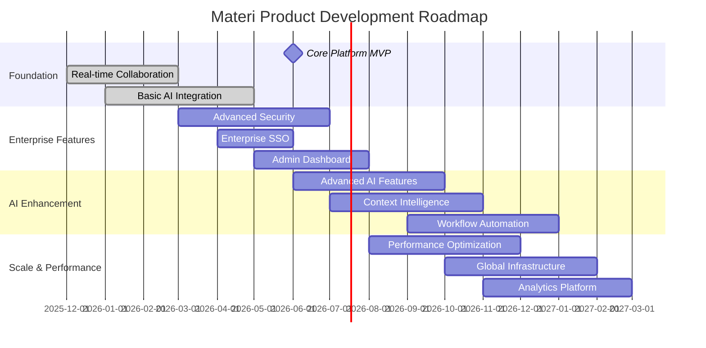
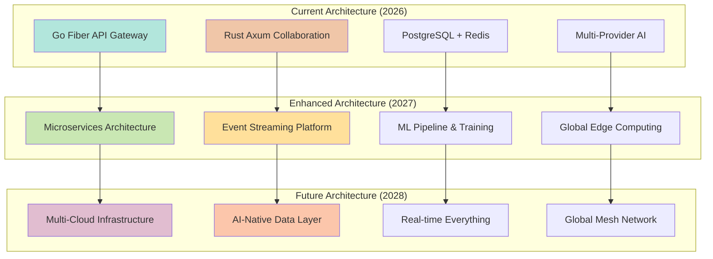

# Product Vision & Strategy

<Info>
**SDD Classification:** L1-Strategic | **Authority:** CEO + CPO + CTO | **Review Cycle:** Quarterly
</Info>

This Product Strategy Document defines the comprehensive product vision, market positioning, and execution roadmap for building the world's leading AI-native document collaboration platform. This strategic foundation guides all product development, feature prioritization, and go-to-market activities through 2028.

**Our mission:** Transform how enterprises create, collaborate, and leverage knowledge through intelligent document platforms.

## Executive Summary

Materi represents a paradigm shift in enterprise document collaboration, delivering the first truly AI-native platform that combines real-time collaboration with intelligent content generation. Our strategy targets the $15B+ document collaboration market with a platform that outperforms incumbents by 5-8x in speed while delivering transformative AI capabilities.

### Strategic Objectives 2026-2028

| Objective | 2026 | 2027 | 2028 |
|-----------|------|------|------|
| **Revenue** | $5M ARR | $25M ARR | $50M ARR |
| **Enterprise Customers** | 100 | 300 | 500 |
| **Fortune 500 Penetration** | 10 | 50 | 100 |
| **Market Position** | Challenger | Leader | Visionary |

---

## Market Opportunity & Positioning

### Market Analysis

**Total Addressable Market (TAM):** $47B
- Document collaboration software: $15.2B
- AI content generation tools: $12.8B
- Enterprise productivity suites: $19.0B

**Serviceable Available Market (SAM):** $12B
- Enterprise document collaboration: $8.5B
- AI-enhanced productivity tools: $3.5B

**Serviceable Obtainable Market (SOM):** $1.2B
- AI-native document platforms: $800M
- Real-time enterprise collaboration: $400M

### Competitive Landscape

| Competitor | Strengths | Weaknesses | Materi Advantage |
|------------|-----------|------------|------------------|
| **Google Docs** | Market penetration, integration | Performance, enterprise features | 5x faster with validated SLAs |
| **Microsoft 365** | Enterprise adoption, ecosystem | Legacy architecture, slow innovation | AI-native design, modern stack |
| **Notion** | Flexibility, community | Performance at scale, real-time limits | Enterprise performance + >90% test coverage |
| **Figma** | Real-time excellence | Document-focused limitations | Document specialization + AI |

### Market Positioning Strategy

**Primary Position:** "The AI-Native Document Collaboration Platform for Enterprise Teams"

**Value Proposition Framework:**
- **Performance Leadership:** 5-8x faster than existing solutions
- **AI Integration:** Native AI capabilities, not bolt-on features
- **Enterprise Ready:** SOC 2, GDPR, Fortune 500 security requirements
- **Real-time Excellence:** Sub-25ms collaboration latency globally

---

## Product Vision

### Vision Statement

> "Empower every enterprise team to create, collaborate, and innovate at the speed of thought through intelligent document experiences."

### Product Philosophy

| Principle | Description |
|-----------|-------------|
| **AI-First Design** | Intelligence embedded in every workflow, not separate tools |
| **Performance Excellence** | Enterprise users deserve consumer-grade speed |
| **Human Collaboration** | Technology amplifies human creativity, doesn't replace it |
| **Security by Design** | Enterprise security built into architecture, not added later |

---

## Core Product Pillars

### Pillar 1: Lightning-Fast Real-Time Collaboration

- **Sub-25ms edit synchronization** globally with comprehensive SLA validation
- **Conflict-free collaborative editing** with advanced CRDT algorithms and >90% test coverage
- **Presence awareness** with real-time cursors (<10ms broadcast for 1000+ users validated)
- **Instant document loading** regardless of document size
- **Comprehensive Testing Suite** covering all 5 core relay service capabilities
- **Performance Guarantees** backed by industry-standard testing and continuous validation

### Pillar 2: Native AI Content Intelligence

- **Context-aware content generation** using workspace knowledge
- **Intelligent document assistance** for writing, editing, formatting
- **Multi-provider AI orchestration** for optimal performance and cost
- **Semantic search and discovery** across enterprise knowledge base

### Pillar 3: Enterprise-Grade Infrastructure

- **99.9% uptime guarantee** with global redundancy
- **SOC 2 Type II compliance** with comprehensive audit trails
- **Advanced security controls** including zero-trust architecture
- **Seamless enterprise integration** with SSO and existing workflows

### Pillar 4: Intuitive User Experience

- **Progressive Web App** with native app performance
- **Accessibility excellence** meeting WCAG 2.1 AA standards
- **Mobile-first collaboration** with full feature parity
- **Customizable workflows** adapting to team preferences

---

## Target User Personas

### Primary Persona: Enterprise Knowledge Workers

| Attribute | Details |
|-----------|---------|
| **Role** | Content creators, project managers, consultants |
| **Company Size** | 1,000+ employees, Fortune 500 preferred |
| **Pain Points** | Slow collaboration tools, AI tool fragmentation, security concerns |
| **Value Drivers** | Productivity gains, seamless workflows, intelligent assistance |

### Secondary Persona: IT Decision Makers

| Attribute | Details |
|-----------|---------|
| **Role** | CTO, IT Director, Security Officer |
| **Concerns** | Security, compliance, integration complexity, vendor management |
| **Value Drivers** | Risk mitigation, cost efficiency, simplified vendor stack |

### Tertiary Persona: Team Leads & Managers

| Attribute | Details |
|-----------|---------|
| **Role** | Department heads, project leaders, team coordinators |
| **Focus Areas** | Team productivity, project delivery, collaboration effectiveness |
| **Value Drivers** | Team efficiency, project success rates, visibility and control |

---

## Product Roadmap

### Release Strategy Overview

### Phase 1: Foundation Platform (Q1-Q2 2026)

**Objective:** Establish core platform with competitive real-time collaboration

**Key Features:**

| Category | Features |
|----------|----------|
| **Real-time Editing** | Multi-user simultaneous editing, character-level sync within 25ms, presence indicators, offline editing with sync |
| **Basic AI Integration** | Content generation with OpenAI/Anthropic, context-aware suggestions, grammar/style assistance, template generation |
| **Document Management** | Version history/rollback, sharing/permissions, folder organization, basic search |
| **Core Infrastructure** | User authentication, API-first architecture, basic admin controls, responsive web app |

**Success Metrics:**
- 50+ enterprise pilot customers
- Sub-50ms API response time (P95)
- Sub-25ms collaboration latency
- 95%+ user satisfaction in pilot programs

### Phase 2: Enterprise Readiness (Q3-Q4 2026)

**Objective:** Achieve enterprise-grade security and compliance for Fortune 500 deployment

**Key Features:**

| Category | Features |
|----------|----------|
| **Advanced Security** | SOC 2 Type II certification, advanced encryption/key management, zero-trust architecture, audit logging |
| **Enterprise Integration** | SAML/OAuth SSO, SCIM provisioning, advanced RBAC, enterprise admin dashboard |
| **Performance & Scale** | Global CDN/edge computing, advanced caching, 10,000+ users per org, 99.9% uptime SLA |
| **Enhanced AI** | Multi-document context, workspace knowledge graph, advanced templates, cost optimization |

**Success Metrics:**
- 10+ Fortune 500 customers in production
- SOC 2 Type II certification achieved
- $5M ARR milestone reached
- 99.9% uptime demonstrated over 90 days

### Phase 3: AI Excellence & Market Leadership (Q1-Q2 2027)

**Objective:** Establish market leadership through superior AI capabilities and platform extensibility

**Key Features:**

| Category | Features |
|----------|----------|
| **Advanced AI** | Semantic understanding/auto-categorization, workflow suggestions/automation, analytics/insights, custom AI model training |
| **Platform Extensibility** | Rich API ecosystem, custom workflow builder, advanced analytics/BI, marketplace for extensions |
| **Global Enterprise** | Multi-region with data residency, advanced compliance (GDPR, HIPAA-ready), enterprise backup/DR, white-label options |
| **Advanced Collaboration** | Video/audio integration, review workflows, PM/CRM integrations, mobile apps with feature parity |

**Success Metrics:**
- $25M ARR milestone reached
- 100+ Fortune 500 customers
- Industry recognition as top 3 collaboration platform
- 90%+ customer retention rate

### Phase 4: Market Expansion & Innovation (Q3 2027-Q4 2028)

**Objective:** Expand market reach and maintain innovation leadership

**Key Features:**
- **Next-Generation AI:** Multi-modal AI, predictive content generation, NL interfaces, real-time translation
- **Market Expansion:** Mid-market tier, industry-specific solutions, international expansion (EU, APAC)
- **Innovation Leadership:** VR/AR collaboration, zero-knowledge architecture, sustainability initiatives

**Success Metrics:**
- $50M+ ARR achieved
- Market leadership position established
- 500+ Fortune 500 customers
- Global presence in 20+ countries

---

## Go-to-Market Strategy

### Market Entry Strategy

| Phase | Timeline | Focus | Activities |
|-------|----------|-------|------------|
| **Pilot Program** | Q1 2026 | 50-100 enterprise pilots | Direct sales, high-touch onboarding, tech-forward enterprises |
| **Expansion** | Q2-Q4 2026 | 500+ enterprise customers | Channel partners, analyst engagement, competitive displacement |
| **Leadership** | 2027-2028 | Market leader positioning | Brand recognition, partner ecosystem, acquisition opportunities |

### Pricing Strategy

| Tier | Target Audience | Price/User/Month | Key Features |
|------|-----------------|------------------|--------------|
| **Starter** | Small teams (5-50 users) | $15 | Basic collaboration, limited AI |
| **Professional** | Growing teams (50-500 users) | $30 | Advanced AI, integrations, analytics |
| **Enterprise** | Large organizations (500+ users) | $50 | Full platform, compliance, dedicated support |
| **Enterprise Plus** | Fortune 500 (1000+ users) | Custom | White-label, custom deployment, SLA |

**Pricing Philosophy:**
- Value-based pricing reflecting productivity gains and cost savings
- Competitive positioning against Microsoft 365 and Google Workspace
- Land and expand strategy with usage-based growth opportunities
- Enterprise focus with premium pricing for advanced capabilities

---

## Technology Strategy

### Platform Architecture Evolution

### Innovation Roadmap

| Innovation Area | 2026 | 2027 | 2028 |
|-----------------|------|------|------|
| **AI Capabilities** | Basic generation | Advanced reasoning | Autonomous workflows |
| **Collaboration** | Real-time editing | Multi-modal | Immersive experiences |
| **Performance** | Sub-25ms latency | Sub-10ms latency | Near-zero latency |
| **Security** | SOC 2 compliance | Zero-knowledge | Quantum-resistant |
| **Global Scale** | Multi-region | Edge computing | Mesh architecture |

---

## Success Metrics & KPIs

### Business Metrics

| Metric | 2026 Target | 2027 Target | 2028 Target |
|--------|-------------|-------------|-------------|
| **Annual Recurring Revenue** | $5M | $25M | $50M |
| **Enterprise Customers** | 100 | 300 | 500 |
| **Fortune 500 Penetration** | 10 | 50 | 100 |
| **Gross Revenue Retention** | 90% | 95% | 95% |
| **Net Revenue Retention** | 110% | 120% | 125% |
| **Customer Acquisition Cost** | $10K | $15K | $20K |
| **Lifetime Value** | $100K | $200K | $300K |

### Product Metrics

| Metric | Target | Measurement |
|--------|--------|-------------|
| **Platform Performance** | 99.9% uptime | Infrastructure monitoring |
| **Collaboration Latency** | <25ms global | Real-time measurement |
| **API Response Time** | P95 <50ms | Performance monitoring |
| **User Satisfaction** | 4.5+ NPS | Monthly surveys |
| **Feature Adoption** | 80% core features | Product analytics |
| **Time to Value** | <30 days | Onboarding tracking |

---

## Risk Management

### Market Risks

| Risk | Probability | Impact | Mitigation |
|------|-------------|--------|------------|
| Competitive response from Microsoft/Google | High | Medium | Focus on performance/AI differentiation, build switching costs |
| Economic downturn affecting enterprise spending | Medium | High | Demonstrate clear ROI, flexible pricing, focus on productivity gains |
| AI technology commoditization | Medium | Medium | Invest in proprietary AI, application-specific optimization, data moats |

### Technology Risks

| Risk | Probability | Impact | Mitigation |
|------|-------------|--------|------------|
| Security breach or compliance failure | Low | Critical | Security-first development, regular audits, cyber insurance |
| Performance or scalability issues | Medium | High | Performance testing, gradual scaling, monitoring/alerting |
| Key technology talent retention | Medium | High | Competitive compensation, equity programs, engineering culture |

### Execution Risks

| Risk | Probability | Impact | Mitigation |
|------|-------------|--------|------------|
| Product development delays | Medium | Medium | Agile development, MVP approach, milestone reviews |
| Go-to-market execution failures | Medium | High | Experienced sales leadership, customer development, iterative GTM |

---

## Strategic Partnerships

### Technology Partnerships

| Category | Partners |
|----------|----------|
| **Cloud Infrastructure** | AWS (primary), Azure, Google Cloud, CloudFlare |
| **AI & ML** | OpenAI, Anthropic, Hugging Face, NVIDIA |

### Integration Partnerships

| Category | Partners |
|----------|----------|
| **Enterprise Software** | Salesforce, HubSpot, Slack, Microsoft Teams, Jira, Asana |
| **Identity Providers** | Okta, Auth0, Azure AD |
| **Industry Partners** | Deloitte, Accenture, IBM (systems integrators) |

### Ecosystem Development

**Developer Ecosystem:**
- Comprehensive API and webhook platform
- Developer documentation and sandbox environment
- Community-driven integrations and extensions
- Annual developer conference and community events

**Customer Ecosystem:**
- Customer advisory board for product feedback
- User community forums and knowledge sharing
- Customer success and best practices programs
- Industry user groups and vertical communities

---

## Financial Projections

### Revenue Projections

| Year | Enterprise ARR | Professional ARR | Total ARR | Growth Rate |
|------|----------------|------------------|-----------|-------------|
| **2026** | $4.5M | $0.5M | $5M | - |
| **2027** | $22M | $3M | $25M | 400% |
| **2028** | $45M | $5M | $50M | 100% |

### Investment Requirements

**Total Funding Required:** $75M over 3 years

| Allocation | Percentage | Amount | Focus |
|------------|------------|--------|-------|
| **Product Development** | 40% | $30M | Engineering, AI/ML, platform infrastructure |
| **Sales & Marketing** | 35% | $26M | Enterprise sales team, marketing programs, customer success |
| **Operations** | 15% | $11M | Infrastructure, security, compliance, legal |
| **Strategic Reserve** | 10% | $8M | Market opportunities, competitive responses, contingencies |

### Path to Profitability

| Year | Status | EBITDA |
|------|--------|--------|
| **2026** | Investment year focused on product-market fit | -$15M |
| **2027** | Rapid growth year with improving unit economics | -$5M |
| **2028** | Path to profitability with positive EBITDA | +$5M |

---

## Strategic Imperatives

The enterprise document collaboration market is ready for disruption. Materi's unique combination of performance excellence, AI-native capabilities, and enterprise-grade security positions us to capture this opportunity.

### Key Strategic Imperatives

1. **Execute flawlessly on product roadmap** to establish performance and AI leadership
2. **Build enterprise sales machine** targeting Fortune 500 customers exclusively
3. **Achieve security and compliance excellence** as non-negotiable requirements
4. **Invest in AI differentiation** to maintain technology leadership position
5. **Scale global infrastructure** to support worldwide enterprise deployment
6. **Build ecosystem and partnerships** to accelerate market penetration

### Success Factors

- Product excellence driving organic growth and customer advocacy
- Enterprise-focused go-to-market with high customer lifetime values
- Technology differentiation creating defensible moats
- World-class team execution across all functional areas

---

## Related Documents

- [L1-Strategic Specs](/internal/architecture/specs/l1-strategic-specs) - Business requirements and taxonomy
- [Technology Strategy](/internal/architecture/specs/technology-strategy) - Technical direction and architecture
- [Concept of Operations](/internal/architecture/specs/concept-of-operations) - Operational context
- [System Design Overview](/internal/architecture/system-design/overview) - Architecture details

---

**Document Status:** Approved
**Version:** 1.0
**Last Updated:** January 2026
**Authority:** CEO + CPO + CTO

**Document Classification:** L1-Strategic - Internal Use Only
**Distribution:** Executive Team, Board of Directors, Product Leadership
