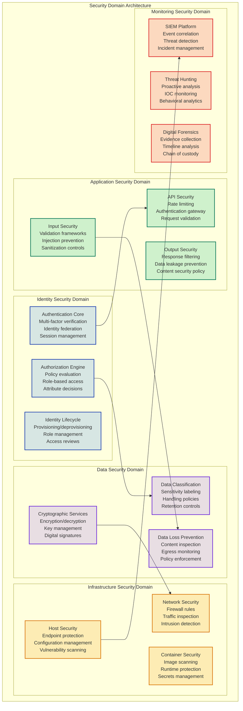
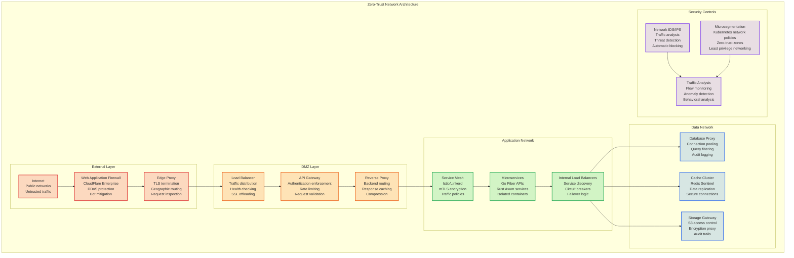
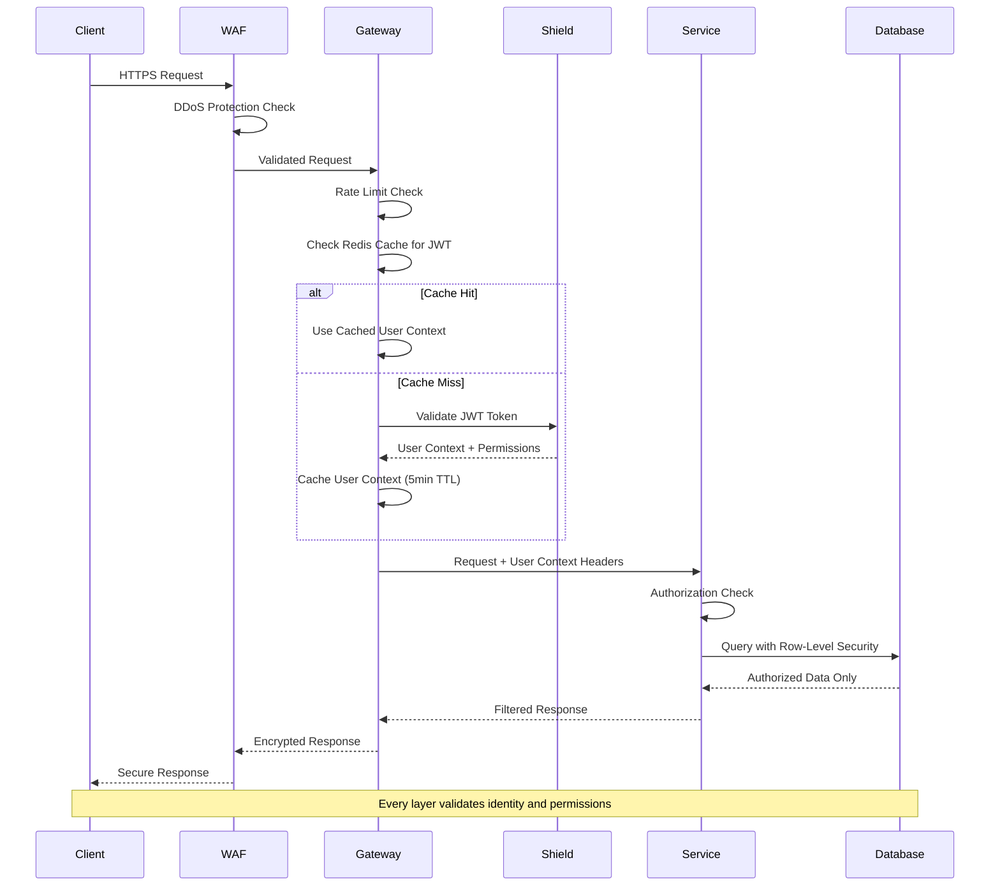
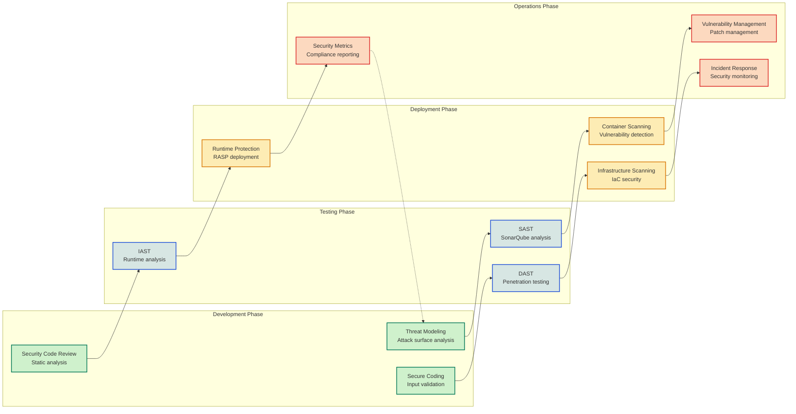

# Security Architecture Overview

<Info>
**SDD Classification:** L2-System | **Authority:** CTO + CISO + Security Architecture Lead | **Review Cycle:** Monthly
</Info>

This Security Architecture Document provides the foundational security architecture design decisions, security patterns, and implementation frameworks that govern the Materi platform's security layer. It serves as the definitive L2-System security architecture specification.

**Security Model**: Zero-trust architecture with defense-in-depth
**Compliance Targets**: SOC 2 Type II, GDPR, CCPA
**Performance Target**: Security without performance impact (<50ms overhead)
**Automation Level**: 90%+ automated security controls

---

## Security Architecture Principles

### Core Security Design Principles

1. **Zero-Trust by Design** - Never trust, always verify every request and user
2. **Defense in Depth** - Multiple independent security layers with no single point of failure
3. **Least Privilege Access** - Minimal permissions required for legitimate operations
4. **Fail Secure** - System failures default to secure state, not open access
5. **Security Transparency** - Complete audit trails and real-time security visibility
6. **Performance Security** - Security controls that enhance rather than degrade performance

---

## Hybrid Authentication Security Model

The hybrid authentication architecture implements defense-in-depth security through multiple validation layers while maintaining sub-50ms response times required for competitive advantage.

### Security Architecture Layers

**1. API Gateway Security Layer**
- JWT signature validation with RSA-256 public key verification
- Real-time token blacklist enforcement via Redis
- Rate limiting with sliding window algorithms
- Request sanitization and security header injection

**2. Service Mesh Security**
- mTLS certificate-based authentication for internal communication
- Service-to-service authorization through certificate validation
- Network segmentation and traffic encryption

**3. Identity Provider Integration**
- Centralized user context management through Shield service
- Comprehensive audit logging for compliance requirements
- Real-time token revocation and session management

---

## Security Domain Architecture



---

## Identity and Access Management Architecture

```mermaid
graph TB
    subgraph "IAM Architecture Design"
        subgraph "Identity Providers Layer"
            INTERNAL_IDP[Internal Identity Provider<br/>Local user accounts<br/>Password policies<br/>MFA enforcement]
            EXTERNAL_IDP[External Identity Providers<br/>SAML 2.0 federation<br/>OAuth 2.0 / OIDC<br/>Enterprise SSO]
            SOCIAL_IDP[Social Identity Providers<br/>Google OAuth<br/>Microsoft Azure AD<br/>GitHub Enterprise]
        end

        subgraph "Authentication Layer"
            AUTH_GATEWAY[Authentication Gateway<br/>Protocol translation<br/>Policy enforcement<br/>Session management]
            MFA_ENGINE[Multi-Factor Engine<br/>TOTP tokens<br/>Hardware keys<br/>Biometric verification]
            RISK_ENGINE[Risk Assessment Engine<br/>Device fingerprinting<br/>Behavioral analytics<br/>Adaptive authentication]
        end

        subgraph "Authorization Layer"
            POLICY_ENGINE[Policy Decision Point<br/>XACML evaluation<br/>Attribute-based access<br/>Dynamic permissions]
            PERMISSION_STORE[Permission Store<br/>Role definitions<br/>Resource mappings<br/>Delegation rules]
            ENFORCEMENT_POINTS[Policy Enforcement Points<br/>API gateway filters<br/>Application middleware<br/>Database row-level security]
        end

        subgraph "Session Management"
            SESSION_STORE[Session Store<br/>Distributed cache<br/>Session replication<br/>Secure cookies]
            TOKEN_SERVICE[Token Service<br/>JWT generation<br/>Token validation<br/>Refresh mechanics]
            SESSION_MONITOR[Session Monitoring<br/>Activity tracking<br/>Anomaly detection<br/>Concurrent session limits]
        end
    end

    EXTERNAL_IDP --> AUTH_GATEWAY
    INTERNAL_IDP --> AUTH_GATEWAY
    SOCIAL_IDP --> AUTH_GATEWAY

    AUTH_GATEWAY --> MFA_ENGINE
    MFA_ENGINE --> RISK_ENGINE
    RISK_ENGINE --> POLICY_ENGINE

    POLICY_ENGINE --> PERMISSION_STORE
    PERMISSION_STORE --> ENFORCEMENT_POINTS

    POLICY_ENGINE --> SESSION_STORE
    SESSION_STORE --> TOKEN_SERVICE
    TOKEN_SERVICE --> SESSION_MONITOR

    classDef idp fill:#60A5FA,stroke:#2563EB,stroke-width:2px,fill-opacity:0.2
    classDef auth fill:#34D399,stroke:#10B981,stroke-width:2px,fill-opacity:0.2
    classDef authz fill:#FBBF24,stroke:#F59E0B,stroke-width:2px,fill-opacity:0.2
    classDef session fill:#A78BFA,stroke:#8B5CF6,stroke-width:2px,fill-opacity:0.2

    class INTERNAL_IDP,EXTERNAL_IDP,SOCIAL_IDP idp
    class AUTH_GATEWAY,MFA_ENGINE,RISK_ENGINE auth
    class POLICY_ENGINE,PERMISSION_STORE,ENFORCEMENT_POINTS authz
    class SESSION_STORE,TOKEN_SERVICE,SESSION_MONITOR session
```



---

## Role-Based Access Control Model

### RBAC Schema Design

The platform implements a hierarchical RBAC model with attribute-based access control extensions:

| Entity | Purpose | Key Features |
|--------|---------|--------------|
| **Users** | Identity management | Email-based, MFA support, lockout protection |
| **Roles** | Permission grouping | Hierarchical, system/workspace/document scopes |
| **Permissions** | Resource actions | Resource-type + action mapping |
| **Access Policies** | Dynamic rules | XACML-like policy expressions |
| **Sessions** | Authentication state | Device fingerprinting, concurrent limits |
| **Audit Log** | Compliance trail | Immutable, tamper-proof logging |

### Permission Context Hierarchy

```
Global Permissions
├── Workspace Permissions
│   ├── Document Permissions
│   │   └── Operation Permissions
│   └── Member Permissions
└── System Permissions
```

---

## Zero-Trust Network Architecture



---

## Authentication Flow

### Zero-Trust Request Validation



---

## Data Protection

### Encryption Architecture

| Data State | Algorithm | Key Management | Compliance |
|------------|-----------|----------------|------------|
| **At Rest** | AES-256-GCM | AWS KMS / HSM | SOC 2, GDPR Article 32 |
| **In Transit** | TLS 1.3 | Certificate rotation | Industry standard |
| **Application** | Field-level encryption | Per-tenant keys | GDPR, CCPA |
| **Backup** | AES-256 | Cross-region encryption | DR compliance |

### Data Classification Matrix

| Classification | Examples | Encryption | Access Controls | Retention |
|---------------|----------|------------|-----------------|-----------|
| **Public** | Marketing content | TLS in transit | Read-only public | Indefinite |
| **Internal** | User preferences | TLS + AES-256 | Authenticated users | 7 years |
| **Confidential** | Document content | AES-256 + key rotation | Role-based | Customer-controlled |
| **Restricted** | Financial/legal data | AES-256 + HSM | Explicit authorization | Regulatory |
| **Personal Data** | User PII | AES-256 + anonymization | Data subject rights | GDPR deletion |

---

## Secure Development Lifecycle



---

## Compliance Framework

### SOC 2 Type II Controls

| Control Category | Control ID | Implementation | Verification |
|-----------------|------------|----------------|--------------|
| **Logical Access** | CC6.1 | RBAC + Policy Engine | Access control reports |
| **Authentication** | CC6.2 | MFA + Enterprise SSO | Authentication logs |
| **Authorization** | CC6.3 | Dynamic authorization | Authorization audit trail |
| **Change Management** | CC8.1 | GitOps workflow | Change audit logs |
| **System Operations** | CC7.1 | Automated monitoring | Operational dashboards |

### GDPR Compliance

| Article | Requirement | Implementation |
|---------|-------------|----------------|
| **Article 25** | Data protection by design | Privacy-first architecture |
| **Article 32** | Security of processing | End-to-end encryption |
| **Article 35** | Data protection impact | Automated privacy controls |
| **Article 17** | Right to erasure | Data deletion workflows |
| **Article 20** | Data portability | Export APIs |

---

## Security Monitoring

### Key Security Metrics

| Metric | Target | Measurement |
|--------|--------|-------------|
| **Authentication Success Rate** | >99.9% | Auth service metrics |
| **Failed Login Detection Time** | <1 minute | SIEM alert latency |
| **Threat Response Time** | <15 minutes | Incident response SLA |
| **Vulnerability Remediation** | <72 hours (critical) | Patch management SLA |
| **Security Test Coverage** | >90% | Automated testing reports |
| **Compliance Score** | 100% | Continuous compliance monitoring |

### Security Event Categories

| Category | Priority | Response Time | Escalation |
|----------|----------|---------------|------------|
| **Critical** | P0 | <15 minutes | Immediate CISO notification |
| **High** | P1 | <1 hour | Security team on-call |
| **Medium** | P2 | <4 hours | Security team queue |
| **Low** | P3 | <24 hours | Standard review |
| **Informational** | P4 | Next business day | Audit log only |

---

## Cross-References

- [System Architecture Overview](/internal/architecture/system-design/overview) - Platform architecture context
- [Platform Services](/internal/architecture/system-design/platform-services) - Service security specifications
- [Disaster Recovery](/developer/operations/runbooks/disaster-recovery) - Security incident recovery
- [SLO/SLI/SLA](/internal/engineering/performance/slo-sli-sla) - Security SLOs

---

**Document Status:** Complete
**Version:** 2.0
**Last Updated:** January 2026
**Authority:** CTO + CISO + Security Architecture Lead
**Classification:** L2-System - Internal Security

**Distribution:** Security Team, Engineering Leadership, Compliance Officers
